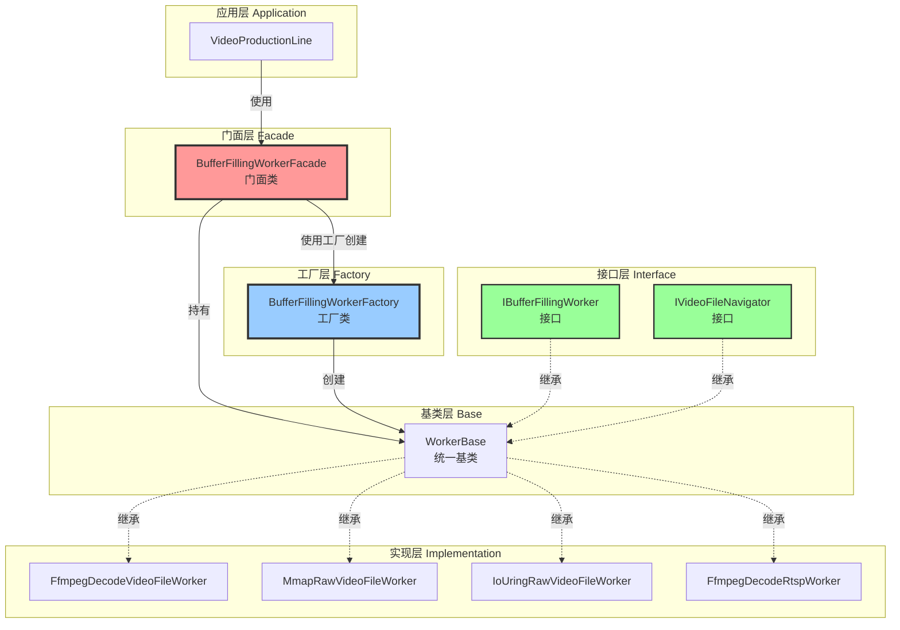
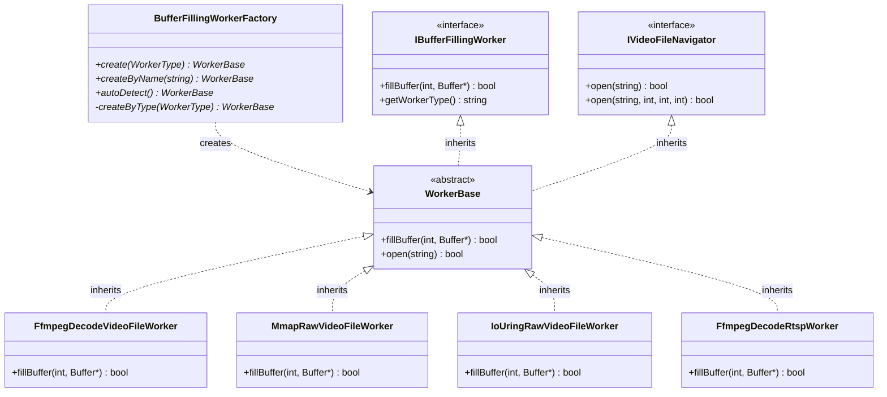
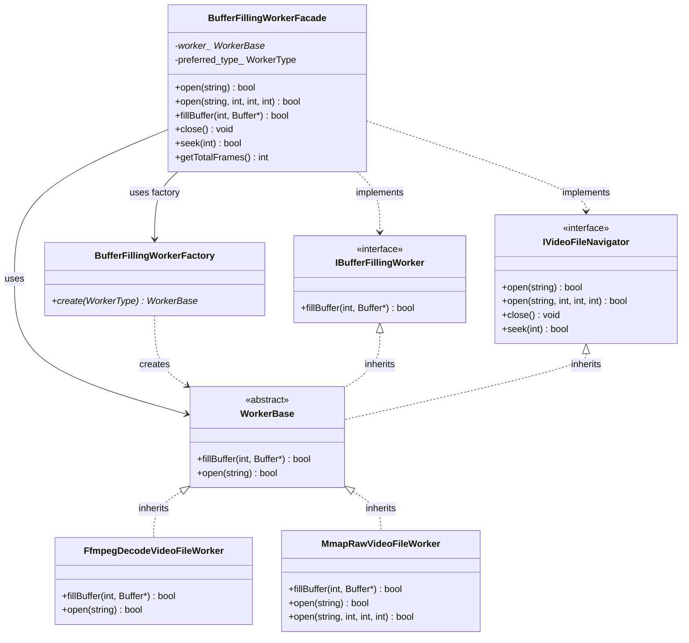
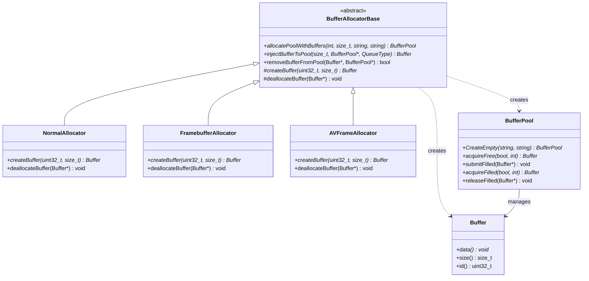
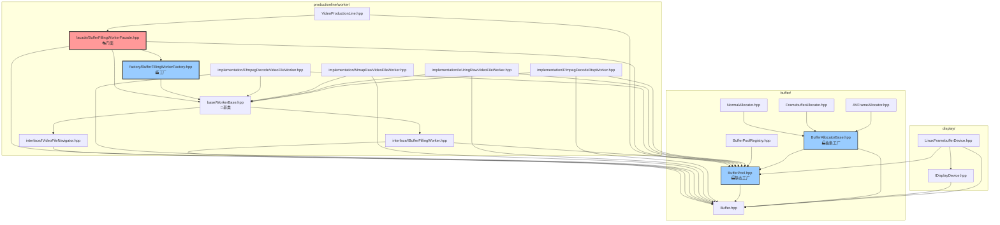
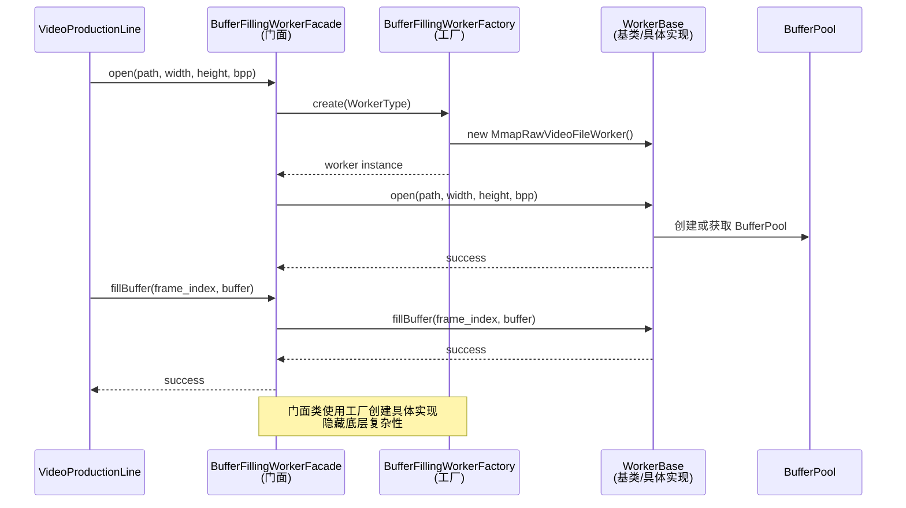

# ProductionLine 综合架构设计文档

## 📋 目录

1. [架构概述](#架构概述)
2. [核心类职责](#核心类职责)
3. [类协作关系](#类协作关系)
4. [设计模式](#设计模式)
5. [门面模式与工厂模式详细分析](#门面模式与工厂模式详细分析)
6. [数据流](#数据流)
7. [核心类详解](#核心类详解)
8. [使用示例](#使用示例)
9. [最佳实践](#最佳实践)
10. [API参考](#api参考)
11. [常见问题](#常见问题)

---

## 架构概述

### 核心理念

**ProductionLine（生产流水线）架构** 采用"生产流水线"和"工人"的类比，清晰地表达了数据流向和职责划分：

- **ProductionLine（生产流水线）**：负责从Worker获取原材料（BufferPool），进行生产（填充Buffer）
- **Worker（工人）**：负责从不同数据源获取数据，填充Buffer，提供原材料（BufferPool）给ProductionLine
- **BufferPool（原材料仓库）**：管理Buffer队列，提供线程安全的调度接口
- **Allocator（分配器）**：负责Buffer和BufferPool的创建和生命周期管理

### 架构层次

```
┌─────────────────────────────────────────────────────────┐
│                   应用层（Application）                    │
│              VideoProductionLine + BufferPool             │
└───────────────────────┬─────────────────────────────────┘
                        │ 使用
┌───────────────────────▼─────────────────────────────────┐
│                   门面层（Facade）                        │
│         BufferFillingWorkerFacade（门面）                │
│    （继承 IBufferFillingWorker + IVideoFileNavigator）   │
└───────────────────────┬─────────────────────────────────┘
                        │ 持有
┌───────────────────────▼─────────────────────────────────┐
│                   接口层（Interface）                      │
│  IBufferFillingWorker（填充Buffer接口）                  │
│  IVideoFileNavigator（文件导航接口，并列关系）            │
└───────────────────────┬─────────────────────────────────┘
                        │ 继承
┌───────────────────────▼─────────────────────────────────┐
│                   基类层（Base）                          │
│              WorkerBase（统一基类）                       │
│    （同时继承 IBufferFillingWorker 和 IVideoFileNavigator）│
└───────────────────────┬─────────────────────────────────┘
                        │ 继承
┌───────────────────────▼─────────────────────────────────┐
│                   实现层（Implementation）                  │
│  FfmpegDecodeVideoFileWorker │ MmapRawVideoFileWorker    │
│  FfmpegDecodeRtspWorker      │ IoUringRawVideoFileWorker │
└───────────────────────┬─────────────────────────────────┘
                        │ 创建
┌───────────────────────▼─────────────────────────────────┐
│                   工厂层（Factory）                        │
│         BufferFillingWorkerFactory（工厂）                │
└─────────────────────────────────────────────────────────┘
                        │
┌───────────────────────▼─────────────────────────────────┐
│                   内存管理层（Memory Management）            │
│         BufferAllocator（抽象） + 具体实现                  │
│  NormalAllocator │ FramebufferAllocator │ AVFrameAllocator│
└───────────────────────┬─────────────────────────────────┘
                        │ 创建/管理
┌───────────────────────▼─────────────────────────────────┐
│                   调度层（Scheduler）                       │
│              BufferPool（纯调度器）                        │
└─────────────────────────────────────────────────────────┘
```

---

## 核心类职责

### 1. VideoProductionLine（生产流水线）

**职责：**
- ✅ **生产管理**：管理多个生产者线程，协调Buffer的获取、填充、提交流程
- ✅ **BufferPool获取**：从Worker获取BufferPool（原材料），Worker必须在实现`IVideoFileNavigator::open()`时自动创建BufferPool（通过调用Allocator）
- ✅ **线程协调**：使用原子变量管理帧索引，确保多线程安全
- ✅ **性能监控**：统计生产速度、错误率等

**不负责：**
- ❌ 视频解码/读取（由Worker负责）
- ❌ Buffer创建/销毁（由Allocator负责，Worker调用）
- ❌ Buffer队列管理（由BufferPool负责）
- ❌ BufferPool创建（由Worker负责，Worker调用Allocator创建）

### 2. BufferPool（缓冲区池）

**职责：**
- ✅ **队列调度**：管理空闲队列（free_queue）和填充队列（filled_queue）
- ✅ **线程安全**：提供线程安全的Buffer获取和提交接口
- ✅ **状态管理**：跟踪Buffer的状态（IDLE、LOCKED_BY_PRODUCER、READY_FOR_CONSUME、LOCKED_BY_CONSUMER）
- ✅ **注册管理**：自动注册到BufferPoolRegistry，支持全局查询和监控

**不负责：**
- ❌ Buffer创建/销毁（由Allocator负责）
- ❌ 数据填充（由Worker负责）
- ❌ 生产流程管理（由ProductionLine负责）

### 3. IBufferFillingWorker（Worker接口）

**职责：**
- ✅ **填充Buffer**：从不同数据源（RTSP/RAW/MP4等）获取数据，解码/处理，填充到Buffer（核心功能）
- ✅ **BufferPool创建**：在实现`IVideoFileNavigator::open()`时**必须**自动调用Allocator创建BufferPool
  - Worker内部创建Allocator实例（如NormalAllocator、AVFrameAllocator等）
  - Worker调用`allocator->allocatePoolWithBuffers()`创建BufferPool
  - Worker通过`getOutputBufferPool()`返回创建的BufferPool（转移所有权给ProductionLine）
- ✅ **能力查询**：提供`getWorkerType()`等接口，用于调试和日志

**接口关系：**
- `IBufferFillingWorker` 和 `IVideoFileNavigator` 是**并列关系**（不是继承关系）
- Worker实现类通过继承 `WorkerBase` 基类来同时实现两个接口：`class Worker : public WorkerBase`
- `WorkerBase` 基类同时继承 `IBufferFillingWorker` 和 `IVideoFileNavigator`，提供统一的基类
- 如果Worker不需要文件导航功能，可以只实现`IBufferFillingWorker`（但当前所有Worker都继承WorkerBase）
- 符合接口分离原则（ISP）：两个接口职责独立，通过WorkerBase统一基类简化继承关系

**不负责：**
- ❌ Buffer创建/销毁（由Allocator负责，Worker只调用Allocator的方法）
- ❌ Buffer队列管理（由BufferPool负责）
- ❌ 生产流程管理（由ProductionLine负责）

**关键设计**：
- Worker在实现`IVideoFileNavigator::open()`时**必须**创建BufferPool，不能返回nullptr
- Worker通过调用Allocator创建BufferPool，而不是直接创建
- Worker根据场景选择合适的Allocator（NormalAllocator、AVFrameAllocator等）

### 4. IVideoFileNavigator（文件导航接口）

**职责**：
- ✅ **文件打开/关闭**：`open(path)` 和 `open(path, width, height, bits_per_pixel)`（两个重载），`close()`, `isOpen()`
- ✅ **文件导航**：`seek()`, `seekToBegin()`, `seekToEnd()`, `skip()`
- ✅ **文件状态查询**：`getTotalFrames()`, `getCurrentFrameIndex()`, `getFrameSize()`, `getFileSize()`, `getWidth()`, `getHeight()`, `getBytesPerPixel()`, `getPath()`, `hasMoreFrames()`, `isAtEnd()`

**接口关系**：
- `IVideoFileNavigator` 和 `IBufferFillingWorker` 是**并列关系**（不是继承关系）
- Worker实现类通过继承 `WorkerBase` 基类来同时实现两个接口：`class Worker : public WorkerBase`
- `WorkerBase` 基类同时继承 `IBufferFillingWorker` 和 `IVideoFileNavigator`，提供统一的基类
- 如果Worker不需要文件导航功能，可以只实现`IBufferFillingWorker`（但当前所有Worker都继承WorkerBase）
- 符合接口分离原则（ISP）：文件操作功能独立为独立接口，通过WorkerBase统一基类简化继承关系

**设计特点**：
- 接口分离原则（ISP）：将所有文件操作功能从`IBufferFillingWorker`中分离
- 职责清晰：所有文件操作功能独立为独立接口
- 可扩展：未来可以独立扩展文件操作功能
- 文档明确：通过接口名称明确表达职责

**注意**：
- Worker在实现`open()`时，需要同时处理文件打开逻辑和BufferPool创建逻辑（BufferPool创建属于`IBufferFillingWorker`的职责，但需要在`open()`时执行）
- 文件操作方法与Buffer填充操作完全分离，符合单一职责原则
- 所有Worker实现类（`FfmpegDecodeVideoFileWorker`, `MmapRawVideoFileWorker`, `FfmpegDecodeRtspWorker`, `IoUringRawVideoFileWorker`）都继承 `WorkerBase` 基类，从而同时实现两个接口

### 5. BufferAllocator（分配器）

**职责：**
- ✅ **Buffer创建**：创建Buffer实例（调用子类的`createBuffer()`）
- ✅ **Buffer销毁**：销毁Buffer实例（调用子类的`deallocateBuffer()`）
- ✅ **BufferPool创建**：创建BufferPool实例（通过`allocatePoolWithBuffers()`）
- ✅ **Buffer注入**：将Buffer注入到BufferPool的队列中（通过友元关系访问BufferPool的私有方法）
- ✅ **Buffer移除**：从BufferPool移除Buffer（通过友元关系）

**不负责：**
- ❌ Buffer队列调度（由BufferPool负责）
- ❌ 数据填充（由Worker负责）
- ❌ 生产流程管理（由ProductionLine负责）

---

## 类协作关系

### 协作关系图

```
┌─────────────────────────────────────────────────────────────────┐
│                    VideoProductionLine                          │
│  ┌─────────────────────────────────────────────────────────┐  │
│  │  std::unique_ptr<BufferPool> worker_buffer_pool_         │  │
│  │  BufferPool* working_buffer_pool_                        │  │
│  │  std::shared_ptr<BufferFillingWorkerFacade> worker_      │  │
│  └─────────────────────────────────────────────────────────┘  │
│                                                                 │
│  协作关系：                                                     │
│  1. Worker在实现IVideoFileNavigator::open()时自动调用Allocator创建BufferPool            │
│  2. 通过 worker_->getOutputBufferPool() 获取Worker创建的Pool   │
│  3. 通过 working_buffer_pool_ 管理Worker创建的Pool           │
│  4. 通过 worker_->fillBuffer() 调用Worker填充Buffer           │
└───────────────────────┬───────────────────────────────────────┘
                        │
                        │ 1. 获取BufferPool
                        │ 2. 调用fillBuffer()
                        │
        ┌───────────────┼───────────────┐
        │               │               │
┌───────▼──────┐ ┌──────▼──────┐ ┌──────▼──────┐
│ BufferPool   │ │   Worker    │ │  Allocator  │
│ (调度器)     │ │  (填充器)    │ │  (分配器)    │
└──────────────┘ └─────────────┘ └─────────────┘
        │               │               │
        │               │               │
        │               │ 3. 调用allocator创建Pool
        │               │               │
        │               │ 4. 调用allocator创建Buffer
        │               │               │
        │               │ 5. 调用allocator注入Buffer
        │               │               │
        │               │               │
        └───────────────┴───────────────┘
                        │
                        │ 友元关系
                        │ (Allocator可以访问BufferPool的私有方法)
                        │
```

### 详细协作流程

#### 1. 初始化阶段（ProductionLine::start()）

```
1. ProductionLine::start(config)
   │
   ├─ 创建Worker（通过Factory）
   │   └─ BufferFillingWorkerFactory::create(worker_type)
   │
   ├─ 打开视频源（Worker在实现IVideoFileNavigator::open()时自动创建BufferPool）
   │   └─ worker_->open(...)  // 调用IVideoFileNavigator::open()
   │       │
   │       ├─ Worker必须创建BufferPool（通过调用Allocator）
   │       ├─ Worker创建Allocator实例（根据场景选择合适的Allocator）
   │       │   ├─ NormalAllocator（普通内存，用于Raw视频文件）
   │       │   ├─ AVFrameAllocator（FFmpeg解码，用于RTSP流和编码视频）
   │       │   └─ FramebufferAllocator（外部内存，用于Framebuffer显示）
   │       ├─ Worker调用 allocator->allocatePoolWithBuffers(...)
   │       │   │
   │       │   ├─ Allocator创建空的BufferPool
   │       │   │   └─ BufferPool::CreateEmpty(name, category)
   │       │   │
   │       │   ├─ Allocator创建Buffer（调用子类的createBuffer）
   │       │   │   └─ NormalAllocator::createBuffer(id, size)
   │       │   │
   │       │   └─ Allocator注入Buffer到Pool（通过友元关系）
   │       │       └─ BufferPool::addBufferToQueue(buffer, FREE)
   │       │
   │       └─ Worker保存创建的BufferPool（内部成员）
   │
   ├─ 从Worker获取BufferPool（Worker必须返回非nullptr）
   │   └─ worker_buffer_pool_ = worker_->getOutputBufferPool()
   │       ├─ 如果返回nullptr → start()失败，报错："Worker failed to create BufferPool"
   │       └─ 返回非nullptr → 使用Worker的BufferPool
   │           └─ working_buffer_pool_ = worker_buffer_pool_.get()
   │
   └─ 启动生产者线程
       └─ producerThreadFunc(thread_id)
```

#### 2. 生产阶段（ProductionLine::producerThreadFunc()）

```
生产者线程循环：
   │
   ├─ 1. 从BufferPool获取空闲Buffer
   │   └─ buffer = working_buffer_pool_->acquireFree(true, timeout)
   │       │
   │       └─ BufferPool内部：
   │           ├─ 加锁（mutex_）
   │           ├─ 从free_queue取出Buffer
   │           ├─ 设置Buffer状态为LOCKED_BY_PRODUCER
   │           └─ 返回Buffer*
   │
   ├─ 2. 调用Worker填充Buffer
   │   └─ worker_->fillBuffer(frame_index, buffer)
   │       │
   │       └─ Worker内部：
   │           ├─ 从数据源读取/解码数据
   │           ├─ 填充到buffer->getVirtualAddress()
   │           └─ 返回成功/失败
   │
   ├─ 3. 提交填充后的Buffer
   │   └─ working_buffer_pool_->submitFilled(buffer)
   │       │
   │       └─ BufferPool内部：
   │           ├─ 加锁（mutex_）
   │           ├─ 设置Buffer状态为READY_FOR_CONSUME
   │           ├─ 添加到filled_queue
   │           └─ 通知消费者（filled_cv_.notify_one()）
   │
   └─ 4. 消费者从BufferPool获取填充后的Buffer
       └─ consumer->acquireFilled(true, timeout)
           │
           └─ BufferPool内部：
               ├─ 加锁（mutex_）
               ├─ 从filled_queue取出Buffer
               ├─ 设置Buffer状态为LOCKED_BY_CONSUMER
               └─ 返回Buffer*
```

#### 3. Worker扩展BufferPool（动态注入模式）

```
Worker内部解码循环（适用于RTSP流等）：
   │
   ├─ 1. FFmpeg解码获得AVFrame
   │   └─ avcodec_receive_frame(codec_ctx, frame)
   │
   ├─ 2. 调用Allocator注入Buffer
   │   └─ allocator->injectAVFrameToPool(frame, pool)
   │       │
   │       ├─ Allocator创建Buffer包装AVFrame
   │       │   └─ AVFrameAllocator::createBuffer(id, size)
   │       │
   │       ├─ Allocator注入Buffer到Pool（通过友元关系）
   │       │   └─ BufferPool::addBufferToQueue(buffer, FILLED)
   │       │
   │       └─ Allocator记录AVFrame和Buffer的映射
   │
   └─ 3. 消费者从BufferPool获取填充后的Buffer
       └─ pool->acquireFilled(true, timeout)
```

### 所有权关系

| 类 | 拥有的资源 | 所有权方式 | 说明 |
|---|-----------|-----------|------|
| **ProductionLine** | `worker_buffer_pool_` | `std::unique_ptr<BufferPool>` | 持有Worker创建的BufferPool的所有权（Worker通过Allocator创建） |
| **ProductionLine** | `working_buffer_pool_` | `BufferPool*` | 指向Worker创建的BufferPool（worker_buffer_pool_.get()） |
| **ProductionLine** | `worker_` | `std::shared_ptr<BufferFillingWorkerFacade>` | 多线程共享Worker门面 |
| **Worker** | `allocator_`（内部） | `std::unique_ptr<BufferAllocator>` | Worker持有Allocator实例，用于创建BufferPool和Buffer |
| **Worker** | `buffer_pool_`（内部） | `std::unique_ptr<BufferPool>` | Worker创建的BufferPool（通过Allocator创建），通过getOutputBufferPool()转移所有权给ProductionLine |
| **Allocator** | `Buffer`对象 | 通过`createBuffer()`创建 | Allocator负责Buffer的生命周期管理 |
| **BufferPool** | `Buffer`对象 | 通过`managed_buffers_`集合管理 | BufferPool只管理Buffer的调度，不拥有Buffer |

### 关联方式

| 类 | 关联的资源 | 关联方式 | 说明 |
|---|-----------|---------|------|
| **ProductionLine** | BufferPool | `BufferPool*`（指针） | 通过指针管理Worker创建的BufferPool（worker_buffer_pool_.get()） |
| **ProductionLine** | Worker | `std::shared_ptr<BufferFillingWorkerFacade>` | 通过智能指针持有Worker门面 |
| **Worker** | BufferPool | `std::unique_ptr<BufferPool>` | Worker通过Allocator创建的BufferPool，通过`getOutputBufferPool()`转移所有权给ProductionLine |
| **Worker** | Allocator | `std::unique_ptr<BufferAllocator>` | Worker内部持有Allocator，用于创建BufferPool和Buffer |
| **Allocator** | BufferPool | Friend关系 | Allocator是BufferPool的友元，可以访问私有方法`addBufferToQueue()`和`removeBufferFromPool()` |
| **BufferPool** | Buffer | `std::set<Buffer*>` | BufferPool通过集合管理所有Buffer，但不拥有Buffer的所有权 |

---

## 设计模式

### 1. 策略模式（Strategy Pattern）

**应用位置**：`IBufferFillingWorker` 接口及其实现类

**设计意图**：将填充Buffer的不同算法封装成独立的策略类，使它们可以互相替换。

**实现方式**：
- **策略接口**：`IBufferFillingWorker` 定义统一的填充Buffer接口
- **具体策略**：
  - `FfmpegDecodeVideoFileWorker`：FFmpeg解码策略
  - `MmapRawVideoFileWorker`：内存映射策略
  - `IoUringRawVideoFileWorker`：异步I/O策略
  - `FfmpegDecodeRtspWorker`：RTSP流解码策略

**优势**：
- 可扩展：新增Worker只需实现接口
- 可替换：不同Worker可以互相替换
- 解耦合：ProductionLine依赖接口，不依赖具体实现

### 2. 工厂模式（Factory Pattern）

**应用位置**：`BufferFillingWorkerFactory`、`BufferPool::CreateEmpty`、`BufferAllocatorBase`

**设计意图**：封装对象的创建逻辑，根据环境和配置创建合适的实例。

**实现方式**：
- **工厂类**：`BufferFillingWorkerFactory` 提供静态工厂方法
- **创建策略**（优先级从高到低）：
  1. 用户显式指定（`WorkerType`）
  2. 环境变量（`VIDEO_READER_TYPE`）
  3. 配置文件（`/etc/video_reader.conf`）
  4. 自动检测系统能力

**工厂模式类型**：
1. **工厂模式**：`BufferFillingWorkerFactory` - 创建Worker实现类
2. **静态工厂方法**：`BufferPool::CreateEmpty` - 创建BufferPool实例
3. **抽象工厂模式**：`BufferAllocatorBase` - 创建Buffer和BufferPool，有3个具体实现：
   - `NormalAllocator` - 普通内存分配器
   - `FramebufferAllocator` - Framebuffer分配器
   - `AVFrameAllocator` - AVFrame分配器

### 3. 门面模式（Facade Pattern）

**应用位置**：`BufferFillingWorkerFacade`

**设计意图**：为复杂的Worker子系统提供统一的、简化的接口。

**实现方式**：
- **门面类**：`BufferFillingWorkerFacade` 封装底层Worker实现
- **隐藏复杂性**：
  - 自动选择Worker类型
  - 智能判断open参数（编码视频 vs Raw视频）
  - 统一错误处理
- **使用WorkerBase**：门面类持有 `std::unique_ptr<WorkerBase>`，无需dynamic_cast即可访问两个接口

**隐藏的子系统**：
- `FfmpegDecodeVideoFileWorker` - FFmpeg解码视频文件
- `MmapRawVideoFileWorker` - Mmap方式读取raw视频
- `IoUringRawVideoFileWorker` - IoUring方式读取raw视频
- `FfmpegDecodeRtspWorker` - FFmpeg解码RTSP流

### 4. 依赖注入（Dependency Injection）

**应用位置**：`VideoProductionLine` 和 `IBufferFillingWorker`

**设计意图**：通过构造函数或方法注入依赖，实现松耦合。

**实现方式**：
- **Worker提供BufferPool**（智能指针方案）：
  ```cpp
  // Worker在实现IVideoFileNavigator::open()时自动调用Allocator创建BufferPool（必须）
  std::unique_ptr<BufferPool> worker_buffer_pool_ = worker_->getOutputBufferPool();
  // ProductionLine持有Worker创建的BufferPool的所有权
  // 如果Worker返回nullptr，start()会失败
  ```

### 5. 生产者-消费者模式（Producer-Consumer Pattern）

**应用位置**：`VideoProductionLine` 和 `BufferPool`

**设计意图**：通过BufferPool作为中间缓冲区，解耦生产者和消费者。

**实现方式**：
- **生产者**：`VideoProductionLine` 的生产者线程
- **缓冲区**：`BufferPool` 管理空闲队列和填充队列
- **消费者**：外部应用从BufferPool获取填充后的Buffer

### 6. 友元模式（Friend Pattern）

**应用位置**：`BufferAllocator` 和 `BufferPool`

**设计意图**：允许Allocator访问BufferPool的私有方法，同时保持封装性。

**实现方式**：
- `BufferAllocator` 是 `BufferPool` 的友元类
- Allocator可以访问BufferPool的私有方法：
  - `addBufferToQueue()`：添加Buffer到队列
  - `removeBufferFromPool()`：从Pool移除Buffer

---

## 门面模式与工厂模式详细分析

### 概述

本节详细分析 `packages/components` 目录中门面模式（Facade Pattern）和工厂模式（Factory Pattern）的使用，以及它们之间的关系。

### 门面类识别

#### ✅ BufferFillingWorkerFacade（门面类）

**文件位置**:
- 头文件: `include/productionline/worker/facade/BufferFillingWorkerFacade.hpp`
- 源文件: `source/productionline/worker/facade/BufferFillingWorkerFacade.cpp`

**设计模式**: 门面模式（Facade Pattern）

**职责**:
- 为用户提供统一、简单的Buffer填充操作接口
- 隐藏底层多种实现（mmap、io_uring、FFmpeg等）的复杂性
- 自动选择最优的Worker实现

**特点**:
- 统一的API接口，简化使用
- 底层实现可以透明切换
- 支持自动和手动选择Worker类型
- 使用WorkerBase基类，无需dynamic_cast，代码更简洁
- 实现 IBufferFillingWorker 和 IVideoFileNavigator 两个接口，确保类型安全

**门面模式体现**:
```cpp
class BufferFillingWorkerFacade : public IBufferFillingWorker, public IVideoFileNavigator {
private:
    std::unique_ptr<WorkerBase> worker_;  // 持有具体实现（统一基类）
    BufferFillingWorkerFactory::WorkerType preferred_type_;
    
public:
    // 实现两个接口的所有方法，提供统一接口，隐藏底层复杂性
    bool open(const char* path) override;
    bool open(const char* path, int width, int height, int bits_per_pixel) override;
    bool fillBuffer(int frame_index, Buffer* buffer) override;
    // ... 其他接口方法
    // 直接通过 worker_ 访问两个接口的方法，无需 navigator_ 指针
};
```

### 工厂模式识别

#### ✅ BufferFillingWorkerFactory（工厂类）

**文件位置**:
- 头文件: `include/productionline/worker/factory/BufferFillingWorkerFactory.hpp`
- 源文件: `source/productionline/worker/factory/BufferFillingWorkerFactory.cpp`

**设计模式**: 工厂模式（Factory Pattern）

**职责**:
- 根据环境和配置创建合适的Worker实现
- 封装Worker创建逻辑
- 支持自动检测和手动指定两种模式
- 返回WorkerBase基类指针，统一类型系统

**工厂方法**:
```cpp
class BufferFillingWorkerFactory {
public:
    enum class WorkerType {
        AUTO,              // 自动检测
        MMAP_RAW,          // MmapRawVideoFileWorker
        IOURING_RAW,       // IoUringRawVideoFileWorker
        FFMPEG_RTSP,       // FfmpegDecodeRtspWorker
        FFMPEG_VIDEO_FILE  // FfmpegDecodeVideoFileWorker
    };
    
    // 工厂方法（返回WorkerBase基类）
    static std::unique_ptr<WorkerBase> create(WorkerType type = WorkerType::AUTO);
    static std::unique_ptr<WorkerBase> createByName(const char* name);
    
private:
    static std::unique_ptr<WorkerBase> createByType(WorkerType type);
    static std::unique_ptr<WorkerBase> autoDetect();
};
```

**创建的产品**:
- `MmapRawVideoFileWorker`
- `IoUringRawVideoFileWorker`
- `FfmpegDecodeRtspWorker`
- `FfmpegDecodeVideoFileWorker`

#### ✅ BufferPool::CreateEmpty（静态工厂方法）

**文件位置**:
- 头文件: `include/buffer/BufferPool.hpp`
- 源文件: `source/buffer/BufferPool.cpp`

**设计模式**: 静态工厂方法（Static Factory Method）

**职责**:
- 创建空的 BufferPool 实例
- 不关心 Buffer 来源，只负责调度管理

**工厂方法**:
```cpp
class BufferPool {
public:
    static std::unique_ptr<BufferPool> CreateEmpty(
        const std::string& name,
        const std::string& category = ""
    );
};
```

#### ✅ BufferAllocatorBase 及其子类（抽象工厂模式）

**文件位置**:
- 基类: `include/buffer/allocator/BufferAllocatorBase.hpp`
- 子类:
  - `include/buffer/allocator/NormalAllocator.hpp`
  - `include/buffer/allocator/FramebufferAllocator.hpp`
  - `include/buffer/allocator/AVFrameAllocator.hpp`

**设计模式**: 抽象工厂模式（Abstract Factory Pattern）

**职责**:
- 创建 Buffer 和 BufferPool
- 管理 Buffer 生命周期

**工厂方法**:
```cpp
class BufferAllocatorBase {
public:
    // 批量创建 Buffer 并构建 BufferPool
    std::unique_ptr<BufferPool> allocatePoolWithBuffers(
        int count, size_t size,
        const std::string& name,
        const std::string& category = ""
    );
    
    // 创建单个 Buffer 并注入到 BufferPool
    Buffer* injectBufferToPool(
        size_t size,
        BufferPool* pool,
        QueueType queue = QueueType::FREE
    );
    
protected:
    // 子类必须实现的工厂方法
    virtual Buffer* createBuffer(uint32_t id, size_t size) = 0;
    virtual void deallocateBuffer(Buffer* buffer) = 0;
};
```

**具体工厂实现**:
- `NormalAllocator` - 普通内存分配器（malloc/posix_memalign）
- `FramebufferAllocator` - Framebuffer分配器（DMA内存）
- `AVFrameAllocator` - AVFrame分配器（FFmpeg帧内存）

### 门面类使用工厂模式的关系

#### 🔗 BufferFillingWorkerFacade（门面）→ BufferFillingWorkerFactory（工厂）

**关系类型**: 门面类内部使用工厂模式创建具体实现

**代码证据**:
```cpp
// BufferFillingWorkerFacade.cpp
BufferFillingWorkerFacade::BufferFillingWorkerFacade(BufferFillingWorkerFactory::WorkerType type)
    : preferred_type_(type)
{
    if (!worker_) {
        // 🎯 门面类使用工厂创建具体实现（返回WorkerBase）
        worker_ = BufferFillingWorkerFactory::create(preferred_type_);
        // 无需dynamic_cast，直接使用worker_访问两个接口
    }
}

bool BufferFillingWorkerFacade::open(const char* path, int width, int height, int bits_per_pixel) {
    // 创建 worker（如果还没创建）
    if (!worker_) {
        // 🎯 门面类使用工厂创建具体实现（返回WorkerBase）
        worker_ = BufferFillingWorkerFactory::create(preferred_type_);
    }
    // 直接通过 worker_ 调用两个接口的方法
    return worker_->open(path, width, height, bits_per_pixel);
    // 或 worker_->open(path);  // 单参数重载
}
```

**设计优势**:
1. **解耦合**: 门面类不直接依赖具体实现类，只依赖工厂和接口
2. **可扩展**: 新增Worker实现只需修改工厂，门面类无需修改
3. **灵活性**: 支持自动检测和手动指定两种创建方式
4. **统一接口**: 门面类提供统一的API，隐藏底层实现的差异

### 可视化图表

#### 📊 门面模式 + 工厂模式组合关系图



#### 🏭 工厂模式详细关系图



#### 🎭 门面模式详细关系图



#### 🏗️ 抽象工厂模式关系图



#### 📁 完整文件依赖关系图



#### 🔄 数据流和调用关系图



### 设计模式统计表

| 设计模式 | 类/方法 | 文件位置 | 数量 |
|---------|---------|---------|------|
| **门面模式** | BufferFillingWorkerFacade | `productionline/worker/facade/BufferFillingWorkerFacade.hpp` | 1 |
| **工厂模式** | BufferFillingWorkerFactory | `productionline/worker/factory/BufferFillingWorkerFactory.hpp` | 1 |
| **静态工厂方法** | BufferPool::CreateEmpty | `buffer/BufferPool.hpp` | 1 |
| **抽象工厂模式** | BufferAllocatorBase | `buffer/allocator/BufferAllocatorBase.hpp` | 1 |
| **具体工厂** | NormalAllocator<br/>FramebufferAllocator<br/>AVFrameAllocator | `buffer/allocator/` | 3 |

### 关键关系总结

#### 门面类使用工厂模式

```
BufferFillingWorkerFacade (门面)
    ↓ 使用
BufferFillingWorkerFactory (工厂)
    ↓ 创建
WorkerBase (基类)
    ↓ 继承
IBufferFillingWorker + IVideoFileNavigator (接口)
    ↓ 继承
具体Worker类 (FfmpegDecodeVideoFileWorker等)
```

#### 设计模式组合优势

1. ✅ **解耦合**: 门面类不直接依赖具体实现
2. ✅ **可扩展**: 新增Worker只需修改工厂
3. ✅ **灵活性**: 支持自动检测和手动指定
4. ✅ **统一接口**: 门面提供简洁API

---

## 数据流

### 整体数据流

```
视频源（RTSP/RAW/MP4）
    ↓
Worker（解码/读取）
    ↓
填充Buffer
    ↓
BufferPool（管理队列）
    ↓
ProductionLine（生产管理）
    ↓
消费者（显示/处理）
```

### 详细数据流（两种模式）

#### Worker填充Buffer流程

**所有Worker统一流程**：
```
1. ProductionLine::producerThreadFunc()
   ↓
2. buffer_pool_ptr_->acquireFree()  // 从BufferPool获取空闲Buffer
   │   （BufferPool由Worker在open()时自动创建）
   ↓
3. worker_->fillBuffer(frame_index, buffer)  // Worker填充Buffer
   │   ├── MmapRawVideoFileWorker: 从mmap区域memcpy到buffer->data()
   │   ├── IoUringRawVideoFileWorker: 异步读取到buffer->data()
   │   ├── FfmpegDecodeVideoFileWorker: 解码后memcpy到buffer->data()
   │   └── FfmpegDecodeRtspWorker: 解码后填充buffer元数据
   ↓
4. buffer_pool_ptr_->submitFilled(buffer)  // 提交填充后的Buffer
   ↓
5. 消费者从BufferPool获取填充后的Buffer
```

**注意**：
- 所有Worker都必须自己创建BufferPool（通过调用Allocator）
- Worker在实现`IVideoFileNavigator::open()`时自动创建BufferPool
- ProductionLine通过`getOutputBufferPool()`获取Worker创建的BufferPool

### BufferPool工作流程

```
空闲队列（Free Queue）
    ↓ acquireFree()
生产者线程获取Buffer
    ↓ fillBuffer()
填充数据
    ↓ submitFilled()
填充队列（Filled Queue）
    ↓ acquireFilled()
消费者获取Buffer
    ↓ releaseFilled()
空闲队列（Free Queue）
```

---

## 核心类详解

### 1. VideoProductionLine（生产流水线）

**职责**：
- 从Worker获取BufferPool（原材料）
- 管理多个生产者线程
- 协调Buffer的获取、填充、提交流程
- 性能监控和统计

**关键成员变量**：
- `std::unique_ptr<BufferPool> worker_buffer_pool_`：Worker创建的BufferPool（Worker通过调用Allocator创建，持有所有权）
- `BufferPool* working_buffer_pool_`：实际工作的BufferPool指针（指向worker_buffer_pool_.get()）
- `std::shared_ptr<BufferFillingWorkerFacade> worker_`：Worker门面（多线程共享）
- `std::vector<std::thread> threads_`：生产者线程池
- `std::atomic<int> next_frame_index_`：下一个要读取的帧索引（原子递增）

**核心方法**：
- `start(config)`：启动生产流水线
  1. 创建Worker（通过Factory）
  2. 打开视频源（调用`IVideoFileNavigator::open()`，Worker在实现时**必须**自动创建BufferPool，通过调用Allocator）
  3. 从Worker获取BufferPool（通过`IBufferFillingWorker::getOutputBufferPool()`，智能指针方案）
  4. 验证Worker是否创建了BufferPool（如果返回nullptr，start()失败）
  5. 使用Worker创建的BufferPool
  6. 启动生产者线程
- `producerThreadFunc(thread_id)`：生产者线程函数
  1. 原子获取帧索引
  2. 从BufferPool获取空闲Buffer
  3. 调用Worker填充Buffer（使用`IBufferFillingWorker::fillBuffer()`方法）
  4. 提交填充后的Buffer
- `stop()`：停止生产流水线
- `getWorkingBufferPool()`：获取实际工作的BufferPool指针（供消费者使用）

**设计特点**：
- Worker必须创建BufferPool：Worker在实现`IVideoFileNavigator::open()`时通过调用Allocator创建BufferPool
- 智能指针：使用unique_ptr持有Worker创建的BufferPool，明确所有权
- 统一指针：使用working_buffer_pool_统一管理Worker创建的BufferPool
- 线程安全：使用原子变量和互斥锁
- 错误处理：支持错误回调和错误信息查询，如果Worker没有创建BufferPool则start()失败

### 2. BufferPool（缓冲区池）

**职责**：
- 管理Buffer队列（空闲队列和填充队列）
- 提供线程安全的Buffer调度接口
- 不关心Buffer的来源和生命周期（由Allocator负责）

**关键成员变量**：
- `std::queue<Buffer*> free_queue_`：空闲队列
- `std::queue<Buffer*> filled_queue_`：填充队列
- `std::set<Buffer*> managed_buffers_`：所有托管的Buffer集合
- `std::mutex mutex_`：互斥锁
- `std::condition_variable free_cv_`：空闲队列条件变量
- `std::condition_variable filled_cv_`：填充队列条件变量
- `uint64_t registry_id_`：在BufferPoolRegistry中的注册ID

**核心方法**：
- `CreateEmpty(name, category)`：创建空的BufferPool（唯一工厂方法）
- `acquireFree(blocking, timeout_ms)`：获取空闲Buffer（生产者使用）
- `submitFilled(buffer)`：提交填充后的Buffer（生产者使用）
- `acquireFilled(blocking, timeout_ms)`：获取填充后的Buffer（消费者使用）
- `releaseFilled(buffer)`：归还Buffer到空闲队列（消费者使用）
- `getFreeCount()`、`getFilledCount()`、`getTotalCount()`：查询统计信息

**私有方法（仅供Allocator友元访问）**：
- `addBufferToQueue(buffer, queue)`：添加Buffer到队列
- `removeBufferFromPool(buffer)`：从Pool移除Buffer

**设计特点**：
- 纯调度器：只负责Buffer的调度，不负责创建和销毁
- 线程安全：所有操作使用互斥锁保护
- 注册机制：所有BufferPool都注册到`BufferPoolRegistry`，可通过ID查找
- 友元关系：允许Allocator访问私有方法，保证封装性

### 3. IBufferFillingWorker（Worker接口）

**职责**：
- 定义Worker的统一接口
- 定义填充Buffer的标准方法
- 定义Worker的能力查询接口

**核心方法**：
- `fillBuffer(frame_index, buffer)`：**核心功能**，填充Buffer（纯虚函数，子类必须实现）
- `getOutputBufferPool()`：获取Worker的输出BufferPool（返回智能指针，转移所有权）
- `getWorkerType()`：获取Worker类型名称（用于调试和日志）

**接口关系**：
- `IBufferFillingWorker` 和 `IVideoFileNavigator` 是**并列关系**（不是继承关系）
- Worker实现类通过继承 `WorkerBase` 基类来同时实现两个接口：`class Worker : public WorkerBase`
- `WorkerBase` 基类同时继承 `IBufferFillingWorker` 和 `IVideoFileNavigator`，提供统一的基类
- **文件操作方法**（`open()`的两个重载版本, `close()`, `isOpen()`）属于`IVideoFileNavigator`接口
- **文件导航和状态查询**由`IVideoFileNavigator`接口提供：
  - `seek()`, `seekToBegin()`, `seekToEnd()`, `skip()`：文件导航
  - `getTotalFrames()`, `getCurrentFrameIndex()`, `getFrameSize()`等：状态查询

**设计特点**：
- 策略模式：定义可替换的策略接口
- 接口分离原则（ISP）：与`IVideoFileNavigator`并列，Worker可选择性实现
- 纯虚函数：`fillBuffer()`是纯虚函数，强制子类实现
- 默认实现：提供部分方法的默认实现（如`getOutputBufferPool()`返回nullptr）
- 所有权管理：getOutputBufferPool()返回智能指针，明确所有权转移

**注意**：
- `setBufferPool()`方法已删除，Worker完全自主管理BufferPool（通过调用Allocator创建）
- Worker在实现`IVideoFileNavigator::open()`时**必须**自动调用Allocator创建BufferPool，不能返回nullptr
- Worker根据场景选择合适的Allocator：
  - Raw视频文件：使用NormalAllocator
  - RTSP流/编码视频：使用AVFrameAllocator（动态注入模式）
  - Framebuffer显示：使用FramebufferAllocator

### 4. IVideoFileNavigator（文件导航接口）

**职责**：
- 定义所有文件相关操作的统一接口
- 文件打开/关闭操作
- 文件导航操作
- 文件状态查询

**核心方法**：
- **文件打开/关闭**：
  - `open(path)`：打开编码视频文件（自动检测格式）
  - `open(path, width, height, bits_per_pixel)`：打开视频文件（统一智能接口）
    - 编码视频Worker：忽略 width/height/bpp，自动检测格式
    - Raw视频Worker：使用传入的 width/height/bpp 参数
  - `close()`：关闭视频文件
  - `isOpen()`：检查文件是否已打开
- **文件导航**：
  - `seek(frame_index)`：跳转到指定帧
  - `seekToBegin()`：回到文件开头
  - `seekToEnd()`：跳转到文件末尾
  - `skip(frame_count)`：跳过N帧（可正可负）
- **文件状态查询**：
  - `getTotalFrames()`：获取总帧数
  - `getCurrentFrameIndex()`：获取当前帧索引
  - `getFrameSize()`：获取单帧大小（字节）
  - `getFileSize()`：获取文件大小（字节）
  - `getWidth()`, `getHeight()`, `getBytesPerPixel()`：获取视频属性
  - `getPath()`：获取文件路径
  - `hasMoreFrames()`：检查是否还有更多帧
  - `isAtEnd()`：检查是否到达文件末尾

**接口关系**：
- `IVideoFileNavigator` 和 `IBufferFillingWorker` 是**并列关系**（不是继承关系）
- Worker实现类通过继承 `WorkerBase` 基类来同时实现两个接口：`class Worker : public WorkerBase`
- `WorkerBase` 基类同时继承 `IBufferFillingWorker` 和 `IVideoFileNavigator`，提供统一的基类
- 如果Worker不需要文件导航功能，可以只实现`IBufferFillingWorker`（但当前所有Worker都继承WorkerBase）

**设计特点**：
- 接口分离原则（ISP）：将所有文件操作功能从`IBufferFillingWorker`中分离
- 职责清晰：所有文件操作功能独立为独立接口
- 可扩展：未来可以独立扩展文件操作功能
- 文档明确：通过接口名称明确表达职责

**注意**：
- Worker在实现`open()`时，需要同时处理文件打开逻辑和BufferPool创建逻辑
- 文件操作方法与Buffer填充操作完全分离，符合单一职责原则
- 所有Worker实现类（`FfmpegDecodeVideoFileWorker`, `MmapRawVideoFileWorker`, `FfmpegDecodeRtspWorker`, `IoUringRawVideoFileWorker`）都同时实现了两个接口

### 5. BufferAllocator（分配器）

**职责**：
- 创建和销毁BufferPool实例
- 创建和销毁Buffer实例
- 将Buffer注入到BufferPool
- 从BufferPool移除Buffer
- 管理Buffer的所有权

**核心方法**：
- `allocatePoolWithBuffers(count, size, name, category)`：创建BufferPool并注入指定数量的Buffer
- `injectBufferToPool(size, pool, queue)`：将Buffer注入到BufferPool
- `removeBufferFromPool(buffer, pool)`：从BufferPool移除Buffer

**子类必须实现**：
- `createBuffer(id, size)`：创建单个Buffer（核心分配逻辑）
- `deallocateBuffer(buffer)`：销毁Buffer（核心释放逻辑）

**辅助方法（通过友元访问BufferPool私有方法）**：
- `addBufferToPoolQueue(pool, buffer, queue)`：添加Buffer到Pool队列
- `removeBufferFromPoolInternal(pool, buffer)`：从Pool移除Buffer

**设计特点**：
- 单一职责：专门负责内存分配和生命周期管理
- Friend关系：是BufferPool的friend类，可以操作BufferPool的内部队列
- 所有权管理：记录每个Buffer的所有者（Allocator）
- 抽象基类：定义分配策略接口，子类实现具体分配逻辑

**注意**：
- Worker在`open()`时自动调用Allocator创建BufferPool（如果需要）
- Allocator是唯一可以创建和销毁Buffer的组件

### 5. WorkerBase（Worker基类）

**文件位置**:
- 头文件: `include/productionline/worker/base/WorkerBase.hpp`

**职责**：
- 作为所有Worker实现类的统一基类
- 同时继承 `IBufferFillingWorker` 和 `IVideoFileNavigator` 两个接口
- 提供统一的类型系统，便于工厂模式和门面模式使用

**设计目的**：
- 统一所有Worker实现类的基类
- 避免在门面类中使用dynamic_cast进行类型转换
- 提供统一的类型标识

**继承关系**：
- `WorkerBase` 继承 `IBufferFillingWorker` 和 `IVideoFileNavigator`
- 所有具体Worker实现类继承 `WorkerBase`

**优势**：
- 类型安全：不需要dynamic_cast，直接使用基类指针即可访问两个接口
- 代码简洁：门面类只需要一个worker_指针，不需要单独的navigator_指针
- 架构清晰：明确的继承层次，符合面向对象设计原则
- 易于维护：统一的基类便于扩展和维护

### 6. BufferFillingWorkerFacade（门面）

**职责**：
- 为用户提供统一、简单的Buffer填充操作接口
- 隐藏底层多种实现的复杂性
- 自动选择最优的Worker实现
- **实现 `IBufferFillingWorker` 和 `IVideoFileNavigator` 两个接口**，确保类型安全和API一致性

**关键成员变量**：
- `std::unique_ptr<WorkerBase> worker_`：实际的Worker实现（统一基类）
- `WorkerType preferred_type_`：用户偏好的Worker类型

**核心方法**：
- `open(path)`：打开编码视频文件（自动检测格式）
- `open(path, width, height, bpp)`：统一智能接口
  - 根据Worker类型自动判断参数用途
  - 编码视频：忽略width/height/bpp，自动检测格式
  - Raw视频：使用width/height/bpp参数
- `fillBuffer(frame_index, buffer)`：填充Buffer（转发到底层Worker）
- `getOutputBufferPool()`：获取Worker的输出BufferPool（返回智能指针，转移所有权）
- 所有接口方法都添加 `override` 关键字，确保与接口签名一致

**设计特点**：
- **接口实现**：继承 `IBufferFillingWorker` 和 `IVideoFileNavigator`，所有方法签名与接口保持一致
- 门面模式：简化复杂子系统接口
- 智能判断：根据Worker类型自动处理参数
- 使用WorkerBase：直接通过worker_访问两个接口的方法，无需navigator_指针和dynamic_cast
- 所有权管理：getOutputBufferPool()返回智能指针，明确所有权转移
- **类型安全**：通过接口继承获得编译期类型检查，确保方法签名一致性

### 7. BufferFillingWorkerFactory（工厂）

**职责**：
- 根据环境和配置创建合适的Worker实现
- 封装Worker创建逻辑
- 支持自动检测和手动指定两种模式

**核心方法**：
- `create(WorkerType)`：工厂方法，创建Worker实例
- `createByName(name)`：通过名称创建Worker
- `autoDetect()`：自动检测最优Worker
- `createByType(type)`：根据类型创建Worker

**创建策略**（优先级从高到低）：
1. 用户显式指定（`type != AUTO`）
2. 环境变量（`VIDEO_READER_TYPE`）
3. 配置文件（`/etc/video_reader.conf`）
4. 自动检测系统能力

### 8. 具体Allocator实现类

#### NormalAllocator（普通内存分配器）

**职责**：使用标准C++内存分配（`malloc`/`posix_memalign`）创建Buffer。

**特点**：
- ✅ 虚拟内存：是
- ❌ 物理地址：否（phys_addr = 0）
- ❌ 连续性：不保证物理连续
- ✅ 适用场景：CPU处理的普通数据缓冲

#### FramebufferAllocator（外部内存包装器）

**职责**：管理由外部设备（如framebuffer）提供的已映射内存。

**特点**：
- ✅ 虚拟内存：由调用者提供（已mmap）
- ✅ 物理地址：由调用者提供（可选）
- ✅ 连续性：通常是物理连续的
- ⚠️ 不分配新内存：仅包装外部内存为Buffer对象
- ⚠️ 不释放内存：仅删除Buffer对象

#### AVFrameAllocator（AVFrame包装器）

**职责**：将FFmpeg解码后的`AVFrame`包装为Buffer对象并注入到BufferPool。

**特点**：
- ✅ 虚拟内存：`AVFrame->data[0]`（FFmpeg分配）
- ❌ 物理地址：0（AVFrame不提供物理地址）
- ❌ 连续性：不保证
- ✅ 零拷贝：直接使用FFmpeg的内存，避免拷贝
- ✅ 生命周期管理：通过映射表管理AVFrame的释放

---

## 使用示例

### 示例1：基本使用（Worker自动创建BufferPool）

```cpp
#include "productionline/VideoProductionLine.hpp"
#include "buffer/BufferPool.hpp"

int main() {
    // 1. 创建VideoProductionLine（Worker会在实现IVideoFileNavigator::open()时自动创建BufferPool）
    VideoProductionLine producer;
    
    // 2. 配置视频源
    VideoProductionLine::Config config(
        "/path/to/video.raw",  // 文件路径
        1920,                  // 宽度
        1080,                  // 高度
        32,                    // 每像素位数（ARGB888）
        true,                  // 循环播放
        2,                     // 2个生产者线程
        BufferFillingWorkerFactory::WorkerType::MMAP_RAW  // Worker类型
    );
    
    // 3. 启动生产流水线（Worker会在实现IVideoFileNavigator::open()时自动调用Allocator创建BufferPool）
    if (!producer.start(config)) {
        printf("Failed to start production line\n");
        return -1;
    }
    
    // 4. 获取工作BufferPool（Worker通过Allocator创建的）
    BufferPool* working_pool = producer.getWorkingBufferPool();
    if (!working_pool) {
        printf("No working BufferPool available\n");
        return -1;
    }
    
    // 6. 消费者循环：从BufferPool获取填充后的Buffer
    while (running) {
        Buffer* filled_buffer = working_pool->acquireFilled(true, 100);
        if (filled_buffer) {
            // 处理Buffer（显示、分析等）
            processBuffer(filled_buffer);
            
            // 归还Buffer
            working_pool->releaseFilled(filled_buffer);
        }
    }
    
    // 7. 停止生产流水线
    producer.stop();
    
    return 0;
}
```

### 示例2：RTSP流（零拷贝模式）

```cpp
// 1. 创建VideoProductionLine（Worker会在实现IVideoFileNavigator::open()时自动创建BufferPool）
VideoProductionLine producer;

// 2. 配置RTSP Worker（Worker会在实现IVideoFileNavigator::open()时自动调用Allocator创建BufferPool）
VideoProductionLine::Config config(
    "rtsp://192.168.1.100:8554/stream",  // RTSP URL
    1920, 1080, 32,                      // 输出分辨率
    false,                               // 不循环（RTSP流是无限的）
    1,                                   // 单线程（RTSP推荐）
    BufferFillingWorkerFactory::WorkerType::FFMPEG_RTSP
);

// 4. 启动（Worker内部会自动注入Buffer到pool）
producer.start(config);

// 5. 获取工作BufferPool（Worker创建的，内部已动态注入Buffer）
BufferPool* working_pool = producer.getWorkingBufferPool();

// 6. 消费者循环（Worker已自动注入Buffer，直接使用即可）
while (running) {
    Buffer* buffer = working_pool->acquireFilled(true, 100);
    if (buffer) {
        // 零拷贝显示（使用DMA）
        display.displayBufferByDMA(buffer);
        working_pool->releaseFilled(buffer);
    }
}
```

---

## 最佳实践

### 1. 选择正确的Worker类型

| 场景 | Worker类型 | Worker内部使用的Allocator | 理由 |
|------|-----------|-------------------------|------|
| Raw视频文件（小文件） | `MMAP_RAW` | NormalAllocator（Worker自动选择） | 实现简单，随机访问性能优秀 |
| Raw视频文件（大文件） | `IOURING_RAW` | NormalAllocator（Worker自动选择） | 零拷贝异步I/O，提高吞吐量 |
| 编码视频文件 | `FFMPEG_VIDEO_FILE` | NormalAllocator（Worker自动选择） | 支持多种编码格式，硬件加速 |
| RTSP流 | `FFMPEG_RTSP` | AVFrameAllocator（Worker自动选择） | 实时流处理，零拷贝模式 |

### 2. BufferPool创建策略

**推荐做法：**
- ✅ 使用Worker自动创建BufferPool，Worker会根据场景自动选择合适的Allocator
- ✅ Worker必须在实现`IVideoFileNavigator::open()`时创建BufferPool，不能返回nullptr
- ❌ 不要直接调用Allocator创建BufferPool（除非是不涉及Worker的场景）

### 3. 错误处理

```cpp
// ✅ 推荐：检查返回值
Buffer* buf = pool->acquireFree(true, 100);  // 超时100ms
if (!buf) {
    // 超时或pool已销毁
    LOG_ERROR("Failed to acquire buffer");
    return;
}

// ✅ 推荐：使用RAII自动归还
class ScopedBuffer {
public:
    ScopedBuffer(BufferPool* pool, Buffer* buf) 
        : pool_(pool), buf_(buf) {}
    
    ~ScopedBuffer() {
        if (buf_) pool_->releaseFilled(buf_);
    }
    
    Buffer* get() { return buf_; }
    
private:
    BufferPool* pool_;
    Buffer* buf_;
};

// 使用
{
    ScopedBuffer scoped(pool.get(), pool->acquireFilled(true));
    if (scoped.get()) {
        // 使用buffer
    }
}  // 自动归还
```

### 4. 性能优化

#### 优化1：避免频繁加锁

```cpp
// ❌ 不推荐：频繁查询
while (true) {
    if (pool->getFilledCount() > 0) {  // 加锁
        Buffer* buf = pool->acquireFilled(false);  // 再次加锁
        // ...
    }
}

// ✅ 推荐：使用阻塞等待（条件变量，高效）
while (true) {
    Buffer* buf = pool->acquireFilled(true, 100);  // 一次加锁+等待
    if (buf) {
        // ...
    }
}
```

#### 优化2：预分配足够的buffer

```cpp
// ✅ 推荐：根据处理速度比例分配
// 例如：解码30fps，显示60fps → 需要30/60 = 0.5倍buffer
// 实际应该分配10-20个buffer留有余地
```

### 5. 线程安全注意事项

```cpp
// ✅ BufferPool所有接口都是线程安全的
// 可以在多个线程中直接调用，无需额外加锁

// ✅ Buffer对象的数据访问需要自己保证线程安全
Buffer* buf = pool->acquireFree(true);
// 此时buf在生产者手中，只有这个线程可以访问buf->getVirtualAddress()

pool->submitFilled(buf);
// buf已经提交，生产者不应再访问buf->getVirtualAddress()

// ⚠️ 注意：不要在持有buffer期间销毁BufferPool
// 应该先归还所有buffer，再销毁Pool
```

---

## API参考

### VideoProductionLine API

| 方法 | 说明 | 参数 | 返回值 |
|------|------|------|--------|
| `VideoProductionLine()` | 构造函数 | 无 | 无 |
| `start(config)` | 启动生产流水线 | `config`: 配置结构体 | `bool` |
| `stop()` | 停止生产流水线 | 无 | 无 |
| `getWorkingBufferPool()` | 获取实际工作的BufferPool指针 | 无 | `BufferPool*` |

### BufferPool API

| 方法 | 说明 | 参数 | 返回值 |
|------|------|------|--------|
| `CreateEmpty(name, category)` | 创建空的BufferPool | `name`: Pool名称<br>`category`: Pool分类 | `unique_ptr<BufferPool>` |
| `acquireFree(blocking, timeout_ms)` | 获取空闲buffer | `blocking`: 是否阻塞<br>`timeout_ms`: 超时（毫秒） | `Buffer*`（失败返回nullptr） |
| `submitFilled(buffer)` | 提交填充buffer | `buffer`: 已填充的buffer | 无 |
| `acquireFilled(blocking, timeout_ms)` | 获取就绪buffer | `blocking`: 是否阻塞<br>`timeout_ms`: 超时（毫秒） | `Buffer*`（失败返回nullptr） |
| `releaseFilled(buffer)` | 归还buffer | `buffer`: 已使用的buffer | 无 |
| `getFreeCount()` | 获取空闲buffer数量 | 无 | `int` |
| `getFilledCount()` | 获取就绪buffer数量 | 无 | `int` |
| `getTotalCount()` | 获取总buffer数量 | 无 | `int` |

### BufferAllocator API

| 方法 | 说明 | 参数 | 返回值 |
|------|------|------|--------|
| `allocatePoolWithBuffers(count, size, name, category)` | 批量分配并创建Pool | `count`: Buffer数量<br>`size`: Buffer大小<br>`name`: Pool名称<br>`category`: Pool分类 | `unique_ptr<BufferPool>` |
| `injectBufferToPool(size, pool, queue)` | 单个注入到Pool | `size`: Buffer大小<br>`pool`: BufferPool指针<br>`queue`: 队列类型 | `Buffer*` |
| `removeBufferFromPool(buffer, pool)` | 从Pool移除并销毁 | `buffer`: Buffer指针<br>`pool`: BufferPool指针 | `bool` |

### IBufferFillingWorker API

| 方法 | 说明 | 参数 | 返回值 |
|------|------|------|--------|
| `fillBuffer(frame_index, buffer)` | 填充Buffer（核心功能，纯虚函数） | `frame_index`: 帧索引<br>`buffer`: Buffer指针 | `bool` |
| `getOutputBufferPool()` | 获取Worker的输出BufferPool | 无 | `unique_ptr<BufferPool>` |
| `getWorkerType()` | 获取Worker类型名称 | 无 | `const char*` |

**注意**：文件操作方法（`open()`, `close()`, `isOpen()`）属于`IVideoFileNavigator`接口，不在`IBufferFillingWorker`中。`open()`方法有两个重载版本。

### IVideoFileNavigator API

| 方法 | 说明 | 参数 | 返回值 |
|------|------|------|--------|
| **文件打开/关闭** |
| `open(path)` | 打开编码视频文件（自动检测格式） | `path`: 文件路径 | `bool` |
| `open(path, w, h, bpp)` | 打开视频文件（统一智能接口） | `path`: 文件路径<br>`w`: 宽度（可选，用于raw视频）<br>`h`: 高度（可选，用于raw视频）<br>`bpp`: 每像素位数（可选，用于raw视频） | `bool` |
| `close()` | 关闭视频文件 | 无 | `void` |
| `isOpen()` | 检查文件是否已打开 | 无 | `bool` |
| **文件导航** |
| `seek(frame_index)` | 跳转到指定帧 | `frame_index`: 帧索引 | `bool` |
| `seekToBegin()` | 回到文件开头 | 无 | `bool` |
| `seekToEnd()` | 跳转到文件末尾 | 无 | `bool` |
| `skip(frame_count)` | 跳过N帧（可正可负） | `frame_count`: 跳过的帧数 | `bool` |
| **文件状态查询** |
| `getTotalFrames()` | 获取总帧数 | 无 | `int` |
| `getCurrentFrameIndex()` | 获取当前帧索引 | 无 | `int` |
| `getFrameSize()` | 获取单帧大小（字节） | 无 | `size_t` |
| `getFileSize()` | 获取文件大小（字节） | 无 | `long` |
| `getWidth()` | 获取视频宽度 | 无 | `int` |
| `getHeight()` | 获取视频高度 | 无 | `int` |
| `getBytesPerPixel()` | 获取每像素字节数 | 无 | `int` |
| `getPath()` | 获取文件路径 | 无 | `const char*` |
| `hasMoreFrames()` | 检查是否还有更多帧 | 无 | `bool` |
| `isAtEnd()` | 检查是否到达文件末尾 | 无 | `bool` |

---

## 常见问题

### Q1: Worker和ProductionLine的区别是什么？

**A**: 
- **Worker**：负责填充Buffer的具体实现（工人），从数据源获取数据并填充到Buffer
- **ProductionLine**：负责管理生产流程（生产流水线），协调Buffer的获取、填充、提交
- **关系**：ProductionLine使用Worker来填充Buffer，Worker提供原材料（BufferPool）给ProductionLine

### Q2: Worker如何创建BufferPool？

**A**:
- **Worker必须创建BufferPool**：Worker在实现`IVideoFileNavigator::open()`时**必须**自动调用Allocator创建BufferPool，流程如下：
  1. Worker实现`IVideoFileNavigator::open()`方法（文件打开逻辑）
  2. Worker创建Allocator实例（根据场景选择合适的Allocator）
     - Raw视频文件：使用NormalAllocator
     - RTSP流/编码视频：使用AVFrameAllocator（动态注入模式）
     - Framebuffer显示：使用FramebufferAllocator
  3. Worker调用`allocator->allocatePoolWithBuffers(count, size, name, category)`
  4. Allocator内部：
     - 创建空的BufferPool：`BufferPool::CreateEmpty(name, category)`
     - 循环创建Buffer：调用子类的`createBuffer(id, size)`
     - 注入Buffer到Pool：通过友元关系调用`BufferPool::addBufferToQueue(buffer, FREE)`
  5. Worker保存创建的BufferPool（内部成员）
  6. Worker通过`getOutputBufferPool()`返回创建的BufferPool（转移所有权给ProductionLine）
- **关键点**：
  - Worker通过调用Allocator创建BufferPool，而不是直接创建
  - `open()`方法属于`IVideoFileNavigator`接口，但Worker在实现时需要同时处理文件打开和BufferPool创建
  - 如果Worker返回nullptr，ProductionLine的`start()`会失败并报错："Worker failed to create BufferPool"

### Q3: Allocator和BufferPool的关系是什么？

**A**:
- **Allocator**：负责Buffer和BufferPool的创建和销毁（内存管理）
- **BufferPool**：负责Buffer的队列调度（调度管理）
- **关系**：Allocator是BufferPool的友元类，可以访问BufferPool的私有方法（`addBufferToQueue()`、`removeBufferFromPool()`）
- **设计原则**：遵循单一职责原则，Allocator只负责内存管理，BufferPool只负责调度

### Q4: 如何选择合适的Worker类型？

**A**:
- **Raw视频文件**：
  - 小文件（<1GB）：`MMAP_RAW`
  - 大文件、高并发：`IOURING_RAW`
- **编码视频文件**：`FFMPEG_VIDEO_FILE`
- **RTSP流**：`FFMPEG_RTSP`
- **自动选择**：`AUTO`（工厂会自动检测最优类型）

### Q5: 多线程生产时如何保证线程安全？

**A**:
- **帧索引**：使用`std::atomic<int> next_frame_index_`原子递增
- **Worker**：使用`std::shared_ptr`多线程共享（只读操作）
- **BufferPool**：内部实现线程安全（使用互斥锁）
- **统计信息**：使用`std::atomic`原子变量

---

## 总结

ProductionLine架构通过清晰的职责划分和设计模式应用，实现了：

1. **高内聚低耦合**：每个类职责单一，依赖接口而非实现
2. **接口分离**：`IBufferFillingWorker`和`IVideoFileNavigator`并列，职责清晰分离
3. **易于扩展**：新增Worker只需实现接口，无需修改现有代码
4. **灵活配置**：支持多种Worker类型，自动或手动选择
5. **性能优化**：支持零拷贝、异步I/O等高性能模式
6. **线程安全**：多线程生产支持，原子操作保证线程安全

通过"生产流水线"和"工人"的类比，开发者可以直观地理解整个架构的设计逻辑和数据流向。

**接口职责分离**：
- `IBufferFillingWorker`：专注于Buffer填充相关操作（`fillBuffer()`, `getOutputBufferPool()`, `getWorkerType()`等）
- `IVideoFileNavigator`：专注于文件相关操作（`open()`的两个重载版本, `close()`, `seek()`, `getTotalFrames()`等）
- Worker实现类通过继承 `WorkerBase` 基类同时实现两个接口，职责清晰，符合接口分离原则（ISP）
- `BufferFillingWorkerFacade` 门面类也继承两个接口，确保API统一性和类型安全

---

**文档维护：** AI SDK Team  
**最后更新：** 2025-01-XX  
**架构版本：** v3.3（接口统一版本 - 门面类继承接口，open()方法重载）
