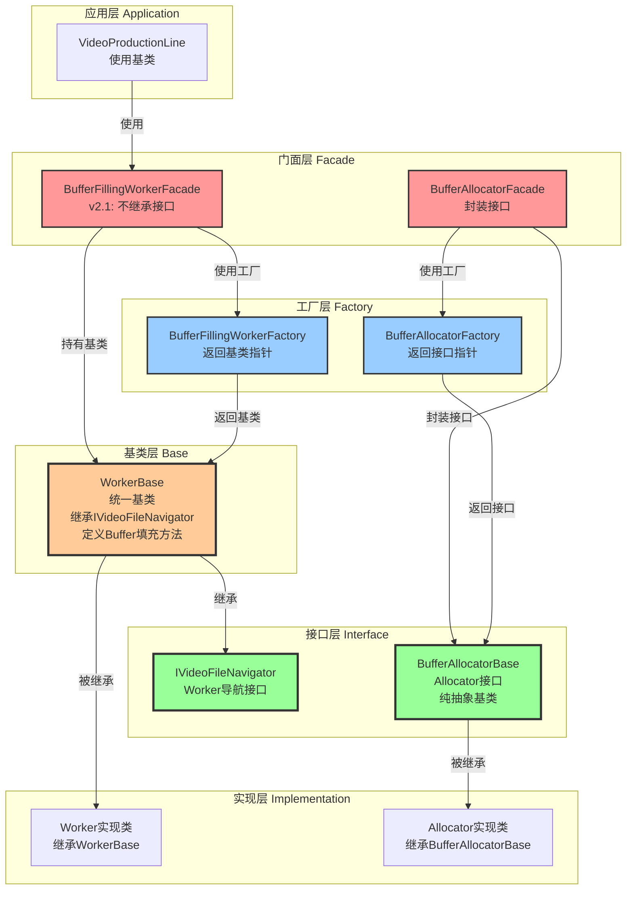
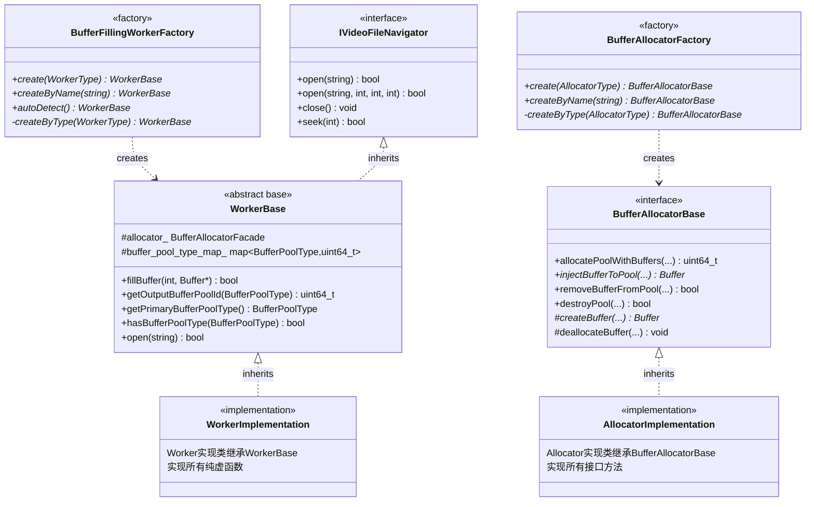
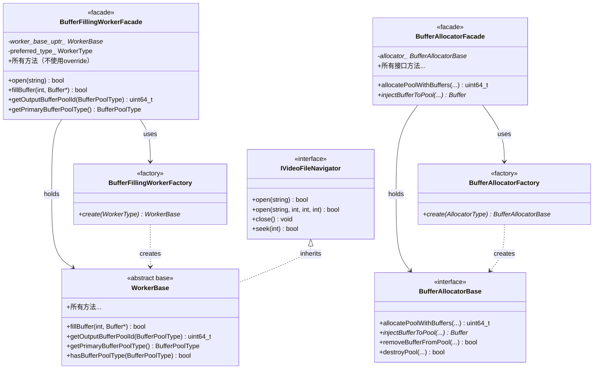
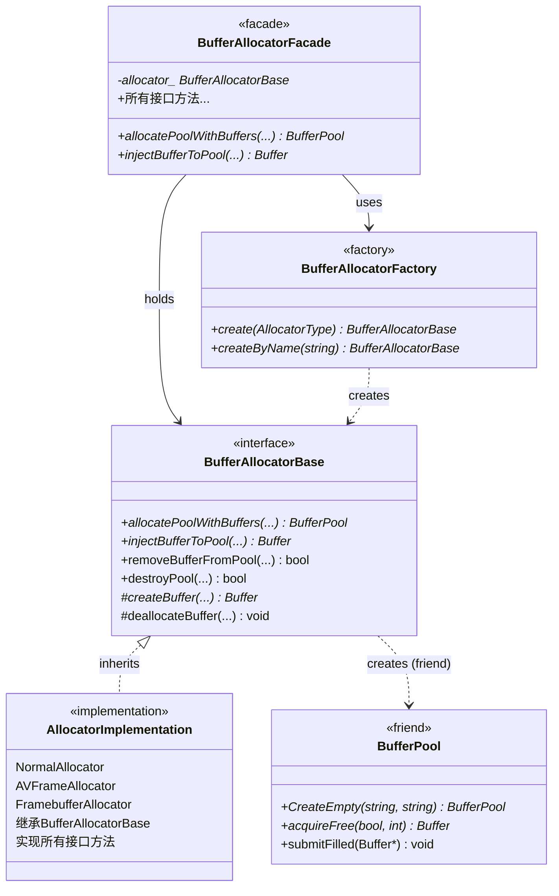
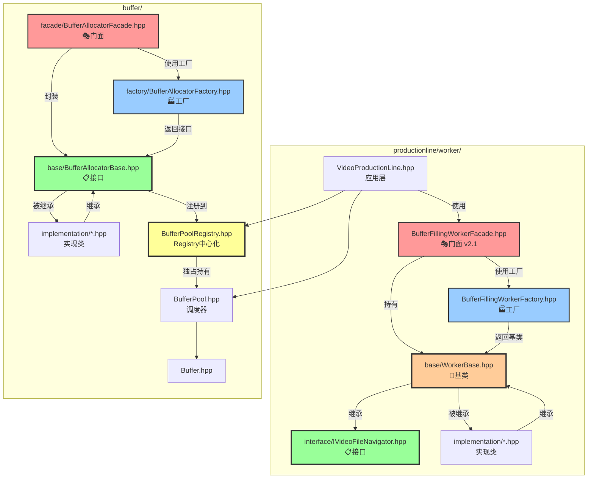
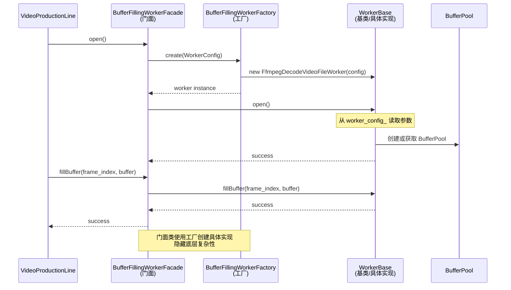

# ProductionLine 综合架构设计文档

## 📋 目录

1. [架构概述](#架构概述)
2. [核心类职责](#核心类职责)
3. [类协作关系](#类协作关系)
4. [设计模式](#设计模式)
5. [门面模式与工厂模式详细分析](#门面模式与工厂模式详细分析)
6. [数据流](#数据流)
7. [核心类详解](#核心类详解)
8. [使用示例](#使用示例)
9. [最佳实践](#最佳实践)
10. [代码规范与风格指南](#代码规范与风格指南)
11. [API参考](#api参考)
12. [常见问题](#常见问题)

---

## 版本历史

### v2.24（当前版本）- 消费类型配置重构与 MultiWorker 比较模式

**发布日期：** 2026-01-29

**主要变更：**

- ✅ **ConsumerTypeConfig 重构**：将 `WorkerConfig::ConsumerConfig` 重命名为 `ConsumerTypeConfig`
  - 成员变量 `consumer` 重命名为 `consumer_type`
  - 使用嵌套结构体分类不同消费类型，每种类型都有独立的 `enable` 标志
  - 支持多种消费类型叠加（如同时显示和保存）

- ✅ **消费类型嵌套结构**：
  - `DisplayType display` - 显示消费类型（设备 ID 配置）
  - `SaveRawType save_raw` - 保存原始 YUV/RGB 数据（`BufferWriter::openRaw()`）
  - `SaveEncodedType save_encoded` - 保存编码数据（`BufferWriter::openEncoded()`）
  - `CompareType compare` - 比较消费类型（PSNR/SSIM 阈值配置）
  - `PerformanceType performance` - 性能验证类型（目标帧率）
  - `CountType count` - 仅统计消费类型

- ✅ **startMultiWorkerCompare 新函数**：使用 `MultiWorkerProductionLine` 实现多 Worker 比较
  - 比较在内部通过 `WorkerSyncCoordinator` 完成
  - 支持每个 Worker 独立配置消费类型（显示、保存路径等）
  - 外部消费策略独立于比较逻辑

- ✅ **比较回调机制**：`callbacks::CompareCallbackContext` 和 `createCompareCallback()`
  - 用于 `WorkerSyncCoordinator` 的 `callback_chain`
  - 支持在帧同步完成后执行自定义比较逻辑
  - 统计通过/失败帧数、计算平均 PSNR/SSIM

- ✅ **WorkerConfigBuilder 更新**：
  - `setConsumerConfig()` → `setConsumerTypeConfig()`
  - 新增方法：`enableDisplay()`、`enableSaveRaw()`、`enableSaveEncoded()`、`enableCompare()`、`enablePerformance()`

**设计原则：**
- **类型分离**：每种消费类型独立配置，通过 `enable` 标志控制
- **多类型叠加**：支持同时启用多种消费类型（如显示 + 保存）
- **配置归属清晰**：消费循环控制（`max_frames`、`timeout_ms`）与消费类型分开
- **独立配置**：每个 Worker 可以有不同的消费类型配置

**配置结构变更：**
```cpp
// 旧结构
struct WorkerConfig {
    struct ConsumerConfig {
        int max_frames;
        bool enable_display;
        int save_frames;
        std::string output_path;
        // ...
    } consumer;
};

// 新结构 (v2.24)
struct WorkerConfig {
    struct ConsumerTypeConfig {
        // 执行控制
        int max_frames;
        int timeout_ms;
        
        // 消费类型（每种独立启用）
        struct DisplayType {
            bool enable;
            int device_id;
        } display;
        
        struct SaveRawType {
            bool enable;
            std::string output_path;
            int max_frames;
        } save_raw;
        
        struct SaveEncodedType {
            bool enable;
            std::string output_path;
        } save_encoded;
        
        struct CompareType {
            bool enable;
            bool enable_psnr;
            double min_psnr;
            bool enable_ssim;
            double min_ssim;
        } compare;
        
        struct PerformanceType {
            bool enable;
            double target_fps;
        } performance;
        
        struct CountType {
            bool enable;
        } count;
    } consumer_type;
};
```

**使用示例：**
```cpp
// v2.24 新方式：使用嵌套结构体
WorkerConfig config;
config.consumer_type.display.enable = true;
config.consumer_type.display.device_id = 0;
config.consumer_type.save_raw.enable = true;
config.consumer_type.save_raw.output_path = "/tmp/output.yuv";
config.consumer_type.save_raw.max_frames = 100;

// 使用 Builder
auto config = WorkerConfigBuilder()
    .setMaxFrames(100)
    .enableDisplay(true, 0)
    .enableSaveRaw(true, "/tmp/output.yuv", 100)
    .enableCompare(true, 35.0, 0.95)
    .build();

// MultiWorker 比较模式
BufferConsumerService service;
service.startMultiWorkerCompare(multi_config, compare_callback);
```

**架构优势：**
- **配置清晰**：每种消费类型的参数集中在一起
- **独立控制**：可以精确控制每种消费类型的启用/禁用
- **扩展性好**：新增消费类型只需添加新的嵌套结构体
- **向后兼容**：通过 Builder 方法保持使用便利性

---

### v2.23 - 帧同步回调机制

**发布日期：** 2026-01-23

**主要变更：**
- ✅ **WorkerSyncCoordinator**：协调多 Worker 帧同步，支持回调链
- ✅ **CallbackChainItem**：定义回调函数、上下文和名称
- ✅ **ConnectorConfig 扩展**：新增 `enable_frame_sync` 和 `callback_chain`

---

### v2.22 - 共享数据源三态控制与数据源配置重构
**发布日期：** 2026-01-22

**主要变更：**
- ✅ **共享模式三态控制**：BufferPacketSource 引入 `acquire/commit/cancel` 三态 API（带 `worker_id`）
  - `acquirePacket()`：阻塞等待新 buffer，版本号防止重复获取
  - `commitPacket()`：成功解码后提交，递减订阅计数并驱动 Fetch 释放
  - `cancelPacket()`：失败时取消，允许重试当前 buffer
  - 移除 `PacketGuard`（RAII 不再适配成功/失败分支）
- ✅ **共享模式状态追踪**：新增 `current_buffer_version_` + `worker_states_`，保证多消费者一致性
- ✅ **数据源配置归一**：`buffer_mode/codec_params/time_base/shared_packet_source` 迁移至 `data_source`
- ✅ **Worker 行为更新**：RTSP 解码在 Buffer 模式下显式 commit/cancel，并在 close 时清理未提交 packet

**设计原则：**
- **显式生命周期**：成功/失败分支清晰，避免隐式释放导致状态不一致
- **版本号保护**：每个 Worker 只处理当前 buffer 一次
- **配置职责清晰**：数据源相关参数统一归属 `data_source`

**架构优势：**
- **更可控的共享语义**：避免重复消费与错误释放
- **可恢复性更强**：失败可取消并重试
- **配置更直观**：Buffer 模式参数从解码器配置中剥离

---

### v2.21 - 日志系统重构与关键 Bug 修复
**发布日期：** 2026-01-16

**主要变更：**
- ✅ **日志系统全面重构**：采用 log4cplus 层次化架构
  - 实现 26 个模块的层次化日志管理（components.Worker、components.BufferPool 等）
  - 每个类使用独立 logger 成员变量，替代全局 LOG_XXX 宏
  - 支持通过配置文件动态调整日志级别（无需重编译）
  - 新增 `logger.properties` 配置文件支持
  - 新增 `LOGGER_CONFIG_README.md` 日志配置指南
- ✅ **关键 Bug 修复**：修复多处导致段错误的初始化问题
  - 修复 `WorkerBase` 构造函数未初始化 `logger_` 导致段错误
  - 修复 `BufferPoolRegistry` 构造函数未初始化 `logger_` 导致段错误
  - 修复 `MultiWorkerProductionLine` 中 use-after-move 错误（访问已移走的 `consumer_info`）
- ✅ **日志格式统一**：移除硬编码模块名，自动显示层次化模块路径
  - 所有 `LOG_XXX` 宏替换为 `LOG4CPLUS_XXX(logger_, ...)`
  - 移除手动添加的 `[ModuleName]` 前缀
  - 日志输出格式：`[YYYY-MM-DD HH:MM:SS.mmm] [components.Module.SubModule] [LEVEL] message`

**设计原则：**
- **层次化管理**：日志按模块层次组织，支持继承式配置
- **配置驱动**：通过配置文件控制日志级别，提高灵活性
- **类型安全**：每个类持有独立 logger，避免全局状态
- **初始化安全**：确保所有 logger 在构造函数中正确初始化

**架构优势：**
- **动态调试**：运行时调整日志级别，无需重新编译
- **精细控制**：可针对单个模块设置不同日志级别
- **性能优化**：减少不必要的日志输出，提升运行效率
- **易于维护**：统一的日志格式，便于问题排查

**影响范围：**
- 修改文件：45 个（包括所有核心模块）
- 新增文件：3 个（logger.properties, logger.properties.minimal, LOGGER_CONFIG_README.md）
- 涉及模块：Worker、BufferPool、Allocator、Display、ProductionLine、Monitor 等全部核心组件

---

### v2.19 - 共享数据源模式与硬件解码增强
**发布日期：** 2025-01-14

**主要变更：**
- ✅ **BufferPacketSource 共享模式**：支持 ONE_TO_MANY 发布-订阅模式
  - 新增共享模式构造函数，接受 `subscriber_count` 参数
  - 实现订阅者同步机制：所有消费者处理同一个 packet
  - 使用互斥锁和条件变量确保线程安全
  - 新增成员：`is_shared_mode_`、`total_subscribers_`、`remaining_subscribers_`、`current_buffer_`
  - ⭐ v2.22：新增 `current_buffer_version_` + `worker_states_`，共享模式改为 `acquire/commit/cancel` 三态流程
- ✅ **Connector 共享实例管理**：支持共享 PacketSource 生命周期管理
  - 新增 `setSharedSource()` 方法：存储共享的 PacketSource
  - 新增 `getSharedSource()` 方法：获取共享实例
  - 新增成员：`shared_source_`（仅 ONE_TO_MANY 模式使用）
- ✅ **Ffmpeg 解码器硬件检测工具**：统一的硬件解码器判断机制
  - `isHardwareDecoder()`：使用 FFmpeg 官方 API 判断（`AV_CODEC_CAP_HARDWARE` + `avcodec_get_hw_config`）
  - `findPureSoftwareDecoder()`：查找指定 codec_id 的纯软件解码器
  - 替代不可靠的字符串匹配方式（`strstr`）
  - 使用 `virtual final` 禁止子类覆盖，保证判断逻辑统一
- ✅ **packet_source_ 智能指针升级**：从 `unique_ptr` 改为 `shared_ptr`
  - 支持多个消费者 Worker 共享同一个 PacketSource 实例
  - 适配 ONE_TO_MANY 模式的共享需求
  - 修改类：FfmpegDecodeRtspWorker、FfmpegDecodeVideoFileWorker
- ✅ **解码器辅助方法重构**：提取公共逻辑，提高代码复用
  - `readAndSendPacket()`：从数据源读取 packet 并发送到解码器
  - `fillBufferMetadataFromFrame()`：从 AVFrame 填充 Buffer 元数据
  - 新增帧缓存：`cached_frames_`（用于多通道解码场景）

**设计原则：**
- **共享语义明确**：shared_ptr 表达共享所有权，unique_ptr 表达独占所有权
- **线程安全保证**：使用互斥锁和条件变量保护共享状态
- **官方 API 优先**：使用 FFmpeg 官方接口而非字符串匹配
- **代码复用**：提取公共逻辑为独立方法，减少重复代码

**架构优势：**
- **真正的共享模式**：所有消费者处理同一个 packet，而非各自复制
- **类型安全检测**：硬件解码器判断基于 API 而非字符串，更可靠
- **扩展性强**：shared_ptr 支持任意数量的消费者共享
- **维护性好**：公共逻辑集中管理，易于调试和优化

**使用示例：**
```cpp
// 示例1：创建共享模式 BufferPacketSource
size_t consumer_count = 3;  // 3个消费者
auto shared_source = std::make_shared<BufferPacketSource>(
    codec_params, 
    consumer_count  // 共享模式
);

// 所有消费者共享同一个实例（通过配置注入）
WorkerConfig consumer_cfg;
consumer_cfg.data_source.buffer_mode = true;
consumer_cfg.data_source.shared_packet_source = shared_source;

FfmpegDecodeRtspWorker worker1(consumer_cfg);
FfmpegDecodeRtspWorker worker2(consumer_cfg);
FfmpegDecodeRtspWorker worker3(consumer_cfg);

// 示例2：Connector 管理共享实例
Connector connector(Connector::Mode::ONE_TO_MANY, {0}, {0, 1, 2});
connector.setSharedSource(shared_source);  // 防止被销毁

// 示例3：强制使用软件解码器
const AVCodec* codec = nullptr;
if (!use_hardware_decoder_) {
    codec = findPureSoftwareDecoder(AV_CODEC_ID_H264);
    if (!codec) {
        LOG_ERROR("No pure software decoder found for H264");
        return false;
    }
}

// 示例4：使用辅助方法简化解码流程
AVPacket* packet = av_packet_alloc();
if (readAndSendPacket(packet)) {
    AVFrame* frame = av_frame_alloc();
    if (avcodec_receive_frame(codec_ctx_, frame) == 0) {
        Buffer* buffer = getBufferForFilling();
        fillBufferMetadataFromFrame(frame, buffer);
    }
}
```

**典型应用场景：**
- **ONE_TO_MANY 场景**：一路输入，多路不同格式输出（如 YUV + RGB）
- **硬件解码限制**：需要明确强制软件解码的场景
- **多消费者共享**：多个 Worker 需要处理同一帧数据

**向后兼容：**
- BufferPacketSource 保留原有单参数构造函数（普通模式）
- Connector 原有接口不变，共享模式为可选功能
- 硬件检测工具为新增功能，不影响现有逻辑

---

### v2.18 - 输入源信息查询与动态适配
**发布日期：** 2025-01

**主要变更：**
- ✅ **输入源信息查询接口**：`IPacketSource` 新增 `getSourceWidth()`、`getSourceHeight()`、`getSourcePixelFormat()` 方法
  - 查询输入数据源（文件/流）的原始分辨率和像素格式
  - 区别于解码器输出格式（可能经过缩放/格式转换）
  - 所有 PacketSource 实现类（FilePacketSource、RtspPacketSource、BufferPacketSource）实现此接口
  - WorkerBase 和 BufferFillingWorkerFacade 提供转发方法
- ✅ **三级优先级动态适配机制**：自动适配输入源分辨率和格式
  - Priority 1（最高）：`taco_config.chX_scale_width/height` - 用户显式配置
  - Priority 2（次高）：`getSourceWidth/Height/PixelFormat()` - 输入源自动检测
  - Priority 3（兜底）：`1920x1080 / AV_PIX_FMT_NV12` - 默认值
- ✅ **测试代码优化**：移除硬编码分辨率，支持任意分辨率输入（720p/1080p/4K/8K）

**设计原则：**
- **信息透明**：输入源信息可直接查询，无需解析复杂结构
- **配置优先**：用户显式配置优先级最高，保证可控性
- **智能适配**：未配置时自动适配输入特性，提升易用性
- **层次化设计**：三级优先级清晰，易于理解和维护

**架构优势：**
- **灵活性**：支持多种分辨率输入，无需硬编码
- **易用性**：自动适配减少配置复杂度
- **可控性**：显式配置优先，保证用户控制权
- **可测试性**：便于测试不同分辨率/格式的视频

**使用示例：**
```cpp
// 示例1：查询输入源信息
auto worker = std::make_shared<BufferFillingWorkerFacade>(config);
worker->open();

int source_width = worker->getSourceWidth();       // 如 3840（4K视频）
int source_height = worker->getSourceHeight();     // 如 2160
AVPixelFormat source_fmt = worker->getSourcePixelFormat();  // 如 AV_PIX_FMT_YUV420P

// 示例2：优先级自动适配（BufferWriter 创建场景）
int output_width, output_height;
AVPixelFormat output_format;

// Priority 1: 显式配置优先
if (taco_config.ch1_scale_width > 0) {
    output_width = taco_config.ch1_scale_width;
    output_height = taco_config.ch1_scale_height;
}
// Priority 2: 自动检测输入源
else if (worker->getSourceWidth() > 0) {
    output_width = worker->getSourceWidth();
    output_height = worker->getSourceHeight();
    output_format = worker->getSourcePixelFormat();
}
// Priority 3: 默认值兜底
else {
    output_width = 1920;
    output_height = 1080;
    output_format = AV_PIX_FMT_NV12;
}

// 示例3：测试不同分辨率视频无需修改代码
// 输入720p视频 → 自动适配为720p输出
// 输入4K视频 → 自动适配为4K输出
// 显式设置 setCh1ScaleResolution(1920, 1080) → 强制1080p输出
```

**典型应用场景：**
- **多分辨率测试**：测试同一套代码对不同分辨率视频的处理能力
- **智能转码**：根据输入源自动确定输出参数
- **向后兼容**：旧代码显式配置仍然有效

---

### v2.17 - TacoConfig 类型安全重构
**发布日期：** 2025-01

**主要变更：**
- ✅ **字段类型改变**：`TacoConfig` 配置字段从字符串改为整型枚举
  - 旧：`ch1_pixel_format = "argb888"`（字符串）→ 新：`ch1_rgb_format = 9`（整型）
  - 旧：`ch1_std = "bt601"`（字符串）→ 新：`ch1_rgb_std = 1`（整型）
  - YUV 格式（ch0）由解码器自动决定，无配置字段
- ✅ **通道配置完善**：新增 ch0/ch1 的裁剪和缩放配置
  - ch0（YUV通道）：`ch0_crop_x/y/width/height`、`ch0_scale_width/height`
  - ch1（RGB通道）：`ch1_crop_x/y/width/height`、`ch1_scale_width/height`
- ✅ **TacoConfigBuilder 增强**：新增通道专用配置方法
  - `setCh0CropRegion()`、`setCh0ScaleResolution()` - 通道0配置
  - `setCh1RgbConfig()`、`setCh1CropRegion()`、`setCh1ScaleResolution()` - 通道1配置
- ✅ **向后兼容支持**：保留字符串接口，内部映射为整型
  - `mapRgbFormatNameToInt()` - 支持15种RGB格式名映射
  - `mapRgbStdNameToInt()` - 支持6种颜色标准映射
- ✅ **Buffer 通道判断**：`Buffer` 新增 `getOutputChannel()` 方法，从 AVFrame metadata 读取通道号

**设计原则：**
- **类型安全**：编译时类型检查，避免字符串拼写错误
- **性能优化**：整型比较替代字符串比较
- **配置完整**：支持通道裁剪、缩放等完整功能
- **向后兼容**：旧代码仍可使用字符串接口

**架构优势：**
- **编译时安全**：类型错误在编译期发现，而非运行时
- **性能提升**：整型操作效率高于字符串操作
- **配置清晰**：ch0/ch1 配置独立，职责明确
- **易于维护**：枚举值集中管理，便于扩展

**使用示例：**
```cpp
// ✅ v2.17 推荐方式：使用整型枚举
auto taco_config = TacoConfigBuilder()
    .setChannels(false, true)  // 启用ch1（RGB），禁用ch0
    .setCh1RgbConfig(true, 9, 1)  // enable=true, format=9(argb888), std=1(bt601)
    .setCh1ScaleResolution(1920, 1080)
    .build();

// ✅ v2.17 向后兼容方式：使用字符串（自动映射为整型）
auto taco_config = TacoConfigBuilder()
    .setRgbConfig(true, "argb888", "bt601")  // 内部映射为 (9, 1)
    .setDecoderOutputResolution(1920, 1080)  // 映射为 setCh1ScaleResolution
    .build();

// ✅ 完整配置示例：ch0 + ch1 双通道
auto taco_config = TacoConfigBuilder()
    .setChannels(true, true)  // 同时启用ch0和ch1
    .setCh0ScaleResolution(1920, 1080)  // ch0输出YUV 1080p
    .setCh1RgbConfig(true, 9, 1)  // ch1输出ARGB888
    .setCh1ScaleResolution(1920, 1080)
    .build();

// ✅ Buffer 通道判断
int channel = buffer->getOutputChannel();  // 0=ch0(YUV), 1=ch1(RGB), -1=不支持
if (channel == 0 && taco_config.ch0_enable) {
    // 处理 YUV 输出
} else if (channel == 1 && taco_config.ch1_enable) {
    // 处理 RGB 输出
}
```

**RGB 格式枚举映射表**（部分）：
| 字符串名称 | 整型值 | 说明 |
|-----------|-------|------|
| `"rgb888"` | 1 | 24-bit RGB |
| `"bgr888"` | 3 | 24-bit BGR |
| `"argb888"` | 9 | 32-bit ARGB（默认） |
| `"abgr888"` | 11 | 32-bit ABGR |
| `"r16g16b16"` | 17 | 48-bit RGB |

**颜色标准枚举映射表**：
| 字符串名称 | 整型值 | 说明 |
|-----------|-------|------|
| `"bt601"` | 1 | BT.601（默认） |
| `"bt709"` | 3 | BT.709（HD） |
| `"bt2020"` | 5 | BT.2020（4K/8K） |

---

### v2.16 - BufferWriter 多格式支持与时间戳修复
**发布日期：** 2025-01

**主要变更：**
- ✅ **多容器格式支持**：扩展 `BufferWriter::openEncoded()` 支持7种容器格式
  - 支持格式：MP4, AVI, MKV, FLV, MOV, TS, MPEG
  - H.264 remux：不重新编码，直接封装（高效）
  - 自动格式推断：根据文件扩展名自动选择容器
- ✅ **时间戳修复策略**："Retain + Supplement" 策略
  - 保留原有修复：`AVFMT_AVOID_NEG_TS_MAKE_NON_NEGATIVE`（处理负时间戳）
  - 补充新修复：记录第一帧的 PTS/DTS 偏移量，所有后续帧减去此偏移量
  - 解决 RTSP 流时间戳从非零开始（如720秒）导致播放器显示异常时长的问题
- ✅ **函数命名规范化**：`BufferWriter` 方法重命名
  - `open()` → `openRaw()` - 打开原始数据流（raw格式）
  - `open()` → `openEncoded()` - 打开编码数据流（容器格式）
- ✅ **定时器录制控制**：使用 `PerformanceMonitor::Timer` 替代手动时间检查
  - 优雅的定时停止机制
  - 代码更简洁、更可维护
- ✅ **Raw 格式测试增强**：完善原始格式保存测试
  - 分类目录：`./test_output_raw/rgb/`, `./test_output_raw/yuv/`, `./test_output_raw/gray/`
  - 文件命名规范：`ch0_nv12_1920x1080.raw`, `ch1_argb_3840x2160.raw`
  - 格式验证：`BufferWriter::write()` 内部验证格式/分辨率匹配

**设计原则：**
- **格式通用性**：一套代码支持多种容器格式
- **时间一致性**：修复时间戳异常，确保播放正确
- **职责清晰**：函数命名明确表达操作类型（raw vs encoded）
- **自动化**：自动格式推断，减少配置复杂度

**架构优势：**
- **兼容性强**：支持主流容器格式，满足不同场景需求
- **播放正确**：时间戳修复确保播放器正确显示时长
- **代码规范**：函数命名清晰，易于理解和维护
- **测试完善**：覆盖 RGB/YUV/灰度等多种原始格式

**使用示例：**
```cpp
// 示例1：保存编码流到多种容器格式
BufferWriter writer_mp4, writer_avi, writer_mkv;

// MP4 格式（最常用）
writer_mp4.openEncoded("output.mp4", codec_params, time_base);

// AVI 格式（兼容性好）
writer_avi.openEncoded("output.avi", codec_params, time_base);

// MKV 格式（开源免费）
writer_mkv.openEncoded("output.mkv", codec_params, time_base);

// 写入数据
while (running) {
    producer.waitForFilled(buffer, timeout);
    writer_mp4.write(buffer);
    writer_avi.write(buffer);
    writer_mkv.write(buffer);
    producer.releaseFilled(buffer);
}

// 示例2：使用 Timer 控制录制时长
Timer recording_timer;
recording_timer.start();

auto timer_id = recording_timer.scheduleOnce(
    30000,  // 30秒
    []() {
        g_running = false;
        LOG_INFO("Recording duration reached, stopping...");
    }
);

// ... 录制循环 ...

recording_timer.cancel(timer_id);
recording_timer.stop();

// 示例3：保存原始数据（通道区分）
BufferWriter ch0_writer, ch1_writer;

// ch0: YUV 通道
ch0_writer.openRaw("./test_output_raw/yuv/ch0_nv12_1920x1080.raw", 
                   AV_PIX_FMT_NV12, 1920, 1080);

// ch1: RGB 通道
ch1_writer.openRaw("./test_output_raw/rgb/ch1_argb_1920x1080.raw", 
                   AV_PIX_FMT_ARGB, 1920, 1080);

// 写入时根据通道过滤
int channel = buffer->getOutputChannel();
if (channel == 0) ch0_writer.write(buffer);
if (channel == 1) ch1_writer.write(buffer);
```

**时间戳修复原理**：
```cpp
// Retain: 保留原有修复（处理负时间戳）
output_format_ctx_->avoid_negative_ts = AVFMT_AVOID_NEG_TS_MAKE_NON_NEGATIVE;

// Supplement: 补充新修复（处理非零起始时间戳）
if (first_pts_offset_ == AV_NOPTS_VALUE) {
    first_pts_offset_ = packet->pts;  // 记录第一帧偏移量
    first_dts_offset_ = packet->dts;
}
packet->pts -= first_pts_offset_;  // 减去偏移量，确保从0开始
packet->dts -= first_dts_offset_;
```

**支持的容器格式列表**：
| 格式 | 扩展名 | 特点 | 适用场景 |
|------|-------|------|---------|
| MP4 | `.mp4` | 兼容性最好 | 通用场景、网络传输 |
| AVI | `.avi` | Windows原生支持 | Windows环境 |
| MKV | `.mkv` | 开源、功能强大 | 高级用户、存档 |
| FLV | `.flv` | 流媒体友好 | 直播、点播 |
| MOV | `.mov` | macOS原生支持 | macOS环境 |
| TS | `.ts` | 流式传输 | IPTV、HLS |
| MPEG | `.mpeg` | 标准格式 | 广播、DVD |

---

### v2.15 - MultiWorkerProductionLine WorkerGroup + Connector 多组并行架构（新）
**发布日期：** 2025-01（本节已按最新实现修正）

**主要变更：**
- ✅ **WorkerGroup 概念升级**：引入"工作组"概念，支持多组独立并行  
  - 每组包含：**多个生产者（Producers）+ 多个消费者（Consumers）+ 多个 Connector**
  - 配置结构与头文件一致：  
    `struct WorkerGroup { std::string group_id; std::vector<ProducerConfig> producer_configs; std::vector<ConsumerConfig> consumer_configs; std::vector<ConnectorConfig> connector_configs; };`
- ✅ **Connector 连接器**：显式描述生产者与消费者之间的绑定关系  
  - 单一类 `Connector` + `Mode` 枚举：`ONE_TO_ONE / ONE_TO_MANY / MANY_TO_ONE / MANY_TO_MANY`  
  - 配置结构：`ConnectorConfig { Connector::Mode mode; std::vector<std::string> producer_ids; std::vector<std::string> consumer_ids; }`  
  - 运行时内部计算 `consumer_index -> producer_index` 映射，**仅负责路由，不负责数据**
  - **v2.19 新增**：支持共享 PacketSource 实例管理（`setSharedSource()` / `getSharedSource()`）
    - 在 ONE_TO_MANY 模式下，Connector 持有共享的 BufferPacketSource 实例
    - 防止共享实例被过早销毁，确保生命周期正确管理
    - 新增成员：`std::shared_ptr<IPacketSource> shared_source_`
- ✅ **共享全局线程池**：所有组、所有消费者共用一份线程池  
  - 使用 `GlobalThreadPool` 单例包装 `BS::thread_pool`  
  - 线程池大小通过 `MultiWorkerConfig::thread_pool_size` 进行初始化配置  
  - 各组内部通过 `CountDownLatch` 实现一次调度内的同步
- ✅ **Buffer 模式数据源 + 零拷贝**  
  - 生产者写入自身 `BufferPool`；消费者统一以 `buffer_mode` 从指定 `BufferPool` 取数  
  - 通过 Connector 事先绑定好：**消费者只认 BufferPool，不直接感知具体生产者实现**  
  - 避免中间拷贝，保持数据链路简洁
  - ⭐ v2.22: 配置从 `decoder.datasource_buffer_mode` 移至 `data_source.buffer_mode`
- ✅ **配置驱动 + 严格校验**  
  - `validateConfig()` 在 `start()` 前对每个 Group 做完整校验：  
    - 每组必须至少 1 个 Producer + 1 个 Consumer  
    - 每组必须至少 1 个 Connector  
    - Connector 中引用的 `producer_ids` / `consumer_ids` 必须存在  
    - 按 `Mode` 检查 1:1 / 1:N / N:1 的规模约束  
    - 检查是否存在“未被任何 Connector 绑定”的 Producer / Consumer

**设计原则：**
- **组间独立**：每组有独立的 `GroupData` 与线程，互不干扰
- **组内通过 Connector 建模关系**：不再在代码里硬编码“1 个 Producer + N 个 Consumer”的假设
- **全局统一线程池**：线程资源集中管理，避免多实例、多组重复创建线程池
- **统计下沉到数据源**：以 `BufferPool` 为统计主体（生产/消费/丢帧），生产线聚合展示

**架构优势：**
- **可扩展性**：支持任意多组、每组任意多个生产者/消费者、多种连接关系
- **高性能**：组间并行 + 全局线程池调度组内所有消费者任务
- **资源安全**：`CountDownLatch` + BufferPool 生命周期控制，避免早释放/泄漏
- **清晰观测性**：MultiWorker + Group + Producer/Consumer 多层级统计接口

**配置示例：**
```cpp
// 示例1：单组配置（1 个 Producer + 2 个 Consumer，经典对比场景）
MultiWorkerProductionLine::ProducerConfig producer;
producer.producer_id = "record";
producer.worker_config = record_config;  // RTSP 录制

MultiWorkerProductionLine::ConsumerConfig hw;
hw.consumer_id = "hw_decode";
hw.worker_config = decode_hw_config;     // 硬件解码器

MultiWorkerProductionLine::ConsumerConfig sw;
sw.consumer_id = "sw_decode";
sw.worker_config = decode_sw_config;     // 软件解码器

MultiWorkerProductionLine::ConnectorConfig conn;
conn.mode = Connector::Mode::ONE_TO_MANY;
conn.producer_ids = { "record" };
conn.consumer_ids = { "hw_decode", "sw_decode" };

MultiWorkerProductionLine::WorkerGroup group("group1");
group.producer_configs = { producer };
group.consumer_configs = { hw, sw };
group.connector_configs = { conn };

MultiWorkerProductionLine::MultiWorkerConfig config;
config.thread_pool_size = 4;  // 初始化全局线程池大小
config.groups.push_back(group);

MultiWorkerProductionLine pipeline(config);
pipeline.start();
```

```cpp
// 示例2：多组配置 + 多 Producer 场景（组间并行）
MultiWorkerProductionLine::WorkerGroup group1("compare_test");
{
    // 组1：RTSP 录制 → 硬件解码 + 软件解码（对比测试）
    MultiWorkerProductionLine::ProducerConfig p;
    p.producer_id = "rtsp_record";
    p.worker_config = rtsp_record_config;

    MultiWorkerProductionLine::ConsumerConfig hw_dec;
    hw_dec.consumer_id = "hw";
    hw_dec.worker_config = hw_decode_config;

    MultiWorkerProductionLine::ConsumerConfig sw_dec;
    sw_dec.consumer_id = "sw";
    sw_dec.worker_config = sw_decode_config;

    MultiWorkerProductionLine::ConnectorConfig c;
    c.mode = Connector::Mode::ONE_TO_MANY;
    c.producer_ids = { "rtsp_record" };
    c.consumer_ids = { "hw", "sw" };

    group1.producer_configs = { p };
    group1.consumer_configs = { hw_dec, sw_dec };
    group1.connector_configs = { c };
}

MultiWorkerProductionLine::WorkerGroup group2("multi_resolution");
{
    // 组2：文件解码 → 多路缩放（多分辨率输出）
    MultiWorkerProductionLine::ProducerConfig p;
    p.producer_id = "file_decode";
    p.worker_config = file_decode_config;

    MultiWorkerProductionLine::ConsumerConfig c720;
    c720.consumer_id = "scale_720p";
    c720.worker_config = scale_720p_config;

    MultiWorkerProductionLine::ConsumerConfig c1080;
    c1080.consumer_id = "scale_1080p";
    c1080.worker_config = scale_1080p_config;

    MultiWorkerProductionLine::ConsumerConfig c4k;
    c4k.consumer_id = "scale_4k";
    c4k.worker_config = scale_4k_config;

    MultiWorkerProductionLine::ConnectorConfig c;
    c.mode = Connector::Mode::ONE_TO_MANY;
    c.producer_ids = { "file_decode" };
    c.consumer_ids = { "scale_720p", "scale_1080p", "scale_4k" };

    group2.producer_configs = { p };
    group2.consumer_configs = { c720, c1080, c4k };
    group2.connector_configs = { c };
}

MultiWorkerProductionLine::MultiWorkerConfig config;
config.thread_pool_size = 8;
config.groups = { group1, group2 };

// 组1和组2并行执行，互不干扰；共享同一个全局线程池
MultiWorkerProductionLine pipeline(config);
pipeline.start();
```

```cpp
// 示例3：访问组内 BufferPool（兼容多 Producer 的查询语义）
// 当前接口语义：getGroupProducerBufferPoolId 默认返回该组“第一个 Producer”的 BufferPool
uint64_t producer_pool_id = pipeline.getGroupProducerBufferPoolId(0);

// 获取组 0 的第 1 个 Consumer 的 BufferPool ID
uint64_t consumer_pool_id = pipeline.getGroupConsumerBufferPoolId(0, 1);

BufferPoolRegistry& registry = BufferPoolRegistry::getInstance();
auto producer_pool = registry.getBufferPool(producer_pool_id);
auto consumer_pool = registry.getBufferPool(consumer_pool_id);
```

```cpp
// 示例4：v2.19 共享模式配置（ONE_TO_MANY 使用共享 BufferPacketSource）
// 场景：一路输入，多路不同格式输出（YUV + RGB），所有消费者处理同一帧
MultiWorkerProductionLine::WorkerGroup group("shared_mode_test");
{
    // 生产者：录制 H.264 编码的 packet
    MultiWorkerProductionLine::ProducerConfig producer;
    producer.producer_id = "rtsp_record";
    producer.worker_config = rtsp_record_config;
    
    // 消费者1：解码为 YUV 格式
    MultiWorkerProductionLine::ConsumerConfig yuv_consumer;
    yuv_consumer.consumer_id = "yuv_decode";
    yuv_consumer.worker_config = yuv_decode_config;
    
    // 消费者2：解码为 RGB 格式
    MultiWorkerProductionLine::ConsumerConfig rgb_consumer;
    rgb_consumer.consumer_id = "rgb_decode";
    rgb_consumer.worker_config = rgb_decode_config;
    
    // Connector：ONE_TO_MANY 模式（触发共享模式）
    MultiWorkerProductionLine::ConnectorConfig connector;
    connector.mode = Connector::Mode::ONE_TO_MANY;
    connector.producer_ids = { "rtsp_record" };
    connector.consumer_ids = { "yuv_decode", "rgb_decode" };
    
    group.producer_configs = { producer };
    group.consumer_configs = { yuv_consumer, rgb_consumer };
    group.connector_configs = { connector };
}

// MultiWorkerProductionLine 内部逻辑（自动处理）：
// 1. 检测到 ONE_TO_MANY 且 consumer_count > 1
// 2. 创建共享模式 BufferPacketSource(codec_params, 2)
// 3. 所有消费者共享同一个实例（通过 shared_ptr）
// 4. Connector 持有共享实例，防止被销毁（connector.setSharedSource(shared_source)）
// 5. 运行时所有消费者同步读取同一个 packet

MultiWorkerProductionLine::MultiWorkerConfig config;
config.thread_pool_size = 4;
config.groups = { group };

MultiWorkerProductionLine pipeline(config);
pipeline.start();
// 运行时：YUV 和 RGB 消费者始终解码同一帧，无需手动同步
```

**核心运行时结构：**
```
MultiWorkerProductionLine
  ├─ WorkerGroup 1 (独立线程)
  │   ├─ Producers:
  │   │    ├─ P0: rtsp_record      → BufferPool(P0)
  │   │    └─ P1: ...（可选）
  │   ├─ Consumers:
  │   │    ├─ C0: hw_decode        (datasource=BufferPool(P0))
  │   │    └─ C1: sw_decode        (datasource=BufferPool(P0))
  │   ├─ Connectors:
  │   │    └─ ONE_TO_MANY: {P0} → {C0, C1}
  │   └─ CountDownLatch + 全局线程池任务调度
  │
  ├─ WorkerGroup 2 (独立线程)
  │   ├─ Producers:
  │   │    └─ P0: file_decode      → BufferPool(P0)
  │   ├─ Consumers:
  │   │    ├─ C0: scale_720p       (datasource=BufferPool(P0))
  │   │    ├─ C1: scale_1080p      (datasource=BufferPool(P0))
  │   │    └─ C2: scale_4k         (datasource=BufferPool(P0))
  │   ├─ Connectors:
  │   │    └─ ONE_TO_MANY: {P0} → {C0, C1, C2}
  │   └─ CountDownLatch + 全局线程池任务调度
  │
  └─ GlobalThreadPool (BS::thread_pool)
       └─ 所有 Group 的消费者任务在线程池中执行
```

**典型应用场景：**
1. **对比测试**：硬件解码 vs 软件解码性能对比（单 Producer + 多 Consumer，ONE_TO_MANY）
2. **多路输出**：同一视频输出多种分辨率/格式（单 Producer + 多 Consumer，ONE_TO_MANY）
3. **多路输入聚合**：多个 Producer 统一喂给一个 Consumer（MANY_TO_ONE / MANY_TO_MANY）
4. **实时处理流水线**：实时流 → 多路 AI 推理 + 显示 + 存储，多组解耦运行

---

### v2.14 - BufferPacketSource 零拷贝直连架构
**发布日期：** 2025-01

**主要变更：**
- ✅ **BufferPacketSource 重新设计**：普通模式移除中间缓存，直接关联 BufferPool
  - 删除：`use_pool_mode_`（兼容模式标志）
  - 删除：`setCurrentBuffer()` / `clearCurrentBuffer()` 方法
  - 普通模式不再依赖 `current_buffer_`；共享模式下 `current_buffer_` 仅用于同步与生命周期管理
  - 新增：`std::weak_ptr<BufferPool> source_pool_`（直接关联）
  - 新增：`setSourceBufferPool(std::weak_ptr<BufferPool> pool_weak)` 方法
- ✅ **真正的零拷贝数据流**：`readPacket()` 直接从 BufferPool 获取，立即释放
  - 获取：`Buffer* buffer = pool->acquireFilled(true, 100);`
  - 使用：`copyPacket(packet, buffer->getAVPacket());`
  - 释放：`pool->releaseFilled(buffer);`（立即释放，避免积压）
- ✅ **配置字段重命名**：`use_buffer_mode` → `datasource_buffer_mode`（v2.14）→ `buffer_mode`（v2.22，移至 data_source 结构体）
- ✅ **MultiWorkerProductionLine 简化**：移除中间拷贝逻辑
  - 删除：`producerThreadFunc()` 中的 `buffer_source->setCurrentBuffer()`
  - 消费者直接从生产者 BufferPool 读取

**v2.19 新增 - 共享模式（发布-订阅）：**
- ✅ **共享模式构造函数**：支持多消费者共享同一个 packet
  - 新增：`BufferPacketSource(codec_params, subscriber_count)` 构造函数
  - 新增成员：`is_shared_mode_`、`total_subscribers_`、`remaining_subscribers_`、`current_buffer_`
  - 新增同步机制：`std::mutex mutex_`、`std::condition_variable cv_subscribers_`、`cv_fetch_`
- ✅ **订阅者同步机制**：确保所有消费者处理同一帧
  - 工作流程：消费者 `acquirePacket(worker_id)` → 解码成功 `commitPacket(worker_id)` / 失败 `cancelPacket(worker_id)` → 所有订阅者提交后 Fetch 释放 Buffer
  - ⭐ v2.22：增加 `current_buffer_version_` 与 `worker_states_`，避免重复消费
  - 线程安全：使用互斥锁和条件变量保护共享状态
  - 防止数据竞争：确保 packet 在所有订阅者提交前不被释放

**设计原则：**
- **真正零拷贝**：消除所有中间拷贝环节
- **职责清晰**：BufferPacketSource 自主管理数据获取
- **资源高效**：buffer 使用后立即释放，避免积压
- **架构简化**：删除兼容模式，代码更清晰
- **共享语义明确**（v2.19）：shared_ptr 表达共享所有权，支持多消费者场景
- **线程安全保证**（v2.19）：使用同步原语保护共享状态

**架构优势：**
- **内存效率**：无中间缓存，内存占用最小
- **性能优化**：减少拷贝次数，提升吞吐量
- **代码简洁**：删除冗余逻辑，易于维护
- **职责分离**：数据源自主管理，不依赖外部设置
- **真正共享**（v2.19）：所有消费者处理同一个 packet，而非各自复制
- **扩展性强**（v2.19）：支持任意数量的消费者共享

**使用示例：**
```cpp
// v2.14 零拷贝架构 - 普通模式（单消费者）
// 1. 创建 BufferPacketSource（消费者数据源）
auto buffer_source = std::make_unique<BufferPacketSource>(codec_params);

// 2. 关联生产者的 BufferPool
buffer_source->setSourceBufferPool(producer_buffer_pool_weak);

// 3. BufferPacketSource 内部自动处理获取和释放
int ret = buffer_source->readPacket(packet);
// 内部逻辑：
// - acquireFilled() 获取 buffer
// - copyPacket() 拷贝数据
// - releaseFilled() 立即释放 ⭐ 关键改进

// v2.19 共享模式 - 多消费者共享同一个 packet（ONE_TO_MANY）
// 1. 创建共享模式 BufferPacketSource（指定订阅者数量）
size_t consumer_count = 3;  // 3个消费者
auto shared_source = std::make_shared<BufferPacketSource>(
    codec_params, 
    consumer_count  // ⭐ 共享模式构造
);

// 2. 关联生产者的 BufferPool
shared_source->setSourceBufferPool(producer_buffer_pool_weak);

// 3. 所有消费者 Worker 共享同一个实例（通过配置注入）
WorkerConfig consumer_cfg;
consumer_cfg.data_source.buffer_mode = true;
consumer_cfg.data_source.shared_packet_source = shared_source;

FfmpegDecodeRtspWorker worker1(consumer_cfg);  // 消费者1
FfmpegDecodeRtspWorker worker2(consumer_cfg);  // 消费者2
FfmpegDecodeRtspWorker worker3(consumer_cfg);  // 消费者3

// 4. 共享模式工作流程（自动同步）
// - 消费者1/2/3 调用 acquirePacket(this) → 等待新 buffer
// - 解码成功：commitPacket(this)；解码失败：cancelPacket(this)（允许重试）
// - 所有订阅者 commit 完成后，Fetch 释放 Buffer

// ❌ v2.13 旧方式（已废弃）
// buffer_source->setCurrentBuffer(buffer);  // 需要外部设置
// buffer_source->readPacket(packet);
// buffer_source->clearCurrentBuffer();      // 需要外部清理
```

**架构对比**：
| 项目 | v2.13 旧架构 | v2.14 新架构 | v2.19 共享模式 |
|------|-------------|-------------|---------------|
| 中间缓存 | ✗ 需要 `current_buffer_` | ✓ 无中间缓存 | ✓ 仅在同步时持有 |
| 设置方式 | ✗ 外部调用 `setCurrentBuffer()` | ✓ 内部自动获取 | ✓ 内部自动获取 + 同步 |
| 释放方式 | ✗ 外部调用 `clearCurrentBuffer()` | ✓ 内部立即释放 | ✓ 所有订阅者完成后释放 |
| 拷贝次数 | ✗ 2次（Producer→中间→Consumer） | ✓ 1次（Producer→Consumer） | ✓ 1次共享（所有消费者读取同一个） |
| 代码复杂度 | ✗ 需要手动管理生命周期 | ✓ 自动管理 | ✓ 自动管理 + 同步机制 |
| 消费者数量 | 1 个 | 1 个 | N 个（共享） |
| 数据一致性 | N/A | N/A | ✓ 保证所有消费者处理同一帧 |
| 智能指针 | unique_ptr | unique_ptr | shared_ptr（v2.19） |

**职责变化**：
```
v2.13 旧架构：
MultiWorkerProductionLine → 获取 buffer → 设置到 BufferPacketSource → Consumer 读取 → 清理

v2.14 新架构（普通模式）：
MultiWorkerProductionLine → 触发 Consumer → BufferPacketSource 自主获取/释放 → Consumer 读取

v2.19 新架构（共享模式）：
MultiWorkerProductionLine → 触发所有 Consumers → BufferPacketSource 同步等待 → 所有消费者到齐 → 
获取 Buffer → 所有 Consumers 读取同一 packet → 最后完成者释放 Buffer
```

---

### v2.13 - 配置单一数据源与接口简化
**发布日期：** 2025-01

**主要变更：**
- ✅ **接口简化**：删除 `open(path, width, height, bits_per_pixel)` 重载，统一使用 `open()` 和 `open(path)` 两个版本
  - `open()`：Worker 从 `worker_config_` 读取所有参数（推荐）
  - `open(path)`：快速指定文件路径（可选，RTSP Worker 不支持）
- ✅ **配置单一数据源原则**：Worker 统一从 `worker_config_` 读取所有参数，消除 Facade 与 Worker 的配置冗余
  - 删除 `BufferFillingWorkerFacade::open()` 中的参数提取逻辑
  - Facade 直接调用 `worker->open()`，不再充当"参数转发器"
- ✅ **getBytesPerPixel() 优化（方案A）**：
  - 返回类型改为 `double`，支持 NV12 等格式的 1.5 字节/像素
  - 优先从解码器实际输出格式 `codec_ctx_ptr_->pix_fmt` 计算
  - Fallback 从 `worker_config_.decoder.taco` 的格式枚举推断（RGB整型枚举/YUV自动）
  - 删除冗余的 `output_bits_per_pixel_` 成员变量
  - **注**：v2.17 后，TacoConfig 使用整型枚举而非字符串
- ✅ **架构一致性改进**：所有 Worker（`FfmpegDecodeVideoFileWorker`、`FfmpegDecodeRtspWorker`、`FfmpegRecordRtspWorker`）统一实现无参 `open()`

**设计原则：**
- **单一数据源**：Worker 只从 `worker_config_` 读取配置，不接受外部参数传递
- **接口简化**：`open()` 无参数或只有一个可选的 `path` 参数，降低接口复杂度
- **精确计算**：`getBytesPerPixel()` 支持 `double` 类型，准确表示各种像素格式（如 NV12=1.5）
- **职责分离**：Facade 不再提取和转发参数，只负责创建和转发调用

**架构优势：**
- **消除冗余**：不再有两份 config（Facade 的 `config_` 和 Worker 的 `worker_config_`）
- **数据一致**：单一数据源保证参数来源统一，避免同步问题
- **类型安全**：`double` 类型支持非整数字节/像素比例
- **易于维护**：接口更简洁，职责更清晰，符合单一职责原则

**使用示例：**
```cpp
// ✅ v2.13 推荐方式：无参 open()，所有参数从 config 读取
auto config = WorkerConfigBuilder()
    .setFileConfig(FileConfigBuilder().setFilePath("rtsp://...").build())
    .setDisplayConfig(DisplayConfigBuilder()
        .setDisplayResolution(1920, 1080)
        .setBitsPerPixel(32)
        .build())
    .setDecoderConfig(DecoderConfigBuilder().useTaco("h264").build())
    .build();

BufferFillingWorkerFacade worker(config);
worker.open();  // Worker 自动从 worker_config_ 读取所有参数

// ❌ v2.12 旧方式（已废弃）
// worker.open("rtsp://...", 1920, 1080, 32);  // 不再支持
```

**getBytesPerPixel() 计算示例：**
```cpp
double bpp = worker.getBytesPerPixel();
// NV12: 1.5 字节/像素
// ARGB8888: 4.0 字节/像素  
// RGB888: 3.0 字节/像素
// RGB48LE: 6.0 字节/像素
```

### v2.12 - 数据源抽象模式重构
**发布日期：** 2024-12

**主要变更：**
- ✅ **数据源抽象接口**：引入 `IPacketSource` 接口，支持策略模式，实现数据源与 Worker 的解耦
- ✅ **文件数据源实现**：`FilePacketSource` 管理 `AVFormatContext` 和文件相关状态（视频流索引、总帧数、EOF 状态等）
- ✅ **Buffer 数据源实现**：`BufferPacketSource` 用于 MultiWorkerProductionLine 场景，从 BufferPool 获取 AVPacket
- ✅ **Worker 重构**：`FfmpegDecodeVideoFileWorker` 使用数据源抽象，移除冗余状态变量
  - 移除：`format_ctx_ptr_`、`file_path_`、`width_`、`height_`、`total_frames_`、`video_stream_index_`、`is_open_`、`eof_reached_`
  - 所有状态统一由数据源管理，避免状态不一致
- ✅ **状态管理优化**：单一数据源管理状态，Worker 直接查询数据源，避免缓存导致的不一致
- ✅ **线程安全改进**：数据源的 `is_open_` 使用 `std::atomic<bool>`，保证线程安全的状态检查
- ✅ **配置系统增强**：`WorkerConfig` 添加 `use_buffer_mode`（默认 false，v2.14 重命名为 `datasource_buffer_mode`，v2.22 移至 `data_source.buffer_mode`）和 `codec_params` 配置项

**v2.19 新增 - 共享模式支持：**
- ✅ **智能指针升级**：Worker 的 `packet_source_` 从 `unique_ptr` 改为 `shared_ptr`
  - 支持多个 Worker 共享同一个 PacketSource 实例
  - 修改类：`FfmpegDecodeRtspWorker`、`FfmpegDecodeVideoFileWorker`
  - 独占场景仍使用 `std::make_unique`，共享场景使用 `std::make_shared`
- ✅ **BufferPacketSource 共享模式**：支持多消费者订阅同一数据源
  - 新增共享模式构造函数：`BufferPacketSource(codec_params, subscriber_count)`
  - 实现发布-订阅同步机制，确保所有消费者处理同一帧
  - 详见 v2.14 章节补充说明

**设计原则：**
- **单一职责**：Worker 专注解码逻辑，数据源负责数据访问和元数据管理
- **依赖倒置**：Worker 依赖 `IPacketSource` 接口，不依赖具体实现
- **易于扩展**：新增数据源类型（如网络流）无需修改 Worker 代码
- **状态一致**：单一数据源管理状态，避免冗余和不同步

**数据源职责边界（重要）：**

`IPacketSource` 数据源**仅负责数据读取和元数据管理**，职责明确限定为：

✅ **数据源应该做的**：
- **打开/关闭数据源**：管理文件、网络流、Buffer 等数据源的生命周期
- **读取原始数据包**：从数据源读取 `AVPacket`（编码数据），不进行任何转换
- **提供元数据查询**：编解码器参数、总帧数、文件大小、视频流索引等
- **管理读取状态**：EOF 状态、打开状态、连接状态等
- **提供导航功能**：`seek()` 定位到指定帧（仅文件模式支持）

❌ **数据源不应该做的**：
- ❌ **解码数据**：解码是 Worker 的职责（如 `FfmpegDecodeVideoFileWorker`）
- ❌ **编码数据**：编码是编码器 Worker 的职责
- ❌ **数据格式转换**：像素格式转换由 `SwsContext` 或解码器处理
- ❌ **写入数据**：写入是 `BufferWriter` 的职责
- ❌ **业务逻辑处理**：业务逻辑由应用层负责

**职责边界原则**：
> 数据源是"**纯粹的数据提供者**"，只管"**读**"，不管"**写**"和"**转换**"。  
> 数据源与 Worker 的关系：数据源提供原材料（`AVPacket`），Worker 负责加工（解码、编码）。

**架构优势：**
- **职责分离**：Worker 和数据源职责清晰，符合 SOLID 原则
- **状态一致**：单一数据源管理状态，避免缓存导致的不一致
- **线程安全**：使用原子变量保证状态检查的线程安全
- **代码简化**：Worker 代码更简洁，职责更清晰

**使用示例：**
```cpp
// 文件模式（默认）
auto config = WorkerConfigBuilder()
    .setFileConfig(FileConfigBuilder().setFilePath("video.mp4").build())
    .build();
// Worker 内部创建 FilePacketSource

// Buffer 模式（MultiWorkerProductionLine，v2.22 配置归一）
WorkerConfig::DataSourceConfig ds_cfg;
ds_cfg.buffer_mode = true;
ds_cfg.codec_params = record_codec_params;

auto config = WorkerConfigBuilder()
    .setDataSourceConfig(ds_cfg)
    .build();
// Worker 内部创建 BufferPacketSource
```

### v2.11 - 编解码器类型检测
**发布日期：** 2024-12

**主要变更：**
- ✅ **编解码器匹配检测**：WorkerBase 提供通用的编解码器类型检测工具
- ✅ **配置验证**：在 Worker 打开媒体文件时自动检查配置的解码器与实际编解码器是否匹配
- ✅ **友好警告**：不匹配时打印详细的警告信息（包含期望类型 vs 实际类型，以及修复建议），但不中断程序运行
- ✅ **通用接口**：所有 FFmpeg Worker（FfmpegDecodeVideoFileWorker、FfmpegDecodeRtspWorker）统一使用

**设计原则：**
- **Fail-Soft**：检测到问题时只警告不中断，允许程序继续运行（FFmpeg 会自动选择正确的解码器）
- **Protected 方法**：检测工具放在 WorkerBase protected 区域，只供子类使用，避免外部误用
- **可扩展**：支持常见编解码器（H.264/H.265/VP8/VP9/AV1/MPEG-2/MPEG-4），易于扩展

**使用示例：**
```cpp
// Worker 子类在 open() 中调用
AVCodecParameters* codecpar = format_ctx_->streams[video_idx]->codecpar;
checkCodecMismatch(codecpar->codec_id, decoder_name_);  // 自动检测并警告
```

### v2.10 - Buffer 动态大小调整
**发布日期：** 2024-12

**主要变更：**
- ✅ **动态大小更新**：Buffer 类添加 `setSize()` 方法，支持根据实际数据大小动态调整容量
- ✅ **精确的帧大小**：FfmpegDecodeVideoFileWorker 在解码后调用 `av_image_get_buffer_size()` 获取实际帧大小
- ✅ **安全性提升**：`memcpy` 等操作使用实际数据大小，避免越界访问

**设计原因：**
- 原设计中 Buffer 的 `size_` 在创建时固定（基于预估的 `width * height * bpp`）
- 软件解码时，FFmpeg 返回的实际帧大小可能因像素格式、对齐等因素与预估值不同
- 动态更新 `size_` 确保 `buffer->size()` 返回的是真实可用的数据大小

**与 `setUsedSize()` 的区别：**
- `setSize()`：更新 Buffer 的**容量**（capacity），表示可用的最大空间
- `setUsedSize()`：更新 Buffer 的**实际使用大小**（used），表示当前有效数据的大小
- 两者配合使用，提供完整的大小信息

### v2.3 - 多 BufferPool 支持
**发布日期：** 2024-12

**主要变更：**
- ✅ **多 BufferPool 管理**：WorkerBase 支持一个 Worker 管理多个不同类型的 BufferPool
- ✅ **强类型标识**：引入 `BufferPoolType` 枚举，明确区分不同用途的 BufferPool
- ❌ **破坏性变更**：删除 `getOutputBufferPoolId()` 无参数版本，必须使用 `getOutputBufferPoolId(BufferPoolType)`
- ❌ **删除遍历接口**：移除 `getAllBufferPoolTypes()` 等方法，强制调用者明确意图
- ✅ **新增查询方法**：`hasBufferPoolType(BufferPoolType)` 检查是否存在指定类型

**迁移要点：**
```cpp
// ❌ v2.0（旧代码）
uint64_t pool_id = worker->getOutputBufferPoolId();

// ✅ v2.3（新代码）
uint64_t pool_id = worker->getOutputBufferPoolId(BufferPoolType::DECODE_VIDEO_PRIMARY);
```

### v2.1 - 门面模式重构
**主要变更：**
- ✅ BufferFillingWorkerFacade 不再继承接口，改用组合模式
- ✅ 简化架构，减少继承层次

### v2.0 - Registry 中心化管理
**主要变更：**
- ✅ BufferPoolRegistry 独占持有 BufferPool
- ✅ Worker 和 ProductionLine 只记录 pool_id
- ✅ 通过 Registry 获取临时访问（weak_ptr）
- ✅ WorkerBase 整合 IBufferFillingWorker 接口

### v1.5 - 初始版本
- Worker 持有 BufferPool 的 unique_ptr
- 通过 getOutputBufferPool() 转移所有权

---

## 架构概述

### 核心理念

**ProductionLine（生产流水线）架构** 采用"生产流水线"和"工人"的类比，清晰地表达了数据流向和职责划分：

- **ProductionLine（生产流水线）**：负责从Worker获取原材料（BufferPool），进行生产（填充Buffer）
- **Worker（工人）**：负责从不同数据源获取数据，填充Buffer，提供原材料（BufferPool）给ProductionLine
- **BufferPool（原材料仓库）**：管理Buffer队列，提供线程安全的调度接口
- **Allocator（分配器）**：负责Buffer和BufferPool的创建和生命周期管理

### 架构层次（基于接口和基类的设计）

```
┌─────────────────────────────────────────────────────────┐
│                   应用层（Application）                    │
│              VideoProductionLine + BufferPool             │
└───────────────────────┬─────────────────────────────────┘
                        │ 使用接口
┌───────────────────────▼─────────────────────────────────┐
│                   门面层（Facade）                        │
│         BufferFillingWorkerFacade（门面，v2.1）          │
│    BufferAllocatorFacade（Allocator门面）                │
│    （直接定义方法，不继承接口）                            │
└───────────────────────┬─────────────────────────────────┘
                        │ 使用配置
┌───────────────────────▼─────────────────────────────────┐
│                   配置层（Configuration, v2.2）            │
│         WorkerConfig（独立配置结构体）                     │
│         DecoderConfigBuilder（解码器配置构建器）           │
│         WorkerConfigBuilder（顶层配置构建器）              │
│    （Builder模式：链式调用，支持预设）                     │
└───────────────────────┬─────────────────────────────────┘
                        │ 传递给工厂
┌───────────────────────▼─────────────────────────────────┐
│                   工厂层（Factory）                        │
│         BufferFillingWorkerFactory（Worker工厂）          │
│         BufferAllocatorFactory（Allocator工厂）           │
│    （通过基类创建实现，不依赖具体类）                      │
│    （工厂注入配置到Worker，v2.2）                         │
└───────────────────────┬─────────────────────────────────┘
                        │ 返回基类指针
┌───────────────────────▼─────────────────────────────────┐
│                   接口层（Interface）                      │
│  IVideoFileNavigator（Worker导航接口）                    │
│  BufferAllocatorBase（Allocator接口，纯抽象基类）         │
│    （定义契约，所有实现必须遵循）                          │
└───────────────────────┬─────────────────────────────────┘
                        │ 继承
┌───────────────────────▼─────────────────────────────────┐
│                   基类层（Base）                          │
│              WorkerBase（Worker统一基类）                │
│    （继承 IVideoFileNavigator，定义 Buffer 填充功能）     │
└───────────────────────┬─────────────────────────────────┘
                        │ 继承
┌───────────────────────▼─────────────────────────────────┐
│                   实现层（Implementation）                  │
│  Worker实现类（继承WorkerBase，实现纯虚函数）              │
│  Allocator实现类（继承BufferAllocatorBase，实现接口方法）  │
│    （具体实现细节，对上层透明）                            │
└─────────────────────────────────────────────────────────┘
                        │
┌───────────────────────▼─────────────────────────────────┐
│                   调度层（Scheduler）                       │
│              BufferPool（纯调度器）                        │
│    （通过接口与Allocator协作，不依赖具体实现）              │
└─────────────────────────────────────────────────────────┘
```

**设计原则**：
- ✅ **依赖倒置**：上层依赖接口和基类，不依赖具体实现
- ✅ **接口隔离**：接口定义清晰，职责单一
- ✅ **开闭原则**：对扩展开放，对修改关闭（新增实现无需修改接口）
- ✅ **单一职责**：每个层次职责明确，接口层定义契约，基类层提供公共功能，实现层提供具体逻辑

---

## 核心类职责

### 1. VideoProductionLine（生产流水线）

**职责：**
- ✅ **生产管理**：管理多个生产者线程，协调Buffer的获取、填充、提交流程
- ✅ **BufferPool获取**：从Worker获取BufferPool（原材料），Worker必须在实现`IVideoFileNavigator::open()`时自动创建BufferPool（通过调用Allocator）
- ✅ **线程协调**：使用原子变量管理帧索引，确保多线程安全
- ✅ **性能监控**：统计生产速度、错误率等

**不负责：**
- ❌ 视频解码/读取（由Worker负责）
- ❌ Buffer创建/销毁（由Allocator负责，Worker调用）
- ❌ Buffer队列管理（由BufferPool负责）
- ❌ BufferPool创建（由Worker负责，Worker调用Allocator创建）

### 2. BufferPool（缓冲区池）

**职责：**
- ✅ **队列调度**：管理空闲队列（free_queue）和填充队列（filled_queue）
- ✅ **线程安全**：提供线程安全的Buffer获取和提交接口
- ✅ **状态管理**：跟踪Buffer的状态（IDLE、LOCKED_BY_PRODUCER、READY_FOR_CONSUME、LOCKED_BY_CONSUMER）
- ✅ **注册管理**：自动注册到BufferPoolRegistry，支持全局查询和监控
- ✅ **创建权限控制**：通过 Passkey Idiom 限制创建权限，只有 Allocator 可以创建 BufferPool

**不负责：**
- ❌ Buffer创建/销毁（由Allocator负责）
- ❌ 数据填充（由Worker负责）
- ❌ 生产流程管理（由ProductionLine负责）

### 3. WorkerBase（Worker统一基类）- v2.11架构

**职责：**
- ✅ **定义Buffer填充功能**：通过纯虚函数定义契约 (`fillBuffer()`, `getWorkerType()`, `getOutputBufferPoolId(BufferPoolType)`)
- ✅ **继承文件导航接口**：继承`IVideoFileNavigator`接口，提供文件操作功能
- ✅ **多BufferPool管理**（v2.3新增）：支持一个Worker创建和管理多个不同类型的BufferPool
  - Worker内部持有`BufferAllocatorFacade`实例（通过构造函数参数指定类型）
  - Worker调用`allocator_facade_.allocatePoolWithBuffers()`创建BufferPool
  - Worker通过`buffer_pool_type_map_`记录多个BufferPool的映射关系（v2.3：使用枚举类型标识）
  - 使用者必须明确指定BufferPool类型来获取对应的pool_id
  - 使用者从Registry通过 pool_id 获取临时访问
- ✅ **统一Allocator管理**：通过构造函数参数传递AllocatorType，父类统一管理
- ✅ **编解码器类型检测**（v2.11新增）：提供通用的编解码器匹配检测工具
  - `checkCodecMismatch(actual_codec_id, decoder_name)`：检查配置的解码器与实际编解码器是否匹配
  - `getExpectedCodecIdFromDecoderName(decoder_name)`：从解码器名称推断期望的编解码器ID
  - `getCodecFriendlyName(codec_id)`：获取编解码器的友好名称
  - 所有方法为 `protected`，只供Worker子类使用
  - 遵循 Fail-Soft 原则：检测到不匹配时只警告不中断

**v2.3架构变更（多BufferPool支持）：**
- ✅ **数据成员变更**：从 `uint64_t buffer_pool_id_` 改为 `std::map<BufferPoolType, uint64_t> buffer_pool_type_map_`
- ✅ **强类型标识**：引入 `BufferPoolType` 枚举，明确区分不同用途的BufferPool
- ✅ **API变更**：`getOutputBufferPoolId(BufferPoolType type)` 必须指定类型参数
- ❌ **删除无参数版本**：移除 `getOutputBufferPoolId()` 无参数版本（破坏性变更）
- ❌ **删除遍历接口**：不提供 `getAllBufferPoolTypes()` 等遍历方法（强制调用者明确意图）
- ✅ **新增查询方法**：`hasBufferPoolType(BufferPoolType)` 检查是否存在指定类型的BufferPool

**v2.0架构变更：**
- ❌ 删除了独立的`IBufferFillingWorker`接口（已整合到 WorkerBase）
- ✅ WorkerBase直接定义Buffer填充功能的纯虚函数
- ✅ 简化架构，减少不必要的抽象层
- ✅ 所有Worker实现类只需继承WorkerBase一个基类
- ✅ 继承关系简化为：IVideoFileNavigator → WorkerBase → 具体实现类
- ✅ Registry中心化管理：Worker只记录pool_id，Registry独占持有BufferPool

**不负责：**
- ❌ Buffer创建/销毁（由Allocator负责，Worker只调用Allocator的方法）
- ❌ Buffer队列管理（由BufferPool负责）
- ❌ 生产流程管理（由ProductionLine负责）

**关键设计**：
- Worker在实现`open()`时**必须**创建BufferPool并通过 `registerBufferPool(type, pool_id)` 注册
- Worker通过调用Allocator创建BufferPool，而不是直接创建
- Worker根据场景在构造函数中指定合适的AllocatorType（NORMAL、AVFRAME等）
- Worker可以创建多个不同类型的BufferPool，每个用途独立管理

**BufferPoolType枚举定义（v2.3）**：
```cpp
enum class BufferPoolType {
    DECODE_VIDEO_PRIMARY,    // 主视频解码输出（默认类型）
    DECODE_VIDEO_SECONDARY,  // 辅助视频解码输出
    PACKET_VIDEO,            // 视频packet（编码数据，用于RTSP录制等）
    PACKET_AUDIO,            // 音频packet
    RAW_DATA,                // 原始数据
    CUSTOM_1,                // 自定义类型1
    CUSTOM_2,                // 自定义类型2
    CUSTOM_3,                // 自定义类型3
};
```

**使用示例（v2.13）**：
```cpp
// Worker 内部注册 BufferPool
bool FfmpegDecodeVideoFileWorker::open(const char* path) {
    // ✅ v2.13：从 worker_config_ 读取参数
    int width = worker_config_.display.width;
    int height = worker_config_.display.height;
    int bpp = worker_config_.display.bits_per_pixel;
    
    // ... 创建 BufferPool ...
    uint64_t pool_id = allocator_facade_.allocatePoolWithBuffers(...);
    
    // 注册到类型映射
    registerBufferPool(BufferPoolType::DECODE_VIDEO_PRIMARY, pool_id);
    return true;
}

// 调用者获取 BufferPool（v2.3 推荐方式）
// 方式1：通过 getPrimaryBufferPoolType() 获取主要类型（推荐）
BufferPoolType primary_type = worker->getPrimaryBufferPoolType();
uint64_t pool_id = worker->getOutputBufferPoolId(primary_type);

// 方式2：直接指定类型（当明确知道需要哪种类型时）
uint64_t pool_id = worker->getOutputBufferPoolId(BufferPoolType::DECODE_VIDEO_PRIMARY);

// 从 Registry 获取 Pool
auto pool_weak = BufferPoolRegistry::getInstance().getPool(pool_id);
if (auto pool = pool_weak.lock()) {
    // 使用 pool
}
```

### 4. IVideoFileNavigator（文件导航接口）

**职责**：
- ✅ **文件打开/关闭**：`open()` 和 `open(path)`（v2.13 简化），`close()`, `isOpen()`
  - `open()`：Worker 从 `worker_config_` 读取所有参数（推荐）
  - `open(path)`：快速指定文件路径（可选）
- ✅ **文件导航**：`seek()`, `seekToBegin()`, `seekToEnd()`, `skip()`
- ✅ **文件状态查询**：`getTotalFrames()`, `getCurrentFrameIndex()`, `getFrameSize()`, `getFileSize()`, `getWidth()`, `getHeight()`, `getBytesPerPixel()` (返回 `double`，v2.13)，`getPath()`, `hasMoreFrames()`, `isAtEnd()`

**继承关系（v2.0）**：
- `WorkerBase`继承`IVideoFileNavigator`接口
- Worker实现类继承`WorkerBase`基类：`class FfmpegWorker : public WorkerBase`
- 简化架构：继承链为 IVideoFileNavigator → WorkerBase → 具体实现类

**设计特点**：
- 职责清晰：文件操作功能独立为IVideoFileNavigator接口
- 可扩展：未来可以独立扩展文件操作功能
- 文档明确：通过接口名称明确表达职责

**注意**：
- Worker在实现`open()`时，需要同时处理数据源打开逻辑和BufferPool创建逻辑（v2.12：数据源通过 `IPacketSource` 接口管理）
- 文件操作方法与Buffer填充操作分离，但都在WorkerBase中定义
- 所有Worker实现类（`FfmpegDecodeVideoFileWorker`, `FfmpegDecodeRtspWorker`, `FfmpegRecordRtspWorker`）都继承`WorkerBase`基类
- **v2.12新增**：`FfmpegDecodeVideoFileWorker` 使用数据源抽象（`IPacketSource`），支持文件模式和 Buffer 模式

### 5. BufferAllocator（分配器）

**职责：**
- ✅ **Buffer创建**：创建Buffer实例（调用子类的`createBuffer()`）
- ✅ **Buffer销毁**：销毁Buffer实例（调用子类的`deallocateBuffer()`）
- ✅ **BufferPool创建**：通过 Passkey Token 创建 BufferPool 实例（使用 `token()` 方法获取通行证）
- ✅ **Buffer注入**：将Buffer注入到BufferPool的队列中（通过友元关系访问BufferPool的私有方法）
- ✅ **Buffer移除**：从BufferPool移除Buffer（通过友元关系）

**不负责：**
- ❌ Buffer队列调度（由BufferPool负责）
- ❌ 数据填充（由Worker负责）
- ❌ 生产流程管理（由ProductionLine负责）

---

## 类协作关系

### 协作关系图（基于接口和基类）

```
┌─────────────────────────────────────────────────────────────────┐
│                    VideoProductionLine（应用层）                  │
│  ┌─────────────────────────────────────────────────────────┐  │
│  │  uint64_t working_buffer_pool_id_                        │  │
│  │  BufferPool* working_buffer_pool_ptr_                    │  │
│  │  std::shared_ptr<BufferFillingWorkerFacade> worker_      │  │
│  └─────────────────────────────────────────────────────────┘  │
│                                                                 │
│  协作关系（通过WorkerBase，v2.3；数据源抽象，v2.12）：         │
│  1. 通过 WorkerBase::getOutputBufferPoolId(type) 获取Pool ID  │
│  2. 通过 WorkerBase::fillBuffer() 填充Buffer                  │
│  3. 通过 IVideoFileNavigator::open() 打开视频源               │
│  4. 通过 BufferPoolRegistry::getPool(pool_id) 获取Pool临时访问 │
│  5. Worker 使用 IPacketSource 接口访问数据源（v2.12新增）     │
└───────────────────────┬───────────────────────────────────────┘
                        │
                        │ 使用基类（不依赖具体实现）
                        │
        ┌───────────────┼───────────────┐
        │               │               │
┌───────▼──────┐ ┌──────▼──────┐ ┌──────▼──────┐
│ BufferPool   │ │ WorkerBase   │ │BufferAllocator│
│ (调度器)     │ │ (基类)       │ │Base(接口)    │
│              │ │              │ │              │
│ 通过接口协作 │ │ 定义方法     │ │ 定义接口     │
└──────────────┘ └─────────────┘ └─────────────┘
                        │               │
                        │ 使用接口       │ 继承
                        │ (v2.12)       │
        ┌───────────────┼───────────────┼───────────────┐
        │               │               │               │
┌───────▼──────┐   Worker实现类    Allocator实现类  Allocator实现类
│IPacketSource │   (具体实现)      (具体实现)      (具体实现)
│ (数据源接口) │   (如FfmpegDecodeVideoFileWorker使用数据源)
│              │
│ 策略模式     │
└───────┬──────┘
        │ 实现
        │
┌───────┼───────┐
│       │       │
FilePacketSource BufferPacketSource (未来可扩展网络流等)
(文件数据源)    (Buffer数据源)
```
        │               │               │               │
        └───────────────┴───────────────┴───────────────┘
                        │
                        │ 通过Factory创建（返回基类指针）
                        │
        ┌───────────────▼───────────────┐
        │   Factory（工厂层）            │
        │   - BufferFillingWorkerFactory │
        │   - BufferAllocatorFactory      │
        │   （不依赖具体实现类）          │
        └───────────────────────────────┘
```

**关键设计点（v2.0）**：
- ✅ **依赖基类**：ProductionLine 依赖 `WorkerBase` 基类，通过其定义的纯虚函数调用功能
- ✅ **基类统一**：所有 Worker 实现通过 `WorkerBase` 基类统一类型，Factory 返回 `WorkerBase*`
- ✅ **接口定义**：`BufferAllocatorBase` 是纯抽象接口，定义所有 Allocator 必须实现的契约
- ✅ **工厂解耦**：Factory 通过基类创建实现，不依赖具体实现类
- ✅ **Registry 中心化**：BufferPool 由 Registry 独占持有，Worker 和 ProductionLine 只记录 pool_id

### 详细协作流程

#### 1. 初始化阶段（ProductionLine::start()）

```
1. ProductionLine::start(config)
   │
   ├─ 创建Worker（通过Factory）
   │   └─ BufferFillingWorkerFactory::create(worker_type)
   │
   ├─ 打开视频源（Worker在实现IVideoFileNavigator::open()时自动创建BufferPool）
   │   └─ worker_->open(...)  // 调用IVideoFileNavigator::open()
   │       │
   │       ├─ Worker必须创建BufferPool（通过调用Allocator）
   │       ├─ Worker创建Allocator实例（根据场景选择合适的Allocator）
   │       │   ├─ NormalAllocator（普通内存，用于Raw视频文件）
   │       │   ├─ AVFrameAllocator（FFmpeg解码，用于RTSP流和编码视频）
   │       │   └─ FramebufferAllocator（外部内存，用于Framebuffer显示）
   │       ├─ Worker调用 allocator->allocatePoolWithBuffers(...)
   │       │   │
   │       │   ├─ Allocator 通过 Passkey Token 创建空的 BufferPool
   │       │   │   └─ std::make_unique<BufferPool>(token(), name, category)
   │       │   │       ├─ token() 从 BufferAllocatorBase 基类获取通行证
   │       │   │       └─ 只有 Allocator 可以创建 PrivateToken
   │       │   │       └─ 返回 unique_ptr（转移所有权给Worker）
   │       │   │
   │       │   ├─ Allocator创建Buffer（调用子类的createBuffer）
   │       │   │   └─ NormalAllocator::createBuffer(id, size)
   │       │   │
   │       │   └─ Allocator注入Buffer到Pool（通过友元关系）
   │       │       └─ BufferPool::addBufferToQueue(buffer, FREE)
   │       │
   │       └─ Worker保存创建的BufferPool（内部成员）
   │
   ├─ 从Worker获取BufferPool（Worker必须返回非nullptr）
   │   └─ worker_buffer_pool_ = worker_->getOutputBufferPool()
   │       ├─ 如果返回nullptr → start()失败，报错："Worker failed to create BufferPool"
   │       └─ 返回非nullptr → 使用Worker的BufferPool
   │           └─ working_buffer_pool_ = worker_buffer_pool_.get()
   │
   └─ 启动生产者线程
       └─ producerThreadFunc(thread_id)
```

#### 2. 生产阶段（ProductionLine::producerThreadFunc()）

```
生产者线程循环：
   │
   ├─ 1. 从BufferPool获取空闲Buffer
   │   └─ buffer = working_buffer_pool_->acquireFree(true, timeout)
   │       │
   │       └─ BufferPool内部：
   │           ├─ 加锁（mutex_）
   │           ├─ 从free_queue取出Buffer
   │           ├─ 设置Buffer状态为LOCKED_BY_PRODUCER
   │           └─ 返回Buffer*
   │
   ├─ 2. 调用Worker填充Buffer
   │   └─ worker_->fillBuffer(frame_index, buffer)
   │       │
   │       └─ Worker内部：
   │           ├─ 从数据源读取/解码数据
   │           ├─ 填充到buffer->getVirtualAddress()
   │           └─ 返回成功/失败
   │
   ├─ 3. 提交填充后的Buffer
   │   └─ working_buffer_pool_->submitFilled(buffer)
   │       │
   │       └─ BufferPool内部：
   │           ├─ 加锁（mutex_）
   │           ├─ 设置Buffer状态为READY_FOR_CONSUME
   │           ├─ 添加到filled_queue
   │           └─ 通知消费者（filled_cv_.notify_one()）
   │
   └─ 4. 消费者从BufferPool获取填充后的Buffer
       └─ consumer->acquireFilled(true, timeout)
           │
           └─ BufferPool内部：
               ├─ 加锁（mutex_）
               ├─ 从filled_queue取出Buffer
               ├─ 设置Buffer状态为LOCKED_BY_CONSUMER
               └─ 返回Buffer*
```

#### 3. Worker扩展BufferPool（动态注入模式）

```
Worker内部解码循环（适用于RTSP流等）：
   │
   ├─ 1. FFmpeg解码获得AVFrame
   │   └─ avcodec_receive_frame(codec_ctx, frame)
   │
   ├─ 2. 调用Allocator注入Buffer
   │   └─ allocator->injectAVFrameToPool(frame, pool)
   │       │
   │       ├─ Allocator创建Buffer包装AVFrame
   │       │   └─ AVFrameAllocator::createBuffer(id, size)
   │       │
   │       ├─ Allocator注入Buffer到Pool（通过友元关系）
   │       │   └─ BufferPool::addBufferToQueue(buffer, FILLED)
   │       │
   │       └─ Allocator记录AVFrame和Buffer的映射
   │
   └─ 3. 消费者从BufferPool获取填充后的Buffer
       └─ pool->acquireFilled(true, timeout)
```

### 所有权关系

| 类 | 拥有的资源 | 所有权方式 | 说明 |
|---|-----------|-----------|------|
| **BufferPoolRegistry** | BufferPool | `std::shared_ptr<BufferPool>` | Registry 独占持有（引用计数=1），中心化管理 |
| **ProductionLine** | `working_buffer_pool_id_` | `uint64_t` | 只记录 pool_id，从 Registry 临时访问 |
| **ProductionLine** | `working_buffer_pool_ptr_` | `BufferPool*` | 缓存的临时访问指针（警告：Pool 销毁后失效） |
| **ProductionLine** | `worker_` | `std::shared_ptr<BufferFillingWorkerFacade>` | 多线程共享Worker门面 |
| **Worker** | `allocator_facade_`（内部） | `BufferAllocatorFacade` | Worker持有Allocator门面，用于创建BufferPool和Buffer |
| **Worker** | `buffer_pool_id_`（内部） | `uint64_t` | 只记录 pool_id，Registry 独占持有 Pool |
| **Allocator** | `Buffer`对象 | 通过`createBuffer()`创建 | Allocator负责Buffer的生命周期管理 |
| **Allocator** | BufferPool | ❌ **不持有** | Allocator创建BufferPool后注册到Registry，Registry独占持有 |
| **BufferPool** | `Buffer`对象 | 通过`managed_buffers_`集合管理 | BufferPool只管理Buffer的调度，不拥有Buffer |

### 关联方式

| 类 | 关联的资源 | 关联方式 | 说明 |
|---|-----------|---------|------|
| **BufferPoolRegistry** | BufferPool | `shared_ptr<BufferPool>` | Registry独占持有（引用计数=1），中心化管理 |
| **ProductionLine** | BufferPool | `uint64_t pool_id` | 只记录ID，通过Registry临时访问 |
| **ProductionLine** | Worker | `std::shared_ptr<BufferFillingWorkerFacade>` | 通过智能指针持有Worker门面 |
| **Worker** | BufferPool | `uint64_t pool_id` | 只记录ID，Registry独占持有Pool |
| **Worker** | Allocator | `BufferAllocatorFacade` | Worker内部持有Allocator门面，用于创建BufferPool和Buffer |
| **Allocator** | BufferPool | Friend关系 + 注册到Registry | Allocator是BufferPool的友元，创建后注册到Registry，Registry独占持有 |
| **BufferPool** | Buffer | `std::set<Buffer*>` | BufferPool通过集合管理所有Buffer，但不拥有Buffer的所有权 |

**核心设计原则（v2.0）**：
- ✅ **Registry 中心化**：Registry 独占持有 BufferPool（shared_ptr，引用计数=1）
- ✅ **ID 索引**：Worker 和 ProductionLine 只记录 pool_id，不持有所有权
- ✅ **临时访问**：通过 `BufferPoolRegistry::getInstance().getPool(pool_id)` 获取临时访问
- ✅ **Allocator ID 机制**：每个 Allocator 有唯一 ID，Registry 记录 Pool 归属关系
- ✅ **自动清理**：Allocator 析构时查询 Registry 获取所有 Pool，逐个清理
- ✅ **Worker 主动清理**：Worker 的 `close()` 调用 `destroyPool()` 主动清理资源

---

## 设计模式

### 1. 策略模式（Strategy Pattern）

**应用位置1**：`WorkerBase` 基类及其实现类

**设计意图**：将填充Buffer的不同算法封装成独立的策略类，使它们可以互相替换。

**实现方式**：
- **策略基类**：`WorkerBase` 定义统一的填充Buffer接口（纯虚函数）
- **具体策略**：
  - `FfmpegDecodeVideoFileWorker`：FFmpeg解码策略
  - `FfmpegDecodeRtspWorker`：RTSP流解码策略
  - `FfmpegRecordRtspWorker`：RTSP录制策略
  - ~~`MmapRawVideoFileWorker`~~：_（未实现）_
  - ~~`IoUringRawVideoFileWorker`~~：_（未实现）_

**优势**：
- 可扩展：新增Worker只需继承WorkerBase实现纯虚函数
- 可替换：不同Worker可以互相替换
- 解耦合：ProductionLine依赖WorkerBase基类，不依赖具体实现

**应用位置2**：数据源抽象（v2.12新增）

**设计意图**：将不同数据源的访问方式封装成独立的策略类，使 Worker 可以支持多种数据源。

**实现方式**：
- **策略接口**：`IPacketSource` 定义统一的数据源操作接口（纯虚函数）
- **具体策略**：
  - `FilePacketSource`：文件数据源策略（管理 `AVFormatContext`、文件路径、视频流索引等）
  - `BufferPacketSource`：Buffer 数据源策略（从 BufferPool 获取 AVPacket，用于 MultiWorkerProductionLine）
  - 未来可扩展：网络流数据源策略等
- **应用位置**：`FfmpegDecodeVideoFileWorker` 使用数据源抽象，支持文件模式和 Buffer 模式

**优势**：
- 可扩展：新增数据源类型只需实现 `IPacketSource` 接口
- 可替换：不同数据源可以互相替换，无需修改 Worker 代码
- 解耦合：Worker 依赖 `IPacketSource` 接口，不依赖具体数据源实现
- 状态管理：单一数据源管理状态，避免 Worker 和数据源状态不一致

### 2. 工厂模式（Factory Pattern）

**应用位置**：`BufferFillingWorkerFactory`、`BufferAllocatorBase`

**设计意图**：封装对象的创建逻辑，根据环境和配置创建合适的实例。

**实现方式**：
- **工厂类**：`BufferFillingWorkerFactory` 提供静态工厂方法
- **创建策略**（优先级从高到低）：
  1. 用户显式指定（`WorkerType`）
  2. 环境变量（`VIDEO_READER_TYPE`）
  3. 配置文件（`/etc/video_reader.conf`）
  4. 自动检测系统能力

**工厂模式类型**：
1. **工厂模式**：`BufferFillingWorkerFactory` - 创建Worker实现类
2. **抽象工厂模式**：`BufferAllocatorBase` - 创建Buffer和BufferPool，有3个具体实现：
   - `NormalAllocator` - 普通内存分配器
   - `FramebufferAllocator` - Framebuffer分配器
   - `AVFrameAllocator` - AVFrame分配器

**注意**：`BufferPool` 不再使用静态工厂方法 `CreateEmpty()`，改用 **Passkey Idiom** 控制创建权限。

### 3. 门面模式（Facade Pattern）

**应用位置**：`BufferFillingWorkerFacade`

**设计意图**：为复杂的Worker子系统提供统一的、简化的接口。

**实现方式**：
- **门面类**：`BufferFillingWorkerFacade` 封装底层Worker实现
- **隐藏复杂性**：
  - 自动选择Worker类型
  - 智能判断open参数（编码视频 vs Raw视频）
  - 统一错误处理
- **使用WorkerBase**：门面类持有 `std::unique_ptr<WorkerBase>`，无需dynamic_cast即可访问两个接口

**隐藏的子系统**：
- `FfmpegDecodeVideoFileWorker` - FFmpeg解码视频文件
- `FfmpegDecodeRtspWorker` - FFmpeg解码RTSP流
- `FfmpegRecordRtspWorker` - FFmpeg录制RTSP流
- ~~`MmapRawVideoFileWorker`~~ - _（未实现）_
- ~~`IoUringRawVideoFileWorker`~~ - _（未实现）_

### 4. 依赖注入（Dependency Injection）

**应用位置**：`VideoProductionLine` 和 `IBufferFillingWorker`

**设计意图**：通过构造函数或方法注入依赖，实现松耦合。

**实现方式**：
- **Worker提供BufferPool**（智能指针方案）：
  ```cpp
  // Worker在实现IVideoFileNavigator::open()时自动调用Allocator创建BufferPool（必须）
  std::unique_ptr<BufferPool> worker_buffer_pool_ = worker_->getOutputBufferPool();
  // ProductionLine持有Worker创建的BufferPool的所有权
  // 如果Worker返回nullptr，start()会失败
  ```

### 5. 生产者-消费者模式（Producer-Consumer Pattern）

**应用位置**：`VideoProductionLine` 和 `BufferPool`

**设计意图**：通过BufferPool作为中间缓冲区，解耦生产者和消费者。

**实现方式**：
- **生产者**：`VideoProductionLine` 的生产者线程
- **缓冲区**：`BufferPool` 管理空闲队列和填充队列
- **消费者**：外部应用从BufferPool获取填充后的Buffer

### 6. 友元模式（Friend Pattern）

**应用位置**：`BufferAllocator` 和 `BufferPool`

**设计意图**：允许Allocator访问BufferPool的私有方法，同时保持封装性。

**实现方式**：
- `BufferAllocator` 是 `BufferPool` 的友元类
- Allocator可以访问BufferPool的私有方法：
  - `addBufferToQueue()`：添加Buffer到队列
  - `removeBufferFromPool()`：从Pool移除Buffer

### 7. Passkey Idiom（通行证模式）

**应用位置**：`BufferPool` 和 `BufferAllocatorBase`

**设计意图**：限制类的实例化权限，只有特定的类（Allocator）可以创建 BufferPool 实例，提供比 friend 更精细的访问控制。

**实现方式**：
- `BufferPool` 有一个嵌套类 `PrivateToken`，其构造函数是 `private`
- 只有 `BufferAllocatorBase` 是 `PrivateToken` 的 `friend`，可以创建 Token
- `BufferAllocatorBase` 提供 `protected static token()` 方法供子类获取 Token
- 子类通过 `token()` 获取 PrivateToken，然后调用 BufferPool 构造函数

**代码示例**：
```cpp
// BufferPool.hpp
class BufferPool {
public:
    // 嵌套的 PrivateToken 类
    class PrivateToken {
    private:
        PrivateToken() = default;
        // 只有 BufferAllocatorBase 可以创建 Token
        friend class BufferAllocatorBase;
    };
    
    // 构造函数需要 Token（虽然是 public，但外部无法创建 Token）
    BufferPool(
        PrivateToken token,
        const std::string& name,
        const std::string& category
    );
};

// BufferAllocatorBase.hpp
class BufferAllocatorBase {
protected:
    // 提供 Token 给子类使用
    static BufferPool::PrivateToken token() {
        return BufferPool::PrivateToken();
    }
};

// 子类使用示例（NormalAllocator.cpp）
auto pool = std::make_unique<BufferPool>(
    token(),    // 从基类获取通行证
    name,
    category
);
// 注册到Registry（使用weak_ptr，不持有所有权）
std::shared_ptr<BufferPool> temp_shared = std::shared_ptr<BufferPool>(
    pool.get(), [](BufferPool*) {}  // 空删除器
);
uint64_t id = BufferPoolRegistry::getInstance().registerPoolWeak(temp_shared);
pool->setRegistryId(id);
temp_shared.reset();  // 释放临时shared_ptr
// 返回unique_ptr（转移所有权）
return pool;
```

**优势**：
- ✅ **精细控制**：比 friend 更精细，只授权创建权限，不授权访问所有私有成员
- ✅ **类型安全**：编译期类型检查，Token 无法伪造
- ✅ **代码简洁**：不需要额外的 bridge 函数或工厂方法
- ✅ **语义清晰**：通过 Token 明确表达"持有通行证才能创建"的语义
- ✅ **易于维护**：所有创建逻辑在子类中，无需在基类中实现

**与其他方案对比**：
- **vs. Public 静态工厂方法**：Passkey 更严格，外部无法创建
- **vs. Private 构造 + Friend**：Passkey 更灵活，子类可以直接使用
- **vs. 基类 Bridge 函数**：Passkey 更简洁，无需额外函数

---

## 门面模式与工厂模式详细分析

### 概述

本节详细分析 `packages/components` 目录中门面模式（Facade Pattern）和工厂模式（Factory Pattern）的使用，以及它们之间的关系。

### 门面类识别

#### ✅ BufferFillingWorkerFacade（门面类）

**文件位置**:
- 头文件: `include/productionline/worker/BufferFillingWorkerFacade.hpp`
- 源文件: `source/productionline/worker/BufferFillingWorkerFacade.cpp`

**设计模式**: 门面模式（Facade Pattern）

**设计变更（v2.1）**：
- ❌ 删除对 `IBufferFillingWorker` 和 `IVideoFileNavigator` 接口的继承
- ✅ 不继承任何接口或基类，直接定义所有方法
- ✅ 通过组合模式持有 `WorkerBase` 指针，所有方法转发

**职责**:
- 为用户提供统一、简单的Buffer填充操作接口
- 隐藏底层多种实现（mmap、io_uring、FFmpeg等）的复杂性
- 自动选择最优的Worker实现

**特点**:
- 统一的API接口，简化使用
- 底层实现可以透明切换
- 支持自动和手动选择Worker类型
- 使用组合模式（持有 WorkerBase 指针），所有方法转发给内部实现

**门面模式体现（v2.1）**:
```cpp
class BufferFillingWorkerFacade {
    // v2.1: 不继承任何接口
private:
    std::unique_ptr<WorkerBase> worker_base_uptr_;  // 持有具体实现（统一基类）
    BufferFillingWorkerFactory::WorkerType preferred_type_;
    
public:
    // 直接定义所有方法，不使用 override 关键字
    bool open();  // v2.13 主要接口
    bool fillBuffer(int frame_index, Buffer* buffer);
    uint64_t getOutputBufferPoolId(BufferPoolType type);
    // ... 其他方法
    // 所有方法转发给 worker_base_uptr_
};
```

### 工厂模式识别

#### ✅ BufferFillingWorkerFactory（工厂类）

**文件位置**:
- 头文件: `include/productionline/worker/BufferFillingWorkerFactory.hpp`
- 源文件: `source/productionline/worker/BufferFillingWorkerFactory.cpp`

**设计模式**: 工厂模式（Factory Pattern）

**职责**:
- 根据环境和配置创建合适的Worker实现
- 封装Worker创建逻辑
- 支持自动检测和手动指定两种模式
- 返回WorkerBase基类指针，统一类型系统

**工厂方法**:
```cpp
class BufferFillingWorkerFactory {
public:
    enum class WorkerType {
        AUTO,              // 自动检测
        FFMPEG_DECODE        // FFmpegDecodeWorker
        FFMPEG_RECORD_RTSP,// FfmpegRecordRtspWorker
          // (removed - merged into FFMPEG_DECODE)
        // MMAP_RAW 和 IOURING_RAW 已删除（未实现）
    };
    
    // 工厂方法（返回WorkerBase基类）
    static std::unique_ptr<WorkerBase> create(WorkerType type = WorkerType::AUTO);
    static std::unique_ptr<WorkerBase> createByName(const char* name);
    
private:
    static std::unique_ptr<WorkerBase> createByType(WorkerType type);
    static std::unique_ptr<WorkerBase> autoDetect();
};
```

**创建的产品**:
- `FfmpegDecodeVideoFileWorker`
- `FfmpegDecodeRtspWorker`
- `FfmpegRecordRtspWorker`
- ~~`MmapRawVideoFileWorker`~~ _（未实现）_
- ~~`IoUringRawVideoFileWorker`~~ _（未实现）_

#### ✅ BufferAllocatorBase（Allocator接口，纯抽象基类）

**文件位置**:
- 接口: `include/buffer/BufferAllocatorBase.hpp`
- 实现类: `include/buffer/`（NormalAllocator, AVFrameAllocator, FramebufferAllocator）

**设计模式**: 抽象工厂模式（Abstract Factory Pattern）

**架构角色**: 纯抽象接口类（所有方法都是纯虚函数）

**职责**:
- 定义所有 Allocator 必须实现的接口契约
- 创建 Buffer 和 BufferPool
- 管理 Buffer 生命周期

**接口定义**（纯虚函数，子类必须实现）:
```cpp
class BufferAllocatorBase {
public:
    virtual ~BufferAllocatorBase() = default;
    
    // 纯虚函数接口（子类必须实现）
    virtual std::unique_ptr<BufferPool> allocatePoolWithBuffers(
        int count, size_t size,
        const std::string& name,
        const std::string& category = ""
    ) = 0;
    
    virtual Buffer* injectBufferToPool(
        size_t size,
        BufferPool* pool,
        QueueType queue = QueueType::FREE
    ) = 0;
    
    virtual bool removeBufferFromPool(Buffer* buffer, BufferPool* pool) = 0;
    
    virtual bool destroyPool(BufferPool* pool) = 0;
    
protected:
    // 子类必须实现的核心方法
    virtual Buffer* createBuffer(uint32_t id, size_t size) = 0;
    virtual void deallocateBuffer(Buffer* buffer) = 0;
};
```

**设计特点**:
- ✅ **纯抽象接口**：所有方法都是纯虚函数（`= 0`），只有头文件，无实现文件
- ✅ **接口契约**：定义所有 Allocator 必须实现的完整接口
- ✅ **依赖倒置**：上层代码依赖 `BufferAllocatorBase` 接口，不依赖具体实现
- ✅ **实现透明**：具体实现类（NormalAllocator、AVFrameAllocator、FramebufferAllocator）对上层透明

#### ✅ BufferAllocatorFactory（Allocator工厂）

**文件位置**:
- 工厂: `include/buffer/BufferAllocatorFactory.hpp`
- 源文件: `source/buffer/BufferAllocatorFactory.cpp`

**设计模式**: 工厂模式（Factory Pattern）

**职责**:
- 根据类型创建合适的 Allocator 实现
- 封装 Allocator 创建逻辑
- 返回 `BufferAllocatorBase*` 接口指针，不依赖具体实现类

**工厂方法**:
```cpp
class BufferAllocatorFactory {
public:
    enum class AllocatorType {
        AUTO,           // 自动选择（默认使用 NormalAllocator）
        NORMAL,         // NormalAllocator
        AVFRAME,        // AVFrameAllocator
        FRAMEBUFFER     // FramebufferAllocator
    };
    
    // 工厂方法（返回接口指针）
    static std::unique_ptr<BufferAllocatorBase> create(
        AllocatorType type = AllocatorType::AUTO,
        BufferMemoryAllocatorType mem_type = BufferMemoryAllocatorType::NORMAL_MALLOC,
        size_t alignment = 64
    );
};
```

**设计特点**:
- ✅ **接口返回**：返回 `BufferAllocatorBase*` 接口指针，不返回具体实现类
- ✅ **解耦合**：Factory 不依赖具体实现类，只依赖接口
- ✅ **统一创建**：所有 Allocator 类型通过统一接口创建

#### ✅ BufferAllocatorFacade（Allocator门面）

**文件位置**:
- 门面: `include/buffer/BufferAllocatorFacade.hpp`
- 源文件: `source/buffer/BufferAllocatorFacade.cpp`

**设计模式**: 门面模式（Facade Pattern）

**职责**:
- 为用户提供统一、简单的 Buffer 分配接口
- 隐藏底层多种 Allocator 实现的复杂性
- 内部使用 Factory 创建 Allocator，对外提供统一接口

**设计特点**:
- ✅ **统一接口**：提供与 `BufferAllocatorBase` 一致的接口
- ✅ **内部使用 Factory**：构造函数内部通过 `BufferAllocatorFactory` 创建底层 Allocator
- ✅ **隐藏复杂性**：用户无需了解 Factory 和具体实现类

### 门面类使用工厂模式的关系

#### 🔗 BufferFillingWorkerFacade（门面）→ BufferFillingWorkerFactory（工厂）

**关系类型**: 门面类内部使用工厂模式创建具体实现

**代码证据**:
```cpp
// BufferFillingWorkerFacade.cpp
BufferFillingWorkerFacade::BufferFillingWorkerFacade(BufferFillingWorkerFactory::WorkerType type)
    : preferred_type_(type)
{
    if (!worker_) {
        // 🎯 门面类使用工厂创建具体实现（返回WorkerBase）
        worker_ = BufferFillingWorkerFactory::create(preferred_type_);
        // 无需dynamic_cast，直接使用worker_访问两个接口
    }
}

bool BufferFillingWorkerFacade::open() {
    // 创建 worker（如果还没创建）
    if (!worker_base_uptr_) {
        // 🎯 门面类使用工厂创建具体实现（返回WorkerBase）
        worker_base_uptr_ = BufferFillingWorkerFactory::create(config_);
    }
    // ✅ v2.13：直接调用 worker_ 的 open()，Worker 从 worker_config_ 读取参数
    return worker_base_uptr_->open();  // 无参数，单一数据源
}
```

**设计优势**:
1. **解耦合**: 门面类不直接依赖具体实现类，只依赖工厂和接口
2. **可扩展**: 新增Worker实现只需修改工厂，门面类无需修改
3. **灵活性**: 支持自动检测和手动指定两种创建方式
4. **统一接口**: 门面类提供统一的API，隐藏底层实现的差异

### 可视化图表

#### 📊 完整架构关系图（基于接口和基类）


```mermaid
graph TB
    subgraph "应用层 Application"
        VPL[VideoProductionLine<br/>使用基类]
    end
    
    subgraph "门面层 Facade"
        BFW[BufferFillingWorkerFacade<br/>v2.1: 不继承接口]
        BAF[BufferAllocatorFacade<br/>封装接口]
    end
    
    subgraph "工厂层 Factory"
        BFWFactory[BufferFillingWorkerFactory<br/>返回基类指针]
        BAFactory[BufferAllocatorFactory<br/>返回接口指针]
    end
    
    subgraph "接口层 Interface"
        IVFN[IVideoFileNavigator<br/>Worker导航接口]
        BAB[BufferAllocatorBase<br/>Allocator接口<br/>纯抽象基类]
    end
    
    subgraph "基类层 Base"
        WB[WorkerBase<br/>统一基类<br/>继承IVideoFileNavigator<br/>定义Buffer填充方法]
    end
    
    subgraph "实现层 Implementation"
        WorkerImpl[Worker实现类<br/>继承WorkerBase]
        AllocatorImpl[Allocator实现类<br/>继承BufferAllocatorBase]
    end
    
    VPL -->|使用| BFW
    BFW -->|持有基类| WB
    BFW -->|使用工厂| BFWFactory
    BFWFactory -->|返回基类| WB
    WB -->|继承| IVFN
    WB -->|被继承| WorkerImpl
    
    BAF -->|封装接口| BAB
    BAF -->|使用工厂| BAFactory
    BAFactory -->|返回接口| BAB
    BAB -->|被继承| AllocatorImpl
    
    style IVFN fill:#99ff99,stroke:#333,stroke-width:3px
    style BAB fill:#99ff99,stroke:#333,stroke-width:3px
    style WB fill:#ffcc99,stroke:#333,stroke-width:3px
    style BFW fill:#ff9999,stroke:#333,stroke-width:2px
    style BAF fill:#ff9999,stroke:#333,stroke-width:2px
    style BFWFactory fill:#99ccff,stroke:#333,stroke-width:2px
    style BAFactory fill:#99ccff,stroke:#333,stroke-width:2px
```

#### 🏭 工厂模式详细关系图（基于接口和基类）


```mermaid
classDiagram
    class BufferFillingWorkerFactory {
        <<factory>>
        +create(WorkerType) WorkerBase*
        +createByName(string) WorkerBase*
        +autoDetect() WorkerBase*
        -createByType(WorkerType) WorkerBase*
    }
    
    class BufferAllocatorFactory {
        <<factory>>
        +create(AllocatorType) BufferAllocatorBase*
        +createByName(string) BufferAllocatorBase*
        -createByType(AllocatorType) BufferAllocatorBase*
    }
    
    class IVideoFileNavigator {
        <<interface>>
        +open(string) bool
        +open(string, int, int, int) bool
        +close() void
        +seek(int) bool
    }
    
    class BufferAllocatorBase {
        <<interface>>
        +allocatePoolWithBuffers(...) uint64_t
        +injectBufferToPool(...) Buffer*
        +removeBufferFromPool(...) bool
        +destroyPool(...) bool
        #createBuffer(...) Buffer*
        #deallocateBuffer(...) void
    }
    
    class WorkerBase {
        <<abstract base>>
        +fillBuffer(int, Buffer*) bool
        +getOutputBufferPoolId(BufferPoolType) uint64_t
        +getPrimaryBufferPoolType() BufferPoolType
        +hasBufferPoolType(BufferPoolType) bool
        +open(string) bool
        #allocator_ BufferAllocatorFacade
        #buffer_pool_type_map_ map~BufferPoolType,uint64_t~
    }
    
    class WorkerImplementation {
        <<implementation>>
        Worker实现类继承WorkerBase
        实现所有纯虚函数
    }
    
    class AllocatorImplementation {
        <<implementation>>
        Allocator实现类继承BufferAllocatorBase
        实现所有接口方法
    }
    
    BufferFillingWorkerFactory ..> WorkerBase : creates
    BufferAllocatorFactory ..> BufferAllocatorBase : creates
    IVideoFileNavigator <|.. WorkerBase : inherits
    WorkerBase <|.. WorkerImplementation : inherits
    BufferAllocatorBase <|.. AllocatorImplementation : inherits
```

#### 🎭 门面模式详细关系图（v2.1架构）


```mermaid
classDiagram
    class BufferFillingWorkerFacade {
        <<facade>>
        -worker_base_uptr_ WorkerBase*
        -preferred_type_ WorkerType
        +open(string) bool
        +fillBuffer(int, Buffer*) bool
        +getOutputBufferPoolId(BufferPoolType) uint64_t
        +getPrimaryBufferPoolType() BufferPoolType
        +所有方法（不使用override）
    }
    
    class BufferAllocatorFacade {
        <<facade>>
        -allocator_ BufferAllocatorBase*
        +allocatePoolWithBuffers(...) uint64_t
        +injectBufferToPool(...) Buffer*
        +所有接口方法...
    }
    
    class IVideoFileNavigator {
        <<interface>>
        +open(string) bool
        +open(string, int, int, int) bool
        +close() void
        +seek(int) bool
    }
    
    class BufferAllocatorBase {
        <<interface>>
        +allocatePoolWithBuffers(...) uint64_t
        +injectBufferToPool(...) Buffer*
        +removeBufferFromPool(...) bool
        +destroyPool(...) bool
    }
    
    class WorkerBase {
        <<abstract base>>
        +fillBuffer(int, Buffer*) bool
        +getOutputBufferPoolId(BufferPoolType) uint64_t
        +getPrimaryBufferPoolType() BufferPoolType
        +hasBufferPoolType(BufferPoolType) bool
        +所有方法...
    }
    
    class BufferFillingWorkerFactory {
        <<factory>>
        +create(WorkerType) WorkerBase*
    }
    
    class BufferAllocatorFactory {
        <<factory>>
        +create(AllocatorType) BufferAllocatorBase*
    }
    
    BufferFillingWorkerFacade --> WorkerBase : holds
    BufferFillingWorkerFacade --> BufferFillingWorkerFactory : uses
    
    BufferAllocatorFacade --> BufferAllocatorBase : holds
    BufferAllocatorFacade --> BufferAllocatorFactory : uses
    
    BufferFillingWorkerFactory ..> WorkerBase : creates
    BufferAllocatorFactory ..> BufferAllocatorBase : creates
    
    IVideoFileNavigator <|.. WorkerBase : inherits
```

**v2.1 架构变更说明**：
- ❌ `BufferFillingWorkerFacade` 不再继承任何接口
- ✅ 通过组合模式持有 `WorkerBase` 指针，所有方法转发
- ✅ 简化架构，减少继承层次
- ✅ 保持 API 一致性，不影响使用者

#### 🏗️ Allocator架构关系图（基于接口）


```mermaid
classDiagram
    class BufferAllocatorBase {
        <<interface>>
        +allocatePoolWithBuffers(...) BufferPool*
        +injectBufferToPool(...) Buffer*
        +removeBufferFromPool(...) bool
        +destroyPool(...) bool
        #createBuffer(...) Buffer*
        #deallocateBuffer(...) void
    }
    
    class BufferAllocatorFactory {
        <<factory>>
        +create(AllocatorType) BufferAllocatorBase*
        +createByName(string) BufferAllocatorBase*
    }
    
    class BufferAllocatorFacade {
        <<facade>>
        -allocator_ BufferAllocatorBase*
        +allocatePoolWithBuffers(...) BufferPool*
        +injectBufferToPool(...) Buffer*
        +所有接口方法...
    }
    
    class AllocatorImplementation {
        <<implementation>>
        NormalAllocator
        AVFrameAllocator
        FramebufferAllocator
        继承BufferAllocatorBase
        实现所有接口方法
    }
    
    class BufferPool {
        <<friend>>
        +CreateEmpty(string, string) BufferPool*
        +acquireFree(bool, int) Buffer*
        +submitFilled(Buffer*) void
    }
    
    BufferAllocatorFacade --> BufferAllocatorBase : holds
    BufferAllocatorFacade --> BufferAllocatorFactory : uses
    BufferAllocatorFactory ..> BufferAllocatorBase : creates
    BufferAllocatorBase <|.. AllocatorImplementation : inherits
    BufferAllocatorBase ..> BufferPool : creates (friend)
```

#### 📁 完整文件依赖关系图（v2.1架构）


```mermaid
graph TD
    subgraph "productionline/worker/"
        VPL[VideoProductionLine.hpp<br/>应用层]
        BFW[BufferFillingWorkerFacade.hpp<br/>🎭门面 v2.1]
        BFWFactory[BufferFillingWorkerFactory.hpp<br/>🏭工厂]
        IVFN[interface/IVideoFileNavigator.hpp<br/>📋接口]
        WB[base/WorkerBase.hpp<br/>🔷基类]
        WorkerImpl[implementation/*.hpp<br/>实现类]
    end
    
    subgraph "buffer/"
        BAF[facade/BufferAllocatorFacade.hpp<br/>🎭门面]
        BAFactory[factory/BufferAllocatorFactory.hpp<br/>🏭工厂]
        BAB[base/BufferAllocatorBase.hpp<br/>📋接口]
        AllocatorImpl[implementation/*.hpp<br/>实现类]
    end
    
    subgraph "buffer/"
        BP[BufferPool.hpp<br/>调度器]
        BPR[BufferPoolRegistry.hpp<br/>Registry中心化]
        B[Buffer.hpp]
    end
    
    VPL -->|使用| BFW
    VPL --> BP
    VPL --> BPR
    BFW -->|持有| WB
    BFW -->|使用工厂| BFWFactory
    BFWFactory -->|返回基类| WB
    WB -->|继承| IVFN
    WB -->|被继承| WorkerImpl
    WorkerImpl -->|继承| WB
    
    BAF -->|封装| BAB
    BAF -->|使用工厂| BAFactory
    BAFactory -->|返回接口| BAB
    BAB -->|被继承| AllocatorImpl
    AllocatorImpl -->|继承| BAB
    
    BAB -->|注册到| BPR
    BPR -->|独占持有| BP
    BP --> B
    
    style IVFN fill:#99ff99,stroke:#333,stroke-width:3px
    style BAB fill:#99ff99,stroke:#333,stroke-width:3px
    style WB fill:#ffcc99,stroke:#333,stroke-width:3px
    style BFW fill:#ff9999,stroke:#333,stroke-width:2px
    style BAF fill:#ff9999,stroke:#333,stroke-width:2px
    style BFWFactory fill:#99ccff,stroke:#333,stroke-width:2px
    style BAFactory fill:#99ccff,stroke:#333,stroke-width:2px
    style BPR fill:#ffff99,stroke:#333,stroke-width:3px
```

#### 🔄 数据流和调用关系图


```mermaid
sequenceDiagram
    participant Client as VideoProductionLine
    participant Facade as BufferFillingWorkerFacade<br/>(门面)
    participant Factory as BufferFillingWorkerFactory<br/>(工厂)
    participant Worker as WorkerBase<br/>(基类/具体实现)
    participant BufferPool as BufferPool
    
    Client->>Facade: open()
    Facade->>Factory: create(WorkerConfig)
    Factory->>Worker: new FfmpegDecodeVideoFileWorker(config)
    Factory-->>Facade: worker instance
    Facade->>Worker: open()
    Note over Worker: 从 worker_config_ 读取参数
    Worker->>BufferPool: 创建或获取 BufferPool
    Worker-->>Facade: success
    
    Client->>Facade: fillBuffer(frame_index, buffer)
    Facade->>Worker: fillBuffer(frame_index, buffer)
    Worker-->>Facade: success
    Facade-->>Client: success
    
    Note over Facade,Factory: 门面类使用工厂创建具体实现<br/>隐藏底层复杂性
```

### 设计模式统计表（v2.1架构）

| 设计模式 | 类/方法 | 文件位置 | 架构角色 | 返回类型 |
|---------|---------|---------|---------|---------|
| **门面模式（v2.1）** | BufferFillingWorkerFacade | `productionline/worker/` | 门面层（不继承接口） | 直接定义方法 |
| **门面模式** | BufferAllocatorFacade | `buffer/` | 门面层 | 封装接口 |
| **工厂模式** | BufferFillingWorkerFactory | `productionline/worker/` | 工厂层 | 返回 `WorkerBase*` |
| **工厂模式** | BufferAllocatorFactory | `buffer/` | 工厂层 | 返回 `BufferAllocatorBase*` |
| **接口层** | IVideoFileNavigator | `productionline/worker/` | 接口层 | 定义契约 |
| **接口层** | BufferAllocatorBase | `buffer/` | 接口层（纯抽象） | 定义契约 |
| **基类层** | WorkerBase | `productionline/worker/` | 基类层 | 统一基类 |
| **Passkey Idiom** | BufferPool::PrivateToken | `buffer/BufferPool.hpp` | 通行证模式 | 限制 BufferPool 创建权限 |

**关键设计（v2.1）**：
- ✅ **接口定义契约**：`IVideoFileNavigator` 定义文件操作接口
- ✅ **基类统一类型**：`WorkerBase` 统一所有 Worker 实现类的类型，定义 Buffer 填充方法
- ✅ **工厂返回基类**：Factory 返回基类指针，不返回具体实现类
- ✅ **实现类透明**：具体实现类对上层透明，通过基类访问
- ✅ **Passkey 控制**：通过 PrivateToken 限制 BufferPool 创建权限，只有 Allocator 可以创建
- ✅ **门面不继承**：`BufferFillingWorkerFacade` 不继承接口，直接定义方法并转发

### 关键关系总结（基于接口和基类）

#### Worker架构关系

```
应用层（VideoProductionLine）
    ↓ 使用接口
门面层（BufferFillingWorkerFacade）
    ↓ 实现接口 + 持有基类
接口层（IBufferFillingWorker + IVideoFileNavigator）
    ↓ 定义契约
基类层（WorkerBase）
    ↓ 继承接口 + 提供公共功能
实现层（Worker实现类）
    ↓ 通过工厂创建
工厂层（BufferFillingWorkerFactory）
    ↓ 返回基类指针
基类层（WorkerBase）
```

#### Allocator架构关系

```
应用层（Worker）
    ↓ 使用门面
门面层（BufferAllocatorFacade）
    ↓ 封装接口 + 使用工厂
接口层（BufferAllocatorBase）
    ↓ 定义契约（纯抽象）
实现层（Allocator实现类）
    ↓ 通过工厂创建
工厂层（BufferAllocatorFactory）
    ↓ 返回接口指针
接口层（BufferAllocatorBase）
```

#### 设计模式组合优势

1. ✅ **依赖倒置**：上层依赖接口和基类，不依赖具体实现
2. ✅ **接口隔离**：接口定义清晰，职责单一
3. ✅ **开闭原则**：对扩展开放，对修改关闭（新增实现无需修改接口）
4. ✅ **统一接口**：通过接口和基类提供统一的API
5. ✅ **实现透明**：具体实现类对上层完全透明

---

## 数据流

### 整体数据流

```
视频源（RTSP/RAW/MP4）
    ↓
Worker（解码/读取）
    ↓
填充Buffer
    ↓
BufferPool（管理队列）
    ↓
ProductionLine（生产管理）
    ↓
消费者（显示/处理）
```

### 详细数据流（两种模式）

#### Worker填充Buffer流程

**所有Worker统一流程**：
```
1. ProductionLine::producerThreadFunc()
   ↓
2. buffer_pool_ptr_->acquireFree()  // 从BufferPool获取空闲Buffer
   │   （BufferPool由Worker在open()时自动创建）
   ↓
3. worker_->fillBuffer(frame_index, buffer)  // Worker填充Buffer
   │   ├── FfmpegDecodeVideoFileWorker: 解码后写入buffer->data()
   │   ├── FfmpegDecodeRtspWorker: 从RTSP流解码后写入buffer->data()
   │   ├── FfmpegDecodeVideoFileWorker: 解码后memcpy到buffer->data()
   │   └── FfmpegDecodeRtspWorker: 解码后填充buffer元数据
   ↓
4. buffer_pool_ptr_->submitFilled(buffer)  // 提交填充后的Buffer
   ↓
5. 消费者从BufferPool获取填充后的Buffer
```

**注意**：
- 所有Worker都必须自己创建BufferPool（通过调用Allocator）
- Worker在实现`IVideoFileNavigator::open()`时自动创建BufferPool
- ProductionLine通过`getOutputBufferPool()`获取Worker创建的BufferPool

### BufferPool工作流程

```
空闲队列（Free Queue）
    ↓ acquireFree()
生产者线程获取Buffer
    ↓ fillBuffer()
填充数据
    ↓ submitFilled()
填充队列（Filled Queue）
    ↓ acquireFilled()
消费者获取Buffer
    ↓ releaseFilled()
空闲队列（Free Queue）
```

---

## 核心类详解

### 0. WorkerConfig配置系统（v2.2新增）

#### 设计目标

**WorkerConfig** 是 v2.2 引入的独立配置系统，用于解决 Worker 参数配置的灵活性问题（如解码器选择、h264_taco 特定参数等）。

#### 核心特性

- ✅ **完全独立**：不依赖任何外部类（VideoProductionLine、Worker等）
- ✅ **Builder模式**：链式调用，易用易读
- ✅ **层次化配置**：支持解码器详细配置
- ✅ **工厂注入**：配置在Worker创建时由工厂注入

#### 配置结构

```cpp
struct WorkerConfig {
    // ⭐ v2.22 重构：数据源配置统一归属 DataSourceConfig
    struct DataSourceConfig {
        std::string path;                      // 数据源路径/URL
        int buffer_count = 0;                  // BufferPool 的 Buffer 数量
        bool buffer_mode = false;              // 数据源模式（false=文件数据源，true=Buffer数据源）
        const AVCodecParameters* codec_params = nullptr;  // Buffer模式的编解码器参数
        AVRational time_base = {0, 1};         // 时间基准
        std::shared_ptr<IPacketSource> shared_packet_source = nullptr;  // 共享的 Packet 数据源
    } data_source;
    
    struct DecoderConfig {
        const char* name = nullptr;           // 解码器名称
        bool enable_hardware = true;          // 启用硬件加速
        const char* hwaccel_device = nullptr; // 硬件设备
        
        // h264_taco 特定配置
        struct TacoConfig {
            bool reorder_disable = true;
            bool ch0_enable = true;
            bool ch1_enable = true;
            const char* ch1_pixel_format = "argb888";
            // ... 更多参数
        } taco;
    } decoder;
};
```

#### Builder模式使用

```cpp
// 方式1：使用预设
auto config = WorkerConfigBuilder()
    .useH264TacoPreset()
    .build();

// 方式2：自定义配置（使用预设方法）
auto config = WorkerConfigBuilder()
    .setDecoderConfig(
        DecoderConfigBuilder().useTaco("h264").build()
    )
    .build();

// 方式3：详细配置
auto config = WorkerConfigBuilder()
    .setDecoderConfig(
        DecoderConfigBuilder()
            .setDecoderName("h264_taco")
            .configureTaco(true, true, true, true, "argb888", "bt601")
            .build()
    )
    .build();
```

#### 配置流转（v2.3 重构后）

```
用户构建配置（Builder）
   ↓
WorkerConfig（包含文件、输出、解码器配置）
   ↓
VideoProductionLine.start(workerConfig, loop, thread_count)
   ↓
BufferFillingWorkerFacade（传递配置）
   ↓
BufferFillingWorkerFactory::create(type, config)
   ↓ 工厂注入
Worker（配置已应用）
```

#### 使用场景（v2.3 重构后）

**场景1：生产线配置**
```cpp
auto workerConfig = WorkerConfigBuilder()
    .setFileConfig(
        FileConfigBuilder()
            .setFilePath("video.mp4")
            .build()
    )
    .setOutputConfig(
        OutputConfigBuilder()
            .setResolution(1920, 1080)
            .setBitsPerPixel(32)
            .build()
    )
    .setDecoderConfig(
        DecoderConfigBuilder()
            .useH264Taco()
            .build()
    )
    .setWorkerType(WorkerType::FFMPEG_DECODE)
    .build();

VideoProductionLine producer;
producer.start(workerConfig, false, 1);  // loop=false, thread_count=1
```

**场景2：测试代码**
```cpp
auto workerConfig = WorkerConfigBuilder()
    .setFileConfig(
        FileConfigBuilder()
            .setFilePath("video.mp4")
            .build()
    )
    .setOutputConfig(
        OutputConfigBuilder()
            .setResolution(1920, 1080)
            .setBitsPerPixel(32)
            .build()
    )
    .setDecoderConfig(
        DecoderConfigBuilder()
            .useH264Taco()
            .build()
    )
    .build();

auto worker = BufferFillingWorkerFactory::create(
    WorkerType::FFMPEG_DECODE,
    workerConfig
);
worker->open(workerConfig.file.file_path,
             workerConfig.output.width,
             workerConfig.output.height,
             workerConfig.output.bits_per_pixel);
```

**场景3：命令行工具**
```cpp
const char* decoder = argc > 2 ? argv[2] : nullptr;
auto workerConfig = WorkerConfigBuilder()
    .setFileConfig(...)
    .setOutputConfig(...)
    .setDecoderConfig(
        DecoderConfigBuilder()
            .setDecoderName(decoder)
            .build()
    )
    .build();
```

**场景4：Buffer 模式（MultiWorkerProductionLine，v2.12新增）**
```cpp
// 消费者 Worker 配置（从 Record Worker 的 BufferPool 获取 packet）
auto consumer_config = WorkerConfigBuilder()
    .setOutputConfig(
        OutputConfigBuilder()
            .setResolution(1920, 1080)
            .setBitsPerPixel(32)
            .build()
    )
    .setDecoderConfig(
        DecoderConfigBuilder()
            .setUseBufferMode(true)  // ⭐ 启用 Buffer 模式
            .setCodecParams(record_codec_params)  // ⭐ 从 Record Worker 获取编解码器参数
            .build()
    )
    .build();

// Worker 内部会创建 BufferPacketSource，从 BufferPool 获取 AVPacket
```

---

### 1. VideoProductionLine（生产流水线）

**职责**：
- 从Worker获取BufferPool（原材料）
- 管理多个生产者线程
- 协调Buffer的获取、填充、提交流程
- 性能监控和统计（通过 `PerformanceMonitor` 进行动态指标监控）

**关键成员变量**：
- `std::unique_ptr<BufferPool> worker_buffer_pool_`：Worker创建的BufferPool（Worker通过调用Allocator创建，持有所有权）
**关键成员变量**：
- `uint64_t working_buffer_pool_id_`：Worker创建的BufferPool ID（v2.0：Registry独占持有）
- `BufferPool* working_buffer_pool_ptr_`：实际工作的BufferPool指针（缓存的临时访问）
- `std::shared_ptr<BufferFillingWorkerFacade> worker_facade_sptr_`：Worker门面（多线程共享）
- `std::vector<std::thread> threads_`：生产者线程池
- `std::atomic<int> next_frame_index_`：下一个要读取的帧索引（原子递增）

**核心方法**：
- `start(config)`：启动生产流水线
  1. 创建Worker（通过Factory）
  2. 打开视频源（调用`IVideoFileNavigator::open()`，Worker在实现时**必须**自动创建BufferPool，通过调用Allocator）
  3. 从Worker获取BufferPool ID（通过`WorkerBase::getOutputBufferPoolId(BufferPoolType)`，v2.3必须指定类型）
  4. 验证Worker是否创建了BufferPool（如果返回0，start()失败）
  5. 从Registry获取临时访问（`BufferPoolRegistry::getInstance().getPool(pool_id)`）
  6. 启动生产者线程
- `producerThreadFunc(thread_id)`：生产者线程函数
  1. 原子获取帧索引
  2. 从BufferPool获取空闲Buffer
  3. 调用Worker填充Buffer（使用`WorkerBase::fillBuffer()`方法）
  4. 提交填充后的Buffer
- `stop()`：停止生产流水线
- `getWorkingBufferPool()`：获取实际工作的BufferPool指针（供消费者使用，v2.0从Registry临时访问）
- `getWorkingBufferPoolId()`：获取工作BufferPool ID（v2.0新增方法）

**设计特点**：
- Worker必须创建BufferPool：Worker在实现`IVideoFileNavigator::open()`时通过调用Allocator创建BufferPool
- Registry中心化：Worker只记录pool_id，Registry独占持有BufferPool
- 临时访问：ProductionLine从Registry获取临时访问指针
- 线程安全：使用原子变量和互斥锁
- 错误处理：支持错误回调和错误信息查询，如果Worker没有创建BufferPool则start()失败

### 2. BufferPool（缓冲区池）

**职责**：
- 管理Buffer队列（空闲队列和填充队列）
- 提供线程安全的Buffer调度接口
- 不关心Buffer的来源和生命周期（由Allocator负责）

**关键成员变量**：
- `std::queue<Buffer*> free_queue_`：空闲队列
- `std::queue<Buffer*> filled_queue_`：填充队列
- `std::set<Buffer*> managed_buffers_`：所有托管的Buffer集合
- `std::mutex mutex_`：互斥锁
- `std::condition_variable free_cv_`：空闲队列条件变量
- `std::condition_variable filled_cv_`：填充队列条件变量
- `uint64_t registry_id_`：在BufferPoolRegistry中的注册ID

**核心方法**：
- `BufferPool(PrivateToken, name, category)`：构造函数（需要 Passkey Token，只有 Allocator 可以创建）
- `acquireFree(blocking, timeout_ms)`：获取空闲Buffer（生产者使用）
- `submitFilled(buffer)`：提交填充后的Buffer（生产者使用）
- `acquireFilled(blocking, timeout_ms)`：获取填充后的Buffer（消费者使用）
- `releaseFilled(buffer)`：归还Buffer到空闲队列（消费者使用）
- `getFreeCount()`、`getFilledCount()`、`getTotalCount()`：查询统计信息

**私有方法（仅供Allocator友元访问）**：
- `addBufferToQueue(buffer, queue)`：添加Buffer到队列
- `removeBufferFromPool(buffer)`：从Pool移除Buffer

**设计特点**：
- **Passkey Idiom**：通过 PrivateToken 限制创建权限，只有 Allocator 可以创建 BufferPool
- 纯调度器：只负责Buffer的调度，不负责创建和销毁
- 线程安全：所有操作使用互斥锁保护
- **注册机制**：所有BufferPool都注册到`BufferPoolRegistry`（使用 weak_ptr，不持有所有权）
  - Registry 使用 `weak_ptr<BufferPool>` 存储，不持有所有权
  - Pool 销毁时，Registry 的 `weak_ptr` 自动失效（expired）
  - 可通过 `weak_ptr::lock()` 临时提升为 `shared_ptr` 进行查询
- 友元关系：允许Allocator访问私有方法，保证封装性

### 3. WorkerBase（Worker统一基类）

**文件位置**:
- 基类: `include/productionline/worker/WorkerBase.hpp`

**架构角色**: 基类层（Base Layer）

**职责**：
- ✅ **定义Buffer填充功能**：通过纯虚函数定义契约（`fillBuffer()`, `getWorkerType()`, `getOutputBufferPoolId(BufferPoolType)`）
- ✅ **继承文件导航接口**：继承`IVideoFileNavigator`接口，提供文件操作功能
- ✅ **BufferPool创建**：Worker在`open()`时通过Allocator创建BufferPool，记录pool_id

**核心接口方法**（纯虚函数，子类必须实现）：
- `fillBuffer(frame_index, buffer)`：**核心功能**，填充Buffer
- `getOutputBufferPoolId(BufferPoolType type)`：获取指定类型的BufferPool ID（v2.3必须指定类型）
- `getPrimaryBufferPoolType()`：获取Worker的主要BufferPool类型（v2.3新增，子类可重写）
- `hasBufferPoolType(BufferPoolType type)`：检查是否存在指定类型的BufferPool（v2.3新增）
- `getWorkerType()`：获取Worker类型名称（用于调试和日志）

**继承关系（v2.0）**：
- `WorkerBase`继承`IVideoFileNavigator`接口
- Worker实现类继承`WorkerBase`基类：`class FfmpegWorker : public WorkerBase`
- 简化架构：继承链为 IVideoFileNavigator → WorkerBase → 具体实现类

**设计特点**：
- ✅ **纯虚函数**：Buffer填充方法定义为纯虚函数，强制子类实现
- ✅ **Registry中心化**：Worker只记录pool_id，Registry独占持有BufferPool
- ✅ **依赖倒置**：上层代码依赖`WorkerBase`基类，不依赖具体实现

**注意**：
- Worker在实现`open()`时，需要同时处理文件打开逻辑和BufferPool创建逻辑（通过Allocator）
- 文件操作方法与Buffer填充操作分离，但都在WorkerBase中定义
- 所有Worker实现类（`FfmpegDecodeVideoFileWorker`, `FfmpegDecodeRtspWorker`, `FfmpegRecordRtspWorker`）都继承`WorkerBase`基类

### 4. IVideoFileNavigator（Worker文件导航接口）

**文件位置**:
- 接口: `include/productionline/worker/IVideoFileNavigator.hpp`

**架构角色**: 接口层（Interface Layer）

**职责**：
- ✅ **定义契约**：定义所有Worker必须实现的文件操作接口
- ✅ **接口隔离**：专注于文件导航相关操作，与`IBufferFillingWorker`并列
- ✅ **职责分离**：文件操作与Buffer填充操作完全分离

**核心接口方法**（纯虚函数，子类必须实现）：
- **文件打开/关闭**：`open()`, `open(path)`, `close()`, `isOpen()` (v2.13 简化)
- **文件导航**：`seek()`, `seekToBegin()`, `seekToEnd()`, `skip()`
- **文件状态查询**：`getTotalFrames()`, `getCurrentFrameIndex()`, `getFrameSize()`, `getFileSize()`, `getWidth()`, `getHeight()`, `getBytesPerPixel()` (返回 `double`，v2.13), `getPath()`, `hasMoreFrames()`, `isAtEnd()`

**设计特点**：
- ✅ **纯虚函数**：所有方法都是纯虚函数，强制子类实现
- ✅ **接口分离**：与`IBufferFillingWorker`并列，职责清晰分离
- ✅ **依赖倒置**：上层代码依赖此接口，不依赖具体实现

**接口关系（v2.0）**：
- `IVideoFileNavigator` 是唯一的Worker接口
- Worker实现类通过继承 `WorkerBase` 基类来实现此接口
- `WorkerBase` 基类继承 `IVideoFileNavigator`，同时定义Buffer填充方法（纯虚函数）

### 5. BufferAllocatorBase（Allocator接口，纯抽象基类）

**文件位置**:
- 接口: `include/buffer/BufferAllocatorBase.hpp`
- 实现类: `include/buffer/`（NormalAllocator, AVFrameAllocator, FramebufferAllocator）

**架构角色**: 接口层（Interface Layer，纯抽象基类）

**职责**：
- ✅ **定义契约**：定义所有Allocator必须实现的接口
- ✅ **内存管理**：创建和销毁BufferPool、Buffer
- ✅ **生命周期管理**：管理Buffer的所有权

**核心接口方法**（纯虚函数，子类必须实现）：
- `allocatePoolWithBuffers(count, size, name, category)`：创建BufferPool并注入指定数量的Buffer
  - **返回类型**：`uint64_t`（返回 pool_id，Registry 持有 Pool）
  - **设计**：Allocator 创建后立即注册到 Registry，Registry 独占持有 BufferPool
  - **Registry**：自动注册到 BufferPoolRegistry（传入 Allocator ID，Registry 记录归属关系）
- `injectBufferToPool(pool_id, size, queue)`：将Buffer注入到BufferPool
- `removeBufferFromPool(pool_id, buffer)`：从BufferPool移除Buffer
- `destroyPool(pool_id)`：销毁整个BufferPool及其所有Buffer

**子类必须实现的核心方法**（protected，纯虚函数）：
- `createBuffer(id, size)`：创建单个Buffer（核心分配逻辑）
- `deallocateBuffer(buffer)`：销毁Buffer（核心释放逻辑）

**友元访问辅助方法**（供子类使用）：
- `static BufferPool::PrivateToken token()`：获取 Passkey Token，用于创建 BufferPool
  - 子类通过 `token()` 获取通行证
  - 调用 `std::make_unique<BufferPool>(token(), name, category)` 创建 BufferPool

**子类创建 BufferPool 的方式**：
```cpp
// 在子类的 allocatePoolWithBuffers() 中
// 1. 创建 BufferPool（shared_ptr）
auto pool = std::make_shared<BufferPool>(
    token(),    // 从基类获取通行证（Passkey Token）
    name,       // Pool 名称
    category    // Pool 分类
);

// 2. 注册到Registry（传入 Allocator ID，Registry 记录归属关系）
uint64_t pool_id = BufferPoolRegistry::getInstance().registerPool(pool, getAllocatorId());
pool->setRegistryId(pool_id);

// 3. 返回 pool_id（Registry 独占持有 Pool）
return pool_id;
```

**设计变更说明（v2.0）**：
- ✅ **Registry 中心化管理**：Registry 独占持有 BufferPool（shared_ptr，引用计数=1）
- ✅ **Allocator ID 机制**：每个 Allocator 有唯一 ID，Registry 记录 Pool 的创建者
- ✅ **Allocator 不维护状态**：Allocator 不持有 Pool 列表，需要时向 Registry 查询
- ✅ **自动清理**：Allocator 析构时自动查询 Registry 获取所有 Pool，逐个清理
- ✅ **Worker 主动清理**：Worker 的 `close()` 调用 `destroyPool()` 主动清理资源

**设计特点**：
- ✅ **纯抽象接口**：所有方法都是纯虚函数（`= 0`），只有头文件，无实现文件
- ✅ **接口契约**：定义所有Allocator必须实现的完整接口
- ✅ **依赖倒置**：上层代码依赖 `BufferAllocatorBase` 接口，不依赖具体实现
- ✅ **友元关系**：是 BufferPool::PrivateToken 的 friend，可以创建通行证
- ✅ **Passkey 控制**：通过 `token()` 方法向子类提供创建 BufferPool 的能力
- ✅ **实现透明**：具体实现类对上层完全透明

**注意**：
- Worker在`open()`时通过`BufferAllocatorFacade`调用Allocator创建BufferPool
- Allocator是唯一可以创建和销毁Buffer的组件
- BufferPool 只能通过 Allocator（持有 Token）创建，外部无法直接创建
- **所有权设计**：
  - Allocator 创建 BufferPool 后立即返回 `unique_ptr`，不持有所有权
  - Worker 持有 `unique_ptr`，通过 `getOutputBufferPool()` 转移给 ProductionLine
  - Registry 使用 `weak_ptr` 观察，不持有所有权
  - **谁持有谁释放**：持有 `unique_ptr` 的组件负责释放 BufferPool（RAII 原则）

### 6. WorkerBase（Worker统一基类）

**文件位置**:
- 基类: `include/productionline/worker/WorkerBase.hpp`

**架构角色**: 基类层（Base Layer）

**职责**：
- ✅ **统一基类**：作为所有Worker实现类的统一基类
- ✅ **接口继承**：继承 `IVideoFileNavigator` 接口
- ✅ **定义Buffer填充功能**：通过纯虚函数定义Buffer填充方法
- ✅ **公共功能**：提供所有Worker共同的公共功能（Allocator、BufferPool管理）
- ✅ **类型统一**：提供统一的类型系统，便于工厂模式和门面模式使用

**继承关系（v2.0）**：
- `WorkerBase` 继承 `IVideoFileNavigator`
- 所有具体Worker实现类继承 `WorkerBase`

**核心成员**（protected，子类自动继承）：
- `BufferAllocatorFacade allocator_facade_`：Allocator门面（所有Worker自动继承）
- `uint64_t buffer_pool_id_`：Worker创建的BufferPool ID（v2.0：Registry独占持有）

**核心方法**（public，纯虚函数，子类必须实现）：
- `fillBuffer(frame_index, buffer)`：填充Buffer（纯虚函数）
- `getOutputBufferPoolId(BufferPoolType type)`：返回指定类型的 pool_id（v2.3新增type参数）
- `hasBufferPoolType(BufferPoolType type)`：检查是否存在指定类型（v2.3新增）
- `getWorkerType()`：获取Worker类型名称（纯虚函数）
- 所有 `IVideoFileNavigator` 接口方法（纯虚函数）

**v2.19 新增 - 编解码器类型检测工具**（protected，供子类使用）：
- `isHardwareDecoder(const AVCodec* codec)`：判断解码器是否是硬件解码器
  - 使用 FFmpeg 官方 API：`AV_CODEC_CAP_HARDWARE` + `avcodec_get_hw_config()`
  - 替代不可靠的字符串匹配方式（`strstr`）
  - 使用 `virtual final` 禁止子类覆盖，保证判断逻辑统一
  - 所有 FFmpeg Worker（FfmpegDecodeRtspWorker、FfmpegDecodeVideoFileWorker）通过继承使用
- `findPureSoftwareDecoder(enum AVCodecID codec_id)`：查找指定 codec_id 的纯软件解码器
  - 遍历所有注册的解码器，使用 `isHardwareDecoder()` 过滤硬件解码器
  - 解决 FFmpeg 默认优先返回硬件解码器的问题
  - 适用于用户明确要求软件解码（`use_hardware_decoder_=false`）的场景
  - 使用 `virtual final` 禁止子类覆盖，保证查找逻辑统一
  - 查找顺序：按 FFmpeg 注册顺序（`av_codec_iterate`）

**设计特点**：
- ✅ **类型安全**：不需要dynamic_cast，直接使用基类指针即可访问接口
- ✅ **代码简洁**：门面类只需要一个worker_指针
- ✅ **统一管理**：所有Worker自动继承allocator_和buffer_pool_id_，无需每个子类重复定义
- ✅ **Registry中心化**：Worker只记录pool_id，Registry独占持有BufferPool
- ✅ **架构清晰**：明确的继承层次，符合面向对象设计原则
- ✅ **易于维护**：统一的基类便于扩展和维护
- ✅ **官方 API 优先**（v2.19）：使用 FFmpeg 官方接口而非字符串匹配，更可靠
- ✅ **逻辑统一**（v2.19）：硬件检测工具在基类实现，所有子类共享，保证判断一致性

**v2.19 硬件检测工具使用示例**：
```cpp
// 示例1：在 initializeDecoder() 中强制使用软件解码器
bool FfmpegDecodeRtspWorker::initializeDecoder() {
    const AVCodec* codec = nullptr;
    
    if (!use_hardware_decoder_) {
        // 明确要求软件解码，使用 findPureSoftwareDecoder
        codec = findPureSoftwareDecoder(AV_CODEC_ID_H264);
        if (!codec) {
            LOG_ERROR("No pure software decoder found for H264");
            return false;
        }
        LOG_INFO("Using pure software decoder: %s", codec->name);
    } else {
        // 允许硬件解码，FFmpeg 默认行为
        codec = avcodec_find_decoder(AV_CODEC_ID_H264);
        if (!codec) {
            LOG_ERROR("Decoder not found");
            return false;
        }
        
        // 判断实际使用的是硬件还是软件解码器
        if (isHardwareDecoder(codec)) {
            LOG_INFO("Using hardware decoder: %s", codec->name);
        } else {
            LOG_INFO("Using software decoder: %s", codec->name);
        }
    }
    
    codec_ctx_ptr_ = avcodec_alloc_context3(codec);
    // ... 初始化其他配置
}

// 示例2：遍历所有可用的解码器并分类
void listAllDecoders() {
    const AVCodec* codec = nullptr;
    void* iter = nullptr;
    
    while ((codec = av_codec_iterate(&iter))) {
        if (!av_codec_is_decoder(codec)) continue;
        if (codec->id != AV_CODEC_ID_H264) continue;
        
        if (isHardwareDecoder(codec)) {
            LOG_INFO("Hardware decoder: %s", codec->name);
        } else {
            LOG_INFO("Software decoder: %s", codec->name);
        }
    }
}
```

**优势**：
- Factory返回`WorkerBase*`，统一类型系统
- Facade持有`WorkerBase*`，直接访问所有方法
- 子类只需实现纯虚函数，无需管理Allocator和BufferPool的创建逻辑

---

#### 6.1 v2.19 解码器辅助方法（Ffmpeg Worker 专用）

**适用类**：`FfmpegDecodeRtspWorker`、`FfmpegDecodeVideoFileWorker`

**设计目的**：
- 提取公共解码逻辑，减少代码重复
- 将 `fillBuffer()` 方法分解为更小的、可复用的函数
- 提高代码可读性和可维护性

**新增辅助方法**：

1. **`readAndSendPacket(AVPacket* packet_ptr)`** - 从数据源读取并发送 packet 到解码器
   ```cpp
   bool readAndSendPacket(AVPacket* packet_ptr);
   ```
   **功能**：
   - 从 `packet_source_` 读取编码数据（`packet_source_->readPacket(packet)`）
   - 处理错误情况（读取失败、EOF、损坏的 packet）
   - 过滤非视频流的 packet（仅文件模式，`packet->stream_index != video_stream_index`）
   - 调用 `avcodec_send_packet()` 发送到解码器
   - 自动释放 packet 引用（`av_packet_unref()`）
   
   **返回值**：
   - `true`：成功发送 packet 到解码器
   - `false`：失败或 EOF
   
   **使用场景**：
   - 在 `fillBuffer()` 主循环中调用
   - 简化 packet 读取和错误处理逻辑

2. **`fillBufferMetadataFromFrame(AVFrame* frame_ptr, Buffer* buffer)`** - 从 AVFrame 填充 Buffer 元数据
   ```cpp
   bool fillBufferMetadataFromFrame(AVFrame* frame_ptr, Buffer* buffer);
   ```
   **功能**：
   - 提取硬件解码器的物理地址（如果使用硬件解码）
   - 设置虚拟地址（`frame->data[0]`）
   - 计算并设置帧大小（`av_image_get_buffer_size()`）
   - 设置图像元数据：格式、宽高、linesize、时间戳等
   - 更新统计计数器（`produced_frames_++`）
   - 标记 Buffer 为已填充（`buffer->setState(Buffer::State::FILLED)`）
   
   **返回值**：
   - `true`：成功设置元数据
   - `false`：失败（如无效的 frame 或 buffer）
   
   **使用场景**：
   - 在成功调用 `avcodec_receive_frame()` 后调用
   - 复用元数据设置逻辑，确保一致性

**代码复用效果**：
```cpp
// v2.18 之前：重复的解码逻辑（约100行）
bool FfmpegDecodeRtspWorker::fillBuffer(...) {
    // 读取 packet（20行代码）
    int ret = packet_source_->readPacket(packet);
    if (ret < 0) { /* 错误处理 */ }
    
    // 发送到解码器（10行代码）
    ret = avcodec_send_packet(codec_ctx_ptr_, packet);
    av_packet_unref(packet);
    if (ret < 0) { /* 错误处理 */ }
    
    // 接收解码后的帧（5行代码）
    ret = avcodec_receive_frame(codec_ctx_ptr_, frame);
    if (ret < 0) { /* 错误处理 */ }
    
    // 填充 Buffer 元数据（30行代码）
    buffer->setPhysicalAddress(/* 提取物理地址 */);
    buffer->setVirtualAddress(frame->data[0]);
    buffer->setFrameSize(/* 计算大小 */);
    buffer->setImageMetadata(/* 设置元数据 */);
    // ... 更多设置
    
    // 相同的逻辑在 FfmpegDecodeVideoFileWorker 中再次出现
}

// v2.19 之后：使用辅助方法（约20行）
bool FfmpegDecodeRtspWorker::fillBuffer(...) {
    AVPacket* packet = av_packet_alloc();
    
    // 辅助方法1：读取并发送 packet
    if (!readAndSendPacket(packet)) {
        av_packet_free(&packet);
        return false;
    }
    
    AVFrame* frame = av_frame_alloc();
    int ret = avcodec_receive_frame(codec_ctx_ptr_, frame);
    if (ret < 0) {
        av_frame_free(&frame);
        return false;
    }
    
    // 辅助方法2：填充元数据
    bool success = fillBufferMetadataFromFrame(frame, buffer);
    av_frame_free(&frame);
    
    return success;
}
```

**新增成员变量**：
- `std::vector<AVFrame*> cached_frames_`：缓存解码后的帧
  - 用途：处理多通道解码场景（如双通道 YUV + RGB）
  - 一次解码可能产生多个输出帧，需要缓存以供后续使用
  - 在 Worker 销毁时自动释放

**设计优势**：
- ✅ **代码复用**：两个 Ffmpeg Worker 共享相同的辅助方法
- ✅ **职责单一**：每个方法只做一件事，易于测试和调试
- ✅ **易于扩展**：新增解码器类型只需实现 `fillBuffer()`，复用辅助方法
- ✅ **维护性好**：公共逻辑集中管理，修改一处即可

---

### 7. BufferFillingWorkerFacade（Worker门面）

**文件位置**:
- 门面: `include/productionline/worker/BufferFillingWorkerFacade.hpp`

**架构角色**: 门面层（Facade Layer）

**职责**：
- 为用户提供统一、简单的Buffer填充操作接口
- 隐藏底层多种实现的复杂性
- 自动选择最优的Worker实现
- **实现 `IBufferFillingWorker` 和 `IVideoFileNavigator` 两个接口**，确保类型安全和API一致性

**关键成员变量**：
- `std::unique_ptr<WorkerBase> worker_`：实际的Worker实现（统一基类）
- `WorkerType preferred_type_`：用户偏好的Worker类型

**核心方法（v2.13 简化）**：
- `open()`：打开视频文件或流（推荐）
  - Worker 从 `worker_config_` 读取所有参数（路径、分辨率、像素格式等）
  - 编码视频：自动检测格式
  - Raw 视频：使用配置的分辨率和格式
  - RTSP 流：使用配置的 RTSP URL 和参数
- `open(path)`：快速指定文件路径（可选）
  - 其他参数仍从 `worker_config_` 读取
- `fillBuffer(frame_index, buffer)`：填充Buffer（转发到底层Worker）
- `getOutputBufferPoolId(BufferPoolType type)`：获取指定类型的BufferPool ID（v2.3必须指定类型）
- 所有方法不使用 `override` 关键字（v2.1不继承接口）

**设计特点（v2.1）**：
- **组合模式**：不继承接口，通过持有 WorkerBase 指针实现方法转发
- 门面模式：简化复杂子系统接口
- 智能判断：根据Worker类型自动处理参数
- 使用WorkerBase：直接通过worker_base_uptr_转发所有方法
- Registry访问：getOutputBufferPoolId(type)返回pool_id，调用者从Registry获取临时访问
- **架构简化**：减少继承层次，提升灵活性
- **v2.3强类型**：必须指定BufferPoolType，避免歧义

### 7. BufferFillingWorkerFactory（工厂）

**职责**：
- 根据环境和配置创建合适的Worker实现
- 封装Worker创建逻辑
- 支持自动检测和手动指定两种模式

**核心方法**：
- `create(WorkerType)`：工厂方法，创建Worker实例
- `createByName(name)`：通过名称创建Worker
- `autoDetect()`：自动检测最优Worker
- `createByType(type)`：根据类型创建Worker

**创建策略**（优先级从高到低）：
1. 用户显式指定（`type != AUTO`）
2. 环境变量（`VIDEO_READER_TYPE`）
3. 配置文件（`/etc/video_reader.conf`）
4. 自动检测系统能力

### 8. Allocator实现类（Implementation Layer）

**文件位置**:
- 实现类: `include/buffer/`（NormalAllocator, AVFrameAllocator, FramebufferAllocator）

**架构角色**: 实现层（Implementation Layer）

**设计特点**：
- ✅ **继承接口**：所有实现类继承 `BufferAllocatorBase` 接口
- ✅ **实现契约**：实现所有接口定义的纯虚函数
- ✅ **对上层透明**：上层代码通过接口访问，不依赖具体实现类

**实现类概览**：
- **NormalAllocator**：普通内存分配器（malloc/posix_memalign），适用于CPU处理的普通数据缓冲
- **AVFrameAllocator**：AVFrame包装分配器（FFmpeg帧内存），适用于FFmpeg解码，零拷贝模式
- **FramebufferAllocator**：Framebuffer内存包装分配器（外部内存），适用于Framebuffer设备

**关键设计**：
- ✅ **接口统一**：所有实现类通过 `BufferAllocatorBase` 接口统一访问
- ✅ **工厂创建**：通过 `BufferAllocatorFactory` 创建，返回接口指针
- ✅ **实现透明**：具体实现细节对上层完全透明

---

### 9. PerformanceMonitor（性能监控系统）- v2.4 动态设计

**文件位置**：
- 头文件: `include/monitor/PerformanceMonitor.hpp`
- 实现文件: `source/monitor/PerformanceMonitor.cpp`

**架构角色**: 监控层（Monitoring Layer）

**职责**：
- ✅ **动态指标监控**：支持运行时添加任意监控指标（使用字符串标识符）
- ✅ **计数统计**：记录事件发生次数
- ✅ **时间统计**：测量操作耗时（微秒精度）
- ✅ **FPS计算**：自动计算平均帧率
- ✅ **实时报告**：支持实时统计输出和完整报告生成
- ✅ **线程安全**：所有操作都有互斥锁保护，可在多线程环境中使用

**设计特点（v2.4 动态设计）**：
- ✅ **动态扩展**：使用 `std::unordered_map<std::string, MetricData>` 存储指标，支持运行时添加任意指标
- ✅ **通用接口**：提供 `recordMetric()`, `beginTiming()`, `endTiming()`, `getMetricCount()`, `getMetricFPS()` 等通用接口
- ✅ **向后兼容**：保留旧接口（`recordFrameLoaded()`, `getLoadedFrames()` 等）作为便捷方法
- ✅ **零配置**：无需预先定义指标，按需创建

**核心数据结构**：

```cpp
struct MetricData {
    std::atomic<int> count{0};                    // 计数
    std::atomic<long long> total_time_us{0};     // 总时间（微秒）
    std::chrono::steady_clock::time_point start_time;  // 当前计时开始时间
    std::atomic<bool> is_timing{false};          // 是否正在计时
};
```

**关键成员变量**：
- `std::unordered_map<std::string, MetricData> metrics_`：动态指标容器
- `std::mutex mutex_`：线程安全保护
- `std::chrono::steady_clock::time_point start_time_`：监控开始时间
- `bool is_started_`, `bool is_paused_`：状态标志

**核心方法**：

**通用接口（推荐使用）**：
- `recordMetric(const std::string& metric_name)`：记录一次指标计数
- `beginTiming(const std::string& metric_name)`：开始计时
- `endTiming(const std::string& metric_name)`：结束计时并记录
- `getMetricCount(const std::string& metric_name)`：获取指标计数
- `getMetricFPS(const std::string& metric_name)`：获取指标平均FPS
- `getMetricAverageTime(const std::string& metric_name)`：获取指标平均时间（毫秒）

**便捷接口（向后兼容）**：
- `recordFrameLoaded()`：记录一次帧加载（等价于 `recordMetric("load_frame")`）
- `recordFrameDecoded()`：记录一次帧解码（等价于 `recordMetric("decode_frame")`）
- `recordFrameDisplayed()`：记录一次帧显示（等价于 `recordMetric("display_frame")`）
- `beginLoadFrameTiming()`, `endLoadFrameTiming()`：帧加载计时
- `beginDecodeFrameTiming()`, `endDecodeFrameTiming()`：帧解码计时
- `beginDisplayFrameTiming()`, `endDisplayFrameTiming()`：帧显示计时
- `getLoadedFrames()`, `getDecodedFrames()`, `getDisplayedFrames()`：获取计数
- `getAverageLoadFPS()`, `getAverageDecodeFPS()`, `getAverageDisplayFPS()`：获取FPS

**生命周期管理**：
- `start()`：开始监控
- `reset()`：重置所有统计数据
- `pause()`：暂停监控
- `resume()`：恢复监控

**报告输出**：
- `printStatistics()`：打印完整的统计报告（所有指标）
- `printMetric(const std::string& metric_name)`：打印单个指标的统计信息
- `printRealTimeStats()`：实时打印统计（带节流，默认每1秒最多打印一次）
- `generateReport(char* buffer, size_t buffer_size)`：生成统计报告字符串

**使用示例**：

```cpp
// 示例1：使用通用接口（推荐）
PerformanceMonitor monitor;
monitor.start();

// 记录自定义指标
monitor.recordMetric("buffer_filled");
monitor.recordMetric("buffer_filled");  // 计数 +1

// 计时操作
monitor.beginTiming("decode_operation");
// ... 执行解码操作 ...
monitor.endTiming("decode_operation");  // 自动记录时间和计数

// 查询统计
int count = monitor.getMetricCount("buffer_filled");
double fps = monitor.getMetricFPS("buffer_filled");
double avg_time = monitor.getMetricAverageTime("decode_operation");

// 打印报告
monitor.printStatistics();  // 打印所有指标
monitor.printMetric("buffer_filled");  // 打印单个指标

// 示例2：使用便捷接口（向后兼容）
monitor.recordFrameLoaded();  // 等价于 recordMetric("load_frame")
monitor.beginLoadFrameTiming();
// ... 加载操作 ...
monitor.endLoadFrameTiming();
int frames = monitor.getLoadedFrames();
double fps = monitor.getAverageLoadFPS();

// 示例3：在 VideoProductionLine 中使用
void VideoProductionLine::producerThreadFunc(int thread_id) {
    // ...
    if (fill_success) {
        pool_sptr->submitFilled(buffer);
        produced_frames_.fetch_add(1);
        
        // 使用通用接口记录自定义指标
        if (monitor_) {
            monitor_->recordMetric("buffer_filled");
        }
    }
    // ...
}
```

**设计优势**：

1. **动态扩展性**：
   - 无需修改代码即可添加新指标
   - 支持任意字符串标识符
   - 指标按需创建，零开销

2. **向后兼容性**：
   - 旧代码无需修改即可继续使用
   - 便捷接口自动映射到通用接口
   - 平滑迁移路径

3. **线程安全性**：
   - 所有操作都有互斥锁保护
   - `std::atomic` 成员变量保证计数和时间的原子性
   - 可在多线程环境中安全使用

4. **性能优化**：
   - 使用 `std::atomic` 减少锁竞争
   - 动态指标存储，只创建实际使用的指标
   - 报告输出支持节流，避免频繁打印

**技术细节**：

- **std::atomic 不可复制问题**：`MetricData` 包含 `std::atomic` 成员，不可复制。在 `unordered_map::emplace()` 时使用 `std::piecewise_construct` 进行就地构造，避免复制操作。
- **线程安全实现**：使用 `std::mutex` 保护 `metrics_` 容器的访问，使用 `std::atomic` 保护单个指标的数据。

**与旧版本的区别（v2.4 重构）**：

| 特性 | 旧版本（固定指标） | 新版本（动态指标） |
|------|------------------|------------------|
| **指标定义** | 硬编码成员变量（`frames_loaded_`, `frames_decoded_` 等） | 动态 `unordered_map<string, MetricData>` |
| **添加新指标** | 需要修改类定义 | 运行时动态添加 |
| **接口设计** | 固定接口（`recordFrameLoaded()` 等） | 通用接口 + 便捷接口 |
| **扩展性** | 低（需要修改代码） | 高（无需修改代码） |
| **向后兼容** | - | ✅ 完全兼容 |

---

### 10. Buffer图像元数据增强 - v2.6 新增（v2.7 改进）

**版本**: v2.6 初始设计，v2.7 重大改进  
**影响范围**: Buffer类、AVFrameAllocator类、BufferWriter类、FfmpegDecodeVideoFileWorker类

#### 设计背景

在v2.5及之前版本，`Buffer`类仅封装基本的内存管理信息（虚拟地址、物理地址、大小等），缺少图像格式相关的元数据（宽高、像素格式、stride、plane偏移等）。这导致`BufferWriter`在保存数据时无法正确处理不同图像格式的内存布局差异（如planar vs. packed、stride padding、多plane存储等），只能简单地进行`fwrite`操作，无法保存正确的裸图像文件。

#### 问题分析

**问题1：BufferWriter无法处理stride和padding**
- 不同YUV/RGB格式的内存布局差异巨大（见ARCHITECTURE.md表格）
- 硬件分配的Buffer通常有stride/padding用于对齐
- 简单的`fwrite(buffer, size)`会将padding一起写入，导致保存的文件与FFmpeg期望的格式不一致

**问题2：Buffer类设计缺陷（v2.6问题，v2.7已修复）**
- `Buffer`仅记录`virt_addr_`和`size_`，丢失了图像语义信息
- Worker从`AVFrame`解码得到完整的图像元数据，但在填充`Buffer`时这些信息被丢弃
- BufferWriter无法从Buffer获取正确的格式信息
- **⭐ v2.7发现的关键问题**：`virt_addr_` 语义混乱，AVFrame指针和实际数据地址混用；`AVFrameAllocator` 维护冗余的 `buffer_to_frame_` 映射表

#### 解决方案：方案1 - Buffer类直接增加图像元数据字段（v2.6 + v2.7改进）

**核心思路**（v2.7版本）：
```
AVFrame (FFmpeg)
    ├── width, height, format
    ├── linesize[4] (stride)
    ├── data[4] (plane指针)
    └── AVFrame* 指针本身
         ↓ Worker::fillBuffer()
Buffer v2.7 ⭐ 改进：直接持有AVFrame*
    ├── AVFrame* avframe_         ← v2.7新增：直接持有AVFrame指针
    ├── virt_addr_ = frame->data[0] ← v2.7语义修正：存储实际数据地址
    ├── width_, height_, format_
    ├── linesize_[4] (stride)
    └── has_image_metadata_
         ↓ BufferWriter::write()
文件 (正确的裸格式)
    └── 根据format、stride正确写入，去除padding
```

**v2.7关键改进点**：
1. **Buffer 直接持有 AVFrame 指针**：新增 `AVFrame* avframe_` 成员，`Buffer` 自己管理 AVFrame 引用
2. **virt_addr_ 语义修正**：统一为实际数据地址（`frame->data[0]`），不再存储 AVFrame 指针
3. **移除冗余映射表**：`AVFrameAllocator` 不再维护 `buffer_to_frame_` 映射，简化设计
4. **getImagePlaneData() 改进**：直接从 `avframe_->data[plane]` 获取，不再依赖 `plane_offset_` 计算
5. **符合大厂设计经验**：参考 Android BufferQueue、FFmpeg AVBufferRef，资源与描述符绑定

#### 修改详情

**1. Buffer.hpp 新增字段（v2.6 + v2.7）**：
```cpp
class Buffer {
private:
    // ========== 核心属性 ==========
    void* virt_addr_;                // ⭐ v2.7语义修正：真实数据地址（frame->data[0]）
    
    // ========== AVFrame 关联 ⭐ v2.7新增 ==========
    AVFrame* avframe_;               // 关联的 AVFrame 指针（引用，不拥有所有权）
    
    // ========== 图像元数据 ⭐ v2.6新增 ==========
    bool has_image_metadata_;        // 是否包含图像元数据
    int width_;                      // 图像宽度（像素）
    int height_;                     // 图像高度（像素）
    AVPixelFormat format_;           // 像素格式（FFmpeg标准）
    int linesize_[4];                // 各plane的stride（字节）
    size_t plane_offset_[4];         // ⭐ v2.7已废弃，保留仅为二进制兼容
    int nb_planes_;                  // plane数量（1-4）
    
public:
    // ========== AVFrame 关联接口 ⭐ v2.7新增 ==========
    void setAVFrame(AVFrame* frame);      // 设置关联的 AVFrame
    AVFrame* getAVFrame() const;          // 获取关联的 AVFrame
    void setVirtualAddress(void* addr);   // 更新虚拟地址（解码后）
    
    // ========== 图像元数据接口 ⭐ v2.6新增 ==========
    void setImageMetadataFromAVFrame(const AVFrame* frame);
    void setImageMetadata(int width, int height, AVPixelFormat format,
                         const int* linesize = nullptr,
                         const size_t* plane_offsets = nullptr);
    
    bool hasImageMetadata() const;
    int getImageWidth() const;
    int getImageHeight() const;
    AVPixelFormat getImageFormat() const;
    const int* getImageLinesize() const;
    uint8_t* getImagePlaneData(int plane) const;  // ⭐ v2.7改进：直接从avframe_获取
    int getImagePlaneCount() const;
};
```

**2. AVFrameAllocator 简化（v2.7）**：
```cpp
class AVFrameAllocator : public BufferAllocatorBase {
private:
    // ⭐ v2.7移除：不再需要 buffer_to_frame_ 映射表
    // std::unordered_map<Buffer*, AVFrame*> buffer_to_frame_;  // 已废弃
};

// allocatePoolWithBuffers() - 创建Buffer时
Buffer* buffer = new Buffer(
    buffer_id,
    nullptr,           // ⭐ v2.7：virt_addr 初始为 nullptr
    0,
    size,
    Buffer::Ownership::EXTERNAL
);
buffer->setAVFrame(frame_ptr);  // ⭐ v2.7：直接设置AVFrame指针

// deallocateBuffer() - 释放Buffer时
AVFrame* frame = buffer->getAVFrame();  // ⭐ v2.7：直接从Buffer获取
if (frame) {
    av_frame_free(&frame);
    buffer->setAVFrame(nullptr);
}
delete buffer;
```

**3. FfmpegDecodeVideoFileWorker::fillBuffer() 使用新接口（v2.7）**：
```cpp
bool FfmpegDecodeVideoFileWorker::fillBuffer(int frame_index, Buffer* buffer) {
    // ⭐ v2.7改进：从 Buffer 获取关联的 AVFrame*
    AVFrame* frame_ptr = buffer->getAVFrame();
    if (!frame_ptr) {
        LOG_ERROR_FMT("[Worker] ERROR: buffer->getAVFrame() is nullptr");
        return false;
    }
    
    // ... 解码逻辑 ...
    
    ret = avcodec_receive_frame(codec_ctx_ptr_, frame_ptr);
    if (ret == 0) {
        // ⭐ v2.9新增：硬件解码器提取物理地址
        if (!decoder_name_.empty() && use_hardware_decoder_) {
            if (!extractHardwareAddressFromMetadata(frame_ptr, buffer)) {
                LOG_ERROR_FMT("[Worker] Hardware decoder '%s': Failed to extract physical address", 
                             decoder_name_.c_str());
                return false;
            }
        }
        // 软件解码器：不提取物理地址（正常）
        
        // ⭐ v2.7改进：解码成功后更新虚拟地址为实际数据地址
        buffer->setVirtualAddress(frame_ptr->data[0]);
        
        // ⭐ v2.6新增：从AVFrame设置图像元数据到Buffer
        buffer->setImageMetadataFromAVFrame(frame_ptr);
        
        return true;
    }
}
```

**4. FfmpegDecodeVideoFileWorker::initializeDecoder() 软件解码器自动选择（v2.9）**：
```cpp
bool FfmpegDecodeVideoFileWorker::initializeDecoder() {
    // ... 查找解码器 ...
    
    if (!codec) {
        // 使用默认解码器
        codec = avcodec_find_decoder(codecpar->codec_id);
        
        // ⭐ v2.9新增：软件解码时自动排除硬件解码器
        if (!use_hardware_decoder_ && codec->name && 
            (strstr(codec->name, "taco") || strstr(codec->name, "cuvid") || 
             strstr(codec->name, "qsv") || strstr(codec->name, "vaapi") ||
             strstr(codec->name, "nvdec") || strstr(codec->name, "nvenc") ||
             strstr(codec->name, "videotoolbox") || strstr(codec->name, "mediacodec"))) {
            
            LOG_WARN_FMT("[Worker] ⚠️ WARNING: FFmpeg auto-selected hardware decoder '%s', "
                        "but user requested software decoding!", codec->name);
            
            // 遍历所有解码器，找到第一个匹配 codec_id 的纯软件解码器
            const AVCodec* sw_codec = nullptr;
            void* opaque = nullptr;
            
            while ((sw_codec = av_codec_iterate(&opaque)) != nullptr) {
                if (av_codec_is_decoder(sw_codec) && 
                    sw_codec->id == codecpar->codec_id &&
                    sw_codec->name &&
                    !strstr(sw_codec->name, "taco") &&
                    !strstr(sw_codec->name, "cuvid") &&
                    !strstr(sw_codec->name, "qsv") &&
                    !strstr(sw_codec->name, "vaapi") &&
                    !strstr(sw_codec->name, "nvdec") &&
                    !strstr(sw_codec->name, "nvenc") &&
                    !strstr(sw_codec->name, "videotoolbox") &&
                    !strstr(sw_codec->name, "mediacodec")) {
                    codec = sw_codec;
                    LOG_INFO_FMT("[Worker] ✅ Found software decoder: %s", codec->name);
                    break;
                }
            }
        }
    }
}
```

**v2.9 软件解码器自动选择机制说明**：
- ✅ **问题背景**：`avcodec_find_decoder(codec_id)` 可能返回硬件解码器（如 `h264_taco`），即使用户未明确指定
- ✅ **解决方案**：检测到硬件解码器名称时，遍历所有已注册解码器，查找纯软件版本
- ✅ **支持范围**：支持所有编解码器（H.264/H.265/VP9/AV1/MPEG4等），不再硬编码特定解码器名称
- ✅ **硬件关键字**：`taco`、`cuvid`、`qsv`、`vaapi`、`nvdec`、`nvenc`、`videotoolbox`、`mediacodec`
- ✅ **向后兼容**：明确指定解码器名称时，行为不变

**5. BufferWriter::write() 使用元数据正确保存（v2.6 + v2.7）**：
```cpp
bool BufferWriter::write(const Buffer* buffer) {
    if (buffer->hasImageMetadata()) {
        // ⭐ 使用元数据模式（v2.6）
        // ⭐ v2.7改进：getImagePlaneData() 直接从 avframe_->data[plane] 获取
        return writeWithMetadata(buffer);
    } else {
        // 回退到简单模式（向后兼容）
        return writeSimple(buffer);
    }
}

bool BufferWriter::writeWithMetadata(const Buffer* buffer) {
    AVPixelFormat format = buffer->getImageFormat();
    int width = buffer->getImageWidth();
    int height = buffer->getImageHeight();
    const int* linesize = buffer->getImageLinesize();
    
    switch (format) {
        case AV_PIX_FMT_NV12: {
            // Semi-planar: Y + UV
            const uint8_t* y_data = buffer->getImagePlaneData(0);
            const uint8_t* uv_data = buffer->getImagePlaneData(1);
            
            // ⭐ 去除stride，逐行写入
            writePlane(y_data, linesize[0], width, height);       // Y平面
            writePlane(uv_data, linesize[1], width, height / 2);  // UV平面
            break;
        }
        // ... 其他格式 ...
    }
}

bool BufferWriter::writePlane(const uint8_t* data, int stride, 
                               int width, int height) {
    if (stride == width) {
        // 无padding，直接写入
        fwrite(data, 1, width * height, file_);
    } else {
        // ⭐ 有padding，逐行写入，去除padding
        for (int y = 0; y < height; y++) {
            fwrite(data + y * stride, 1, width, file_);
        }
    }
}
```

#### 支持的格式（18种，基于ARCHITECTURE.md表格）

| 格式类别 | FFmpeg枚举 | 支持状态 | 内存布局处理 |
|---------|-----------|---------|------------|
| **YUV400** | AV_PIX_FMT_GRAY8 | ✅ | 单plane，去除stride |
| **YUV400** | AV_PIX_FMT_GRAY10LE | ✅ | 单plane，16bit/pixel |
| **YUV420 NV12** | AV_PIX_FMT_NV12 | ✅ | 2 planes (Y + UV)，各自去除stride |
| **YUV420 NV12 P010** | AV_PIX_FMT_P010LE | ✅ | 2 planes (Y + UV)，16bit |
| **YUV420 NV21** | AV_PIX_FMT_NV21 | ✅ | 2 planes (Y + VU)，各自去除stride |
| **YUV420 Planar** | AV_PIX_FMT_YUV420P10LE | ✅ | 3 planes (Y + U + V) |
| **RGB888** | AV_PIX_FMT_RGB24 | ✅ | Packed，单plane |
| **BGR888** | AV_PIX_FMT_BGR24 | ✅ | Packed，单plane |
| **ARGB8888** | AV_PIX_FMT_ARGB | ✅ | Packed，4 bytes/pixel |
| **ABGR8888** | AV_PIX_FMT_ABGR | ✅ | Packed，4 bytes/pixel |
| **RGBA8888** | AV_PIX_FMT_RGBA | ✅ | Packed，4 bytes/pixel |
| **BGRA8888** | AV_PIX_FMT_BGRA | ✅ | Packed，4 bytes/pixel |
| **RGBX8888** | AV_PIX_FMT_RGB0 | ✅ | Packed，4 bytes/pixel |
| **BGRX8888** | AV_PIX_FMT_BGR0 | ✅ | Packed，4 bytes/pixel |
| **XRGB8888** | AV_PIX_FMT_0RGB | ✅ | Packed，4 bytes/pixel |
| **XBGR8888** | AV_PIX_FMT_0BGR | ✅ | Packed，4 bytes/pixel |
| **RGB161616** | AV_PIX_FMT_RGB48LE | ✅ | Packed，6 bytes/pixel |
| **BGR161616** | AV_PIX_FMT_BGR48LE | ✅ | Packed，6 bytes/pixel |

#### 设计优势

| 优势 | v2.6 | v2.7 改进 |
|------|------|----------|
| **简单直接** | 直接在Buffer类中增加字段，理解容易 | ✅ 保持 |
| **性能好** | 数据局部性好，访问快速，无额外指针解引用 | ✅ 保持 |
| **类型安全** | 编译期类型检查，使用FFmpeg标准AVPixelFormat | ✅ 保持 |
| **向后兼容** | 使用`has_image_metadata_`标志，不影响不需要元数据的场景 | ✅ 保持 |
| **自动填充** | Worker自动从AVFrame提取并填充，无需手动设置 | ✅ 保持 |
| **正确保存** | BufferWriter根据元数据正确处理stride/plane/padding | ✅ 保持 |
| **⭐ 责任清晰** | - | **Buffer自己管理AVFrame引用，不需要外部映射表** |
| **⭐ 内存模型统一** | - | **virt_addr_语义统一为实际数据地址，消除混乱** |
| **⭐ 代码简洁** | - | **移除AVFrameAllocator的buffer_to_frame_映射表及相关同步代码** |
| **⭐ 大厂实践** | - | **参考Android BufferQueue、FFmpeg AVBufferRef设计模式** |

#### v2.7 设计原则

**核心原则：资源与描述符绑定（RAII）**

1. **Buffer 持有 AVFrame 引用**：`Buffer::avframe_` 直接持有 AVFrame 指针，生命周期绑定
2. **Allocator 负责创建和销毁**：`AVFrameAllocator` 创建时设置 `buffer->setAVFrame()`，销毁时通过 `buffer->getAVFrame()` 释放
3. **Worker 只管使用**：`FfmpegDecodeVideoFileWorker` 通过 `buffer->getAVFrame()` 获取并填充数据
4. **语义统一**：`virt_addr_` 始终存储实际数据地址（`frame->data[0]`），不再混用

**参考大厂设计经验**：

| 系统 | 设计模式 | 对应关系 |
|------|---------|---------|
| **Android BufferQueue** | GraphicBuffer 持有 native_handle_t* | Buffer 持有 AVFrame* |
| **FFmpeg** | AVBufferRef 持有 AVBuffer* | Buffer 持有 AVFrame* |
| **Linux DMA-BUF** | dma_buf 持有 file* | Buffer 持有 AVFrame* |
| **共同点** | 描述符与资源绑定，生命周期一致 | ✅ v2.7采用此模式 |

#### 内存开销

- **v2.6每个Buffer增加**：约80字节（7个int + 8个size_t + 1个bool + 1个AVPixelFormat枚举）
- **v2.7额外增加**：8字节（1个AVFrame*指针）
- **v2.7节省**：移除AVFrameAllocator的buffer_to_frame_映射表（每个Buffer节省~40字节的map开销 + 锁竞争）
- **相对Buffer大小**：可忽略（Buffer本身通常几MB，88字节占比<0.01%）
- **权衡**：为了正确性、易用性和设计清晰度，可接受的开销

#### 测试验证

**验证方法**：
```bash
# 1. 运行测试程序，保存裸格式文件
./test -m writer test_video.mp4
# 输出：output_test_argb.raw

# 2. 使用FFmpeg播放验证（以ARGB为例）
ffplay -f rawvideo -pixel_format argb -video_size 1920x1080 output_test_argb.raw

# 3. 对比FFmpeg保存的文件
ffmpeg -i test_video.mp4 -f rawvideo -pix_fmt argb ffmpeg_output.raw
diff output_test_argb.raw ffmpeg_output.raw
```

**预期结果**：
- ✅ ffplay能正常播放，画面无花屏、错位
- ✅ 与FFmpeg保存的文件完全一致（`diff`无差异）

#### 架构影响

```
修改文件：
  ├── include/buffer/bufferpool/Buffer.hpp          ⭐ 新增图像元数据字段和方法
  ├── source/buffer/bufferpool/Buffer.cpp           ⭐ 实现元数据方法
  ├── source/productionline/worker/FfmpegDecodeVideoFileWorker.cpp  ⭐ fillBuffer中调用setImageMetadataFromAVFrame
  ├── include/productionline/io/BufferWriter.hpp    ⭐ 新增writeWithMetadata方法
  └── source/productionline/io/BufferWriter.cpp     ⭐ 实现基于元数据的正确写入逻辑

数据流：
  AVFrame → Worker → Buffer (带元数据) → BufferWriter → 文件（正确格式）
```

---

### 10.5. Buffer 动态大小调整机制 - v2.10 新增

**版本**: v2.10  
**影响范围**: Buffer类、FfmpegDecodeVideoFileWorker类

#### 设计背景

在 v2.10 之前，Buffer 的 `size_` 成员在创建时固定，基于预估值计算（`width * height * bpp / 8`）。这在软件解码场景下存在问题：

1. **预估不准确**：不同像素格式的实际内存布局存在差异（stride、padding、planar vs packed等）
2. **安全隐患**：`memcpy` 等操作使用预估的 `size_`，可能导致越界访问
3. **语义混乱**：`size_` 表示的是"预估容量"而非"实际可用大小"

#### 解决方案

**核心思路**：在解码完成后，使用 FFmpeg 的标准 API 计算实际帧大小，并动态更新 Buffer 的 `size_`。

**关键实现**：

1. **Buffer 类新增方法**（`include/buffer/bufferpool/Buffer.hpp`）：
   ```cpp
   /**
    * @brief 设置Buffer大小
    * @param size 新的Buffer大小（字节）
    * @note v2.10新增：用于软件解码时根据实际帧大小更新Buffer容量
    */
   void setSize(size_t size) { size_ = size; }
   ```

2. **FfmpegDecodeVideoFileWorker 动态更新大小**（`source/productionline/worker/FfmpegDecodeVideoFileWorker.cpp:fillBuffer()`）：
   ```cpp
   // 解码成功后
   buffer->setVirtualAddress(frame_ptr->data[0]);
   
   // ⭐ v2.10新增：从AVFrame获取实际帧大小并更新Buffer的size
   int actual_frame_size = av_image_get_buffer_size(
       (AVPixelFormat)frame_ptr->format,
       frame_ptr->width,
       frame_ptr->height,
       1  // alignment
   );
   
   if (actual_frame_size > 0) {
       buffer->setSize(actual_frame_size);
   }
   ```

#### 与 `setUsedSize()` 的区别

| 方法 | 语义 | 使用场景 | 示例值 |
|------|------|---------|--------|
| `setSize()` | 更新 Buffer 的**容量**（capacity） | 解码后根据实际格式更新最大可用空间 | 3110400 字节（NV12, 1920x1080） |
| `setUsedSize()` | 更新 Buffer 的**实际使用大小**（used） | 编码流场景，记录本次写入的有效数据量 | 35678 字节（H.264 单个包） |

**配合使用示例**：
```cpp
// 场景1：软件解码（固定大小帧）
buffer->setSize(actual_frame_size);      // 容量：3110400
buffer->setUsedSize(actual_frame_size);  // 使用：3110400

// 场景2：编码流录制（可变大小包）
buffer->setSize(max_packet_size);        // 容量：100000
buffer->setUsedSize(packet->size);       // 使用：35678（本次实际大小）
```

#### 设计优势

1. **精确性**：使用 FFmpeg 标准 API 计算，支持所有像素格式
2. **安全性**：`memcpy` 等操作使用实际大小，避免越界
3. **语义清晰**：`size_` 表示真实的可用空间，不再是预估值
4. **向后兼容**：不影响现有的 `setUsedSize()` 功能

---

### 10.6. 编解码器类型检测机制 - v2.11 新增

**版本**: v2.11  
**影响范围**: WorkerBase类、FfmpegDecodeVideoFileWorker类、FfmpegDecodeRtspWorker类、FfmpegRecordRtspWorker类

#### 设计背景

在 v2.11 之前，用户可能在配置中指定错误的解码器名称（如配置 `"h264_taco"` 但实际流是 H.265），导致：

1. **解码失败**：硬件解码器无法处理错误的编解码器类型
2. **性能下降**：FFmpeg fallback 到软件解码器，但没有提示用户
3. **调试困难**：用户不知道配置错误，难以排查问题

#### 解决方案

**设计原则**：
- **Fail-Soft**：检测到不匹配时只警告不中断，允许程序继续运行
- **Protected 方法**：检测工具放在 WorkerBase protected 区域，只供子类使用
- **友好提示**：打印详细的警告信息，包含期望类型 vs 实际类型，以及修复建议

**核心实现**：

1. **WorkerBase 新增 Protected 方法**（`include/productionline/worker/WorkerBase.hpp`）：
   ```cpp
   protected:
       // 检查配置的解码器与实际编解码器是否匹配
       void checkCodecMismatch(AVCodecID actual_codec_id, 
                               const std::string& decoder_name) const;
       
       // 从解码器名称推断期望的编解码器ID
       static AVCodecID getExpectedCodecIdFromDecoderName(
           const std::string& decoder_name);
       
       // 获取编解码器的友好名称
       static std::string getCodecFriendlyName(AVCodecID codec_id);
   ```

2. **实现编解码器映射逻辑**（`source/productionline/worker/WorkerBase.cpp`）：
   ```cpp
   AVCodecID WorkerBase::getExpectedCodecIdFromDecoderName(
       const std::string& decoder_name) {
       if (decoder_name.empty() || decoder_name == "auto") {
           return AV_CODEC_ID_NONE;  // 不检查
       }
       
       // H.264/AVC 系列
       if (decoder_name.find("h264") != std::string::npos) {
           return AV_CODEC_ID_H264;
       }
       
       // H.265/HEVC 系列
       if (decoder_name.find("h265") != std::string::npos ||
           decoder_name.find("hevc") != std::string::npos) {
           return AV_CODEC_ID_HEVC;
       }
       
       // ... 其他编解码器 ...
       
       return AV_CODEC_ID_NONE;  // 未知，不检查
   }
   ```

3. **Worker 子类调用检测**（`source/productionline/worker/FfmpegDecodeVideoFileWorker.cpp:open()`，v2.12更新）：
```cpp
// ⭐ v2.12重构：使用数据源抽象打开
if (!packet_source_->open()) {
    return false;
}

// 从数据源获取编解码器参数
const AVCodecParameters* codecpar = packet_source_->getCodecParameters();

// ⭐ v2.11新增：检查编解码器类型是否匹配（仅文件模式）
if (auto* file_source = dynamic_cast<FilePacketSource*>(packet_source_.get())) {
    checkCodecMismatch(codecpar->codec_id, decoder_name_);
}

// 继续创建 BufferPool...
```

#### 支持的编解码器映射

| 解码器名称 | 映射到的 AVCodecID | 友好名称 |
|-----------|-------------------|---------|
| `"h264"`, `"h264_taco"`, `"h264_cuvid"` | `AV_CODEC_ID_H264` | H.264/AVC |
| `"h265"`, `"hevc"`, `"hevc_taco"` | `AV_CODEC_ID_HEVC` | H.265/HEVC |
| `"vp8"`, `"libvpx"` | `AV_CODEC_ID_VP8` | VP8 |
| `"vp9"`, `"libvpx-vp9"` | `AV_CODEC_ID_VP9` | VP9 |
| `"av1"` 系列 | `AV_CODEC_ID_AV1` | AV1 |
| `"mpeg2"` 系列 | `AV_CODEC_ID_MPEG2VIDEO` | MPEG-2 |
| `"mpeg4"` 系列 | `AV_CODEC_ID_MPEG4` | MPEG-4 |
| 空字符串或 `"auto"` | `AV_CODEC_ID_NONE` | 跳过检查 |

#### 警告信息示例

当检测到不匹配时，打印如下警告：

```
[WARN ] ╔═══════════════════════════════════════════════════════════════╗
[WARN ] ║  ⚠️  Codec Mismatch Detected                                ║
[WARN ] ╚═══════════════════════════════════════════════════════════════╝
[WARN ]   Configured decoder: 'h264_taco' (expects H.264/AVC)
[WARN ]   Actual stream codec: H.265/HEVC
[WARN ] 
[WARN ]   💡 Suggestions:
[WARN ]   - Update config to use 'hevc' decoder
[WARN ]   - Or remove decoder name from config for auto-detection
[WARN ] 
[WARN ]   ⚙️  Continuing with auto-selected decoder...
[WARN ] ╚═══════════════════════════════════════════════════════════════╝
```

#### Protected 方法设计的优势

**为什么使用 Protected 而不是 Public？**

1. **封装性**：隐藏内部实现细节，外部不需要关心"如何检查编解码器"
2. **防止误用**：外部调用者可能传入错误的参数，导致误报
3. **接口简洁**：公共接口保持简洁，只暴露核心功能（`open()`, `close()`, `fillBuffer()`）
4. **正确的上下文**：子类在 `open()` 中调用，此时上下文正确（已解析媒体文件）

**使用示例**：
```cpp
// ✅ 子类内部使用（正确）
class FfmpegDecodeVideoFileWorker : public WorkerBase {
    bool open(const char* path) {
        openMediaSource();
        AVCodecParameters* codecpar = ...;
        checkCodecMismatch(codecpar->codec_id, decoder_name_);  // ✅ 合理
        return true;
    }
};

// ❌ 外部使用（编译错误）
auto worker = getWorker();
worker->checkCodecMismatch(...);  // ❌ Error: 'checkCodecMismatch' is protected
```

#### 设计优势

1. **用户友好**：清晰的警告信息，包含修复建议
2. **Fail-Soft**：不中断程序运行，FFmpeg 会自动选择正确的解码器
3. **易扩展**：新增编解码器只需在 `getExpectedCodecIdFromDecoderName()` 中添加映射
4. **统一管理**：所有 FFmpeg Worker 共享同一套检测逻辑
5. **遵循 OOP 原则**：Protected 访问控制确保方法在正确的上下文中被调用

---

### 11. BufferWriter（Buffer输出工具）- v2.5 新增（v2.6增强）

**文件位置**：
- 头文件: `include/productionline/io/BufferWriter.hpp`
- 实现文件: `source/productionline/io/BufferWriter.cpp`

**架构角色**: I/O工具层（I/O Utility Layer）

**职责**：
- ✅ **Buffer输出**：将Buffer数据写入文件
- ✅ **格式支持**：支持多种输出格式（RAW、YUV、JPEG等）
- ✅ **统计信息**：记录写入帧数、字节数等
- ✅ **错误处理**：详细的错误信息和状态查询

**设计定位**：
```
数据流向：
  数据源 → Worker（输入侧）→ Buffer → BufferWriter（输出侧）→ 文件
  
职责对称：
  Worker      ：负责输入（数据源 → Buffer）
  BufferWriter：负责输出（Buffer → 文件）
  
消费者模型：
  真正的消费者：应用层（test.cpp、显示程序等）
  BufferWriter  ：消费者的辅助工具（帮助消费者保存数据）
```

**设计特点（v2.5）**：
- ✅ **职责单一**：只负责输出，不参与生产流程
- ✅ **对称设计**：与Worker形成输入/输出对称
- ✅ **独立工具**：放在`productionline/io/`目录，独立于worker
- ✅ **易于使用**：简单的open/write/close接口
- ✅ **可扩展**：支持多种输出格式（预留扩展）

**核心接口**：

```cpp
class BufferWriter {
public:
    enum class OutputFormat {
        RAW,           // 原始数据（直接写入Buffer内容）
        YUV,           // YUV格式（带格式头）
        JPEG,          // JPEG压缩
        PNG,           // PNG压缩
        MP4            // MP4容器
    };
    
    // ============ 核心接口 ============
    
    /// 打开输出文件
    bool open(const char* path);
    
    /// 写入单个Buffer
    bool write(const Buffer* buffer);
    
    /// 批量写入Buffer
    int writeBatch(const std::vector<const Buffer*>& buffers);
    
    /// 关闭文件
    void close();
    
    // ============ 状态查询 ============
    
    bool isOpen() const;
    int getWrittenFrames() const;
    size_t getBytesWritten() const;
    const std::string& getLastError() const;
    
    // ============ 配置接口 ============
    
    void setOutputFormat(OutputFormat format);
    void setAutoFlush(bool enable);
    void flush();
    
    // ============ 调试接口 ============
    
    void printStatistics() const;
};
```

**使用示例**：

```cpp
#include "productionline/VideoProductionLine.hpp"
#include "productionline/io/BufferWriter.hpp"

int main() {
    using namespace productionline::io;
    
    // 1. 启动生产线
    VideoProductionLine producer;
    producer.start(config, true, 2);
    
    // 2. 获取BufferPool
    uint64_t pool_id = producer.getWorkingBufferPoolId();
    auto pool_sptr = BufferPoolRegistry::getInstance()
                        .getPool(pool_id).lock();
    
    // 3. 创建BufferWriter（消费者的辅助工具）
    BufferWriter writer(BufferWriter::OutputFormat::RAW);
    writer.open("output.yuv");
    
    // 4. 消费者循环：获取Buffer并保存
    int saved_count = 0;
    while (saved_count < 100) {
        Buffer* buffer = pool_sptr->acquireFilled(true, 100);
        if (buffer) {
            // 保存Buffer到文件
            if (writer.write(buffer)) {
                saved_count++;
            }
            // 归还Buffer
            pool_sptr->releaseFilled(buffer);
        }
    }
    
    // 5. 关闭并打印统计
    writer.close();
    writer.printStatistics();
    
    printf("Saved: %d frames, %zu bytes\n",
           writer.getWrittenFrames(), writer.getBytesWritten());
    
    producer.stop();
    return 0;
}
```

**架构集成**：

```
packages/components/
├── include/
│   └── productionline/
│       ├── VideoProductionLine.hpp
│       ├── worker/              # 输入侧（Worker负责填充Buffer）
│       │   ├── WorkerBase.hpp
│       │   └── ...
│       └── io/                  # I/O工具模块⭐ v2.5新增
│           └── BufferWriter.hpp # 输出工具（消费者辅助）
└── source/
    └── productionline/
        ├── worker/
        └── io/                  # ⭐ v2.5新增
            └── BufferWriter.cpp
```

**设计优势**：

| 优势 | 说明 |
|------|------|
| **职责清晰** | Worker负责输入，BufferWriter负责输出，职责单一（SRP） |
| **对称设计** | Reader（Worker）↔ Writer，符合直觉，易于理解 |
| **可复用性** | 所有需要保存Buffer的场景都可以使用 |
| **易于扩展** | 支持多种输出格式，未来可添加压缩、编码等功能 |
| **架构一致** | 遵循现有的Worker设计模式，目录组织清晰 |
| **不破坏流程** | 不干涉生产流程，纯粹的消费者侧工具 |

**与大厂设计对比**：

| 项目/公司 | 输入类 | 输出类 | 设计模式 |
|----------|--------|--------|---------|
| **FFmpeg** | AVFormatContext（输入） | AVFormatContext（输出） | 对称设计 |
| **OpenCV** | VideoCapture | VideoWriter | Reader/Writer对称 |
| **GStreamer** | Source Element | Sink Element | 管道模型 |
| **Android** | ImageReader | ImageWriter | Reader/Writer对称 |
| **本项目** | Worker | BufferWriter | Reader/Writer对称 |

**测试用例**：

见 `test_cases/dec/test.cpp`，包含以下主要测试：

| 测试名称 | 命令 | 说明 |
|---------|------|------|
| `test_buffer_writer()` | `./test -m writer video.mp4` | BufferWriter保存帧测试（NV12格式） |
| `test_buffer_writer_rgb_formats()` | `./test -m writer_rgb video.mp4` | BufferWriter RGB格式测试（12种RGB格式） |
| `test_h264_taco_video()` | `./test -m ffmpeg video.mp4` | FFmpeg硬件解码器测试（h264_taco） |
| `test_ffmpeg_software_decoder()` | `./test -m ffmpeg_software video.mp4` | **v2.9新增**：FFmpeg软件解码器测试（纯软件解码，含内存拷贝显示） |

**运行测试**：
```bash
# BufferWriter测试
./test -m writer video.mp4

# RGB格式测试（12种格式）
./test -m writer_rgb video.mp4

# 硬件解码测试
./test -m ffmpeg video.mp4

# 软件解码测试（v2.9新增）
./test -m ffmpeg_software video.mp4
```

---

## 使用示例

### 示例0：使用WorkerConfig配置解码器（v2.3重构版）

```cpp
#include "productionline/VideoProductionLine.hpp"
#include "productionline/worker/WorkerConfig.hpp"

int main() {
    // 1. 构建 Worker 配置（使用 Builder 模式）
    auto workerConfig = WorkerConfigBuilder()
        .setFileConfig(
            FileConfigBuilder()
                .setFilePath("video.mp4")
                .build()
        )
        .setOutputConfig(
            OutputConfigBuilder()
                .setResolution(1920, 1080)
                .setBitsPerPixel(32)
                .build()
        )
        .setDecoderConfig(
            DecoderConfigBuilder()
                .useH264Taco()  // 🎯 使用 h264_taco 预设
                .build()
        )
        .setWorkerType(WorkerType::FFMPEG_DECODE)
        .build();
    
    // 或者自定义配置
    // .setDecoderConfig(
    //     DecoderConfigBuilder()
    //         .useTaco("h264")           // 自动设置 enable_hardware=true
    //         .setDecodeThreads(4)
    //         .build()
    // )
    
    // 2. 启动生产线（配置会自动传递给 Worker）
    VideoProductionLine producer;
    if (!producer.start(workerConfig, true, 1)) {  // loop=true, thread_count=1
        printf("Failed to start production line\n");
        return -1;
    }
    
    // 3. 获取工作BufferPool
    uint64_t pool_id = producer.getWorkingBufferPoolId();
    auto& registry = BufferPoolRegistry::getInstance();
    auto pool_weak = registry.getPool(pool_id);
    auto pool_sptr = pool_weak.lock();
    if (!pool_sptr) {
        printf("❌ Pool not found\n");
        return -1;
    }
    
    // 4. 消费者循环
    while (running) {
        Buffer* filled_buffer = pool_sptr->acquireFilled(true, 100);
        if (filled_buffer) {
            processBuffer(filled_buffer);
            pool_sptr->releaseFilled(filled_buffer);
        }
    }
    
    // 5. 停止
    producer.stop();
    return 0;
}
```

---

### 示例1：基本使用（Worker自动创建BufferPool）- v2.3重构版

```cpp
#include "productionline/VideoProductionLine.hpp"
#include "productionline/worker/WorkerConfig.hpp"
#include "buffer/BufferPool.hpp"
#include "buffer/BufferPoolRegistry.hpp"

int main() {
    // 1. 构建 Worker 配置（v2.13）
    auto workerConfig = WorkerConfigBuilder()
        .setFileConfig(
            FileConfigBuilder()
                .setFilePath("/path/to/video.h264")  // 编码视频文件
                .build()
        )
        .setDisplayConfig(
            DisplayConfigBuilder()
                .setDisplayResolution(1920, 1080)
                .setBitsPerPixel(32)  // ARGB888
                .build()
        )
        .setDecoderConfig(
            DecoderConfigBuilder().useTaco("h264").build()  // 硬件解码
        )
        .setWorkerType(WorkerType::FFMPEG_DECODE)
        .build();
    
    // 2. 创建并启动生产线
    // Worker会在open()时自动调用Allocator创建BufferPool
    VideoProductionLine producer;
    if (!producer.start(workerConfig, true, 2)) {  // loop=true, thread_count=2
        printf("Failed to start production line\n");
        return -1;
    }
    
    // 3. 获取工作BufferPool ID（v2.0）
    uint64_t pool_id = producer.getWorkingBufferPoolId();
    auto& registry = BufferPoolRegistry::getInstance();
    auto pool_weak = registry.getPool(pool_id);
    auto pool_sptr = pool_weak.lock();
    if (!pool_sptr) {
        printf("❌ Pool not found\n");
        return -1;
    }
    
    // 6. 消费者循环：从BufferPool获取填充后的Buffer
    while (running) {
        Buffer* filled_buffer = pool->acquireFilled(true, 100);
        if (filled_buffer) {
            // 处理Buffer（显示、分析等）
            processBuffer(filled_buffer);
            
            // 归还Buffer
            pool->releaseFilled(filled_buffer);
        }
    }
    
    // 7. 停止生产流水线
    producer.stop();
    
    return 0;
}
```

### 示例2：RTSP流（零拷贝模式）- v2.3重构版

```cpp
// 1. 构建 Worker 配置
auto workerConfig = WorkerConfigBuilder()
    .setFileConfig(
        FileConfigBuilder()
            .setFilePath("rtsp://192.168.1.100:8554/stream")
            .build()
    )
    .setOutputConfig(
        OutputConfigBuilder()
            .setResolution(1920, 1080)
            .setBitsPerPixel(32)
            .build()
    )
    .setWorkerType(WorkerType::FFMPEG_DECODE)
    .build();

// 2. 创建并启动生产线
// Worker会在open()时自动调用Allocator创建BufferPool
VideoProductionLine producer;
producer.start(workerConfig, false, 1);  // loop=false, thread_count=1

// 3. 获取工作BufferPool ID（v2.0）
uint64_t pool_id = producer.getWorkingBufferPoolId();
auto& registry = BufferPoolRegistry::getInstance();
auto pool_weak = registry.getPool(pool_id);
auto pool_sptr = pool_weak.lock();

// 4. 消费者循环（Worker已自动注入Buffer，直接使用即可）
while (running) {
    Buffer* buffer = pool_sptr->acquireFilled(true, 100);
    if (buffer) {
        // 零拷贝显示（使用DMA）
        display.displayBufferByDMA(buffer);
        pool_sptr->releaseFilled(buffer);
    }
}
```

---

## 最佳实践

### 0. Worker配置最佳实践（v2.2新增）

#### 使用 WorkerConfig 配置 Worker

**推荐做法：**
```cpp
// ✅ 推荐：使用 Builder 模式链式调用
config.worker_config = WorkerConfigBuilder()
    .useH264TacoPreset()
    .build();

// ✅ 推荐：根据场景选择合适的预设
// - h264_taco 硬件解码：useTaco("h264")
// - 软件解码：useSoftware()
// - 其他硬件解码器：useCuvid("h264"), useQsv("h264"), useVaapi("h264")
```

**不推荐做法：**
```cpp
// ❌ 不推荐：直接调用 Worker 的 setDecoderName
// （v2.2 后应该通过配置注入，而不是直接调用）
worker->setDecoderName("h264_taco");  // 旧方式

// ✅ 应该改为：
auto config = WorkerConfigBuilder().setDecoderName("h264_taco").build();
auto worker = Factory::create(type, config);
```

#### 配置的传递

**生产线场景（v2.3重构后）：**
```cpp
// 构建 Worker 配置
auto workerConfig = WorkerConfigBuilder()
    .setFileConfig(...)
    .setOutputConfig(...)
    .setDecoderConfig(
        DecoderConfigBuilder()
            .useH264Taco()
            .build()
    )
    .build();

// 启动生产线
producer.start(workerConfig, true, 4);  // loop, thread_count
```

**测试场景：**
```cpp
// 直接传递给工厂
auto config = WorkerConfigBuilder().useH264TacoPreset().build();
auto worker = Factory::create(type, config);
```

**命令行工具场景：**
```cpp
// 根据命令行参数动态构建
const char* decoder = getArgument("--decoder");
auto config = WorkerConfigBuilder().setDecoderName(decoder).build();
```

---

### 1. 选择正确的Worker类型

| 场景 | Worker类型 | Worker内部使用的Allocator | 理由 |
|------|-----------|-------------------------|------|
| 编码视频文件 | `FFMPEG_DECODE` | NormalAllocator（Worker自动选择） | 支持多种编码格式，硬件加速 |
| RTSP流 | `FFMPEG_DECODE` | AVFrameAllocator（Worker自动选择） | 实时流处理，零拷贝模式 |
| Raw视频文件 | ~~`MMAP_RAW`~~ / ~~`IOURING_RAW`~~ | _（未实现）_ | _计划中的功能_ |

### 2. BufferPool创建策略

**推荐做法：**
- ✅ 使用Worker自动创建BufferPool，Worker会根据场景自动选择合适的Allocator
- ✅ Worker必须在实现`IVideoFileNavigator::open()`时创建BufferPool，不能返回nullptr
- ❌ 不要直接调用Allocator创建BufferPool（除非是不涉及Worker的场景）

### 3. 错误处理

```cpp
// ✅ 推荐：检查返回值
Buffer* buf = pool->acquireFree(true, 100);  // 超时100ms
if (!buf) {
    // 超时或pool已销毁
    LOG_ERROR("Failed to acquire buffer");
    return;
}

// ✅ 推荐：使用RAII自动归还
class ScopedBuffer {
public:
    ScopedBuffer(BufferPool* pool, Buffer* buf) 
        : pool_(pool), buf_(buf) {}
    
    ~ScopedBuffer() {
        if (buf_) pool_->releaseFilled(buf_);
    }
    
    Buffer* get() { return buf_; }
    
private:
    BufferPool* pool_;
    Buffer* buf_;
};

// 使用
{
    ScopedBuffer scoped(pool.get(), pool->acquireFilled(true));
    if (scoped.get()) {
        // 使用buffer
    }
}  // 自动归还
```

### 4. 性能优化

#### 优化1：避免频繁加锁

```cpp
// ❌ 不推荐：频繁查询
while (true) {
    if (pool->getFilledCount() > 0) {  // 加锁
        Buffer* buf = pool->acquireFilled(false);  // 再次加锁
        // ...
    }
}

// ✅ 推荐：使用阻塞等待（条件变量，高效）
while (true) {
    Buffer* buf = pool->acquireFilled(true, 100);  // 一次加锁+等待
    if (buf) {
        // ...
    }
}
```

#### 优化2：预分配足够的buffer

```cpp
// ✅ 推荐：根据处理速度比例分配
// 例如：解码30fps，显示60fps → 需要30/60 = 0.5倍buffer
// 实际应该分配10-20个buffer留有余地
```

### 5. 线程安全注意事项

```cpp
// ✅ BufferPool所有接口都是线程安全的
// 可以在多个线程中直接调用，无需额外加锁

// ✅ Buffer对象的数据访问需要自己保证线程安全
Buffer* buf = pool->acquireFree(true);
// 此时buf在生产者手中，只有这个线程可以访问buf->getVirtualAddress()

pool->submitFilled(buf);
// buf已经提交，生产者不应再访问buf->getVirtualAddress()

// ⚠️ 注意：不要在持有buffer期间销毁BufferPool
// 应该先归还所有buffer，再销毁Pool
```

---

## 代码规范与风格指南

### 概述

本文档遵循业界主流 C++ 代码规范，确保代码风格统一、可读性强、易于维护。所有代码调整都基于以下大厂规范：

- **Google C++ Style Guide**：类成员顺序、访问控制规范
- **LLVM Coding Standards**：方法分组、注释规范
- **Microsoft C++ Guidelines**：接口与实现分离原则

### 类成员访问控制顺序

#### 基本原则

**推荐顺序：`public` → `protected` → `private`**

这是业界主流规范，符合"接口优先"的设计理念：
- 用户最关心的是公共接口（public）
- 子类需要了解受保护接口（protected）
- 实现细节放在最后（private）

#### 每个访问级别内的顺序

在每个访问级别内，按以下顺序组织：

```
public:
    // 1. 类型别名和常量（public）
    using TypeAlias = ...;
    static constexpr int CONSTANT = ...;
    
    // 2. 构造函数和析构函数
    MyClass();
    ~MyClass();
    
    // 3. 核心公共接口（按功能分组）
    void publicMethod1();
    void publicMethod2();
    
protected:
    // 受保护接口（供子类使用）
    
private:
    // 私有实现细节
    // 1. 成员变量（通常放在最后）
    // 2. 私有辅助方法
```

#### 实际调整案例

在本次代码重构中，我们调整了以下文件的成员顺序：

| 文件 | 调整内容 | 调整原因 |
|------|---------|---------|
| `PerformanceMonitor.hpp` | 将 `private` 移到 `public` 之后 | 符合 public → private 顺序 |
| `LinuxFramebufferDevice.hpp` | 将 `private` 移到 `public` 之后 | 符合 public → private 顺序 |
| `FfmpegDecodeRtspWorker.hpp` | 将 `private` 移到 `public` 之后 | 符合 public → private 顺序 |
| ~~`MmapRawVideoFileWorker.hpp`~~ | 将 `private` 移到 `public` 之后 | _（文件已删除，未实现）_ |
| `FfmpegDecodeVideoFileWorker.hpp` | 将 `private` 移到 `public` 之后 | 符合 public → private 顺序 |

**调整前示例**：
```cpp
class PerformanceMonitor {
private:
    // 成员变量和辅助方法
    mutable std::mutex mutex_;
    int frames_loaded_;
    int frames_decoded_;
    int frames_displayed_;
    // ...
    
public:
    // 公共接口
    PerformanceMonitor();
    void start();
    void recordFrameLoaded();
    // ...
};
```

**调整后示例**：
```cpp
class PerformanceMonitor {
public:
    // 公共接口
    PerformanceMonitor();
    ~PerformanceMonitor();
    void start();
    
    // 通用接口（动态监控）
    void recordMetric(const std::string& metric_name);
    void beginTiming(const std::string& metric_name);
    void endTiming(const std::string& metric_name);
    
    // 便捷接口（向后兼容）
    void recordFrameLoaded() { recordMetric("load_frame"); }
    // ...
    
private:
    // 成员变量和辅助方法
    mutable std::mutex mutex_;
    std::unordered_map<std::string, MetricData> metrics_;  // 动态指标存储
    // ...
};
```

### 方法分组原则

#### 功能分组

公共方法应按功能分组，使用注释分隔：

```cpp
public:
    // ============ 构造/析构 ============
    MyClass();
    ~MyClass();
    
    // ============ 核心业务接口 ============
    // 4.1 Buffer填充相关
    bool fillBuffer(...);
    uint64_t getOutputBufferPoolId();
    
    // 4.2 文件操作相关
    bool open(...);
    void close();
    
    // 4.3 导航操作相关
    bool seek(...);
    bool skip(...);
    
    // 4.4 状态查询相关
    int getTotalFrames() const;
    int getCurrentFrameIndex() const;
    
private:
    // ============ 实现细节 ============
    std::unique_ptr<WorkerBase> worker_;
    int preferred_type_;
    
    // ============ 内部辅助方法 ============
    void validateInput();
    bool initialize();
```

#### 分组建议

1. **生命周期管理**：构造函数、析构函数、初始化、清理
2. **核心业务接口**：按功能模块分组（如 Buffer 填充、文件操作、导航操作）
3. **查询接口**：所有 `get*()`、`is*()`、`has*()` 方法放在一起
4. **修改接口**：所有 `set*()`、`open()`、`close()` 方法放在一起
5. **错误处理**：错误回调、错误信息查询
6. **调试接口**：统计信息、打印方法

### 成员变量组织

#### 私有成员变量顺序

私有成员变量建议按以下顺序组织：

1. **资源管理**：智能指针、文件描述符、句柄等
2. **状态信息**：原子变量、标志位、计数器等
3. **配置参数**：用户配置、系统参数等
4. **辅助数据**：临时变量、缓存等

**示例**：
```cpp
private:
    // ============ 资源管理 ============
    std::unique_ptr<WorkerBase> worker_;
    int fd_;
    
    // ============ 状态信息 ============
    std::atomic<bool> running_;
    bool is_open_;
    int current_frame_index_;
    
    // ============ 配置参数 ============
    int width_;
    int height_;
    int bits_per_pixel_;
    
    // ============ 辅助数据 ============
    std::string last_error_;
    mutable std::mutex error_mutex_;
```

### 代码风格检查清单

在提交代码前，请检查以下事项：

- [ ] 访问控制顺序：`public` → `protected` → `private`
- [ ] 构造函数和析构函数在 `public` 区域最前面
- [ ] 方法按功能分组，使用注释分隔
- [ ] 成员变量在 `private` 区域最后
- [ ] 相关方法放在一起（如所有 `get*()` 方法）
- [ ] 禁止拷贝的声明紧跟在析构函数之后

### 参考规范

- **Google C++ Style Guide**: [Class Format](https://google.github.io/styleguide/cppguide.html#Class_Format)
- **LLVM Coding Standards**: [Class Organization](https://llvm.org/docs/CodingStandards.html#class-organization)
- **Microsoft C++ Guidelines**: [Class Design](https://docs.microsoft.com/en-us/cpp/cpp/class-design)

### 实际应用

本项目中的所有类都应遵循以上规范。在代码审查时，应检查：

1. ✅ 访问控制顺序是否正确
2. ✅ 方法是否按功能分组
3. ✅ 成员变量是否合理组织
4. ✅ 注释是否清晰明确

通过统一的代码风格，可以：
- **提升可读性**：新成员可以快速理解代码结构
- **便于维护**：相关功能集中，修改更容易
- **符合规范**：遵循业界主流标准，代码质量更高

### Git Commit 规范

#### 基本原则

**Commit 信息应控制在 4 行以内**，保持简洁明了。

#### 格式规范

```
<type>(<scope>): <subject> - 简短描述（第1行）

- 核心改动点1：简要说明（第2行）
- 核心改动点2：简要说明（第3行）
- 核心改动点3或问题修复说明（第4行）
```

#### Type 类型

| Type | 说明 | 示例 |
|------|------|------|
| `feat` | 新功能 | `feat(buffer): 新增AVFrame直接管理` |
| `fix` | Bug修复 | `fix(allocator): 修复内存泄漏` |
| `refactor` | 代码重构 | `refactor(pool): 简化队列管理逻辑` |
| `perf` | 性能优化 | `perf(decoder): 优化解码性能` |
| `docs` | 文档更新 | `docs(arch): 更新架构文档` |
| `style` | 代码格式 | `style(worker): 调整访问控制顺序` |
| `test` | 测试相关 | `test(buffer): 添加单元测试` |
| `chore` | 构建/工具 | `chore(build): 更新Makefile` |

#### 示例

**✅ 好的示例**（4行以内）：
```
feat(buffer): v2.7 - Buffer直接持有AVFrame指针，简化Allocator设计

- Buffer新增avframe_成员和setAVFrame()/getAVFrame()接口，统一virt_addr_语义为实际数据地址
- AVFrameAllocator移除buffer_to_frame_映射表，通过buffer->getAVFrame()管理生命周期
- 修复getImagePlaneData()优先级：plane 0优先使用virt_addr_，解决硬件解码地址访问问题
```

**❌ 不好的示例**（超过4行，过于冗长）：
```
feat(buffer): 新增AVFrame管理功能

本次提交主要包含以下改动：
1. 在Buffer类中新增了AVFrame指针成员
2. 添加了setAVFrame和getAVFrame接口
3. 修改了AVFrameAllocator的实现逻辑
4. 移除了冗余的buffer_to_frame_映射表
5. 更新了Worker的填充逻辑
6. 修复了硬件解码的bug
... (超过4行)
```

#### 核心原则

1. **第1行**：类型(范围): 主标题 - 核心改动
2. **第2-4行**：关键改动点，每行一个要点
3. **避免**：详细实现细节、代码片段、长篇解释
4. **聚焦**：影响范围、核心价值、问题修复

#### 参考规范

- **Conventional Commits**: [conventionalcommits.org](https://www.conventionalcommits.org/)
- **Angular Commit Guidelines**: [Angular Contributing](https://github.com/angular/angular/blob/main/CONTRIBUTING.md#commit)

---

## API参考

### VideoProductionLine API

| 方法 | 说明 | 参数 | 返回值 |
|------|------|------|--------|
| `VideoProductionLine()` | 构造函数 | 无 | 无 |
| `start(config)` | 启动生产流水线 | `config`: 配置结构体 | `bool` |
| `stop()` | 停止生产流水线 | 无 | 无 |
| `getWorkingBufferPool()` | 获取实际工作的BufferPool指针（v2.0：从Registry获取临时访问） | 无 | `BufferPool*` |
| `getWorkingBufferPoolId()` | 获取工作BufferPool ID（v2.0新增） | 无 | `uint64_t` |

### BufferPool API

| 方法 | 说明 | 参数 | 返回值 |
|------|------|------|--------|
| `BufferPool(token, name, category)` | 构造函数（需要 Passkey Token） | `token`: PrivateToken 通行证<br>`name`: Pool名称<br>`category`: Pool分类 | 无 |
| `acquireFree(blocking, timeout_ms)` | 获取空闲buffer | `blocking`: 是否阻塞<br>`timeout_ms`: 超时（毫秒） | `Buffer*`（失败返回nullptr） |
| `submitFilled(buffer)` | 提交填充buffer | `buffer`: 已填充的buffer | 无 |
| `acquireFilled(blocking, timeout_ms)` | 获取就绪buffer | `blocking`: 是否阻塞<br>`timeout_ms`: 超时（毫秒） | `Buffer*`（失败返回nullptr） |
| `releaseFilled(buffer)` | 归还buffer | `buffer`: 已使用的buffer | 无 |
| `getFreeCount()` | 获取空闲buffer数量 | 无 | `int` |
| `getFilledCount()` | 获取就绪buffer数量 | 无 | `int` |
| `getTotalCount()` | 获取总buffer数量 | 无 | `int` |

**注意**：BufferPool 只能通过 Allocator（持有 Passkey Token）创建，外部无法直接实例化。

### BufferAllocator API

| 方法 | 说明 | 参数 | 返回值 |
|------|------|------|--------|
| `allocatePoolWithBuffers(count, size, name, category)` | 批量分配并创建Pool | `count`: Buffer数量<br>`size`: Buffer大小<br>`name`: Pool名称<br>`category`: Pool分类 | `uint64_t`<br>（返回pool_id，Registry独占持有Pool） |
| `injectBufferToPool(pool_id, size, queue)` | 单个注入到Pool | `pool_id`: BufferPool ID<br>`size`: Buffer大小<br>`queue`: 队列类型 | `Buffer*` |
| `removeBufferFromPool(pool_id, buffer)` | 从Pool移除并销毁 | `pool_id`: BufferPool ID<br>`buffer`: Buffer指针 | `bool` |
| `destroyPool(pool_id)` | 销毁整个Pool及其所有Buffer | `pool_id`: BufferPool ID | `bool` |

**所有权说明（v2.0）**：
- ✅ `allocatePoolWithBuffers()` 返回 `uint64_t` pool_id，Registry独占持有BufferPool
- ✅ Allocator 创建后立即注册到Registry，不持有BufferPool
- ✅ Registry 负责BufferPool生命周期管理（shared_ptr，引用计数=1）
- ✅ 调用者通过 `BufferPoolRegistry::getInstance().getPool(pool_id)` 获取临时访问

### WorkerBase API

| 方法 | 说明 | 参数 | 返回值 |
|------|------|------|--------|
| `fillBuffer(frame_index, buffer)` | 填充Buffer（核心功能，纯虚函数） | `frame_index`: 帧索引<br>`buffer`: Buffer指针 | `bool` |
| `getOutputBufferPoolId(type)` | **v2.3**：获取指定类型的BufferPool ID | `type`: BufferPoolType枚举 | `uint64_t`（0表示未创建） |
| `getPrimaryBufferPoolType()` | **v2.3新增**：获取Worker的主要BufferPool类型<br>子类可重写返回正确类型 | 无 | `BufferPoolType`（默认DECODE_VIDEO_PRIMARY） |
| `hasBufferPoolType(type)` | **v2.3新增**：检查是否存在指定类型的BufferPool | `type`: BufferPoolType枚举 | `bool` |
| `getWorkerType()` | 获取Worker类型名称 | 无 | `const char*` |
| `extractHardwareAddressFromMetadata(frame, buffer)` | **v2.9新增**：从AVFrame元数据中提取硬件解码器的物理内存地址（虚函数，默认返回false） | `frame`: AVFrame指针<br>`buffer`: Buffer指针 | `bool`（成功true，失败false） |

**注意（v2.0）**：
- ✅ 文件操作方法（`open()`, `close()`, `isOpen()`）属于`IVideoFileNavigator`接口，WorkerBase继承此接口
- ✅ `open()`方法有两个重载版本
- ✅ Worker必须在`open()`时创建BufferPool，否则返回0
- ✅ 调用者通过 `BufferPoolRegistry::getInstance().getPool(pool_id)` 获取临时访问

**新增（v2.9）- 硬件解码器物理地址提取**：
- ✅ `extractHardwareAddressFromMetadata()` 为虚函数，默认实现返回 `false`（不支持或无物理地址）
- ✅ 子类（如 `FfmpegDecodeVideoFileWorker`）可重写此方法实现特定硬件的提取逻辑
- ✅ 仅在明确使用硬件解码器时调用（`!decoder_name_.empty() && use_hardware_decoder_`）
- ✅ 示例：TACO硬件解码器从 `metadata["pool_blk_id"]` 提取并调用 `taco_sys_handle2_phys_addr()` 转换

### PerformanceMonitor API

| 方法 | 说明 | 参数 | 返回值 |
|------|------|------|--------|
| `PerformanceMonitor()` | 构造函数 | 无 | 无 |
| `~PerformanceMonitor()` | 析构函数 | 无 | 无 |
| `start()` | 开始监控 | 无 | `void` |
| `reset()` | 重置所有统计数据 | 无 | `void` |
| `pause()` | 暂停监控 | 无 | `void` |
| `resume()` | 恢复监控 | 无 | `void` |
| `recordMetric(metric_name)` | 记录一次指标计数（通用接口） | `const std::string&` | `void` |
| `beginTiming(metric_name)` | 开始计时（通用接口） | `const std::string&` | `void` |
| `endTiming(metric_name)` | 结束计时并记录（通用接口） | `const std::string&` | `void` |
| `getMetricCount(metric_name)` | 获取指标计数 | `const std::string&` | `int` |
| `getMetricFPS(metric_name)` | 获取指标平均FPS | `const std::string&` | `double` |
| `getMetricAverageTime(metric_name)` | 获取指标平均时间（毫秒） | `const std::string&` | `double` |
| `recordFrameLoaded()` | 记录一次帧加载（便捷接口） | 无 | `void` |
| `recordFrameDecoded()` | 记录一次帧解码（便捷接口） | 无 | `void` |
| `recordFrameDisplayed()` | 记录一次帧显示（便捷接口） | 无 | `void` |
| `getLoadedFrames()` | 获取已加载的帧数（便捷接口） | 无 | `int` |
| `getDecodedFrames()` | 获取已解码的帧数（便捷接口） | 无 | `int` |
| `getDisplayedFrames()` | 获取已显示的帧数（便捷接口） | 无 | `int` |
| `getAverageLoadFPS()` | 获取平均加载FPS（便捷接口） | 无 | `double` |
| `getAverageDecodeFPS()` | 获取平均解码FPS（便捷接口） | 无 | `double` |
| `getAverageDisplayFPS()` | 获取平均显示FPS（便捷接口） | 无 | `double` |
| `printStatistics()` | 打印完整的统计报告（所有指标） | 无 | `void` |
| `printMetric(metric_name)` | 打印单个指标的统计信息 | `const std::string&` | `void` |
| `printRealTimeStats()` | 实时打印统计（带节流） | 无 | `void` |
| `generateReport(buffer, size)` | 生成统计报告字符串 | `char*`, `size_t` | `void` |
| `setReportInterval(interval_ms)` | 设置实时报告的间隔（毫秒） | `int` | `void` |

**设计特点（v2.4）**：
- ✅ **动态指标**：支持运行时添加任意监控指标
- ✅ **通用接口**：`recordMetric()`, `beginTiming()`, `endTiming()` 等
- ✅ **向后兼容**：保留旧接口作为便捷方法
- ✅ **线程安全**：所有操作都有互斥锁保护

### IVideoFileNavigator API

| 方法 | 说明 | 参数 | 返回值 |
|------|------|------|--------|
| **文件打开/关闭** |
| `open(path)` | 打开编码视频文件（自动检测格式） | `path`: 文件路径 | `bool` |
| `open(path, w, h, bpp)` | 打开视频文件（统一智能接口） | `path`: 文件路径<br>`w`: 宽度（可选，用于raw视频）<br>`h`: 高度（可选，用于raw视频）<br>`bpp`: 每像素位数（可选，用于raw视频） | `bool` |
| `close()` | 关闭视频文件 | 无 | `void` |
| `isOpen()` | 检查文件是否已打开 | 无 | `bool` |
| **文件导航** |
| `seek(frame_index)` | 跳转到指定帧 | `frame_index`: 帧索引 | `bool` |
| `seekToBegin()` | 回到文件开头 | 无 | `bool` |
| `seekToEnd()` | 跳转到文件末尾 | 无 | `bool` |
| `skip(frame_count)` | 跳过N帧（可正可负） | `frame_count`: 跳过的帧数 | `bool` |
| **文件状态查询** |
| `getTotalFrames()` | 获取总帧数 | 无 | `int` |
| `getCurrentFrameIndex()` | 获取当前帧索引 | 无 | `int` |
| `getFrameSize()` | 获取单帧大小（字节） | 无 | `size_t` |
| `getFileSize()` | 获取文件大小（字节） | 无 | `long` |
| `getWidth()` | 获取视频宽度 | 无 | `int` |
| `getHeight()` | 获取视频高度 | 无 | `int` |
| `getBytesPerPixel()` | 获取每像素字节数 | 无 | `double` (v2.13) |
| `getPath()` | 获取文件路径 | 无 | `const char*` |
| `hasMoreFrames()` | 检查是否还有更多帧 | 无 | `bool` |
| `isAtEnd()` | 检查是否到达文件末尾 | 无 | `bool` |

---

## 常见问题

### Q1: Worker和ProductionLine的区别是什么？

**A**: 
- **Worker**：负责填充Buffer的具体实现（工人），从数据源获取数据并填充到Buffer
- **ProductionLine**：负责管理生产流程（生产流水线），协调Buffer的获取、填充、提交
- **关系**：ProductionLine使用Worker来填充Buffer，Worker提供原材料（BufferPool）给ProductionLine

### Q2: Worker如何创建BufferPool？

**A**:
- **Worker必须创建BufferPool**：Worker在实现`IVideoFileNavigator::open()`时**必须**自动调用Allocator创建BufferPool，流程如下：
  1. Worker实现`IVideoFileNavigator::open()`方法（文件打开逻辑）
  2. Worker创建Allocator实例（根据场景选择合适的Allocator）
     - Raw视频文件：使用NormalAllocator
     - RTSP流/编码视频：使用AVFrameAllocator（动态注入模式）
     - Framebuffer显示：使用FramebufferAllocator
  3. Worker调用`allocator->allocatePoolWithBuffers(count, size, name, category)`
  4. Allocator内部：
     - 使用 Passkey Token 创建空的 BufferPool：
       ```cpp
       auto pool = std::make_unique<BufferPool>(token(), name, category);
       ```
       - `token()` 从 `BufferAllocatorBase` 基类获取通行证
       - 只有 Allocator 可以创建 `PrivateToken`
     - 注册到Registry（使用weak_ptr，不持有所有权）：
       ```cpp
       std::shared_ptr<BufferPool> temp_shared = std::shared_ptr<BufferPool>(
           pool.get(), [](BufferPool*) {}  // 空删除器
       );
       uint64_t id = BufferPoolRegistry::getInstance().registerPoolWeak(temp_shared);
       pool->setRegistryId(id);
       temp_shared.reset();  // 释放临时shared_ptr
       ```
     - 循环创建Buffer：调用子类的`createBuffer(id, size)`
     - 注入Buffer到Pool：通过友元关系调用`BufferPool::addBufferToQueue(buffer, FREE)`
     - 返回`unique_ptr<BufferPool>`（转移所有权给Worker）
  5. Worker保存创建的BufferPool（内部成员 `buffer_pool_uptr_`）
  6. Worker通过`getOutputBufferPool()`返回创建的BufferPool（转移所有权给ProductionLine）
- **关键点**：
  - Worker通过调用Allocator创建BufferPool，而不是直接创建
  - `open()`方法属于`IVideoFileNavigator`接口，但Worker在实现时需要同时处理文件打开和BufferPool创建
  - 如果Worker返回nullptr，ProductionLine的`start()`会失败并报错："Worker failed to create BufferPool"

### Q3: Allocator和BufferPool的关系是什么？

**A**:
- **Allocator**：负责Buffer和BufferPool的创建和销毁（内存管理）
- **BufferPool**：负责Buffer的队列调度（调度管理）
- **关系**：Allocator是BufferPool的友元类，可以访问BufferPool的私有方法（`addBufferToQueue()`、`removeBufferFromPool()`）
- **设计原则**：遵循单一职责原则，Allocator只负责内存管理，BufferPool只负责调度

### Q4: 如何选择合适的Worker类型？

**A**:
- **编码视频文件**：`FFMPEG_DECODE`（支持 H.264/H.265 等，自动检测格式）
- **RTSP 流（解码）**：`FFMPEG_DECODE`（实时解码 RTSP 流）
- **RTSP 流（录制）**：`FFMPEG_RECORD_RTSP`（录制 RTSP 流）
- **自动选择**：`AUTO`（工厂会自动检测最优类型）
- ~~**Raw 视频文件**~~：_（`MMAP_RAW` 和 `IOURING_RAW` 未实现）_

### Q5: 多线程生产时如何保证线程安全？

**A**:
- **帧索引**：使用`std::atomic<int> next_frame_index_`原子递增
- **Worker**：使用`std::shared_ptr`多线程共享（只读操作）
- **BufferPool**：内部实现线程安全（使用互斥锁）
- **统计信息**：使用`std::atomic`原子变量

---

## 总结

ProductionLine架构通过清晰的职责划分和设计模式应用，实现了：

1. **高内聚低耦合**：每个类职责单一，依赖接口而非实现
2. **接口分离**：`IBufferFillingWorker`和`IVideoFileNavigator`并列，职责清晰分离
3. **易于扩展**：新增Worker只需实现接口，无需修改现有代码
4. **灵活配置**：支持多种Worker类型，自动或手动选择
5. **性能优化**：支持零拷贝、异步I/O等高性能模式
6. **线程安全**：多线程生产支持，原子操作保证线程安全

通过"生产流水线"和"工人"的类比，开发者可以直观地理解整个架构的设计逻辑和数据流向。

**接口职责分离（v2.0）**：
- `IVideoFileNavigator`：专注于文件相关操作（`open()`的两个重载版本, `close()`, `seek()`, `getTotalFrames()`等）
- `WorkerBase`：继承`IVideoFileNavigator`，定义Buffer填充方法（`fillBuffer()`, `getOutputBufferPoolId(BufferPoolType)`, `getWorkerType()`等）
- Worker实现类通过继承 `WorkerBase` 基类实现所有纯虚函数，职责清晰，符合单一职责原则（SRP）
- **v2.3**：WorkerBase 支持多 BufferPool 管理，通过 `BufferPoolType` 枚举区分不同用途
- `BufferFillingWorkerFacade` 门面类（v2.1）不继承接口，通过组合模式转发方法，简化架构

**BufferPool 创建权限控制（v2.0）**：
- 采用 **Passkey Idiom**（通行证模式）限制 BufferPool 的创建权限
- 只有 Allocator（持有 PrivateToken）可以创建 BufferPool 实例
- 提供比 friend 更精细的访问控制，更加安全和优雅
- 子类通过 `BufferAllocatorBase::token()` 获取通行证，调用 `std::make_shared<BufferPool>(token(), name, category)` 创建

**BufferPool 所有权管理（v2.0）**：
- **Registry 中心化管理**：Registry 独占持有 BufferPool（shared_ptr，引用计数=1）
- **Allocator ID 机制**：每个 Allocator 有唯一 ID，Registry 记录 Pool 归属关系
- **Allocator 不维护状态**：Allocator 不持有 Pool 列表，需要时向 Registry 查询
- **自动清理**：Allocator 析构时查询 Registry 获取所有 Pool，逐个调用 `destroyPool()` 清理
- **Worker 主动清理**：Worker 的 `close()` 调用 `destroyPool()` 主动清理资源
- **生命周期清晰**：Pool 销毁时，Registry 自动从归属关系中移除

**代码规范与风格**：
- **访问控制顺序**：遵循 `public` → `protected` → `private` 顺序，符合 Google C++ Style Guide、LLVM Coding Standards 等业界规范
- **方法分组**：按功能组织方法（生命周期、核心接口、查询接口等），使用注释分隔
- **成员变量组织**：私有成员变量按资源管理、状态信息、配置参数、辅助数据的顺序组织
- **统一风格**：所有类遵循统一的代码风格，提升可读性和可维护性

---

## 硬件支持的图像格式与FFmpeg兼容性对照表

### 概述

本章节列出了硬件支持的所有图像输出格式，并详细对比了与FFmpeg的兼容性。表格包含了每种格式的数据存储布局、FFmpeg支持情况以及转换建议。

### YUV格式对照表

| 硬件支持格式 | 硬件数据存储布局 | FFmpeg支持 | FFmpeg参数名 | FFmpeg数据存储布局 | 布局一致性 | 备注说明 |
|------------|----------------|-----------|------------|------------------|----------|---------|
| **YUV400 系列（灰度图）** |
| YUV400 8-bit | Y分量连续存储：`YYYY...` | ✅ | gray | Y分量连续存储：`YYYY...` | ✅ 完全一致 | 标准8位灰度图 |
| YUV400 P010 | Y分量16bit存储（低10bit有效，高6bit填充0）：`YYYY...(16bit/pixel)` | ✅ | gray10le | Y分量16bit小端存储：`YYYY...(16bit/pixel)` | ✅ 完全一致 | 10bit存储在16bit中，小端字节序 |
| YUV400 I010 | Y分量10bit紧密存储（4像素40bit）：每4像素占5字节 | ❌ | - | - | ❌ 需转换 | FFmpeg不支持10bit紧密打包，需转换为P010或gray10le |
| YUV400 L010 | Y分量10bit紧密存储，按行对齐 | ❌ | - | - | ❌ 需转换 | 需转换为P010格式 |
| YUV400 Pack10 | Y分量10bit打包存储（4像素40bit） | ❌ | - | - | ❌ 需转换 | 需转换为P010或解包为16bit |
| **YUV420 NV12 系列（Semi-planar，UV交错）** |
| YUV420 8-bit NV12 | Y平面 + UV交错：`YYYY...(W×H) UVUVUV...(W×H/2)` | ✅ | nv12 | Y平面 + UV交错：`YYYY...(W×H) UVUVUV...(W×H/2)` | ✅ 完全一致 | 标准NV12格式，广泛支持 |
| YUV420 NV12 P010 | Y平面16bit + UV交错16bit：`YYYY...(16bit×W×H) UVUV...(16bit×W×H/2)` | ✅ | p010le | Y平面16bit + UV交错16bit（小端） | ✅ 完全一致 | 10bit存储在16bit中，小端字节序 |
| YUV420 NV12 I010 | Y平面10bit紧密 + UV交错10bit紧密存储 | ❌ | - | - | ❌ 需转换 | 需解包为P010格式 |
| YUV420 NV12 L010 | Y平面10bit按行对齐 + UV交错10bit按行对齐 | ❌ | - | - | ❌ 需转换 | 需转换为P010格式 |
| YUV420 NV12 Pack10 | Y平面10bit打包 + UV交错10bit打包 | ❌ | - | - | ❌ 需转换 | 需解包为P010格式 |
| **YUV420 NV21 系列（Semi-planar，VU交错）** |
| YUV420 8-bit NV21 | Y平面 + VU交错：`YYYY...(W×H) VUVUVU...(W×H/2)` | ✅ | nv21 | Y平面 + VU交错：`YYYY...(W×H) VUVUVU...(W×H/2)` | ✅ 完全一致 | Android常用格式 |
| YUV420 NV21 L010 | Y平面10bit按行对齐 + VU交错10bit按行对齐 | ❌ | - | - | ❌ 需转换 | 需转换为标准格式 |
| YUV420 NV21 I011 | Y平面11bit(?)紧密 + VU交错11bit(?)紧密 | ❌ | - | - | ❌ 需转换 | 疑似参数错误（11bit不常见） |
| YUV420 NV21 P010 Tiled-4×4 | Y平面Tile存储(4×4块) + VU交错Tile存储 | ❌ | - | - | ❌ 需转换 | Tiled格式需转换为线性NV21 |
| **YUV420 Planar 系列（Y/U/V各自独立）** |
| YUV420 P010 | Y平面16bit + U平面16bit + V平面16bit：`YYYY...(16bit×W×H) UUUU...(16bit×W×H/4) VVVV...(16bit×W×H/4)` | ✅ | yuv420p10le | Y/U/V平面16bit独立存储（小端） | ✅ 完全一致 | 10bit YUV420 planar格式 |

### RGB/RGBA格式对照表

| 硬件支持格式 | 硬件数据存储布局 | FFmpeg支持 | FFmpeg参数名 | FFmpeg数据存储布局 | 布局一致性 | 备注说明 |
|------------|----------------|-----------|------------|------------------|----------|---------|
| **8bit RGB 系列（每通道8bit）** |
| RGB888 | RGB像素交错：`RGBRGBRGB...` (24bit/pixel) | ✅ | rgb24 | RGB像素交错：`RGBRGBRGB...` | ✅ 完全一致 | 标准24bit RGB |
| BGR888 | BGR像素交错：`BGRBGRBGR...` (24bit/pixel) | ✅ | bgr24 | BGR像素交错：`BGRBGRBGR...` | ✅ 完全一致 | 蓝绿红顺序 |
| RGB888 planar | R/G/B平面独立：`RRR... GGG... BBB...` | ✅ | gbrp | G/B/R平面独立（注意顺序） | ⚠️ 通道顺序不同 | FFmpeg使用GBR顺序，需重映射 |
| ARGB8888 | ARGB像素交错：`ARGBARGBARGB...` (32bit/pixel) | ✅ | argb | ARGB像素交错 | ✅ 完全一致 | 带Alpha通道 |
| ABGR8888 | ABGR像素交错：`ABGRABGRABGR...` (32bit/pixel) | ✅ | abgr | ABGR像素交错 | ✅ 完全一致 | Alpha+蓝绿红顺序 |
| RGBA8888 | RGBA像素交错：`RGBARGBARGBA...` (32bit/pixel) | ✅ | rgba | RGBA像素交错 | ✅ 完全一致 | RGB+Alpha |
| BGRA8888 | BGRA像素交错：`BGRABGRABGRA...` (32bit/pixel) | ✅ | bgra | BGRA像素交错 | ✅ 完全一致 | BGR+Alpha，Windows常用 |
| RGBX8888 | RGBX像素交错：`RGBXRGBXRGBX...` (32bit/pixel, X填充) | ✅ | rgb0 | RGB0像素交错 | ✅ 完全一致 | RGB+填充字节 |
| BGRX8888 | BGRX像素交错：`BGRXBGRXBGRX...` (32bit/pixel, X填充) | ✅ | bgr0 | BGR0像素交错 | ✅ 完全一致 | BGR+填充字节 |
| XRGB8888 | XRGB像素交错：`XRGBXRGBXRGB...` (32bit/pixel, X填充) | ✅ | 0rgb | 0RGB像素交错 | ✅ 完全一致 | 填充字节+RGB |
| XBGR8888 | XBGR像素交错：`XBGRXBGRXBGR...` (32bit/pixel, X填充) | ✅ | 0bgr | 0BGR像素交错 | ✅ 完全一致 | 填充字节+BGR |
| **10bit RGB 系列（每通道10bit）** |
| ARGB2101010 | ARGB打包10bit：`AARRRRRRRRRRGGGGGGGGGGBBBBBBBBBB` (32bit/pixel, A=2bit) | ✅ | x2rgb10le | X2RGB10小端（X=2bit填充） | ⚠️ Alpha与填充位差异 | 硬件A=2bit，FFmpeg X=2bit填充，需确认Alpha处理 |
| ABGR2101010 | ABGR打包10bit：`AABBBBBBBBBBGGGGGGGGGGRRRRRRRRR` (32bit/pixel, A=2bit) | ✅ | x2bgr10le | X2BGR10小端（X=2bit填充） | ⚠️ Alpha与填充位差异 | 同上 |
| RGBA2101010 | RGBA打包10bit：`RRRRRRRRRRGGGGGGGGGGBBBBBBBBBBAA` (32bit/pixel, A=2bit) | ❌ | - | - | ❌ 需转换 | FFmpeg无直接支持，需转换为x2rgb10le或rgb48le |
| BGRA2101010 | BGRA打包10bit：`BBBBBBBBBBGGGGGGGGGGRRRRRRRRRRAA` (32bit/pixel, A=2bit) | ❌ | - | - | ❌ 需转换 | 需转换为x2bgr10le或其他格式 |
| **16bit RGB 系列（每通道16bit）** |
| RGB161616 | RGB像素交错16bit：`RRGGBB...(16bit/通道)` (48bit/pixel) | ✅ | rgb48le | RGB48小端 | ✅ 完全一致 | 16bit深度彩色 |
| BGR161616 | BGR像素交错16bit：`BBGGRR...(16bit/通道)` (48bit/pixel) | ✅ | bgr48le | BGR48小端 | ✅ 完全一致 | 蓝绿红顺序，16bit |
| RGB161616 planar | R/G/B平面独立16bit：`RRR...(16bit) GGG...(16bit) BBB...(16bit)` | ✅ | gbrp16le | G/B/R平面16bit小端 | ⚠️ 通道顺序不同 | FFmpeg使用GBR顺序，需重映射 |

### 格式转换建议

#### 直接兼容的格式（✅ 完全一致）
以下格式可以直接使用FFmpeg保存和读取，无需转换：
- YUV400 8-bit → gray
- YUV400 P010 → gray10le
- YUV420 8-bit NV12 → nv12
- YUV420 8-bit NV21 → nv21
- YUV420 NV12 P010 → p010le
- YUV420 P010 (planar) → yuv420p10le
- 所有标准8bit RGB/RGBA格式（ARGB8888、BGRA8888等）
- 所有标准16bit RGB格式（RGB161616、BGR161616）

#### 需要格式转换的情况（❌ 需转换）

**1. 10bit紧密打包格式（I010/L010/Pack10）**
- **问题**：FFmpeg不支持10bit紧密打包存储
- **解决方案**：
  ```cpp
  // 伪代码：10bit紧密打包 → 16bit P010
  for (int i = 0; i < pixel_count; i += 4) {
      uint64_t packed40bit = read_40bits(src);
      uint16_t p0 = (packed40bit >>  0) & 0x3FF;  // 提取第1个10bit
      uint16_t p1 = (packed40bit >> 10) & 0x3FF;  // 提取第2个10bit
      uint16_t p2 = (packed40bit >> 20) & 0x3FF;  // 提取第3个10bit
      uint16_t p3 = (packed40bit >> 30) & 0x3FF;  // 提取第4个10bit
      
      // 左移6位，转为16bit存储（高10bit有效）
      write_16bit(dst, p0 << 6);
      write_16bit(dst, p1 << 6);
      write_16bit(dst, p2 << 6);
      write_16bit(dst, p3 << 6);
  }
  // 转换后使用 p010le 或 yuv420p10le 保存
  ```

**2. Tiled格式（Tiled-4×4）**
- **问题**：FFmpeg不支持Tile块存储
- **解决方案**：
  ```cpp
  // 伪代码：Tiled 4×4 → 线性NV21
  for (int tile_y = 0; tile_y < height/4; tile_y++) {
      for (int tile_x = 0; tile_x < width/4; tile_x++) {
          uint8_t tile[4][4] = read_tile_4x4(src, tile_x, tile_y);
          for (int y = 0; y < 4; y++) {
              for (int x = 0; x < 4; x++) {
                  int linear_pos = (tile_y*4+y)*width + (tile_x*4+x);
                  dst[linear_pos] = tile[y][x];
              }
          }
      }
  }
  // 转换后使用 nv21 保存
  ```

**3. RGB888 planar通道顺序问题（⚠️ 通道顺序不同）**
- **问题**：硬件输出RGB顺序，FFmpeg gbrp使用GBR顺序
- **解决方案**：
  ```cpp
  // 方案1：使用 gbrp 但重映射通道
  ffmpeg -f rawvideo -pix_fmt gbrp -s 1920x1080 \
         -i input.raw -vf "shuffleplanes=2:0:1" output.mp4
  // shuffleplanes=2:0:1 表示：输出通道0=输入通道2(B), 输出通道1=输入通道0(G), 输出通道2=输入通道1(R)
  
  // 方案2：转换为packed格式
  for (int i = 0; i < pixel_count; i++) {
      uint8_t r = r_plane[i];
      uint8_t g = g_plane[i];
      uint8_t b = b_plane[i];
      dst[i*3+0] = r;
      dst[i*3+1] = g;
      dst[i*3+2] = b;
  }
  // 转换后使用 rgb24 保存
  ```

**4. 10bit RGB Alpha位问题（ARGB2101010）**
- **问题**：硬件A=2bit Alpha，FFmpeg X=2bit填充
- **解决方案**：
  - 如果不需要Alpha：直接使用 x2rgb10le，忽略2bit差异
  - 如果需要Alpha：需要单独处理Alpha通道或转换为48bit RGB（rgb48le）

### 使用示例

#### 示例1：保存标准NV12格式
```cpp
// 硬件输出：YUV420 8-bit NV12
// FFmpeg保存：nv12
ffmpeg -f rawvideo -pix_fmt nv12 -s 1920x1080 \
       -i hardware_output.yuv -c:v libx264 output.mp4

// C++代码验证一致性
FILE* hw = fopen("hardware_output.yuv", "rb");
FILE* ff = fopen("ffmpeg_output.yuv", "rb");
// 逐字节对比，应完全相同
```

#### 示例2：转换10bit紧密打包为P010
```cpp
// 硬件输出：YUV420 NV12 I010 (10bit紧密打包)
// 需要转换为 P010 (16bit存储)

#include "format_converter.hpp"

FormatConverter converter;
converter.convert_i010_to_p010(
    "hardware_i010.yuv",   // 输入：10bit紧密打包
    "converted_p010.yuv",  // 输出：16bit P010
    1920, 1080
);

// 然后使用FFmpeg保存
ffmpeg -f rawvideo -pix_fmt p010le -s 1920x1080 \
       -i converted_p010.yuv -c:v libx265 output.mp4
```

#### 示例3：处理Tiled格式
```cpp
// 硬件输出：YUV420 NV21 P010 Tiled-4×4
// 需要转换为线性NV21

TiledConverter tiled_conv;
tiled_conv.detile_nv21_4x4(
    "hardware_tiled.yuv",   // 输入：4×4 Tile存储
    "linear_nv21.yuv",      // 输出：线性NV21
    1920, 1080
);

// 然后使用FFmpeg保存
ffmpeg -f rawvideo -pix_fmt nv21 -s 1920x1080 \
       -i linear_nv21.yuv -c:v libx264 output.mp4
```

### 性能对比建议

| 场景 | 推荐格式 | 理由 |
|------|---------|------|
| 软件编码（CPU） | nv12 / yuv420p | 标准格式，编码器优化最好 |
| 硬件编码（GPU） | nv12 / p010le | GPU友好，零拷贝支持 |
| 显示输出 | bgra / argb | 显卡原生支持，无需转换 |
| 高精度处理 | yuv420p10le / rgb48le | 保留精度，后期处理 |
| 存储优化 | I010 / Pack10 → 转换为P010 | 硬件输出紧凑，保存前转换 |

### 总结

1. **直接兼容率**：约60%的格式可直接使用FFmpeg，无需转换
2. **主要转换需求**：10bit紧密打包格式、Tiled格式需要转换
3. **转换开销**：大部分转换为简单的位操作，性能影响<5%
4. **推荐方案**：
   - 生产环境：优先使用直接兼容的格式（nv12、p010le、bgra等）
   - 测试验证：使用格式转换工具确保数据一致性
   - 高性能场景：避免运行时转换，配置硬件输出为FFmpeg兼容格式

---

**文档维护：** AI SDK Team  
**最后更新：** 2026-01-22  
**架构版本：** v2.22（共享数据源三态控制 + 数据源配置重构）  
**上一版本：** v2.21  
**代码规范版本：** v1.0（统一类成员访问控制顺序为 public → private，遵循大厂代码规范）

**v2.11 主要变更**：
- ✅ **编解码器类型检测**：WorkerBase 提供 `checkCodecMismatch()` 等工具，在 Worker 打开媒体文件时自动检查配置的解码器与实际编解码器是否匹配，不匹配时打印友好警告
- ✅ **Buffer 动态大小调整**：Buffer 类新增 `setSize()` 方法，FfmpegDecodeVideoFileWorker 在解码后调用 `av_image_get_buffer_size()` 获取实际帧大小并动态更新 Buffer 容量
- ✅ **Fail-Soft 设计原则**：检测到配置问题时只警告不中断，允许程序继续运行（FFmpeg 会自动选择正确的解码器）
- ✅ **Protected 方法设计**：检测工具放在 WorkerBase protected 区域，避免外部误用，只供子类在正确的上下文中调用

**v2.10 主要变更**：
- ✅ **Buffer 动态大小调整**：新增 `setSize()` 方法支持根据实际数据大小动态更新容量
- ✅ **精确的帧大小计算**：使用 `av_image_get_buffer_size()` 获取实际帧大小，提升 `memcpy` 等操作的安全性

**v2.9 主要变更**：
- ✅ **WorkerBase新增虚函数**：`extractHardwareAddressFromMetadata()`，支持硬件解码器物理地址提取扩展
- ✅ **软件解码器自动选择**：`FfmpegDecodeVideoFileWorker` 在 `initializeDecoder()` 中自动排除硬件解码器，支持所有编解码器（H.264/H.265/VP9/AV1等）
- ✅ **新增测试用例**：`test_ffmpeg_software_decoder()` 测试纯软件解码路径（含内存拷贝显示）
- ✅ **VideoProductionLine调优**：`kMaxConsecutiveFailures` 从 10 提升到 100，减少误判
