# ProductionLine 综合架构设计文档

## 📋 目录

1. [架构概述](#架构概述)
2. [核心类职责](#核心类职责)
3. [类协作关系](#类协作关系)
4. [设计模式](#设计模式)
5. [门面模式与工厂模式详细分析](#门面模式与工厂模式详细分析)
6. [数据流](#数据流)
7. [核心类详解](#核心类详解)
8. [使用示例](#使用示例)
9. [最佳实践](#最佳实践)
10. [API参考](#api参考)
11. [常见问题](#常见问题)

---

## 架构概述

### 核心理念

**ProductionLine（生产流水线）架构** 采用"生产流水线"和"工人"的类比，清晰地表达了数据流向和职责划分：

- **ProductionLine（生产流水线）**：负责从Worker获取原材料（BufferPool），进行生产（填充Buffer）
- **Worker（工人）**：负责从不同数据源获取数据，填充Buffer，提供原材料（BufferPool）给ProductionLine
- **BufferPool（原材料仓库）**：管理Buffer队列，提供线程安全的调度接口
- **Allocator（分配器）**：负责Buffer和BufferPool的创建和生命周期管理

### 架构层次（基于接口和基类的设计）

```
┌─────────────────────────────────────────────────────────┐
│                   应用层（Application）                    │
│              VideoProductionLine + BufferPool             │
└───────────────────────┬─────────────────────────────────┘
                        │ 使用接口
┌───────────────────────▼─────────────────────────────────┐
│                   门面层（Facade）                        │
│         BufferFillingWorkerFacade（门面）                │
│    BufferAllocatorFacade（Allocator门面）                │
│    （实现接口，隐藏实现复杂性）                            │
└───────────────────────┬─────────────────────────────────┘
                        │ 使用工厂创建
┌───────────────────────▼─────────────────────────────────┐
│                   工厂层（Factory）                        │
│         BufferFillingWorkerFactory（Worker工厂）          │
│         BufferAllocatorFactory（Allocator工厂）           │
│    （通过接口/基类创建实现，不依赖具体类）                  │
└───────────────────────┬─────────────────────────────────┘
                        │ 返回接口/基类指针
┌───────────────────────▼─────────────────────────────────┐
│                   接口层（Interface）                      │
│  IBufferFillingWorker（Worker填充接口）                  │
│  IVideoFileNavigator（Worker导航接口）                    │
│  BufferAllocatorBase（Allocator接口，纯抽象基类）         │
│    （定义契约，所有实现必须遵循）                          │
└───────────────────────┬─────────────────────────────────┘
                        │ 继承
┌───────────────────────▼─────────────────────────────────┐
│                   基类层（Base）                          │
│              WorkerBase（Worker统一基类）                │
│    （同时继承两个接口，提供统一类型和公共功能）              │
└───────────────────────┬─────────────────────────────────┘
                        │ 继承
┌───────────────────────▼─────────────────────────────────┐
│                   实现层（Implementation）                  │
│  Worker实现类（继承WorkerBase，实现接口方法）              │
│  Allocator实现类（继承BufferAllocatorBase，实现接口方法）  │
│    （具体实现细节，对上层透明）                            │
└─────────────────────────────────────────────────────────┘
                        │
┌───────────────────────▼─────────────────────────────────┐
│                   调度层（Scheduler）                       │
│              BufferPool（纯调度器）                        │
│    （通过接口与Allocator协作，不依赖具体实现）              │
└─────────────────────────────────────────────────────────┘
```

**设计原则**：
- ✅ **依赖倒置**：上层依赖接口和基类，不依赖具体实现
- ✅ **接口隔离**：接口定义清晰，职责单一
- ✅ **开闭原则**：对扩展开放，对修改关闭（新增实现无需修改接口）
- ✅ **单一职责**：每个层次职责明确，接口层定义契约，基类层提供公共功能，实现层提供具体逻辑

---

## 核心类职责

### 1. VideoProductionLine（生产流水线）

**职责：**
- ✅ **生产管理**：管理多个生产者线程，协调Buffer的获取、填充、提交流程
- ✅ **BufferPool获取**：从Worker获取BufferPool（原材料），Worker必须在实现`IVideoFileNavigator::open()`时自动创建BufferPool（通过调用Allocator）
- ✅ **线程协调**：使用原子变量管理帧索引，确保多线程安全
- ✅ **性能监控**：统计生产速度、错误率等

**不负责：**
- ❌ 视频解码/读取（由Worker负责）
- ❌ Buffer创建/销毁（由Allocator负责，Worker调用）
- ❌ Buffer队列管理（由BufferPool负责）
- ❌ BufferPool创建（由Worker负责，Worker调用Allocator创建）

### 2. BufferPool（缓冲区池）

**职责：**
- ✅ **队列调度**：管理空闲队列（free_queue）和填充队列（filled_queue）
- ✅ **线程安全**：提供线程安全的Buffer获取和提交接口
- ✅ **状态管理**：跟踪Buffer的状态（IDLE、LOCKED_BY_PRODUCER、READY_FOR_CONSUME、LOCKED_BY_CONSUMER）
- ✅ **注册管理**：自动注册到BufferPoolRegistry，支持全局查询和监控
- ✅ **创建权限控制**：通过 Passkey Idiom 限制创建权限，只有 Allocator 可以创建 BufferPool

**不负责：**
- ❌ Buffer创建/销毁（由Allocator负责）
- ❌ 数据填充（由Worker负责）
- ❌ 生产流程管理（由ProductionLine负责）

### 3. IBufferFillingWorker（Worker接口）

**职责：**
- ✅ **填充Buffer**：从不同数据源（RTSP/RAW/MP4等）获取数据，解码/处理，填充到Buffer（核心功能）
- ✅ **BufferPool创建**：在实现`IVideoFileNavigator::open()`时**必须**自动调用Allocator创建BufferPool
  - Worker内部创建Allocator实例（如NormalAllocator、AVFrameAllocator等）
  - Worker调用`allocator->allocatePoolWithBuffers()`创建BufferPool
  - Worker通过`getOutputBufferPool()`返回创建的BufferPool（转移所有权给ProductionLine）
- ✅ **能力查询**：提供`getWorkerType()`等接口，用于调试和日志

**接口关系：**
- `IBufferFillingWorker` 和 `IVideoFileNavigator` 是**并列关系**（不是继承关系）
- Worker实现类通过继承 `WorkerBase` 基类来同时实现两个接口：`class Worker : public WorkerBase`
- `WorkerBase` 基类同时继承 `IBufferFillingWorker` 和 `IVideoFileNavigator`，提供统一的基类
- 如果Worker不需要文件导航功能，可以只实现`IBufferFillingWorker`（但当前所有Worker都继承WorkerBase）
- 符合接口分离原则（ISP）：两个接口职责独立，通过WorkerBase统一基类简化继承关系

**不负责：**
- ❌ Buffer创建/销毁（由Allocator负责，Worker只调用Allocator的方法）
- ❌ Buffer队列管理（由BufferPool负责）
- ❌ 生产流程管理（由ProductionLine负责）

**关键设计**：
- Worker在实现`IVideoFileNavigator::open()`时**必须**创建BufferPool，不能返回nullptr
- Worker通过调用Allocator创建BufferPool，而不是直接创建
- Worker根据场景选择合适的Allocator（NormalAllocator、AVFrameAllocator等）

### 4. IVideoFileNavigator（文件导航接口）

**职责**：
- ✅ **文件打开/关闭**：`open(path)` 和 `open(path, width, height, bits_per_pixel)`（两个重载），`close()`, `isOpen()`
- ✅ **文件导航**：`seek()`, `seekToBegin()`, `seekToEnd()`, `skip()`
- ✅ **文件状态查询**：`getTotalFrames()`, `getCurrentFrameIndex()`, `getFrameSize()`, `getFileSize()`, `getWidth()`, `getHeight()`, `getBytesPerPixel()`, `getPath()`, `hasMoreFrames()`, `isAtEnd()`

**接口关系**：
- `IVideoFileNavigator` 和 `IBufferFillingWorker` 是**并列关系**（不是继承关系）
- Worker实现类通过继承 `WorkerBase` 基类来同时实现两个接口：`class Worker : public WorkerBase`
- `WorkerBase` 基类同时继承 `IBufferFillingWorker` 和 `IVideoFileNavigator`，提供统一的基类
- 如果Worker不需要文件导航功能，可以只实现`IBufferFillingWorker`（但当前所有Worker都继承WorkerBase）
- 符合接口分离原则（ISP）：文件操作功能独立为独立接口，通过WorkerBase统一基类简化继承关系

**设计特点**：
- 接口分离原则（ISP）：将所有文件操作功能从`IBufferFillingWorker`中分离
- 职责清晰：所有文件操作功能独立为独立接口
- 可扩展：未来可以独立扩展文件操作功能
- 文档明确：通过接口名称明确表达职责

**注意**：
- Worker在实现`open()`时，需要同时处理文件打开逻辑和BufferPool创建逻辑（BufferPool创建属于`IBufferFillingWorker`的职责，但需要在`open()`时执行）
- 文件操作方法与Buffer填充操作完全分离，符合单一职责原则
- 所有Worker实现类（`FfmpegDecodeVideoFileWorker`, `MmapRawVideoFileWorker`, `FfmpegDecodeRtspWorker`, `IoUringRawVideoFileWorker`）都继承 `WorkerBase` 基类，从而同时实现两个接口

### 5. BufferAllocator（分配器）

**职责：**
- ✅ **Buffer创建**：创建Buffer实例（调用子类的`createBuffer()`）
- ✅ **Buffer销毁**：销毁Buffer实例（调用子类的`deallocateBuffer()`）
- ✅ **BufferPool创建**：通过 Passkey Token 创建 BufferPool 实例（使用 `token()` 方法获取通行证）
- ✅ **Buffer注入**：将Buffer注入到BufferPool的队列中（通过友元关系访问BufferPool的私有方法）
- ✅ **Buffer移除**：从BufferPool移除Buffer（通过友元关系）

**不负责：**
- ❌ Buffer队列调度（由BufferPool负责）
- ❌ 数据填充（由Worker负责）
- ❌ 生产流程管理（由ProductionLine负责）

---

## 类协作关系

### 协作关系图（基于接口和基类）

```
┌─────────────────────────────────────────────────────────────────┐
│                    VideoProductionLine（应用层）                  │
│  ┌─────────────────────────────────────────────────────────┐  │
│  │  std::unique_ptr<BufferPool> worker_buffer_pool_         │  │
│  │  BufferPool* working_buffer_pool_                        │  │
│  │  std::shared_ptr<BufferFillingWorkerFacade> worker_      │  │
│  └─────────────────────────────────────────────────────────┘  │
│                                                                 │
│  协作关系（通过接口）：                                         │
│  1. 通过 IBufferFillingWorker::getOutputBufferPool() 获取Pool │
│  2. 通过 IBufferFillingWorker::fillBuffer() 填充Buffer         │
│  3. 通过 IVideoFileNavigator::open() 打开视频源                │
└───────────────────────┬───────────────────────────────────────┘
                        │
                        │ 使用接口（不依赖具体实现）
                        │
        ┌───────────────┼───────────────┐
        │               │               │
┌───────▼──────┐ ┌──────▼──────┐ ┌──────▼──────┐
│ BufferPool   │ │ WorkerBase   │ │BufferAllocator│
│ (调度器)     │ │ (基类)       │ │Base(接口)    │
│              │ │              │ │              │
│ 通过接口协作 │ │ 实现接口     │ │ 定义接口     │
└──────────────┘ └─────────────┘ └─────────────┘
                        │               │
                        │ 继承           │ 继承
                        │               │
        ┌───────────────┼───────────────┼───────────────┐
        │               │               │               │
    Worker实现类    Worker实现类    Allocator实现类  Allocator实现类
    (具体实现)      (具体实现)      (具体实现)      (具体实现)
        │               │               │               │
        └───────────────┴───────────────┴───────────────┘
                        │
                        │ 通过Factory创建（返回接口/基类指针）
                        │
        ┌───────────────▼───────────────┐
        │   Factory（工厂层）            │
        │   - BufferFillingWorkerFactory │
        │   - BufferAllocatorFactory      │
        │   （不依赖具体实现类）          │
        └───────────────────────────────┘
```

**关键设计点**：
- ✅ **依赖接口**：ProductionLine 依赖 `IBufferFillingWorker` 和 `IVideoFileNavigator` 接口，不依赖具体 Worker 实现
- ✅ **基类统一**：所有 Worker 实现通过 `WorkerBase` 基类统一类型，Factory 返回 `WorkerBase*`
- ✅ **接口定义**：`BufferAllocatorBase` 是纯抽象接口，定义所有 Allocator 必须实现的契约
- ✅ **工厂解耦**：Factory 通过接口/基类创建实现，不依赖具体实现类

### 详细协作流程

#### 1. 初始化阶段（ProductionLine::start()）

```
1. ProductionLine::start(config)
   │
   ├─ 创建Worker（通过Factory）
   │   └─ BufferFillingWorkerFactory::create(worker_type)
   │
   ├─ 打开视频源（Worker在实现IVideoFileNavigator::open()时自动创建BufferPool）
   │   └─ worker_->open(...)  // 调用IVideoFileNavigator::open()
   │       │
   │       ├─ Worker必须创建BufferPool（通过调用Allocator）
   │       ├─ Worker创建Allocator实例（根据场景选择合适的Allocator）
   │       │   ├─ NormalAllocator（普通内存，用于Raw视频文件）
   │       │   ├─ AVFrameAllocator（FFmpeg解码，用于RTSP流和编码视频）
   │       │   └─ FramebufferAllocator（外部内存，用于Framebuffer显示）
   │       ├─ Worker调用 allocator->allocatePoolWithBuffers(...)
   │       │   │
   │       │   ├─ Allocator 通过 Passkey Token 创建空的 BufferPool
   │       │   │   └─ std::make_unique<BufferPool>(token(), name, category)
   │       │   │       ├─ token() 从 BufferAllocatorBase 基类获取通行证
   │       │   │       └─ 只有 Allocator 可以创建 PrivateToken
   │       │   │       └─ 返回 unique_ptr（转移所有权给Worker）
   │       │   │
   │       │   ├─ Allocator创建Buffer（调用子类的createBuffer）
   │       │   │   └─ NormalAllocator::createBuffer(id, size)
   │       │   │
   │       │   └─ Allocator注入Buffer到Pool（通过友元关系）
   │       │       └─ BufferPool::addBufferToQueue(buffer, FREE)
   │       │
   │       └─ Worker保存创建的BufferPool（内部成员）
   │
   ├─ 从Worker获取BufferPool（Worker必须返回非nullptr）
   │   └─ worker_buffer_pool_ = worker_->getOutputBufferPool()
   │       ├─ 如果返回nullptr → start()失败，报错："Worker failed to create BufferPool"
   │       └─ 返回非nullptr → 使用Worker的BufferPool
   │           └─ working_buffer_pool_ = worker_buffer_pool_.get()
   │
   └─ 启动生产者线程
       └─ producerThreadFunc(thread_id)
```

#### 2. 生产阶段（ProductionLine::producerThreadFunc()）

```
生产者线程循环：
   │
   ├─ 1. 从BufferPool获取空闲Buffer
   │   └─ buffer = working_buffer_pool_->acquireFree(true, timeout)
   │       │
   │       └─ BufferPool内部：
   │           ├─ 加锁（mutex_）
   │           ├─ 从free_queue取出Buffer
   │           ├─ 设置Buffer状态为LOCKED_BY_PRODUCER
   │           └─ 返回Buffer*
   │
   ├─ 2. 调用Worker填充Buffer
   │   └─ worker_->fillBuffer(frame_index, buffer)
   │       │
   │       └─ Worker内部：
   │           ├─ 从数据源读取/解码数据
   │           ├─ 填充到buffer->getVirtualAddress()
   │           └─ 返回成功/失败
   │
   ├─ 3. 提交填充后的Buffer
   │   └─ working_buffer_pool_->submitFilled(buffer)
   │       │
   │       └─ BufferPool内部：
   │           ├─ 加锁（mutex_）
   │           ├─ 设置Buffer状态为READY_FOR_CONSUME
   │           ├─ 添加到filled_queue
   │           └─ 通知消费者（filled_cv_.notify_one()）
   │
   └─ 4. 消费者从BufferPool获取填充后的Buffer
       └─ consumer->acquireFilled(true, timeout)
           │
           └─ BufferPool内部：
               ├─ 加锁（mutex_）
               ├─ 从filled_queue取出Buffer
               ├─ 设置Buffer状态为LOCKED_BY_CONSUMER
               └─ 返回Buffer*
```

#### 3. Worker扩展BufferPool（动态注入模式）

```
Worker内部解码循环（适用于RTSP流等）：
   │
   ├─ 1. FFmpeg解码获得AVFrame
   │   └─ avcodec_receive_frame(codec_ctx, frame)
   │
   ├─ 2. 调用Allocator注入Buffer
   │   └─ allocator->injectAVFrameToPool(frame, pool)
   │       │
   │       ├─ Allocator创建Buffer包装AVFrame
   │       │   └─ AVFrameAllocator::createBuffer(id, size)
   │       │
   │       ├─ Allocator注入Buffer到Pool（通过友元关系）
   │       │   └─ BufferPool::addBufferToQueue(buffer, FILLED)
   │       │
   │       └─ Allocator记录AVFrame和Buffer的映射
   │
   └─ 3. 消费者从BufferPool获取填充后的Buffer
       └─ pool->acquireFilled(true, timeout)
```

### 所有权关系

| 类 | 拥有的资源 | 所有权方式 | 说明 |
|---|-----------|-----------|------|
| **ProductionLine** | `worker_buffer_pool_` | `std::unique_ptr<BufferPool>` | 持有Worker创建的BufferPool的所有权（Worker通过Allocator创建后转移） |
| **ProductionLine** | `working_buffer_pool_` | `BufferPool*` | 指向Worker创建的BufferPool（worker_buffer_pool_.get()） |
| **ProductionLine** | `worker_` | `std::shared_ptr<BufferFillingWorkerFacade>` | 多线程共享Worker门面 |
| **Worker** | `allocator_facade_`（内部） | `BufferAllocatorFacade` | Worker持有Allocator门面，用于创建BufferPool和Buffer |
| **Worker** | `buffer_pool_uptr_`（内部） | `std::unique_ptr<BufferPool>` | Worker创建的BufferPool（通过Allocator创建），通过getOutputBufferPool()转移所有权给ProductionLine |
| **Allocator** | `Buffer`对象 | 通过`createBuffer()`创建 | Allocator负责Buffer的生命周期管理 |
| **Allocator** | BufferPool | ❌ **不持有** | Allocator创建BufferPool后立即返回unique_ptr，不持有所有权 |
| **BufferPoolRegistry** | BufferPool引用 | `std::weak_ptr<BufferPool>` | Registry使用weak_ptr观察Pool，不持有所有权（观察者模式） |
| **BufferPool** | `Buffer`对象 | 通过`managed_buffers_`集合管理 | BufferPool只管理Buffer的调度，不拥有Buffer |

### 关联方式

| 类 | 关联的资源 | 关联方式 | 说明 |
|---|-----------|---------|------|
| **ProductionLine** | BufferPool | `BufferPool*`（指针） | 通过指针管理Worker创建的BufferPool（worker_buffer_pool_.get()） |
| **ProductionLine** | Worker | `std::shared_ptr<BufferFillingWorkerFacade>` | 通过智能指针持有Worker门面 |
| **Worker** | BufferPool | `std::unique_ptr<BufferPool>` | Worker通过Allocator创建的BufferPool，通过`getOutputBufferPool()`转移所有权给ProductionLine |
| **Worker** | Allocator | `BufferAllocatorFacade` | Worker内部持有Allocator门面，用于创建BufferPool和Buffer |
| **Allocator** | BufferPool | Friend关系 + 创建后转移 | Allocator是BufferPool的友元，可以访问私有方法；创建后立即返回unique_ptr，不持有所有权 |
| **BufferPoolRegistry** | BufferPool | `std::weak_ptr<BufferPool>` | Registry使用weak_ptr观察Pool，不持有所有权，Pool销毁后自动失效 |
| **BufferPool** | Buffer | `std::set<Buffer*>` | BufferPool通过集合管理所有Buffer，但不拥有Buffer的所有权 |

**核心设计原则**：
- ✅ **独占所有权**：同一时刻只有一个组件持有 `unique_ptr<BufferPool>`（Worker 或 ProductionLine）
- ✅ **谁持有谁释放**：持有 `unique_ptr` 的组件负责释放 BufferPool（RAII 原则）
- ✅ **Registry 观察者**：Registry 使用 `weak_ptr` 观察，不影响生命周期
- ✅ **Allocator 不持有**：Allocator 创建后立即转移所有权，不持有 BufferPool

---

## 设计模式

### 1. 策略模式（Strategy Pattern）

**应用位置**：`IBufferFillingWorker` 接口及其实现类

**设计意图**：将填充Buffer的不同算法封装成独立的策略类，使它们可以互相替换。

**实现方式**：
- **策略接口**：`IBufferFillingWorker` 定义统一的填充Buffer接口
- **具体策略**：
  - `FfmpegDecodeVideoFileWorker`：FFmpeg解码策略
  - `MmapRawVideoFileWorker`：内存映射策略
  - `IoUringRawVideoFileWorker`：异步I/O策略
  - `FfmpegDecodeRtspWorker`：RTSP流解码策略

**优势**：
- 可扩展：新增Worker只需实现接口
- 可替换：不同Worker可以互相替换
- 解耦合：ProductionLine依赖接口，不依赖具体实现

### 2. 工厂模式（Factory Pattern）

**应用位置**：`BufferFillingWorkerFactory`、`BufferAllocatorBase`

**设计意图**：封装对象的创建逻辑，根据环境和配置创建合适的实例。

**实现方式**：
- **工厂类**：`BufferFillingWorkerFactory` 提供静态工厂方法
- **创建策略**（优先级从高到低）：
  1. 用户显式指定（`WorkerType`）
  2. 环境变量（`VIDEO_READER_TYPE`）
  3. 配置文件（`/etc/video_reader.conf`）
  4. 自动检测系统能力

**工厂模式类型**：
1. **工厂模式**：`BufferFillingWorkerFactory` - 创建Worker实现类
2. **抽象工厂模式**：`BufferAllocatorBase` - 创建Buffer和BufferPool，有3个具体实现：
   - `NormalAllocator` - 普通内存分配器
   - `FramebufferAllocator` - Framebuffer分配器
   - `AVFrameAllocator` - AVFrame分配器

**注意**：`BufferPool` 不再使用静态工厂方法 `CreateEmpty()`，改用 **Passkey Idiom** 控制创建权限。

### 3. 门面模式（Facade Pattern）

**应用位置**：`BufferFillingWorkerFacade`

**设计意图**：为复杂的Worker子系统提供统一的、简化的接口。

**实现方式**：
- **门面类**：`BufferFillingWorkerFacade` 封装底层Worker实现
- **隐藏复杂性**：
  - 自动选择Worker类型
  - 智能判断open参数（编码视频 vs Raw视频）
  - 统一错误处理
- **使用WorkerBase**：门面类持有 `std::unique_ptr<WorkerBase>`，无需dynamic_cast即可访问两个接口

**隐藏的子系统**：
- `FfmpegDecodeVideoFileWorker` - FFmpeg解码视频文件
- `MmapRawVideoFileWorker` - Mmap方式读取raw视频
- `IoUringRawVideoFileWorker` - IoUring方式读取raw视频
- `FfmpegDecodeRtspWorker` - FFmpeg解码RTSP流

### 4. 依赖注入（Dependency Injection）

**应用位置**：`VideoProductionLine` 和 `IBufferFillingWorker`

**设计意图**：通过构造函数或方法注入依赖，实现松耦合。

**实现方式**：
- **Worker提供BufferPool**（智能指针方案）：
  ```cpp
  // Worker在实现IVideoFileNavigator::open()时自动调用Allocator创建BufferPool（必须）
  std::unique_ptr<BufferPool> worker_buffer_pool_ = worker_->getOutputBufferPool();
  // ProductionLine持有Worker创建的BufferPool的所有权
  // 如果Worker返回nullptr，start()会失败
  ```

### 5. 生产者-消费者模式（Producer-Consumer Pattern）

**应用位置**：`VideoProductionLine` 和 `BufferPool`

**设计意图**：通过BufferPool作为中间缓冲区，解耦生产者和消费者。

**实现方式**：
- **生产者**：`VideoProductionLine` 的生产者线程
- **缓冲区**：`BufferPool` 管理空闲队列和填充队列
- **消费者**：外部应用从BufferPool获取填充后的Buffer

### 6. 友元模式（Friend Pattern）

**应用位置**：`BufferAllocator` 和 `BufferPool`

**设计意图**：允许Allocator访问BufferPool的私有方法，同时保持封装性。

**实现方式**：
- `BufferAllocator` 是 `BufferPool` 的友元类
- Allocator可以访问BufferPool的私有方法：
  - `addBufferToQueue()`：添加Buffer到队列
  - `removeBufferFromPool()`：从Pool移除Buffer

### 7. Passkey Idiom（通行证模式）

**应用位置**：`BufferPool` 和 `BufferAllocatorBase`

**设计意图**：限制类的实例化权限，只有特定的类（Allocator）可以创建 BufferPool 实例，提供比 friend 更精细的访问控制。

**实现方式**：
- `BufferPool` 有一个嵌套类 `PrivateToken`，其构造函数是 `private`
- 只有 `BufferAllocatorBase` 是 `PrivateToken` 的 `friend`，可以创建 Token
- `BufferAllocatorBase` 提供 `protected static token()` 方法供子类获取 Token
- 子类通过 `token()` 获取 PrivateToken，然后调用 BufferPool 构造函数

**代码示例**：
```cpp
// BufferPool.hpp
class BufferPool {
public:
    // 嵌套的 PrivateToken 类
    class PrivateToken {
    private:
        PrivateToken() = default;
        // 只有 BufferAllocatorBase 可以创建 Token
        friend class BufferAllocatorBase;
    };
    
    // 构造函数需要 Token（虽然是 public，但外部无法创建 Token）
    BufferPool(
        PrivateToken token,
        const std::string& name,
        const std::string& category
    );
};

// BufferAllocatorBase.hpp
class BufferAllocatorBase {
protected:
    // 提供 Token 给子类使用
    static BufferPool::PrivateToken token() {
        return BufferPool::PrivateToken();
    }
};

// 子类使用示例（NormalAllocator.cpp）
auto pool = std::make_unique<BufferPool>(
    token(),    // 从基类获取通行证
    name,
    category
);
// 注册到Registry（使用weak_ptr，不持有所有权）
std::shared_ptr<BufferPool> temp_shared = std::shared_ptr<BufferPool>(
    pool.get(), [](BufferPool*) {}  // 空删除器
);
uint64_t id = BufferPoolRegistry::getInstance().registerPoolWeak(temp_shared);
pool->setRegistryId(id);
temp_shared.reset();  // 释放临时shared_ptr
// 返回unique_ptr（转移所有权）
return pool;
```

**优势**：
- ✅ **精细控制**：比 friend 更精细，只授权创建权限，不授权访问所有私有成员
- ✅ **类型安全**：编译期类型检查，Token 无法伪造
- ✅ **代码简洁**：不需要额外的 bridge 函数或工厂方法
- ✅ **语义清晰**：通过 Token 明确表达"持有通行证才能创建"的语义
- ✅ **易于维护**：所有创建逻辑在子类中，无需在基类中实现

**与其他方案对比**：
- **vs. Public 静态工厂方法**：Passkey 更严格，外部无法创建
- **vs. Private 构造 + Friend**：Passkey 更灵活，子类可以直接使用
- **vs. 基类 Bridge 函数**：Passkey 更简洁，无需额外函数

---

## 门面模式与工厂模式详细分析

### 概述

本节详细分析 `packages/components` 目录中门面模式（Facade Pattern）和工厂模式（Factory Pattern）的使用，以及它们之间的关系。

### 门面类识别

#### ✅ BufferFillingWorkerFacade（门面类）

**文件位置**:
- 头文件: `include/productionline/worker/facade/BufferFillingWorkerFacade.hpp`
- 源文件: `source/productionline/worker/facade/BufferFillingWorkerFacade.cpp`

**设计模式**: 门面模式（Facade Pattern）

**职责**:
- 为用户提供统一、简单的Buffer填充操作接口
- 隐藏底层多种实现（mmap、io_uring、FFmpeg等）的复杂性
- 自动选择最优的Worker实现

**特点**:
- 统一的API接口，简化使用
- 底层实现可以透明切换
- 支持自动和手动选择Worker类型
- 使用WorkerBase基类，无需dynamic_cast，代码更简洁
- 实现 IBufferFillingWorker 和 IVideoFileNavigator 两个接口，确保类型安全

**门面模式体现**:
```cpp
class BufferFillingWorkerFacade : public IBufferFillingWorker, public IVideoFileNavigator {
private:
    std::unique_ptr<WorkerBase> worker_;  // 持有具体实现（统一基类）
    BufferFillingWorkerFactory::WorkerType preferred_type_;
    
public:
    // 实现两个接口的所有方法，提供统一接口，隐藏底层复杂性
    bool open(const char* path) override;
    bool open(const char* path, int width, int height, int bits_per_pixel) override;
    bool fillBuffer(int frame_index, Buffer* buffer) override;
    // ... 其他接口方法
    // 直接通过 worker_ 访问两个接口的方法，无需 navigator_ 指针
};
```

### 工厂模式识别

#### ✅ BufferFillingWorkerFactory（工厂类）

**文件位置**:
- 头文件: `include/productionline/worker/factory/BufferFillingWorkerFactory.hpp`
- 源文件: `source/productionline/worker/factory/BufferFillingWorkerFactory.cpp`

**设计模式**: 工厂模式（Factory Pattern）

**职责**:
- 根据环境和配置创建合适的Worker实现
- 封装Worker创建逻辑
- 支持自动检测和手动指定两种模式
- 返回WorkerBase基类指针，统一类型系统

**工厂方法**:
```cpp
class BufferFillingWorkerFactory {
public:
    enum class WorkerType {
        AUTO,              // 自动检测
        MMAP_RAW,          // MmapRawVideoFileWorker
        IOURING_RAW,       // IoUringRawVideoFileWorker
        FFMPEG_RTSP,       // FfmpegDecodeRtspWorker
        FFMPEG_VIDEO_FILE  // FfmpegDecodeVideoFileWorker
    };
    
    // 工厂方法（返回WorkerBase基类）
    static std::unique_ptr<WorkerBase> create(WorkerType type = WorkerType::AUTO);
    static std::unique_ptr<WorkerBase> createByName(const char* name);
    
private:
    static std::unique_ptr<WorkerBase> createByType(WorkerType type);
    static std::unique_ptr<WorkerBase> autoDetect();
};
```

**创建的产品**:
- `MmapRawVideoFileWorker`
- `IoUringRawVideoFileWorker`
- `FfmpegDecodeRtspWorker`
- `FfmpegDecodeVideoFileWorker`

#### ✅ BufferAllocatorBase（Allocator接口，纯抽象基类）

**文件位置**:
- 接口: `include/buffer/allocator/base/BufferAllocatorBase.hpp`
- 实现类: `include/buffer/allocator/implementation/`（NormalAllocator, AVFrameAllocator, FramebufferAllocator）

**设计模式**: 抽象工厂模式（Abstract Factory Pattern）

**架构角色**: 纯抽象接口类（所有方法都是纯虚函数）

**职责**:
- 定义所有 Allocator 必须实现的接口契约
- 创建 Buffer 和 BufferPool
- 管理 Buffer 生命周期

**接口定义**（纯虚函数，子类必须实现）:
```cpp
class BufferAllocatorBase {
public:
    virtual ~BufferAllocatorBase() = default;
    
    // 纯虚函数接口（子类必须实现）
    virtual std::unique_ptr<BufferPool> allocatePoolWithBuffers(
        int count, size_t size,
        const std::string& name,
        const std::string& category = ""
    ) = 0;
    
    virtual Buffer* injectBufferToPool(
        size_t size,
        BufferPool* pool,
        QueueType queue = QueueType::FREE
    ) = 0;
    
    virtual bool removeBufferFromPool(Buffer* buffer, BufferPool* pool) = 0;
    
    virtual bool destroyPool(BufferPool* pool) = 0;
    
protected:
    // 子类必须实现的核心方法
    virtual Buffer* createBuffer(uint32_t id, size_t size) = 0;
    virtual void deallocateBuffer(Buffer* buffer) = 0;
};
```

**设计特点**:
- ✅ **纯抽象接口**：所有方法都是纯虚函数（`= 0`），只有头文件，无实现文件
- ✅ **接口契约**：定义所有 Allocator 必须实现的完整接口
- ✅ **依赖倒置**：上层代码依赖 `BufferAllocatorBase` 接口，不依赖具体实现
- ✅ **实现透明**：具体实现类（NormalAllocator、AVFrameAllocator、FramebufferAllocator）对上层透明

#### ✅ BufferAllocatorFactory（Allocator工厂）

**文件位置**:
- 工厂: `include/buffer/allocator/factory/BufferAllocatorFactory.hpp`
- 源文件: `source/buffer/allocator/factory/BufferAllocatorFactory.cpp`

**设计模式**: 工厂模式（Factory Pattern）

**职责**:
- 根据类型创建合适的 Allocator 实现
- 封装 Allocator 创建逻辑
- 返回 `BufferAllocatorBase*` 接口指针，不依赖具体实现类

**工厂方法**:
```cpp
class BufferAllocatorFactory {
public:
    enum class AllocatorType {
        AUTO,           // 自动选择（默认使用 NormalAllocator）
        NORMAL,         // NormalAllocator
        AVFRAME,        // AVFrameAllocator
        FRAMEBUFFER     // FramebufferAllocator
    };
    
    // 工厂方法（返回接口指针）
    static std::unique_ptr<BufferAllocatorBase> create(
        AllocatorType type = AllocatorType::AUTO,
        BufferMemoryAllocatorType mem_type = BufferMemoryAllocatorType::NORMAL_MALLOC,
        size_t alignment = 64
    );
};
```

**设计特点**:
- ✅ **接口返回**：返回 `BufferAllocatorBase*` 接口指针，不返回具体实现类
- ✅ **解耦合**：Factory 不依赖具体实现类，只依赖接口
- ✅ **统一创建**：所有 Allocator 类型通过统一接口创建

#### ✅ BufferAllocatorFacade（Allocator门面）

**文件位置**:
- 门面: `include/buffer/allocator/facade/BufferAllocatorFacade.hpp`
- 源文件: `source/buffer/allocator/facade/BufferAllocatorFacade.cpp`

**设计模式**: 门面模式（Facade Pattern）

**职责**:
- 为用户提供统一、简单的 Buffer 分配接口
- 隐藏底层多种 Allocator 实现的复杂性
- 内部使用 Factory 创建 Allocator，对外提供统一接口

**设计特点**:
- ✅ **统一接口**：提供与 `BufferAllocatorBase` 一致的接口
- ✅ **内部使用 Factory**：构造函数内部通过 `BufferAllocatorFactory` 创建底层 Allocator
- ✅ **隐藏复杂性**：用户无需了解 Factory 和具体实现类

### 门面类使用工厂模式的关系

#### 🔗 BufferFillingWorkerFacade（门面）→ BufferFillingWorkerFactory（工厂）

**关系类型**: 门面类内部使用工厂模式创建具体实现

**代码证据**:
```cpp
// BufferFillingWorkerFacade.cpp
BufferFillingWorkerFacade::BufferFillingWorkerFacade(BufferFillingWorkerFactory::WorkerType type)
    : preferred_type_(type)
{
    if (!worker_) {
        // 🎯 门面类使用工厂创建具体实现（返回WorkerBase）
        worker_ = BufferFillingWorkerFactory::create(preferred_type_);
        // 无需dynamic_cast，直接使用worker_访问两个接口
    }
}

bool BufferFillingWorkerFacade::open(const char* path, int width, int height, int bits_per_pixel) {
    // 创建 worker（如果还没创建）
    if (!worker_) {
        // 🎯 门面类使用工厂创建具体实现（返回WorkerBase）
        worker_ = BufferFillingWorkerFactory::create(preferred_type_);
    }
    // 直接通过 worker_ 调用两个接口的方法
    return worker_->open(path, width, height, bits_per_pixel);
    // 或 worker_->open(path);  // 单参数重载
}
```

**设计优势**:
1. **解耦合**: 门面类不直接依赖具体实现类，只依赖工厂和接口
2. **可扩展**: 新增Worker实现只需修改工厂，门面类无需修改
3. **灵活性**: 支持自动检测和手动指定两种创建方式
4. **统一接口**: 门面类提供统一的API，隐藏底层实现的差异

### 可视化图表

#### 📊 完整架构关系图（基于接口和基类）

```mermaid
graph TB
    subgraph "应用层 Application"
        VPL[VideoProductionLine<br/>使用接口]
    end
    
    subgraph "门面层 Facade"
        BFW[BufferFillingWorkerFacade<br/>实现接口]
        BAF[BufferAllocatorFacade<br/>封装接口]
    end
    
    subgraph "工厂层 Factory"
        BFWFactory[BufferFillingWorkerFactory<br/>返回基类指针]
        BAFactory[BufferAllocatorFactory<br/>返回接口指针]
    end
    
    subgraph "接口层 Interface"
        IBFW[IBufferFillingWorker<br/>Worker填充接口]
        IVFN[IVideoFileNavigator<br/>Worker导航接口]
        BAB[BufferAllocatorBase<br/>Allocator接口<br/>纯抽象基类]
    end
    
    subgraph "基类层 Base"
        WB[WorkerBase<br/>统一基类<br/>继承两个接口]
    end
    
    subgraph "实现层 Implementation"
        WorkerImpl[Worker实现类<br/>继承WorkerBase]
        AllocatorImpl[Allocator实现类<br/>继承BufferAllocatorBase]
    end
    
    VPL -->|使用接口| BFW
    BFW -->|实现接口| IBFW
    BFW -->|实现接口| IVFN
    BFW -->|持有基类| WB
    BFW -->|使用工厂| BFWFactory
    BFWFactory -->|返回基类| WB
    WB -->|继承| IBFW
    WB -->|继承| IVFN
    WB -->|被继承| WorkerImpl
    
    BAF -->|封装接口| BAB
    BAF -->|使用工厂| BAFactory
    BAFactory -->|返回接口| BAB
    BAB -->|被继承| AllocatorImpl
    
    style IBFW fill:#99ff99,stroke:#333,stroke-width:3px
    style IVFN fill:#99ff99,stroke:#333,stroke-width:3px
    style BAB fill:#99ff99,stroke:#333,stroke-width:3px
    style WB fill:#ffcc99,stroke:#333,stroke-width:3px
    style BFW fill:#ff9999,stroke:#333,stroke-width:2px
    style BAF fill:#ff9999,stroke:#333,stroke-width:2px
    style BFWFactory fill:#99ccff,stroke:#333,stroke-width:2px
    style BAFactory fill:#99ccff,stroke:#333,stroke-width:2px
```



#### 🏭 工厂模式详细关系图（基于接口和基类）

```mermaid
classDiagram
    class BufferFillingWorkerFactory {
        <<factory>>
        +create(WorkerType) WorkerBase*
        +createByName(string) WorkerBase*
        +autoDetect() WorkerBase*
        -createByType(WorkerType) WorkerBase*
    }
    
    class BufferAllocatorFactory {
        <<factory>>
        +create(AllocatorType) BufferAllocatorBase*
        +createByName(string) BufferAllocatorBase*
        -createByType(AllocatorType) BufferAllocatorBase*
    }
    
    class IBufferFillingWorker {
        <<interface>>
        +fillBuffer(int, Buffer*) bool
        +getWorkerType() string
        +getOutputBufferPool() BufferPool*
    }
    
    class IVideoFileNavigator {
        <<interface>>
        +open(string) bool
        +open(string, int, int, int) bool
        +close() void
        +seek(int) bool
    }
    
    class BufferAllocatorBase {
        <<interface>>
        +allocatePoolWithBuffers(...) BufferPool*
        +injectBufferToPool(...) Buffer*
        +removeBufferFromPool(...) bool
        +destroyPool(...) bool
        #createBuffer(...) Buffer*
        #deallocateBuffer(...) void
    }
    
    class WorkerBase {
        <<abstract base>>
        +fillBuffer(int, Buffer*) bool
        +open(string) bool
        +getOutputBufferPool() BufferPool*
        #allocator_ BufferAllocatorFacade
        #buffer_pool_ BufferPool*
    }
    
    class WorkerImplementation {
        <<implementation>>
        Worker实现类继承WorkerBase
        实现所有接口方法
    }
    
    class AllocatorImplementation {
        <<implementation>>
        Allocator实现类继承BufferAllocatorBase
        实现所有接口方法
    }
    
    BufferFillingWorkerFactory ..> WorkerBase : creates
    BufferAllocatorFactory ..> BufferAllocatorBase : creates
    IBufferFillingWorker <|.. WorkerBase : inherits
    IVideoFileNavigator <|.. WorkerBase : inherits
    WorkerBase <|.. WorkerImplementation : inherits
    BufferAllocatorBase <|.. AllocatorImplementation : inherits
```



#### 🎭 门面模式详细关系图（基于接口）

```mermaid
classDiagram
    class BufferFillingWorkerFacade {
        <<facade>>
        -worker_ WorkerBase*
        -preferred_type_ WorkerType
        +open(string) bool
        +fillBuffer(int, Buffer*) bool
        +getOutputBufferPool() BufferPool*
        +所有接口方法...
    }
    
    class BufferAllocatorFacade {
        <<facade>>
        -allocator_ BufferAllocatorBase*
        +allocatePoolWithBuffers(...) BufferPool*
        +injectBufferToPool(...) Buffer*
        +所有接口方法...
    }
    
    class IBufferFillingWorker {
        <<interface>>
        +fillBuffer(int, Buffer*) bool
        +getWorkerType() string
        +getOutputBufferPool() BufferPool*
    }
    
    class IVideoFileNavigator {
        <<interface>>
        +open(string) bool
        +open(string, int, int, int) bool
        +close() void
        +seek(int) bool
    }
    
    class BufferAllocatorBase {
        <<interface>>
        +allocatePoolWithBuffers(...) BufferPool*
        +injectBufferToPool(...) Buffer*
        +removeBufferFromPool(...) bool
        +destroyPool(...) bool
    }
    
    class WorkerBase {
        <<abstract base>>
        +fillBuffer(int, Buffer*) bool
        +open(string) bool
        +所有接口方法...
    }
    
    class BufferFillingWorkerFactory {
        <<factory>>
        +create(WorkerType) WorkerBase*
    }
    
    class BufferAllocatorFactory {
        <<factory>>
        +create(AllocatorType) BufferAllocatorBase*
    }
    
    BufferFillingWorkerFacade ..> IBufferFillingWorker : implements
    BufferFillingWorkerFacade ..> IVideoFileNavigator : implements
    BufferFillingWorkerFacade --> WorkerBase : holds
    BufferFillingWorkerFacade --> BufferFillingWorkerFactory : uses
    
    BufferAllocatorFacade --> BufferAllocatorBase : holds
    BufferAllocatorFacade --> BufferAllocatorFactory : uses
    
    BufferFillingWorkerFactory ..> WorkerBase : creates
    BufferAllocatorFactory ..> BufferAllocatorBase : creates
    
    IBufferFillingWorker <|.. WorkerBase : inherits
    IVideoFileNavigator <|.. WorkerBase : inherits
```



#### 🏗️ Allocator架构关系图（基于接口）

```mermaid
classDiagram
    class BufferAllocatorBase {
        <<interface>>
        +allocatePoolWithBuffers(...) BufferPool*
        +injectBufferToPool(...) Buffer*
        +removeBufferFromPool(...) bool
        +destroyPool(...) bool
        #createBuffer(...) Buffer*
        #deallocateBuffer(...) void
    }
    
    class BufferAllocatorFactory {
        <<factory>>
        +create(AllocatorType) BufferAllocatorBase*
        +createByName(string) BufferAllocatorBase*
    }
    
    class BufferAllocatorFacade {
        <<facade>>
        -allocator_ BufferAllocatorBase*
        +allocatePoolWithBuffers(...) BufferPool*
        +injectBufferToPool(...) Buffer*
        +所有接口方法...
    }
    
    class AllocatorImplementation {
        <<implementation>>
        NormalAllocator
        AVFrameAllocator
        FramebufferAllocator
        继承BufferAllocatorBase
        实现所有接口方法
    }
    
    class BufferPool {
        <<friend>>
        +CreateEmpty(string, string) BufferPool*
        +acquireFree(bool, int) Buffer*
        +submitFilled(Buffer*) void
    }
    
    BufferAllocatorFacade --> BufferAllocatorBase : holds
    BufferAllocatorFacade --> BufferAllocatorFactory : uses
    BufferAllocatorFactory ..> BufferAllocatorBase : creates
    BufferAllocatorBase <|.. AllocatorImplementation : inherits
    BufferAllocatorBase ..> BufferPool : creates (friend)
```



#### 📁 完整文件依赖关系图（基于接口和基类）

```mermaid
graph TD
    subgraph "productionline/worker/"
        VPL[VideoProductionLine.hpp<br/>应用层]
        BFW[facade/BufferFillingWorkerFacade.hpp<br/>🎭门面]
        BFWFactory[factory/BufferFillingWorkerFactory.hpp<br/>🏭工厂]
        IBFW[interface/IBufferFillingWorker.hpp<br/>📋接口]
        IVFN[interface/IVideoFileNavigator.hpp<br/>📋接口]
        WB[base/WorkerBase.hpp<br/>🔷基类]
        WorkerImpl[implementation/*.hpp<br/>实现类]
    end
    
    subgraph "buffer/allocator/"
        BAF[facade/BufferAllocatorFacade.hpp<br/>🎭门面]
        BAFactory[factory/BufferAllocatorFactory.hpp<br/>🏭工厂]
        BAB[base/BufferAllocatorBase.hpp<br/>📋接口]
        AllocatorImpl[implementation/*.hpp<br/>实现类]
    end
    
    subgraph "buffer/"
        BP[BufferPool.hpp<br/>调度器]
        B[Buffer.hpp]
    end
    
    VPL -->|使用接口| BFW
    VPL --> BP
    BFW -->|实现| IBFW
    BFW -->|实现| IVFN
    BFW -->|持有| WB
    BFW -->|使用工厂| BFWFactory
    BFWFactory -->|返回基类| WB
    WB -->|继承| IBFW
    WB -->|继承| IVFN
    WB -->|被继承| WorkerImpl
    WorkerImpl -->|继承| WB
    
    BAF -->|封装| BAB
    BAF -->|使用工厂| BAFactory
    BAFactory -->|返回接口| BAB
    BAB -->|被继承| AllocatorImpl
    AllocatorImpl -->|继承| BAB
    
    BAB -->|创建| BP
    BAB -->|创建| B
    BP --> B
    
    style IBFW fill:#99ff99,stroke:#333,stroke-width:3px
    style IVFN fill:#99ff99,stroke:#333,stroke-width:3px
    style BAB fill:#99ff99,stroke:#333,stroke-width:3px
    style WB fill:#ffcc99,stroke:#333,stroke-width:3px
    style BFW fill:#ff9999,stroke:#333,stroke-width:2px
    style BAF fill:#ff9999,stroke:#333,stroke-width:2px
    style BFWFactory fill:#99ccff,stroke:#333,stroke-width:2px
    style BAFactory fill:#99ccff,stroke:#333,stroke-width:2px
```



#### 🔄 数据流和调用关系图

```mermaid
sequenceDiagram
    participant Client as VideoProductionLine
    participant Facade as BufferFillingWorkerFacade<br/>(门面)
    participant Factory as BufferFillingWorkerFactory<br/>(工厂)
    participant Worker as WorkerBase<br/>(基类/具体实现)
    participant BufferPool as BufferPool
    
    Client->>Facade: open(path, width, height, bpp)
    Facade->>Factory: create(WorkerType)
    Factory->>Worker: new MmapRawVideoFileWorker()
    Factory-->>Facade: worker instance
    Facade->>Worker: open(path, width, height, bpp)
    Worker->>BufferPool: 创建或获取 BufferPool
    Worker-->>Facade: success
    
    Client->>Facade: fillBuffer(frame_index, buffer)
    Facade->>Worker: fillBuffer(frame_index, buffer)
    Worker-->>Facade: success
    Facade-->>Client: success
    
    Note over Facade,Factory: 门面类使用工厂创建具体实现<br/>隐藏底层复杂性
```



### 设计模式统计表（基于接口和基类）

| 设计模式 | 类/方法 | 文件位置 | 架构角色 | 返回类型 |
|---------|---------|---------|---------|---------|
| **门面模式** | BufferFillingWorkerFacade | `productionline/worker/facade/` | 门面层 | 实现接口 |
| **门面模式** | BufferAllocatorFacade | `buffer/allocator/facade/` | 门面层 | 封装接口 |
| **工厂模式** | BufferFillingWorkerFactory | `productionline/worker/factory/` | 工厂层 | 返回 `WorkerBase*` |
| **工厂模式** | BufferAllocatorFactory | `buffer/allocator/factory/` | 工厂层 | 返回 `BufferAllocatorBase*` |
| **接口层** | IBufferFillingWorker | `productionline/worker/interface/` | 接口层 | 定义契约 |
| **接口层** | IVideoFileNavigator | `productionline/worker/interface/` | 接口层 | 定义契约 |
| **接口层** | BufferAllocatorBase | `buffer/allocator/base/` | 接口层（纯抽象） | 定义契约 |
| **基类层** | WorkerBase | `productionline/worker/base/` | 基类层 | 统一基类 |
| **Passkey Idiom** | BufferPool::PrivateToken | `buffer/BufferPool.hpp` | 通行证模式 | 限制 BufferPool 创建权限 |

**关键设计**：
- ✅ **接口定义契约**：所有接口类定义必须实现的方法
- ✅ **基类统一类型**：`WorkerBase` 统一所有 Worker 实现类的类型
- ✅ **工厂返回接口/基类**：Factory 返回接口或基类指针，不返回具体实现类
- ✅ **实现类透明**：具体实现类对上层透明，通过接口/基类访问
- ✅ **Passkey 控制**：通过 PrivateToken 限制 BufferPool 创建权限，只有 Allocator 可以创建

### 关键关系总结（基于接口和基类）

#### Worker架构关系

```
应用层（VideoProductionLine）
    ↓ 使用接口
门面层（BufferFillingWorkerFacade）
    ↓ 实现接口 + 持有基类
接口层（IBufferFillingWorker + IVideoFileNavigator）
    ↓ 定义契约
基类层（WorkerBase）
    ↓ 继承接口 + 提供公共功能
实现层（Worker实现类）
    ↓ 通过工厂创建
工厂层（BufferFillingWorkerFactory）
    ↓ 返回基类指针
基类层（WorkerBase）
```

#### Allocator架构关系

```
应用层（Worker）
    ↓ 使用门面
门面层（BufferAllocatorFacade）
    ↓ 封装接口 + 使用工厂
接口层（BufferAllocatorBase）
    ↓ 定义契约（纯抽象）
实现层（Allocator实现类）
    ↓ 通过工厂创建
工厂层（BufferAllocatorFactory）
    ↓ 返回接口指针
接口层（BufferAllocatorBase）
```

#### 设计模式组合优势

1. ✅ **依赖倒置**：上层依赖接口和基类，不依赖具体实现
2. ✅ **接口隔离**：接口定义清晰，职责单一
3. ✅ **开闭原则**：对扩展开放，对修改关闭（新增实现无需修改接口）
4. ✅ **统一接口**：通过接口和基类提供统一的API
5. ✅ **实现透明**：具体实现类对上层完全透明

---

## 数据流

### 整体数据流

```
视频源（RTSP/RAW/MP4）
    ↓
Worker（解码/读取）
    ↓
填充Buffer
    ↓
BufferPool（管理队列）
    ↓
ProductionLine（生产管理）
    ↓
消费者（显示/处理）
```

### 详细数据流（两种模式）

#### Worker填充Buffer流程

**所有Worker统一流程**：
```
1. ProductionLine::producerThreadFunc()
   ↓
2. buffer_pool_ptr_->acquireFree()  // 从BufferPool获取空闲Buffer
   │   （BufferPool由Worker在open()时自动创建）
   ↓
3. worker_->fillBuffer(frame_index, buffer)  // Worker填充Buffer
   │   ├── MmapRawVideoFileWorker: 从mmap区域memcpy到buffer->data()
   │   ├── IoUringRawVideoFileWorker: 异步读取到buffer->data()
   │   ├── FfmpegDecodeVideoFileWorker: 解码后memcpy到buffer->data()
   │   └── FfmpegDecodeRtspWorker: 解码后填充buffer元数据
   ↓
4. buffer_pool_ptr_->submitFilled(buffer)  // 提交填充后的Buffer
   ↓
5. 消费者从BufferPool获取填充后的Buffer
```

**注意**：
- 所有Worker都必须自己创建BufferPool（通过调用Allocator）
- Worker在实现`IVideoFileNavigator::open()`时自动创建BufferPool
- ProductionLine通过`getOutputBufferPool()`获取Worker创建的BufferPool

### BufferPool工作流程

```
空闲队列（Free Queue）
    ↓ acquireFree()
生产者线程获取Buffer
    ↓ fillBuffer()
填充数据
    ↓ submitFilled()
填充队列（Filled Queue）
    ↓ acquireFilled()
消费者获取Buffer
    ↓ releaseFilled()
空闲队列（Free Queue）
```

---

## 核心类详解

### 1. VideoProductionLine（生产流水线）

**职责**：
- 从Worker获取BufferPool（原材料）
- 管理多个生产者线程
- 协调Buffer的获取、填充、提交流程
- 性能监控和统计

**关键成员变量**：
- `std::unique_ptr<BufferPool> worker_buffer_pool_`：Worker创建的BufferPool（Worker通过调用Allocator创建，持有所有权）
- `BufferPool* working_buffer_pool_`：实际工作的BufferPool指针（指向worker_buffer_pool_.get()）
- `std::shared_ptr<BufferFillingWorkerFacade> worker_`：Worker门面（多线程共享）
- `std::vector<std::thread> threads_`：生产者线程池
- `std::atomic<int> next_frame_index_`：下一个要读取的帧索引（原子递增）

**核心方法**：
- `start(config)`：启动生产流水线
  1. 创建Worker（通过Factory）
  2. 打开视频源（调用`IVideoFileNavigator::open()`，Worker在实现时**必须**自动创建BufferPool，通过调用Allocator）
  3. 从Worker获取BufferPool（通过`IBufferFillingWorker::getOutputBufferPool()`，智能指针方案）
  4. 验证Worker是否创建了BufferPool（如果返回nullptr，start()失败）
  5. 使用Worker创建的BufferPool
  6. 启动生产者线程
- `producerThreadFunc(thread_id)`：生产者线程函数
  1. 原子获取帧索引
  2. 从BufferPool获取空闲Buffer
  3. 调用Worker填充Buffer（使用`IBufferFillingWorker::fillBuffer()`方法）
  4. 提交填充后的Buffer
- `stop()`：停止生产流水线
- `getWorkingBufferPool()`：获取实际工作的BufferPool指针（供消费者使用）

**设计特点**：
- Worker必须创建BufferPool：Worker在实现`IVideoFileNavigator::open()`时通过调用Allocator创建BufferPool
- 智能指针：使用unique_ptr持有Worker创建的BufferPool，明确所有权
- 统一指针：使用working_buffer_pool_统一管理Worker创建的BufferPool
- 线程安全：使用原子变量和互斥锁
- 错误处理：支持错误回调和错误信息查询，如果Worker没有创建BufferPool则start()失败

### 2. BufferPool（缓冲区池）

**职责**：
- 管理Buffer队列（空闲队列和填充队列）
- 提供线程安全的Buffer调度接口
- 不关心Buffer的来源和生命周期（由Allocator负责）

**关键成员变量**：
- `std::queue<Buffer*> free_queue_`：空闲队列
- `std::queue<Buffer*> filled_queue_`：填充队列
- `std::set<Buffer*> managed_buffers_`：所有托管的Buffer集合
- `std::mutex mutex_`：互斥锁
- `std::condition_variable free_cv_`：空闲队列条件变量
- `std::condition_variable filled_cv_`：填充队列条件变量
- `uint64_t registry_id_`：在BufferPoolRegistry中的注册ID

**核心方法**：
- `BufferPool(PrivateToken, name, category)`：构造函数（需要 Passkey Token，只有 Allocator 可以创建）
- `acquireFree(blocking, timeout_ms)`：获取空闲Buffer（生产者使用）
- `submitFilled(buffer)`：提交填充后的Buffer（生产者使用）
- `acquireFilled(blocking, timeout_ms)`：获取填充后的Buffer（消费者使用）
- `releaseFilled(buffer)`：归还Buffer到空闲队列（消费者使用）
- `getFreeCount()`、`getFilledCount()`、`getTotalCount()`：查询统计信息

**私有方法（仅供Allocator友元访问）**：
- `addBufferToQueue(buffer, queue)`：添加Buffer到队列
- `removeBufferFromPool(buffer)`：从Pool移除Buffer

**设计特点**：
- **Passkey Idiom**：通过 PrivateToken 限制创建权限，只有 Allocator 可以创建 BufferPool
- 纯调度器：只负责Buffer的调度，不负责创建和销毁
- 线程安全：所有操作使用互斥锁保护
- **注册机制**：所有BufferPool都注册到`BufferPoolRegistry`（使用 weak_ptr，不持有所有权）
  - Registry 使用 `weak_ptr<BufferPool>` 存储，不持有所有权
  - Pool 销毁时，Registry 的 `weak_ptr` 自动失效（expired）
  - 可通过 `weak_ptr::lock()` 临时提升为 `shared_ptr` 进行查询
- 友元关系：允许Allocator访问私有方法，保证封装性

### 3. IBufferFillingWorker（Worker填充接口）

**文件位置**:
- 接口: `include/productionline/worker/interface/IBufferFillingWorker.hpp`

**架构角色**: 接口层（Interface Layer）

**职责**：
- ✅ **定义契约**：定义所有Worker必须实现的填充Buffer接口
- ✅ **接口隔离**：专注于Buffer填充相关操作，与`IVideoFileNavigator`并列
- ✅ **策略模式**：定义可替换的策略接口

**核心接口方法**（纯虚函数，子类必须实现）：
- `fillBuffer(frame_index, buffer)`：**核心功能**，填充Buffer
- `getOutputBufferPool()`：获取Worker的输出BufferPool（返回智能指针，转移所有权）
- `getWorkerType()`：获取Worker类型名称（用于调试和日志）

**设计特点**：
- ✅ **纯虚函数**：所有方法都是纯虚函数，强制子类实现
- ✅ **接口分离**：与`IVideoFileNavigator`并列，职责清晰分离
- ✅ **依赖倒置**：上层代码依赖此接口，不依赖具体实现

**接口关系**：
- `IBufferFillingWorker` 和 `IVideoFileNavigator` 是**并列关系**（不是继承关系）
- Worker实现类通过继承 `WorkerBase` 基类来同时实现两个接口
- `WorkerBase` 基类同时继承 `IBufferFillingWorker` 和 `IVideoFileNavigator`，提供统一的基类

### 4. IVideoFileNavigator（Worker文件导航接口）

**文件位置**:
- 接口: `include/productionline/worker/interface/IVideoFileNavigator.hpp`

**架构角色**: 接口层（Interface Layer）

**职责**：
- ✅ **定义契约**：定义所有Worker必须实现的文件操作接口
- ✅ **接口隔离**：专注于文件导航相关操作，与`IBufferFillingWorker`并列
- ✅ **职责分离**：文件操作与Buffer填充操作完全分离

**核心接口方法**（纯虚函数，子类必须实现）：
- **文件打开/关闭**：`open(path)`, `open(path, width, height, bits_per_pixel)`, `close()`, `isOpen()`
- **文件导航**：`seek()`, `seekToBegin()`, `seekToEnd()`, `skip()`
- **文件状态查询**：`getTotalFrames()`, `getCurrentFrameIndex()`, `getFrameSize()`, `getFileSize()`, `getWidth()`, `getHeight()`, `getBytesPerPixel()`, `getPath()`, `hasMoreFrames()`, `isAtEnd()`

**设计特点**：
- ✅ **纯虚函数**：所有方法都是纯虚函数，强制子类实现
- ✅ **接口分离**：与`IBufferFillingWorker`并列，职责清晰分离
- ✅ **依赖倒置**：上层代码依赖此接口，不依赖具体实现

**接口关系**：
- `IVideoFileNavigator` 和 `IBufferFillingWorker` 是**并列关系**（不是继承关系）
- Worker实现类通过继承 `WorkerBase` 基类来同时实现两个接口
- `WorkerBase` 基类同时继承 `IBufferFillingWorker` 和 `IVideoFileNavigator`，提供统一的基类

### 5. BufferAllocatorBase（Allocator接口，纯抽象基类）

**文件位置**:
- 接口: `include/buffer/allocator/base/BufferAllocatorBase.hpp`
- 实现类: `include/buffer/allocator/implementation/`（NormalAllocator, AVFrameAllocator, FramebufferAllocator）

**架构角色**: 接口层（Interface Layer，纯抽象基类）

**职责**：
- ✅ **定义契约**：定义所有Allocator必须实现的接口
- ✅ **内存管理**：创建和销毁BufferPool、Buffer
- ✅ **生命周期管理**：管理Buffer的所有权

**核心接口方法**（纯虚函数，子类必须实现）：
- `allocatePoolWithBuffers(count, size, name, category)`：创建BufferPool并注入指定数量的Buffer
  - **返回类型**：`std::unique_ptr<BufferPool>`（转移所有权给调用者）
  - **设计**：Allocator 创建后立即返回，不持有 BufferPool
  - **Registry**：自动注册到 BufferPoolRegistry（使用 weak_ptr，不持有所有权）
- `injectBufferToPool(size, pool, queue)`：将Buffer注入到BufferPool
- `removeBufferFromPool(buffer, pool)`：从BufferPool移除Buffer
- `destroyPool(pool)`：销毁整个BufferPool及其所有Buffer

**子类必须实现的核心方法**（protected，纯虚函数）：
- `createBuffer(id, size)`：创建单个Buffer（核心分配逻辑）
- `deallocateBuffer(buffer)`：销毁Buffer（核心释放逻辑）

**友元访问辅助方法**（供子类使用）：
- `static BufferPool::PrivateToken token()`：获取 Passkey Token，用于创建 BufferPool
  - 子类通过 `token()` 获取通行证
  - 调用 `std::make_unique<BufferPool>(token(), name, category)` 创建 BufferPool

**子类创建 BufferPool 的方式**：
```cpp
// 在子类的 allocatePoolWithBuffers() 中
// 1. 创建 BufferPool（unique_ptr）
auto pool = std::make_unique<BufferPool>(
    token(),    // 从基类获取通行证（Passkey Token）
    name,       // Pool 名称
    category    // Pool 分类
);

// 2. 注册到Registry（使用weak_ptr，不持有所有权）
std::shared_ptr<BufferPool> temp_shared = std::shared_ptr<BufferPool>(
    pool.get(), [](BufferPool*) {}  // 空删除器（不实际删除）
);
uint64_t id = BufferPoolRegistry::getInstance().registerPoolWeak(temp_shared);
pool->setRegistryId(id);
temp_shared.reset();  // 释放临时shared_ptr

// 3. 返回unique_ptr（转移所有权给调用者）
return pool;
```

**设计变更说明**：
- ✅ **独占所有权**：`allocatePoolWithBuffers()` 返回 `unique_ptr<BufferPool>`，所有权转移给调用者
- ✅ **Allocator 不持有**：Allocator 创建后立即返回，不持有 BufferPool
- ✅ **Registry 观察者**：Registry 使用 `weak_ptr` 存储，不持有所有权，Pool 销毁后自动失效
- ✅ **RAII 原则**：谁持有 `unique_ptr`，谁负责释放 BufferPool

**设计特点**：
- ✅ **纯抽象接口**：所有方法都是纯虚函数（`= 0`），只有头文件，无实现文件
- ✅ **接口契约**：定义所有Allocator必须实现的完整接口
- ✅ **依赖倒置**：上层代码依赖 `BufferAllocatorBase` 接口，不依赖具体实现
- ✅ **友元关系**：是 BufferPool::PrivateToken 的 friend，可以创建通行证
- ✅ **Passkey 控制**：通过 `token()` 方法向子类提供创建 BufferPool 的能力
- ✅ **实现透明**：具体实现类对上层完全透明

**注意**：
- Worker在`open()`时通过`BufferAllocatorFacade`调用Allocator创建BufferPool
- Allocator是唯一可以创建和销毁Buffer的组件
- BufferPool 只能通过 Allocator（持有 Token）创建，外部无法直接创建
- **所有权设计**：
  - Allocator 创建 BufferPool 后立即返回 `unique_ptr`，不持有所有权
  - Worker 持有 `unique_ptr`，通过 `getOutputBufferPool()` 转移给 ProductionLine
  - Registry 使用 `weak_ptr` 观察，不持有所有权
  - **谁持有谁释放**：持有 `unique_ptr` 的组件负责释放 BufferPool（RAII 原则）

### 6. WorkerBase（Worker统一基类）

**文件位置**:
- 基类: `include/productionline/worker/base/WorkerBase.hpp`

**架构角色**: 基类层（Base Layer）

**职责**：
- ✅ **统一基类**：作为所有Worker实现类的统一基类
- ✅ **接口继承**：同时继承 `IBufferFillingWorker` 和 `IVideoFileNavigator` 两个接口
- ✅ **公共功能**：提供所有Worker共同的公共功能（Allocator、BufferPool管理）
- ✅ **类型统一**：提供统一的类型系统，便于工厂模式和门面模式使用

**继承关系**：
- `WorkerBase` 继承 `IBufferFillingWorker` 和 `IVideoFileNavigator`
- 所有具体Worker实现类继承 `WorkerBase`

**核心成员**（protected，子类自动继承）：
- `BufferAllocatorFacade allocator_facade_`：Allocator门面（所有Worker自动继承）
- `std::unique_ptr<BufferPool> buffer_pool_uptr_`：Worker创建的BufferPool（所有Worker自动继承）
  - Worker 持有 `unique_ptr`，独占所有权
  - 通过 `getOutputBufferPool()` 转移所有权给 ProductionLine
  - Worker 析构时，如果还持有，会自动释放 BufferPool

**核心方法**（public，纯虚函数，子类必须实现）：
- 所有 `IBufferFillingWorker` 和 `IVideoFileNavigator` 接口方法（纯虚函数）
- `getOutputBufferPool()`：默认实现，返回 `buffer_pool_`（子类可重写）

**设计特点**：
- ✅ **类型安全**：不需要dynamic_cast，直接使用基类指针即可访问两个接口
- ✅ **代码简洁**：门面类只需要一个worker_指针，不需要单独的navigator_指针
- ✅ **统一管理**：所有Worker自动继承allocator_和buffer_pool_，无需每个子类重复定义
- ✅ **架构清晰**：明确的继承层次，符合面向对象设计原则
- ✅ **易于维护**：统一的基类便于扩展和维护

**优势**：
- Factory返回`WorkerBase*`，统一类型系统
- Facade持有`WorkerBase*`，直接访问两个接口的方法
- 子类只需实现接口方法，无需管理Allocator和BufferPool的创建逻辑

### 7. BufferFillingWorkerFacade（Worker门面）

**文件位置**:
- 门面: `include/productionline/worker/facade/BufferFillingWorkerFacade.hpp`

**架构角色**: 门面层（Facade Layer）

**职责**：
- 为用户提供统一、简单的Buffer填充操作接口
- 隐藏底层多种实现的复杂性
- 自动选择最优的Worker实现
- **实现 `IBufferFillingWorker` 和 `IVideoFileNavigator` 两个接口**，确保类型安全和API一致性

**关键成员变量**：
- `std::unique_ptr<WorkerBase> worker_`：实际的Worker实现（统一基类）
- `WorkerType preferred_type_`：用户偏好的Worker类型

**核心方法**：
- `open(path)`：打开编码视频文件（自动检测格式）
- `open(path, width, height, bpp)`：统一智能接口
  - 根据Worker类型自动判断参数用途
  - 编码视频：忽略width/height/bpp，自动检测格式
  - Raw视频：使用width/height/bpp参数
- `fillBuffer(frame_index, buffer)`：填充Buffer（转发到底层Worker）
- `getOutputBufferPool()`：获取Worker的输出BufferPool（返回智能指针，转移所有权）
- 所有接口方法都添加 `override` 关键字，确保与接口签名一致

**设计特点**：
- **接口实现**：继承 `IBufferFillingWorker` 和 `IVideoFileNavigator`，所有方法签名与接口保持一致
- 门面模式：简化复杂子系统接口
- 智能判断：根据Worker类型自动处理参数
- 使用WorkerBase：直接通过worker_访问两个接口的方法，无需navigator_指针和dynamic_cast
- 所有权管理：getOutputBufferPool()返回智能指针，明确所有权转移
- **类型安全**：通过接口继承获得编译期类型检查，确保方法签名一致性

### 7. BufferFillingWorkerFactory（工厂）

**职责**：
- 根据环境和配置创建合适的Worker实现
- 封装Worker创建逻辑
- 支持自动检测和手动指定两种模式

**核心方法**：
- `create(WorkerType)`：工厂方法，创建Worker实例
- `createByName(name)`：通过名称创建Worker
- `autoDetect()`：自动检测最优Worker
- `createByType(type)`：根据类型创建Worker

**创建策略**（优先级从高到低）：
1. 用户显式指定（`type != AUTO`）
2. 环境变量（`VIDEO_READER_TYPE`）
3. 配置文件（`/etc/video_reader.conf`）
4. 自动检测系统能力

### 8. Allocator实现类（Implementation Layer）

**文件位置**:
- 实现类: `include/buffer/allocator/implementation/`（NormalAllocator, AVFrameAllocator, FramebufferAllocator）

**架构角色**: 实现层（Implementation Layer）

**设计特点**：
- ✅ **继承接口**：所有实现类继承 `BufferAllocatorBase` 接口
- ✅ **实现契约**：实现所有接口定义的纯虚函数
- ✅ **对上层透明**：上层代码通过接口访问，不依赖具体实现类

**实现类概览**：
- **NormalAllocator**：普通内存分配器（malloc/posix_memalign），适用于CPU处理的普通数据缓冲
- **AVFrameAllocator**：AVFrame包装分配器（FFmpeg帧内存），适用于FFmpeg解码，零拷贝模式
- **FramebufferAllocator**：Framebuffer内存包装分配器（外部内存），适用于Framebuffer设备

**关键设计**：
- ✅ **接口统一**：所有实现类通过 `BufferAllocatorBase` 接口统一访问
- ✅ **工厂创建**：通过 `BufferAllocatorFactory` 创建，返回接口指针
- ✅ **实现透明**：具体实现细节对上层完全透明

---

## 使用示例

### 示例1：基本使用（Worker自动创建BufferPool）

```cpp
#include "productionline/VideoProductionLine.hpp"
#include "buffer/BufferPool.hpp"

int main() {
    // 1. 创建VideoProductionLine（Worker会在实现IVideoFileNavigator::open()时自动创建BufferPool）
    VideoProductionLine producer;
    
    // 2. 配置视频源
    VideoProductionLine::Config config(
        "/path/to/video.raw",  // 文件路径
        1920,                  // 宽度
        1080,                  // 高度
        32,                    // 每像素位数（ARGB888）
        true,                  // 循环播放
        2,                     // 2个生产者线程
        BufferFillingWorkerFactory::WorkerType::MMAP_RAW  // Worker类型
    );
    
    // 3. 启动生产流水线（Worker会在实现IVideoFileNavigator::open()时自动调用Allocator创建BufferPool）
    if (!producer.start(config)) {
        printf("Failed to start production line\n");
        return -1;
    }
    
    // 4. 获取工作BufferPool（Worker通过Allocator创建的）
    BufferPool* working_pool = producer.getWorkingBufferPool();
    if (!working_pool) {
        printf("No working BufferPool available\n");
        return -1;
    }
    
    // 6. 消费者循环：从BufferPool获取填充后的Buffer
    while (running) {
        Buffer* filled_buffer = working_pool->acquireFilled(true, 100);
        if (filled_buffer) {
            // 处理Buffer（显示、分析等）
            processBuffer(filled_buffer);
            
            // 归还Buffer
            working_pool->releaseFilled(filled_buffer);
        }
    }
    
    // 7. 停止生产流水线
    producer.stop();
    
    return 0;
}
```

### 示例2：RTSP流（零拷贝模式）

```cpp
// 1. 创建VideoProductionLine（Worker会在实现IVideoFileNavigator::open()时自动创建BufferPool）
VideoProductionLine producer;

// 2. 配置RTSP Worker（Worker会在实现IVideoFileNavigator::open()时自动调用Allocator创建BufferPool）
VideoProductionLine::Config config(
    "rtsp://192.168.1.100:8554/stream",  // RTSP URL
    1920, 1080, 32,                      // 输出分辨率
    false,                               // 不循环（RTSP流是无限的）
    1,                                   // 单线程（RTSP推荐）
    BufferFillingWorkerFactory::WorkerType::FFMPEG_RTSP
);

// 4. 启动（Worker内部会自动注入Buffer到pool）
producer.start(config);

// 5. 获取工作BufferPool（Worker创建的，内部已动态注入Buffer）
BufferPool* working_pool = producer.getWorkingBufferPool();

// 6. 消费者循环（Worker已自动注入Buffer，直接使用即可）
while (running) {
    Buffer* buffer = working_pool->acquireFilled(true, 100);
    if (buffer) {
        // 零拷贝显示（使用DMA）
        display.displayBufferByDMA(buffer);
        working_pool->releaseFilled(buffer);
    }
}
```

---

## 最佳实践

### 1. 选择正确的Worker类型

| 场景 | Worker类型 | Worker内部使用的Allocator | 理由 |
|------|-----------|-------------------------|------|
| Raw视频文件（小文件） | `MMAP_RAW` | NormalAllocator（Worker自动选择） | 实现简单，随机访问性能优秀 |
| Raw视频文件（大文件） | `IOURING_RAW` | NormalAllocator（Worker自动选择） | 零拷贝异步I/O，提高吞吐量 |
| 编码视频文件 | `FFMPEG_VIDEO_FILE` | NormalAllocator（Worker自动选择） | 支持多种编码格式，硬件加速 |
| RTSP流 | `FFMPEG_RTSP` | AVFrameAllocator（Worker自动选择） | 实时流处理，零拷贝模式 |

### 2. BufferPool创建策略

**推荐做法：**
- ✅ 使用Worker自动创建BufferPool，Worker会根据场景自动选择合适的Allocator
- ✅ Worker必须在实现`IVideoFileNavigator::open()`时创建BufferPool，不能返回nullptr
- ❌ 不要直接调用Allocator创建BufferPool（除非是不涉及Worker的场景）

### 3. 错误处理

```cpp
// ✅ 推荐：检查返回值
Buffer* buf = pool->acquireFree(true, 100);  // 超时100ms
if (!buf) {
    // 超时或pool已销毁
    LOG_ERROR("Failed to acquire buffer");
    return;
}

// ✅ 推荐：使用RAII自动归还
class ScopedBuffer {
public:
    ScopedBuffer(BufferPool* pool, Buffer* buf) 
        : pool_(pool), buf_(buf) {}
    
    ~ScopedBuffer() {
        if (buf_) pool_->releaseFilled(buf_);
    }
    
    Buffer* get() { return buf_; }
    
private:
    BufferPool* pool_;
    Buffer* buf_;
};

// 使用
{
    ScopedBuffer scoped(pool.get(), pool->acquireFilled(true));
    if (scoped.get()) {
        // 使用buffer
    }
}  // 自动归还
```

### 4. 性能优化

#### 优化1：避免频繁加锁

```cpp
// ❌ 不推荐：频繁查询
while (true) {
    if (pool->getFilledCount() > 0) {  // 加锁
        Buffer* buf = pool->acquireFilled(false);  // 再次加锁
        // ...
    }
}

// ✅ 推荐：使用阻塞等待（条件变量，高效）
while (true) {
    Buffer* buf = pool->acquireFilled(true, 100);  // 一次加锁+等待
    if (buf) {
        // ...
    }
}
```

#### 优化2：预分配足够的buffer

```cpp
// ✅ 推荐：根据处理速度比例分配
// 例如：解码30fps，显示60fps → 需要30/60 = 0.5倍buffer
// 实际应该分配10-20个buffer留有余地
```

### 5. 线程安全注意事项

```cpp
// ✅ BufferPool所有接口都是线程安全的
// 可以在多个线程中直接调用，无需额外加锁

// ✅ Buffer对象的数据访问需要自己保证线程安全
Buffer* buf = pool->acquireFree(true);
// 此时buf在生产者手中，只有这个线程可以访问buf->getVirtualAddress()

pool->submitFilled(buf);
// buf已经提交，生产者不应再访问buf->getVirtualAddress()

// ⚠️ 注意：不要在持有buffer期间销毁BufferPool
// 应该先归还所有buffer，再销毁Pool
```

---

## API参考

### VideoProductionLine API

| 方法 | 说明 | 参数 | 返回值 |
|------|------|------|--------|
| `VideoProductionLine()` | 构造函数 | 无 | 无 |
| `start(config)` | 启动生产流水线 | `config`: 配置结构体 | `bool` |
| `stop()` | 停止生产流水线 | 无 | 无 |
| `getWorkingBufferPool()` | 获取实际工作的BufferPool指针 | 无 | `BufferPool*` |

### BufferPool API

| 方法 | 说明 | 参数 | 返回值 |
|------|------|------|--------|
| `BufferPool(token, name, category)` | 构造函数（需要 Passkey Token） | `token`: PrivateToken 通行证<br>`name`: Pool名称<br>`category`: Pool分类 | 无 |
| `acquireFree(blocking, timeout_ms)` | 获取空闲buffer | `blocking`: 是否阻塞<br>`timeout_ms`: 超时（毫秒） | `Buffer*`（失败返回nullptr） |
| `submitFilled(buffer)` | 提交填充buffer | `buffer`: 已填充的buffer | 无 |
| `acquireFilled(blocking, timeout_ms)` | 获取就绪buffer | `blocking`: 是否阻塞<br>`timeout_ms`: 超时（毫秒） | `Buffer*`（失败返回nullptr） |
| `releaseFilled(buffer)` | 归还buffer | `buffer`: 已使用的buffer | 无 |
| `getFreeCount()` | 获取空闲buffer数量 | 无 | `int` |
| `getFilledCount()` | 获取就绪buffer数量 | 无 | `int` |
| `getTotalCount()` | 获取总buffer数量 | 无 | `int` |

**注意**：BufferPool 只能通过 Allocator（持有 Passkey Token）创建，外部无法直接实例化。

### BufferAllocator API

| 方法 | 说明 | 参数 | 返回值 |
|------|------|------|--------|
| `allocatePoolWithBuffers(count, size, name, category)` | 批量分配并创建Pool | `count`: Buffer数量<br>`size`: Buffer大小<br>`name`: Pool名称<br>`category`: Pool分类 | `std::unique_ptr<BufferPool>`<br>（转移所有权给调用者） |
| `injectBufferToPool(size, pool, queue)` | 单个注入到Pool | `size`: Buffer大小<br>`pool`: BufferPool指针<br>`queue`: 队列类型 | `Buffer*` |
| `removeBufferFromPool(buffer, pool)` | 从Pool移除并销毁 | `buffer`: Buffer指针<br>`pool`: BufferPool指针 | `bool` |

**所有权说明**：
- ✅ `allocatePoolWithBuffers()` 返回 `unique_ptr<BufferPool>`，所有权转移给调用者
- ✅ Allocator 创建后立即返回，不持有 BufferPool
- ✅ 调用者负责释放 BufferPool（RAII 原则）

### IBufferFillingWorker API

| 方法 | 说明 | 参数 | 返回值 |
|------|------|------|--------|
| `fillBuffer(frame_index, buffer)` | 填充Buffer（核心功能，纯虚函数） | `frame_index`: 帧索引<br>`buffer`: Buffer指针 | `bool` |
| `getOutputBufferPool()` | 获取Worker的输出BufferPool | 无 | `unique_ptr<BufferPool>` |
| `getWorkerType()` | 获取Worker类型名称 | 无 | `const char*` |

**注意**：文件操作方法（`open()`, `close()`, `isOpen()`）属于`IVideoFileNavigator`接口，不在`IBufferFillingWorker`中。`open()`方法有两个重载版本。

### IVideoFileNavigator API

| 方法 | 说明 | 参数 | 返回值 |
|------|------|------|--------|
| **文件打开/关闭** |
| `open(path)` | 打开编码视频文件（自动检测格式） | `path`: 文件路径 | `bool` |
| `open(path, w, h, bpp)` | 打开视频文件（统一智能接口） | `path`: 文件路径<br>`w`: 宽度（可选，用于raw视频）<br>`h`: 高度（可选，用于raw视频）<br>`bpp`: 每像素位数（可选，用于raw视频） | `bool` |
| `close()` | 关闭视频文件 | 无 | `void` |
| `isOpen()` | 检查文件是否已打开 | 无 | `bool` |
| **文件导航** |
| `seek(frame_index)` | 跳转到指定帧 | `frame_index`: 帧索引 | `bool` |
| `seekToBegin()` | 回到文件开头 | 无 | `bool` |
| `seekToEnd()` | 跳转到文件末尾 | 无 | `bool` |
| `skip(frame_count)` | 跳过N帧（可正可负） | `frame_count`: 跳过的帧数 | `bool` |
| **文件状态查询** |
| `getTotalFrames()` | 获取总帧数 | 无 | `int` |
| `getCurrentFrameIndex()` | 获取当前帧索引 | 无 | `int` |
| `getFrameSize()` | 获取单帧大小（字节） | 无 | `size_t` |
| `getFileSize()` | 获取文件大小（字节） | 无 | `long` |
| `getWidth()` | 获取视频宽度 | 无 | `int` |
| `getHeight()` | 获取视频高度 | 无 | `int` |
| `getBytesPerPixel()` | 获取每像素字节数 | 无 | `int` |
| `getPath()` | 获取文件路径 | 无 | `const char*` |
| `hasMoreFrames()` | 检查是否还有更多帧 | 无 | `bool` |
| `isAtEnd()` | 检查是否到达文件末尾 | 无 | `bool` |

---

## 常见问题

### Q1: Worker和ProductionLine的区别是什么？

**A**: 
- **Worker**：负责填充Buffer的具体实现（工人），从数据源获取数据并填充到Buffer
- **ProductionLine**：负责管理生产流程（生产流水线），协调Buffer的获取、填充、提交
- **关系**：ProductionLine使用Worker来填充Buffer，Worker提供原材料（BufferPool）给ProductionLine

### Q2: Worker如何创建BufferPool？

**A**:
- **Worker必须创建BufferPool**：Worker在实现`IVideoFileNavigator::open()`时**必须**自动调用Allocator创建BufferPool，流程如下：
  1. Worker实现`IVideoFileNavigator::open()`方法（文件打开逻辑）
  2. Worker创建Allocator实例（根据场景选择合适的Allocator）
     - Raw视频文件：使用NormalAllocator
     - RTSP流/编码视频：使用AVFrameAllocator（动态注入模式）
     - Framebuffer显示：使用FramebufferAllocator
  3. Worker调用`allocator->allocatePoolWithBuffers(count, size, name, category)`
  4. Allocator内部：
     - 使用 Passkey Token 创建空的 BufferPool：
       ```cpp
       auto pool = std::make_unique<BufferPool>(token(), name, category);
       ```
       - `token()` 从 `BufferAllocatorBase` 基类获取通行证
       - 只有 Allocator 可以创建 `PrivateToken`
     - 注册到Registry（使用weak_ptr，不持有所有权）：
       ```cpp
       std::shared_ptr<BufferPool> temp_shared = std::shared_ptr<BufferPool>(
           pool.get(), [](BufferPool*) {}  // 空删除器
       );
       uint64_t id = BufferPoolRegistry::getInstance().registerPoolWeak(temp_shared);
       pool->setRegistryId(id);
       temp_shared.reset();  // 释放临时shared_ptr
       ```
     - 循环创建Buffer：调用子类的`createBuffer(id, size)`
     - 注入Buffer到Pool：通过友元关系调用`BufferPool::addBufferToQueue(buffer, FREE)`
     - 返回`unique_ptr<BufferPool>`（转移所有权给Worker）
  5. Worker保存创建的BufferPool（内部成员 `buffer_pool_uptr_`）
  6. Worker通过`getOutputBufferPool()`返回创建的BufferPool（转移所有权给ProductionLine）
- **关键点**：
  - Worker通过调用Allocator创建BufferPool，而不是直接创建
  - `open()`方法属于`IVideoFileNavigator`接口，但Worker在实现时需要同时处理文件打开和BufferPool创建
  - 如果Worker返回nullptr，ProductionLine的`start()`会失败并报错："Worker failed to create BufferPool"

### Q3: Allocator和BufferPool的关系是什么？

**A**:
- **Allocator**：负责Buffer和BufferPool的创建和销毁（内存管理）
- **BufferPool**：负责Buffer的队列调度（调度管理）
- **关系**：Allocator是BufferPool的友元类，可以访问BufferPool的私有方法（`addBufferToQueue()`、`removeBufferFromPool()`）
- **设计原则**：遵循单一职责原则，Allocator只负责内存管理，BufferPool只负责调度

### Q4: 如何选择合适的Worker类型？

**A**:
- **Raw视频文件**：
  - 小文件（<1GB）：`MMAP_RAW`
  - 大文件、高并发：`IOURING_RAW`
- **编码视频文件**：`FFMPEG_VIDEO_FILE`
- **RTSP流**：`FFMPEG_RTSP`
- **自动选择**：`AUTO`（工厂会自动检测最优类型）

### Q5: 多线程生产时如何保证线程安全？

**A**:
- **帧索引**：使用`std::atomic<int> next_frame_index_`原子递增
- **Worker**：使用`std::shared_ptr`多线程共享（只读操作）
- **BufferPool**：内部实现线程安全（使用互斥锁）
- **统计信息**：使用`std::atomic`原子变量

---

## 总结

ProductionLine架构通过清晰的职责划分和设计模式应用，实现了：

1. **高内聚低耦合**：每个类职责单一，依赖接口而非实现
2. **接口分离**：`IBufferFillingWorker`和`IVideoFileNavigator`并列，职责清晰分离
3. **易于扩展**：新增Worker只需实现接口，无需修改现有代码
4. **灵活配置**：支持多种Worker类型，自动或手动选择
5. **性能优化**：支持零拷贝、异步I/O等高性能模式
6. **线程安全**：多线程生产支持，原子操作保证线程安全

通过"生产流水线"和"工人"的类比，开发者可以直观地理解整个架构的设计逻辑和数据流向。

**接口职责分离**：
- `IBufferFillingWorker`：专注于Buffer填充相关操作（`fillBuffer()`, `getOutputBufferPool()`, `getWorkerType()`等）
- `IVideoFileNavigator`：专注于文件相关操作（`open()`的两个重载版本, `close()`, `seek()`, `getTotalFrames()`等）
- Worker实现类通过继承 `WorkerBase` 基类同时实现两个接口，职责清晰，符合接口分离原则（ISP）
- `BufferFillingWorkerFacade` 门面类也继承两个接口，确保API统一性和类型安全

**BufferPool 创建权限控制**：
- 采用 **Passkey Idiom**（通行证模式）限制 BufferPool 的创建权限
- 只有 Allocator（持有 PrivateToken）可以创建 BufferPool 实例
- 提供比 friend 更精细的访问控制，更加安全和优雅
- 子类通过 `BufferAllocatorBase::token()` 获取通行证，调用 `std::make_unique<BufferPool>(token(), name, category)` 创建

**BufferPool 所有权管理**：
- **独占所有权模式**：使用 `unique_ptr<BufferPool>` 实现独占所有权
- **Allocator 不持有**：Allocator 创建 BufferPool 后立即返回 `unique_ptr`，不持有所有权
- **Registry 观察者**：BufferPoolRegistry 使用 `weak_ptr<BufferPool>` 存储，不持有所有权
- **谁持有谁释放**：持有 `unique_ptr` 的组件（Worker 或 ProductionLine）负责释放 BufferPool（RAII 原则）
- **生命周期清晰**：Pool 销毁时，Registry 的 `weak_ptr` 自动失效（expired）

---

**文档维护：** AI SDK Team  
**最后更新：** 2025-01-24  
**架构版本：** v3.6（基于接口和基类的架构设计 + Passkey Idiom + 独占所有权模式 - Allocator不持有BufferPool，Registry使用weak_ptr观察）
