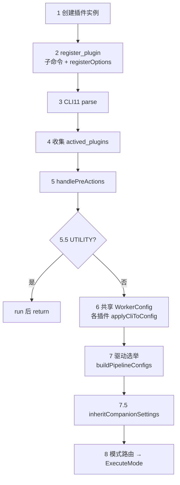

# 应用案例：`test_module_main.cpp`（qa_cases 入口）

> 源码：`test_cases/test_module_main.cpp`  
> 定位：**组件库如何被「应用」的完整案例**——不是又一个接口说明，而是把 `IOptionPlugin`、共享 `WorkerConfig`、`ExecuteMode` 串起来的编排器。  
> 建议阅读顺序：先读本文建立全局图，再下钻 [IOptionPlugin 接口](IOptionPlugin-Interface)。

## 1. 它在架构里的位置

```text
用户命令行 / WebUI
        │
        ▼
┌───────────────────────────────────────┐
│  test_module_main.cpp  ← 本案例       │
│  （注册插件 → 汇聚配置 → 选模式执行） │
└───────────────────────────────────────┘
        │ 只产出 / 转发 WorkerConfig
        ▼
   ExecuteMode → BufferConsumerService
        → ProductionLine / Consumer / Vendor
```

`main` **不包含**解码、显示、NPU 的业务算法；它只做四件事：

1. 把每个插件挂成 CLI 子命令  
2. 解析后收集「本次激活」的插件  
3. 用共享 `WorkerConfig` 汇聚配置，并选出驱动管线  
4. 按规则调用 `ExecuteMode`（或 UTILITY 的 `run()`）

因此它是学习本仓库插件架构的**最佳入口应用案例**。

## 2. 一条命令如何映射到代码

示例：

```bash
./qa_cases vdec --file video.mp4 display --vendor taco npu --model m.nb
```

| 命令片段 | 激活插件 | 在 main 中的角色 |
|----------|----------|------------------|
| `vdec --file …` | `VdecPlugin` | **驱动**：`buildPipelineConfigs` 非空 |
| `display --vendor …` | `DisplayPlugin` | **伴随**：只 `applyCliToConfig` 打开 display |
| `npu --model …` | `NpuPlugin` | **伴随**：只 `applyCliToConfig` 打开 npu |

未出现在命令行的插件（如 `venc`、`memleak`）不会进入 `actived_plugins`。

## 3. 阶段划分（与源码注释对齐）

把 `main()` 看成 8 个阶段。阶段号与文件内注释一致。



### 阶段 1–2：创建与注册

```72:108:test_cases/test_module_main.cpp
    // ── 1. 创建所有插件 ──
    auto vdec_plugin    = std::make_unique<test::vdec::VdecPlugin>();
    ...
    auto register_plugin = [&](test::IOptionPlugin* p) {
        auto* cmd = app.add_subcommand(p->getName(), p->getDescription());
        p->registerOptions(*cmd);
        all_plugin_entries.push_back({p, cmd});
    };
```

要点：

- 每个插件 = 一个 CLI11 子命令（`getName()`）  
- `registerOptions` 在 **parse 之前**调用，只注册选项、绑定成员变量  
- `all_plugin_entries` 保存「插件指针 + 对应 subcommand」，供后面判断 `parsed()`

### 阶段 3–4：解析与激活列表

```117:128:test_cases/test_module_main.cpp
        app.parse(argc, argv);
    ...
    std::vector<test::IOptionPlugin*> actived_plugins;
    for (auto& entry : all_plugin_entries) {
        if (entry.cmd->parsed())
            actived_plugins.push_back(entry.plugin);
    }
```

要点：

- 支持多子命令同条命令组合（`require_subcommand(1, 0)`）  
- `fallthrough` 让 `--topology` / `--perf` 等全局选项可出现在任意位置  
- **只有 `parsed()` 的插件**进入后续流程

### 阶段 5 / 5.5：预处理与工具分流

```142:156:test_cases/test_module_main.cpp
    for (auto* p : actived_plugins) {
        int rc = p->handlePreActions();
        if (rc >= 0) return rc;
    }
    ...
        if (p->getCategory() == test::PluginCategory::UTILITY) {
            int ret = p->run();
            return ret;
        }
```

要点：

- `handlePreActions() >= 0` → 当作退出码立刻结束（如 `--list`）  
- 任一激活插件是 `UTILITY` → 调 `run()` 后 **整进程返回**，不再建 `WorkerConfig`

### 阶段 6：共享 `WorkerConfig`（局部变量，不是全局单例）

```158:162:test_cases/test_module_main.cpp
    WorkerConfig config;
    for (auto* p : actived_plugins) {
        p->applyCliToConfig(config);
    }
```

要点（常被误解）：

| 问题 | 答案 |
|------|------|
| 公共 config 在哪？ | `main` 栈上的局部变量 `config` |
| 谁会写它？ | **本次激活**的每个插件各 `applyCliToConfig` 一次 |
| 会不会所有已注册插件都写？ | **不会**；没出现在命令行的不写 |
| 类型定义在哪？ | `include/productionline/worker/config/WorkerConfigs.hpp` |

驱动写 data_source / decode / encode；伴随写 `consumer_type.display` / `npu_inference` 等——叠在**同一个**对象上。

### 阶段 7：驱动选举

```164:174:test_cases/test_module_main.cpp
    for (auto* p : actived_plugins) {
        auto configs = p->buildPipelineConfigs(config);
        if (!configs.empty()) {
            pipeline_configs = std::move(configs);
            test_name = p->getTestName();
            break;   // 第一个非空 = 驱动
        }
    }
```

要点：

- 输入是阶段 6 的共享 `config`  
- 输出是 `vector<WorkerConfig> pipeline_configs`（1/2/N 路）  
- **第一个**返回非空的插件成为驱动；其后不再问  
- 因此伴随插件必须保持默认空的 `buildPipelineConfigs`

### 阶段 7.5：伴随设置继承

```181:188:test_cases/test_module_main.cpp
    for (auto& pc : pipeline_configs) {
        pc.consumer_type.inheritCompanionSettings(config.consumer_type);
        ...
    }
```

驱动 `buildPipelineConfigs` 往往基于 shared 再 `new` 出多路 config；显示/NPU 等伴随字段需要再从共享 `config` **继承**到每一路 `pc`，否则管线里会丢 display/npu 开关。

### 阶段 8：模式路由（编排，不是业务）

`main` 根据 `pipeline_configs` 规模、compare/display/save/opencv 等标志，选择：

| 条件（摘要） | 调用 |
|--------------|------|
| channel_compare | `ExecuteMode::channelCompare` |
| 单路 ENCODE + display（非 compare） | `venc::runEncodeDecodeDisplay` |
| compare 且 configs 偶数且 >2 | 多线程 PARALLEL COMPARE |
| opencv.enable | `ExecuteMode::single` |
| compare_enabled | `ExecuteMode::compare` |
| size>1 且 batch | 串行 `single` |
| size>1 | `ExecuteMode::parallel` |
| 默认 | `ExecuteMode::single` |

详细决策树见 [ExecuteMode 路由](ExecuteMode-Routing)。  
COMPARE 内部 PEER / SOURCE_REF 见 [COMPARE 双路径](COMPARE-Paths)。

## 4. 两份「Config」不要混淆

```text
WorkerConfig config;                    // 阶段 6：共享汇聚结果（局部变量）
vector<WorkerConfig> pipeline_configs;  // 阶段 7：驱动展开的可执行管线
```

| | 共享 `config` | `pipeline_configs` |
|--|----------------|---------------------|
| 谁填充 | 所有激活插件 `applyCliToConfig` | 仅驱动 `buildPipelineConfigs` |
| 数量 | 始终 1 个对象 | 1 / 2 / N 个 |
| 用途 | 汇聚伴随项、推断部分 flags、传给 build | 真正交给 ExecuteMode 跑 |

## 5. 本案例体现的设计原则

1. **插件地位平等**：都是子命令，没有「主模块 / 附属选项」的 CLI 特权（驱动是运行期选举出来的）。  
2. **配置与执行分离**：插件只写到 `WorkerConfig`；`main` 才调用 `ExecuteMode`。  
3. **组合优于继承**：`vdec + display + npu` 靠多次 `applyCliToConfig` + `inheritCompanionSettings`，不必搞巨型上帝插件。  
4. **工具旁路**：`UTILITY` 不伪造生产线配置，直接 `run()`。

## 6. 读完本文后去哪

| 你想搞清… | 下一篇 |
|-----------|--------|
| `applyCliToConfig` / `buildPipelineConfigs` 每个函数契约 | [IOptionPlugin 接口](IOptionPlugin-Interface) |
| 哪些插件算驱动/伴随 | [插件角色对照](Plugin-Framework) |
| 阶段 8 完整决策树 | [ExecuteMode 路由](ExecuteMode-Routing) |
| 跑起来之后 Buffer / Consumer | [生产线与消费线](Production-Consumption) |
