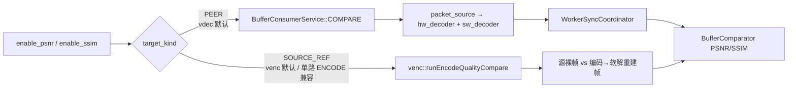

# COMPARE 双路径：PEER vs SOURCE_REF

权威字段：`ConsumerTypeConfig::CompareType::TargetKind`  
（`TARGET_PEER` / `TARGET_SOURCE_REF` / `TARGET_UNSPECIFIED`）

CLI：`CompareOptions` 的 `--compare-target`；也可由插件默认值写入。

## 总览



## PEER（典型：`qa_cases vdec --psnr video.mp4`）

| 项 | 说明 |
|----|------|
| 谁和谁比 | 硬解输出 ↔ 软解输出 |
| 配置产出 | `VdecPlugin::buildPipelineConfigs` 在 compare 开启时推 `(hw, sw)` 对 |
| 拓扑 | `GroupConfig::Mode::ONE_TO_MANY` + `enable_frame_sync` |
| 数据源生产者 | `mg_datasource_producer_type`（可用 `--producer`，如 `FFMPEG_DECODE_THEN_ENCODE`） |
| 结果字段 | `ConsumeResult::{psnr,ssim}_*` / `compare_passed` |

## SOURCE_REF（典型：venc 质量对比）

| 项 | 说明 |
|----|------|
| 谁和谁比 | 源裸帧（参考）↔ 编码后再软解的重建帧 |
| 执行入口 | `ExecuteMode::compare` 发现 `TARGET_SOURCE_REF`（或未指定且单路 `FFMPEG_ENCODE`）后改调 `venc::runEncodeQualityCompare` |
| 不走 | `BufferConsumerService::COMPARE` MultiWorker 双解码路径 |
| 旁路注意 | 单路 ENCODE + display（非 compare）走 `runEncodeDecodeDisplay`，那是**显示路径**，不是质量门禁 |

## 兼容默认

```text
if target == UNSPECIFIED:
  if 单路 && worker_type == FFMPEG_ENCODE → SOURCE_REF
  else → PEER
```

- `VdecPlugin` 显式默认 `TARGET_PEER`
- `VencPlugin` 显式默认 `TARGET_SOURCE_REF`
