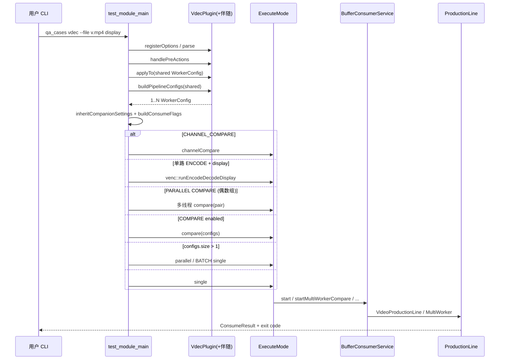
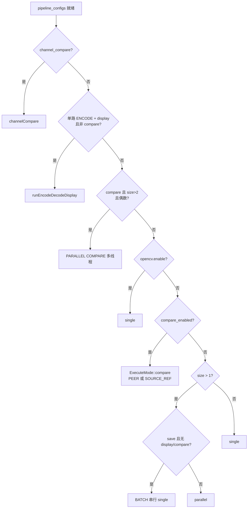

# ExecuteMode 路由与调用链

## `qa_cases vdec ...` 调用链

## 模式决策树

## 模式对照

| 模式 | 触发条件（摘要） | 运行时 |
|------|------------------|--------|
| SINGLE | 1 路，非 compare | `VideoProductionLine` + flags 消费者 |
| PARALLEL | N 路，非 batch | 多路 `startProductionLine` |
| BATCH | N 路 + save 且无 display/compare | 串行 single |
| COMPARE PEER | psnr/ssim + target=PEER | MultiWorker ONE_TO_MANY + sync |
| COMPARE SOURCE_REF | psnr/ssim + target=SOURCE_REF（或 venc 默认） | `runEncodeQualityCompare` |
| CHANNEL_COMPARE | `enable_channel_compare` | `channelCompare` |
| PARALLEL COMPARE | compare 且 configs 偶数且 >2 | 每对 hw/sw 一线程 |
| ENCODE→DECODE→DISPLAY | 单路 encode + display | `runEncodeDecodeDisplay` |

## 关键文件

- `test_cases/test_module_main.cpp` — 路由主开关
- `test_cases/common/ExecuteMode.{hpp,cpp}` — 模式实现
- `include/consumptionline/.../BufferConsumerService` — 门面
