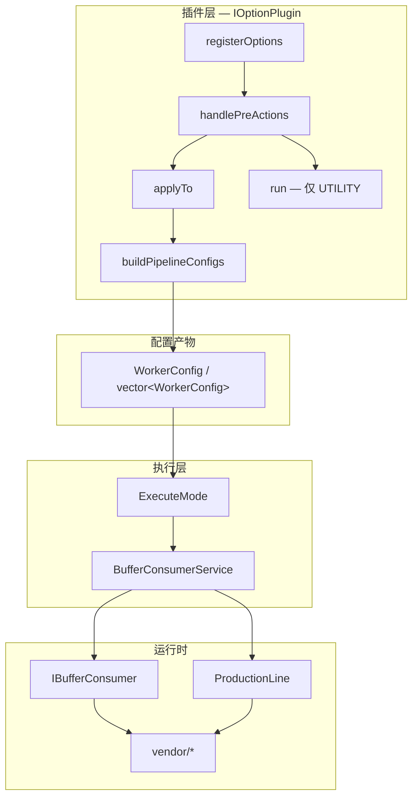

# qa_cases 插件化架构设计

> 状态：架构说明（以源码为准）  
> 日期：2026-08-03  
> 入口源码：`test_cases/test_module_main.cpp`  
> 核心接口：`test_cases/common/IOptionPlugin.hpp`

## 1. 问题与目标

`qa_cases` 需要在一条命令里组合「解码 / 编码 / 显示 / NPU / 保存 / 工具」等多种能力，且 CLI 与 WebUI 复用同一套配置模型。

目标拆成三层责任：

1. **插件层**：解析参数 → 产出 `WorkerConfig`（本文档重点）  
2. **执行层**：按模式启动生产线 / 消费线（`ExecuteMode`）  
3. **运行时层**：Worker、BufferPool、Consumer、Vendor（见仓库 `ARCHITECTURE.md`）

## 2. 总图

## 3. 文档地图（按阅读顺序）

| 顺序 | 文档 | 内容 |
|------|------|------|
| **1（必读）** | [IOptionPlugin 接口设计](IOptionPlugin-Interface) | **每个虚函数的作用、返回值、调用时机、谁必须重写** |
| 2 | [插件角色与实现对照](Plugin-Framework) | 驱动 / 伴随 / 工具；已注册插件表 |
| 3 | [ExecuteMode 路由](ExecuteMode-Routing) | `main` 如何从 configs 选 SINGLE/COMPARE/… |
| 4 | [COMPARE 双路径](COMPARE-Paths) | PEER vs SOURCE_REF |
| 5 | [生产线与消费线](Production-Consumption) | 插件产出之后的运行时 |
| 6 | [原有文档 Review](Doc-Review) | 与 `ARCHITECTURE.md` 等的关系与缺口 |

## 4. 核心结论

1. **中心抽象是 `IOptionPlugin`，不是某个业务 Plugin 类。**  
2. 两个纯虚函数构成最小实现集：`registerOptions`、`applyTo`。  
3. 驱动插件额外必须实现 `buildPipelineConfigs`；伴随禁止抢驱动；工具走 `run()`。  
4. 插件**不**直接启动 `VideoProductionLine`；执行权在 `main` → `ExecuteMode`。

不懂接口契约先读第 1 篇，再看其它页。
