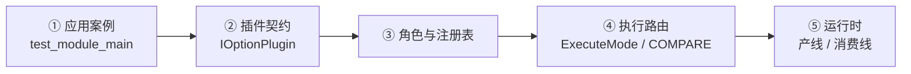
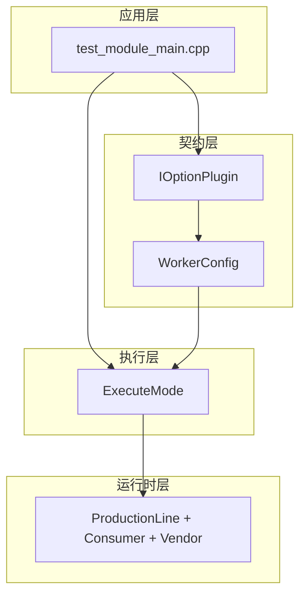

# Components / qa_cases 架构 Wiki

> 以源码为准 · 更新日期：2026-08-03  
> 仓库：https://github.com/luoxiafeng-1990/components

## 这篇 Wiki 怎么读

文档按 **「先看应用 → 再看契约 → 再看执行 → 最后看运行时」** 分层。  
不要从目录名随机跳；按下面推荐顺序，逻辑最顺。

## 分层结构

### ① 应用层 — 组件怎么被用起来

| 文档 | 一句话 |
|------|--------|
| **[应用案例：qa_cases 入口](Application-Case-qa_cases-main)** | 精读 `test_module_main.cpp`：注册 → 共享 WorkerConfig → 驱动选举 → 模式路由 |

这是整份 Wiki 的**叙事起点**：先看见编排器，再理解接口为什么长这样。

### ② 契约层 — 插件必须遵守什么

| 文档 | 一句话 |
|------|--------|
| **[IOptionPlugin 接口](IOptionPlugin-Interface)** | 每个虚函数的作用、时机、返回值、谁必须重写 |
| **[插件角色对照](Plugin-Framework)** | 驱动 / 伴随 / 工具；已注册插件表；选举规则 |

### ③ 执行层 — 配置如何变成一次运行

| 文档 | 一句话 |
|------|--------|
| **[ExecuteMode 路由](ExecuteMode-Routing)** | SINGLE / COMPARE / PARALLEL / BATCH 决策树 |
| **[COMPARE 双路径](COMPARE-Paths)** | PEER（hw↔sw）vs SOURCE_REF（源↔编解码重建） |

### ④ 运行时层 — 帧如何流动

| 文档 | 一句话 |
|------|--------|
| **[生产线与消费线](Production-Consumption)** | ProductionLine、BufferPool、Consumer、Vendor、WebUI 复用 |

更细的 MultiWorker Build/Run 仍以仓库根目录 `ARCHITECTURE.md` 为准。

### ⑤ 元文档

| 文档 | 一句话 |
|------|--------|
| **[原有文档 Review](Doc-Review)** | 仓库内旧文档哪些准、哪些过时、缺什么 |

## 三层责任（总览）

| 层 | 负责 | 不负责 |
|----|------|--------|
| 应用（main） | 注册、汇聚、选驱动、选模式 | 解码/显示算法 |
| 契约（插件） | CLI → 写入/展开 WorkerConfig | 启动生产线 |
| 执行（ExecuteMode） | 按模式调用消费服务 | 解析 CLI |
| 运行时 | 产线/池/消费者/厂商 | 拼命令行 |

## 核心结论

1. **先读应用案例**，再读接口——否则容易把 `applyCliToConfig` 理解成「执行」。  
2. 共享 `WorkerConfig` 是 `main` 里的**局部变量**，只由**本次激活**的插件写入。  
3. 驱动由 `buildPipelineConfigs` 第一个非空者选举；伴随只 `applyCliToConfig`。  
4. 插件不启动 `VideoProductionLine`；执行权在 `main` → `ExecuteMode`。

从这里开始 → **[应用案例：qa_cases 入口](Application-Case-qa_cases-main)**
