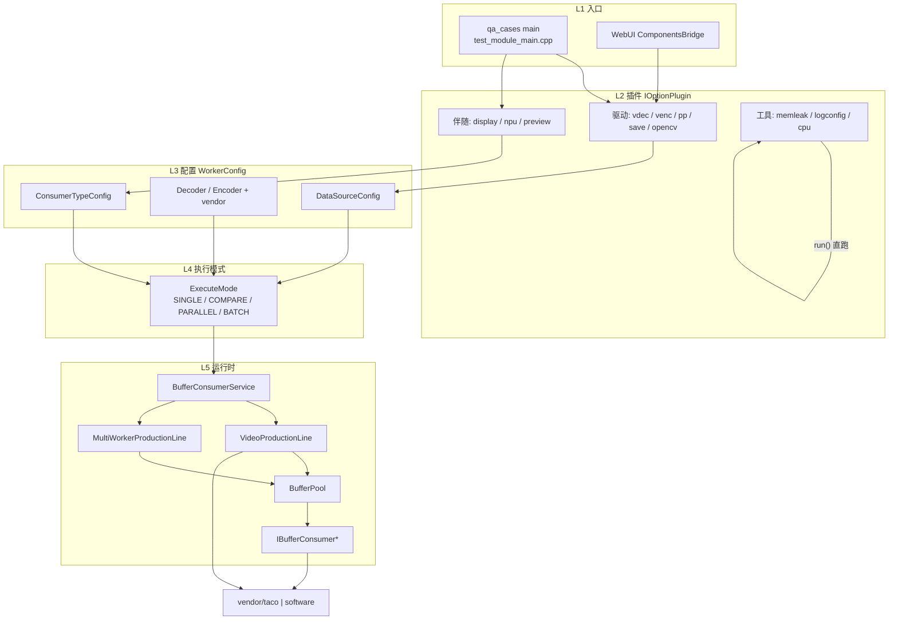

# Components 架构 Wiki

> 更新日期：2026-08-03  
> 范围：从 `IOptionPlugin` 插件层到生产线 / 消费线 / 厂商扩展  
> 仓库：https://github.com/luoxiafeng-1990/components

## 一句话模型

**插件只负责把 CLI/UI 参数收敛成 `WorkerConfig`；真正跑起来的永远是 `ExecuteMode → BufferConsumerService → ProductionLine + Consumer + Vendor`。**

## 导航

| 页面 | 内容 |
|------|------|
| [Plugin-Framework](Plugin-Framework) | 插件分层、注册、驱动/伴随/工具角色 |
| [ExecuteMode-Routing](ExecuteMode-Routing) | `qa_cases` 调用链与模式路由决策树 |
| [COMPARE-Paths](COMPARE-Paths) | PEER vs SOURCE_REF 双路径 |
| [Production-Consumption](Production-Consumption) | 生产线 / 消费线 / BufferPool |
| [Doc-Review](Doc-Review) | 现有架构文档评审结论 |

## 端到端分层（总览）



## 快速入口命令

```bash
# 解码 + 显示
qa_cases vdec --file video.mp4 display --vendor taco

# 解码质量对比（PEER：hw ↔ sw）
qa_cases vdec --psnr video.mp4

# 编码质量对比（SOURCE_REF：源裸帧 ↔ 编码后再软解）
qa_cases venc --psnr --file input.yuv ...
```

## 权威源码

- `test_cases/common/IOptionPlugin.hpp`
- `test_cases/test_module_main.cpp`
- `test_cases/common/ExecuteMode.cpp`
- `ARCHITECTURE.md`（MultiWorker 内核，详见 Doc-Review）
