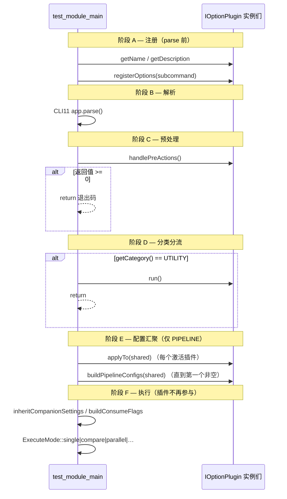

# IOptionPlugin 接口设计

> 权威源码：`test_cases/common/IOptionPlugin.hpp`  
> 调用方：`test_cases/test_module_main.cpp`  
> 本文是插件层架构的**契约说明**，不是目录导览。

## 1. 设计目标

`qa_cases` 把每个功能模块（解码、编码、显示、NPU、工具……）做成**地位平等的子命令插件**。  
`main` 不理解业务细节；它只认 `IOptionPlugin` 契约，按固定生命周期驱动插件。

由此得到三条边界：

| 边界 | 谁负责 | 谁不负责 |
|------|--------|----------|
| 参数解析 | 插件 `registerOptions` + 成员变量 | `main` 不解析业务选项 |
| 配置汇聚 | 插件 `applyTo` / `buildPipelineConfigs` | 插件不直接 `start` 生产线 |
| 真正执行 | `ExecuteMode` + `BufferConsumerService`（PIPELINE）或 `run()`（UTILITY） | 插件接口本身不跑帧 |

一句话：**插件 = CLI/配置适配器；执行引擎在插件之外。**

## 2. 类型与分类

```cpp
enum class PluginCategory {
    PIPELINE,  // 数据消费型：汇聚 WorkerConfig → ExecuteMode
    UTILITY    // 独立工具型：main 直接调用 run()，不进消费策略
};
```

| 分类 | 典型插件 | main 中的路径 |
|------|----------|----------------|
| `PIPELINE` | vdec / venc / pp / save / opencv / display / npu / preview | `applyTo` → `buildPipelineConfigs` → `ExecuteMode::*` |
| `UTILITY` | memleak / logconfig / cpu | `handlePreActions` 后直接 `run()` 并 `return` |

`getCategory()` 默认返回 `PIPELINE`；工具插件必须重写为 `UTILITY`。

## 3. 接口一览

```cpp
class IOptionPlugin {
public:
    virtual ~IOptionPlugin() = default;

    virtual std::string getName() const = 0;
    virtual std::string getDescription() const;          // 默认 ""
    virtual PluginCategory getCategory() const;          // 默认 PIPELINE
    virtual int run();                                   // 默认 0；UTILITY 入口

    virtual void registerOptions(CLI::App& app) = 0;     // 纯虚
    virtual void applyTo(WorkerConfig& config) const = 0;// 纯虚

    virtual void listTests() const;                      // 默认空
    virtual std::vector<WorkerConfig>
        buildPipelineConfigs(const WorkerConfig& shared_config); // 默认 {}
    virtual std::string getTestName() const;             // 默认 ""
    virtual int handlePreActions();                      // 默认 -1（继续）
};
```

## 4. 逐方法契约

### 4.1 `getName() const → std::string`（纯虚）

| 项 | 说明 |
|----|------|
| **作用** | 定义 CLI **子命令名**，也是插件身份 ID |
| **调用时机** | `main` 注册阶段：`app.add_subcommand(p->getName(), …)` |
| **约定** | 稳定、短小、全小写；与目录/模块名一致（如 `"vdec"`、`"display"`） |
| **禁止** | 运行期改名；与其它插件重名 |

### 4.2 `getDescription() const → std::string`

| 项 | 说明 |
|----|------|
| **作用** | 子命令帮助文案（`qa_cases -h` / `qa_cases vdec -h`） |
| **默认** | 空字符串 |
| **约定** | 一句话说明业务，不写实现细节 |

### 4.3 `getCategory() const → PluginCategory`

| 项 | 说明 |
|----|------|
| **作用** | 告诉 `main` 走哪条执行分支 |
| **默认** | `PIPELINE` |
| **UTILITY** | 必须重写；`main` 在 `handlePreActions` 之后若发现 UTILITY，调用 `run()` 后**立即退出**，不再 `applyTo` 管线逻辑（见 `test_module_main.cpp` 5.5 节） |

### 4.4 `registerOptions(CLI::App& app)`（纯虚）

| 项 | 说明 |
|----|------|
| **作用** | 把本插件的 CLI 选项注册到**自己的子命令** `app` 上 |
| **调用时机** | `parse` **之前**；每个插件各注册一次 |
| **机制** | CLI11：选项绑定到插件成员变量；`parse` 成功后成员自动有值 |
| **隔离** | 子命令命名空间独立，`vdec --fps` 与 `display --fps` 不冲突 |
| **典型内容** | 路径/codec/vendor；横切助手如 `DataSourceOptions`、`CompareOptions`；厂商 `TacoVendorOptions` |
| **不做** | 不在这里读文件、不开设备、不构建 `WorkerConfig` |

### 4.5 `handlePreActions() → int`

| 项 | 说明 |
|----|------|
| **作用** | `parse` 之后、配置汇聚之前的预处理：`--list`、参数合法性、位置参数解析等 |
| **返回值** | `>= 0`：当作进程退出码，`main` **立刻 return**；`-1`：继续后续流程 |
| **默认** | `-1`（无预处理） |
| **典型** | `VdecPlugin`：解析 positional 预定义用例 / 路径；`--list` 打印后返回 0 |
| **顺序** | 对所有 `parsed()` 插件依次调用；任一提前退出则后续插件不再执行 |

### 4.6 `applyTo(WorkerConfig& config) const`（纯虚）

| 项 | 说明 |
|----|------|
| **作用** | 把「本插件解析到的参数」写入**共享** `WorkerConfig` |
| **调用时机** | 所有插件 `handlePreActions` 通过后；对每个激活插件依次调用 |
| **语义** | **叠加/注入**，不是创建管线。驱动插件写 `data_source` / decode/encode；伴随插件写 `consumer_type.display` 等 |
| **const** | 方法为 const：只读插件成员，只改传入的 `config` |
| **UTILITY** | 仍可实现为空操作（如 `MemleakPlugin::applyTo` 空实现），因 UTILITY 通常在更早阶段 `run()` 退出 |
| **不做** | 不 `start` 生产线；不决定 SINGLE/COMPARE（那是 `main` + `ExecuteMode`） |

### 4.7 `buildPipelineConfigs(shared_config) → vector<WorkerConfig>`

| 项 | 说明 |
|----|------|
| **作用** | **驱动插件**根据共享配置，展开出可执行的 1/2/N 路 `WorkerConfig` |
| **默认** | 返回空 `{}` —— 表示「我不是驱动 / 无可执行工作」 |
| **main 规则** | 按激活插件顺序调用；**第一个返回非空**的插件成为驱动，其后插件的 `buildPipelineConfigs` **不再调用** |
| **返回值含义** | `1` → 倾向 SINGLE；`2` → 常为 COMPARE 一对 hw/sw；`N` → PARALLEL / BATCH / PARALLEL COMPARE |
| **谁该重写** | vdec / venc / pp / save / opencv 等驱动 |
| **谁保持默认** | display / npu / preview 等**伴随插件**（只 `applyTo`，不产管线） |
| **输入** | `shared_config` 已含全部激活插件的 `applyTo` 结果 |

### 4.8 `getTestName() const → std::string`

| 项 | 说明 |
|----|------|
| **作用** | 日志 / `printResult` / perf 报告中的用例显示名 |
| **调用时机** | 驱动插件选定后，`main` 取驱动的 `getTestName()` |
| **默认** | 空字符串 |

### 4.9 `listTests() const`

| 项 | 说明 |
|----|------|
| **作用** | 列出预定义用例（历史接口；现多由 `handlePreActions` + `--list` 完成） |
| **默认** | 空实现 |
| **说明** | 新代码优先在 `handlePreActions` 中处理 list 并返回退出码 |

### 4.10 `run() → int`

| 项 | 说明 |
|----|------|
| **作用** | **仅 UTILITY** 的执行入口 |
| **返回值** | 进程退出码（0 成功） |
| **默认** | `0`（PIPELINE 不应依赖它） |
| **典型** | `MemleakPlugin::run` 拉起 valgrind 包裹子 `qa_cases` |

### 4.11 析构 `~IOptionPlugin()`

虚析构，保证经基类指针删除派生插件安全。`main` 使用 `unique_ptr` 持有各插件。

## 5. 生命周期（main 强制顺序）



**阶段边界铁律**

1. `registerOptions` 不得依赖 parse 后的值。  
2. `applyTo` 不得假设自己是唯一插件；要可与伴随插件叠加。  
3. `buildPipelineConfigs` 只应由驱动重写；伴随保持默认空。  
4. 插件不调用 `BufferConsumerService::start`；执行权在 `main` / `ExecuteMode`。

## 6. 三种插件角色（实现层分类）

接口只有 `PIPELINE` / `UTILITY` 两分类；工程上 PIPELINE 再分为：

| 角色 | 重写重点 | 示例 |
|------|----------|------|
| **驱动（Driver）** | `registerOptions` + `applyTo` + **`buildPipelineConfigs`** | VdecPlugin、VencPlugin |
| **伴随（Companion）** | `registerOptions` + `applyTo`；`buildPipelineConfigs` 保持默认空 | DisplayPlugin、NpuPlugin、PreviewPlugin |
| **工具（Utility）** | `getCategory→UTILITY` + `registerOptions` + **`run`**；`applyTo` 可空 | MemleakPlugin |

组合示例：

```bash
qa_cases vdec --file video.mp4 display --vendor taco npu --model m.nb
```

- `vdec`：驱动，产出 decode 管线 configs  
- `display` / `npu`：伴随，只往 shared `consumer_type` 注入开关  
- `main`：`inheritCompanionSettings` 把伴随设置合并进每路管线 config  

## 7. 与 WorkerConfig 的关系

```text
IOptionPlugin::applyTo / buildPipelineConfigs
        │
        ▼
   WorkerConfig                 ← 插件层唯一产出物
        │
        ▼
   ExecuteMode / BufferConsumerService
```

插件接口**不**直接接触：

- `VideoProductionLine` / `MultiWorkerProductionLine`
- `IBufferConsumer` 实现类
- 厂商设备句柄（除在 `applyTo` 里写入 vendor extension 配置外）

那些属于执行层，见 [Production-Consumption](Production-Consumption) 与仓库根目录 `ARCHITECTURE.md`。

## 8. 实现检查清单（新增插件必过）

1. 继承 `IOptionPlugin`，实现两个纯虚：`registerOptions`、`applyTo`。  
2. 确定角色：驱动 / 伴随 / 工具；工具必须重写 `getCategory` + `run`。  
3. 驱动必须重写 `buildPipelineConfigs`，并保证在「本插件被 parse」时能返回非空。  
4. 伴随禁止返回非空 `buildPipelineConfigs`（避免抢驱动）。  
5. 在 `test_module_main.cpp` `register_plugin(...)`。  
6. `--help` 可读；错误路径在 `handlePreActions` 返回非零退出码。  

## 9. 参考实现对照

| 方法 | VdecPlugin（驱动） | DisplayPlugin（伴随） | MemleakPlugin（工具） |
|------|--------------------|-----------------------|------------------------|
| `getName` | `"vdec"` | `"display"` | `"memleak"` |
| `getCategory` | 默认 PIPELINE | 默认 PIPELINE | `UTILITY` |
| `registerOptions` | 数据源/解码/CompareOptions | vendor/fps/osd… | target/tool/duration |
| `handlePreActions` | list / positional | 校验 vendor 等 | 默认或轻校验 |
| `applyTo` | data_source + compare | `consumer_type.display` | 空 |
| `buildPipelineConfigs` | 1/2/2N 路 decode | 默认 `{}` | 不参与 |
| `run` | 不用 | 不用 | valgrind 包装执行 |
