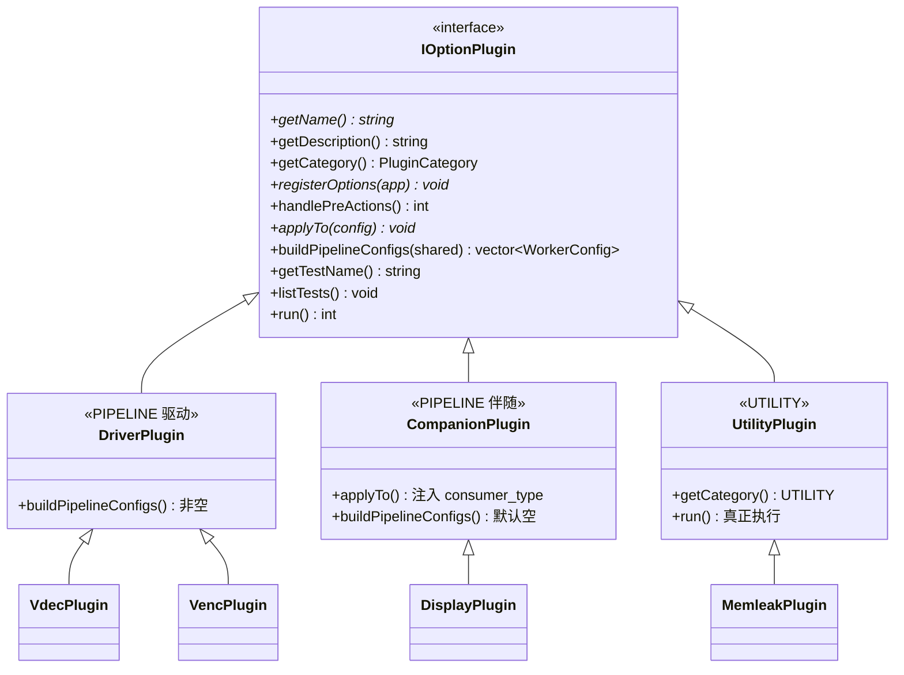

# 插件角色与实现对照

> 前置：[应用案例 · qa_cases 入口](Application-Case-qa_cases-main) → [IOptionPlugin 接口](IOptionPlugin-Interface)  
> 注册表源码：`test_cases/test_module_main.cpp`

## 1. 角色模型

接口层只有 `PluginCategory::{PIPELINE, UTILITY}`。  
PIPELINE 在实现上再分为 **驱动** 与 **伴随**：



## 2. 已注册插件

| 插件类 | 子命令 | 角色 | `buildPipelineConfigs` | 备注 |
|--------|--------|------|------------------------|------|
| `VdecPlugin` | `vdec` | 驱动 | 重写：1/2/2N 路解码 | COMPARE 默认 PEER |
| `VencPlugin` | `venc` | 驱动 | 重写：编码管线 | COMPARE 默认 SOURCE_REF |
| `PPPlugin` | `pp` | 驱动 | 重写 | 可走 channelCompare |
| `SavePlugin` | `save` | 驱动 | 重写 | 合并原 record+writer |
| `OpencvPlugin` | `opencv` | 驱动 | 重写 | OpenCV 消费 |
| `DisplayPlugin` | `display` | 伴随 | 默认空 | 只开 display + vendor |
| `NpuPlugin` | `npu` | 伴随 | 默认空 | 开 npu_inference |
| `PreviewPlugin` | `preview` | 伴随 | 默认空 | 开 jpeg_encode |
| `MemleakPlugin` | `memleak` | 工具 | 不参与 | `run()` + valgrind |
| `LogConfigPlugin` | `logconfig` | 工具 | 不参与 | `run()` |
| `CpuPlugin` | `cpu` | 工具 | 不参与 | `run()` |

未注册：`test_cases/record`、`writer`（能力已并入 `save`）。

## 3. main 中的注册与驱动选举

```cpp
// 简化自 test_module_main.cpp
auto register_plugin = [&](IOptionPlugin* p) {
    auto* cmd = app.add_subcommand(p->getName(), p->getDescription());
    p->registerOptions(*cmd);
};

// parse 后：
for (p : actived) p->handlePreActions();          // 可提前退出
for (p : actived) if (UTILITY) return p->run();   // 工具短路

WorkerConfig shared;
for (p : actived) p->applyTo(shared);             // 全员注入

vector<WorkerConfig> pipeline;
for (p : actived) {
    auto cfg = p->buildPipelineConfigs(shared);
    if (!cfg.empty()) { pipeline = move(cfg); break; }  // 第一非空 = 驱动
}
```

**驱动选举规则**：激活插件列表中，第一个 `buildPipelineConfigs` 非空者胜出。  
因此伴随插件必须保持默认空实现，否则会误抢驱动。

## 4. 驱动 vs 伴随：职责对照（以 vdec + display 为例）

| 步骤 | `VdecPlugin` | `DisplayPlugin` |
|------|--------------|-----------------|
| `registerOptions` | 文件/RTSP/codec/compare… | `--vendor` / `--fps` / OSD… |
| `applyTo` | 写 `data_source`、decode、compare 默认 PEER | 写 `consumer_type.display.enable` + vendor ext |
| `buildPipelineConfigs` | 生成 hw（及 compare 时的 sw）configs | 返回 `{}` |
| 之后 | 不再参与 | 不再参与；由 `inheritCompanionSettings` 合并进管线 |

## 5. UTILITY 为何不能复用 ExecuteMode

工具（如 memleak）要包装子进程或改日志，**没有**「读帧 → 消费」语义。  
若勉强塞进 PIPELINE，会迫使它们伪造 `WorkerConfig`。  
因此用 `getCategory()==UTILITY` + `run()` 显式分流——这是接口设计的一部分，不是权宜之计。

## 6. 横切选项助手（非插件，但服务插件）

| 助手 | 路径 | 供谁用 |
|------|------|--------|
| `DataSourceOptions` | `test_cases/common/DataSourceOptions.hpp` | 驱动注册路径/loop/max-frames |
| `CompareOptions` | `test_cases/common/CompareOptions.hpp` | vdec/venc 共用 psnr/ssim/target |

它们不是 `IOptionPlugin`；在各插件的 `registerOptions` / `applyTo` 内组合调用。

## 7. 扩展新插件的最小步骤

1. 新建 `XxxPlugin : public IOptionPlugin`。  
2. 按角色实现接口（见 [接口检查清单](IOptionPlugin-Interface#8-实现检查清单新增插件必过)）。  
3. `test_module_main.cpp` 中 `make_unique` + `register_plugin`。  
4. 补 `--help` 与一条可运行示例命令。  
