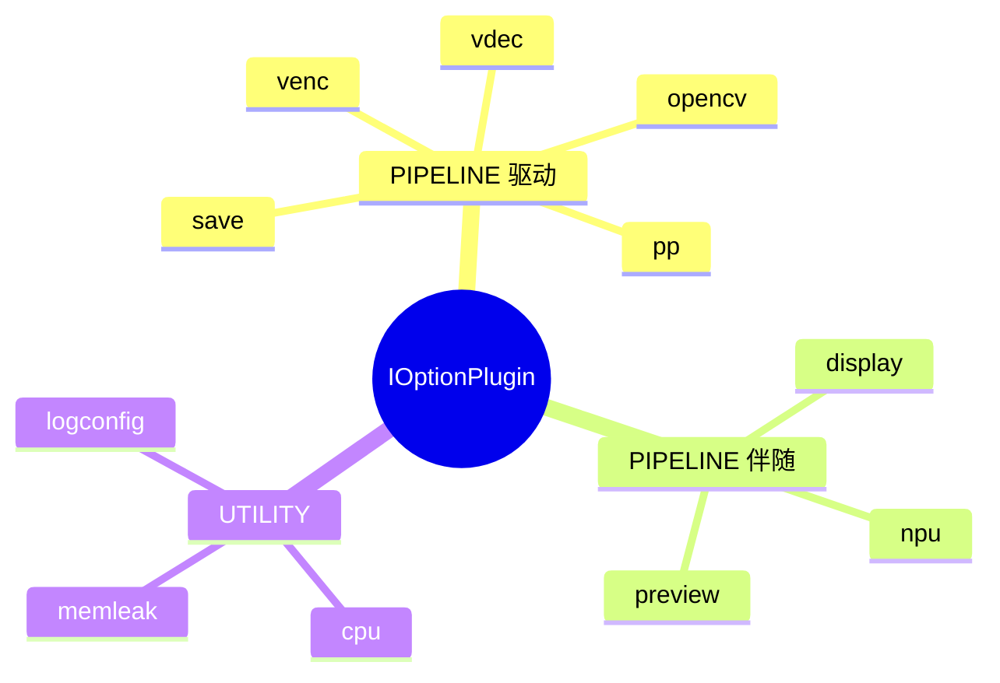

# Plugin Framework（插件框架）

## 接口契约

权威定义：`test_cases/common/IOptionPlugin.hpp`

| 方法 | 作用 |
|------|------|
| `registerOptions(CLI::App&)` | 向子命令注册 CLI 选项 |
| `handlePreActions()` | list / 校验等预处理；`>=0` 表示直接退出 |
| `applyTo(WorkerConfig&)` | 把解析结果写入共享配置 |
| `buildPipelineConfigs(shared)` | 驱动插件产出 1/2/N 路 `WorkerConfig`；空=非驱动 |
| `run()` | 仅 `UTILITY` 使用 |
| `getCategory()` | `PIPELINE` 或 `UTILITY` |

## 插件分类



| 插件 | 子命令 | 角色 | 说明 |
|------|--------|------|------|
| VdecPlugin | `vdec` | 驱动 | 解码；COMPARE 默认 `TARGET_PEER` |
| VencPlugin | `venc` | 驱动 | 编码；COMPARE 默认 `TARGET_SOURCE_REF` |
| PPPlugin | `pp` | 驱动 | 后处理；可走 channelCompare |
| SavePlugin | `save` | 驱动 | 合并原 record+writer |
| OpencvPlugin | `opencv` | 驱动 | OpenCV 消费 |
| DisplayPlugin | `display` | 伴随 | 只 `applyTo` 打开 display |
| NpuPlugin | `npu` | 伴随 | 打开 `npu_inference` |
| PreviewPlugin | `preview` | 伴随 | 打开 `jpeg_encode` |
| Memleak/LogConfig/Cpu | 各自名 | 工具 | `run()` 直跑，不进 ExecuteMode |

> `record` / `writer` 源码仍在目录中，但已被 `save` 合并，**未**注册进 `main`。

## 注册与组合

`test_module_main.cpp`：

1. 每个插件 `app.add_subcommand(name)` + `registerOptions`
2. CLI11 允许多子命令同条命令组合  
   例：`qa_cases vdec --file v.mp4 display --vendor taco npu --model m.nb`
3. 所有 `parsed()` 插件依次 `applyTo(shared)`
4. **第一个** `buildPipelineConfigs` 非空的插件 = 驱动插件
5. `inheritCompanionSettings` 把伴随设置并入各路管线配置

## WorkerConfig 层次

```text
WorkerConfig
├─ data_source: DataSourceConfig
├─ decoder / encoder (+ vendor extension)
├─ global.worker_type          # FFMPEG_DECODE / ENCODE / …
├─ consumer_type: ConsumerTypeConfig
│    ├─ display / save_raw / save_encoded / npu / jpeg_encode / opencv
│    └─ compare.target_kind + psnr/ssim 阈值
├─ mg_datasource_producer_type # COMPARE 数据源生产者类型
└─ extra_consumer              # WebUI PreviewFrameTap
```

横切 CLI 助手：

- `DataSourceOptions` — 路径 / loop / max-frames 等
- `CompareOptions` — `--psnr/--ssim/--compare-target/--producer`
