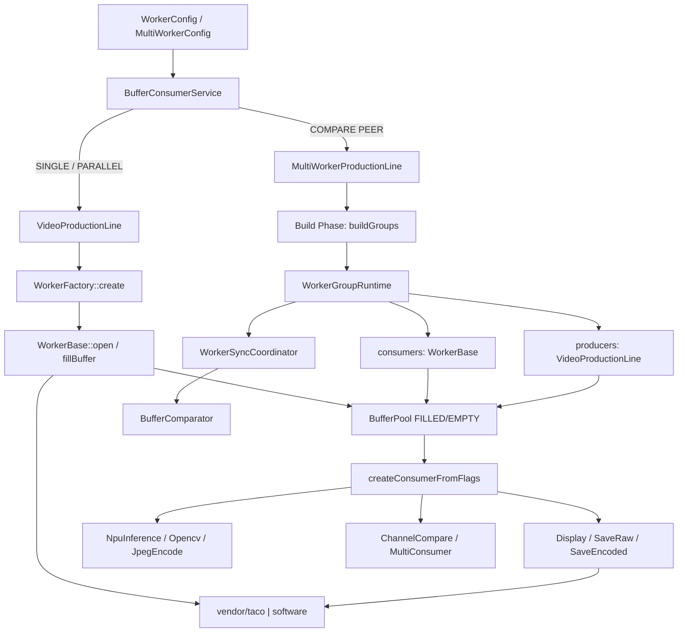
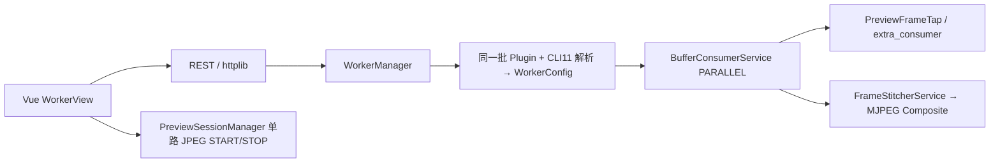

# 生产线 / 消费线 / 厂商

## 运行时协作



## 生产线要点

| 类 | 职责 |
|----|------|
| `VideoProductionLine` | 单 Worker 生产循环：造池 → `fillBuffer` → 投递 |
| `MultiWorkerProductionLine` | 多组并行；**Build/Run 分离**；Runtime 为唯一真相 |
| `WorkerSyncCoordinator` | 帧同步 + COMPARE 回调链 |
| `ComponentTopology` | 注册 BufferPool / 拓扑打印（`--topology`） |
| `WorkerFactory` | 按 `worker_type` 创建 Decode/Encode/PacketRecorder/Opencv… |

`ARCHITECTURE.md` 对 MultiWorker 的 Build Phase / Run Phase、`WorkerGroupRuntime`、Stats 下沉写得很完整——**内核权威**。

## 消费线要点

| 概念 | 说明 |
|------|------|
| `ConsumeTypeFlags` | `CONSUME_DISPLAY \| SAVE_RAW \| NPU \| …` |
| `createConsumerFromFlags` | 按 flags 组合消费者（可 MultiConsumer） |
| `BufferComparator` | PSNR / SSIM 计算与阈值判定 |
| `FrameStitcherService` | 多路拼图（WebUI Composite） |
| `extra_consumer` | WebUI `PreviewFrameTap` 观察点 |

## 厂商扩展

```text
include/vendor/contracts/*     # Decoder / Display / Encoder / NPU / Opencv 扩展接口
include/vendor/taco/*          # 板端 taco 实现
include/vendor/software/*      # 软件参考实现（如 stitcher）
```

插件侧通过 `TacoVendorOptions::registerTo` / `WorkerConfigFactory` 的 vendor registrar 注入。

## WebUI 如何复用同一框架



规格见 `webui/docs/PREVIEW_ARCHITECTURE_DESIGN.md`（方案 3 已认可；实施进度见 `.tasks/current.md`）。
