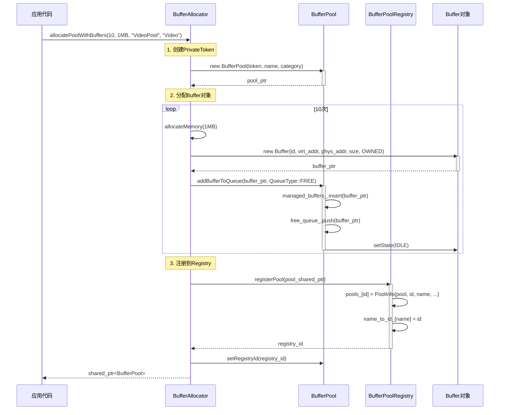
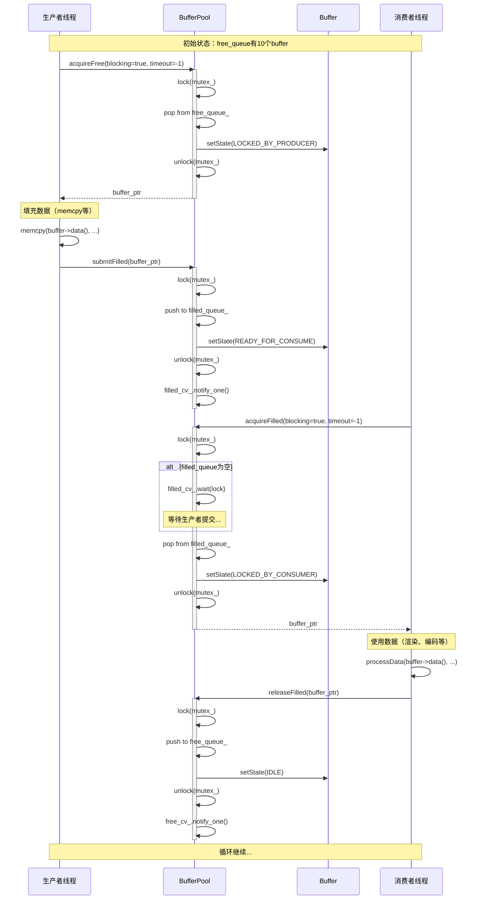
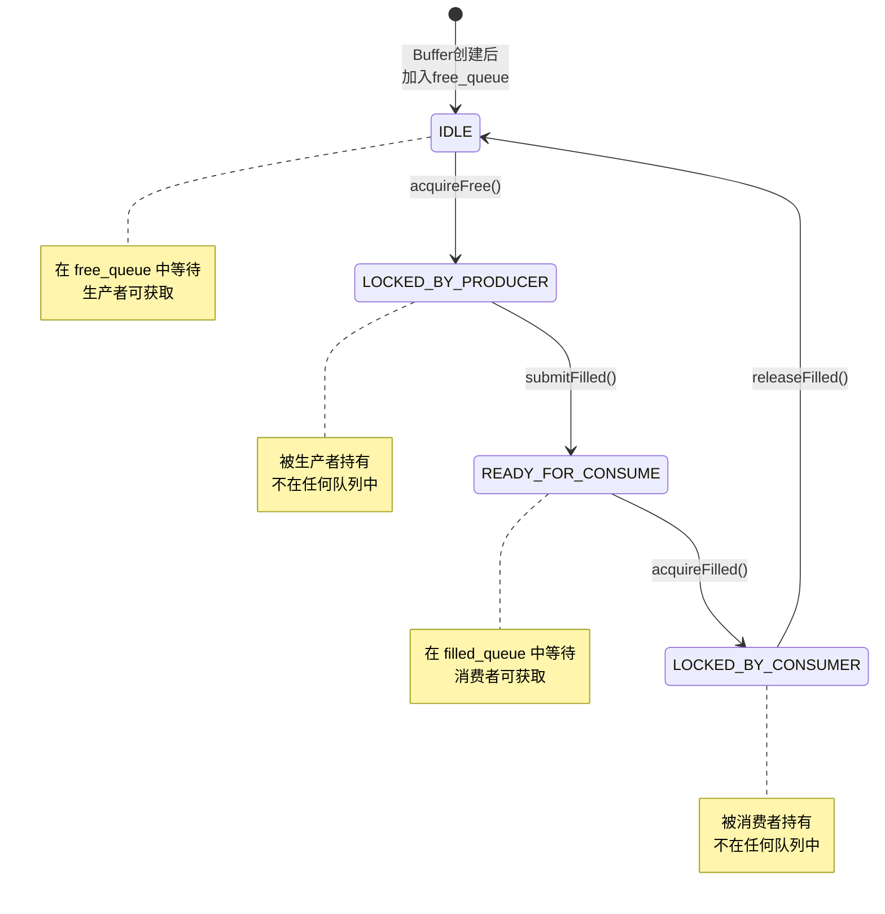
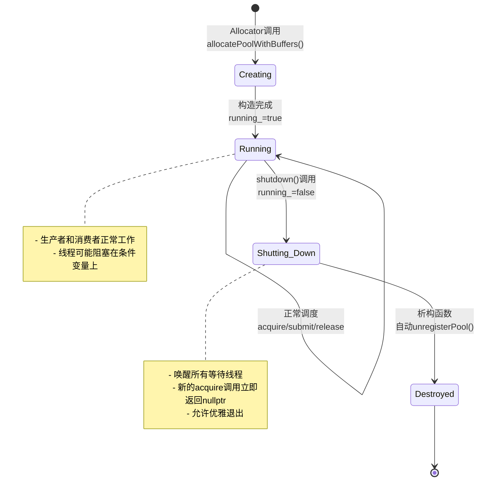
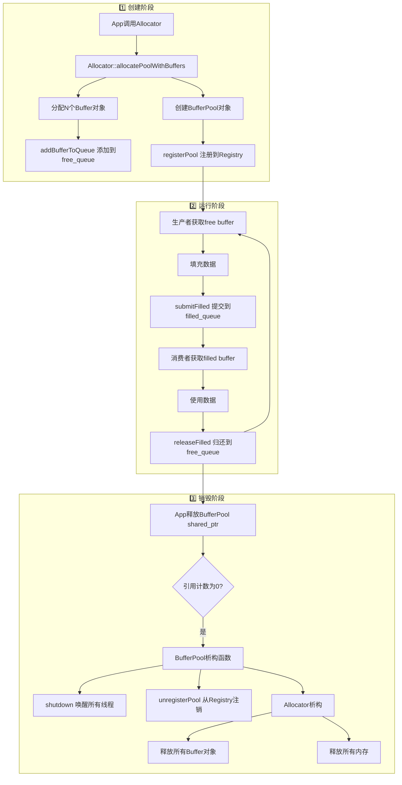

# Buffer子系统设计文档

> **面向人群**: 新入职开发者  
> **文档版本**: v1.0  
> **最后更新**: 2025-11-26  
> **维护者**: AI SDK Team

---

## 📚 目录

1. [概述](#1-概述)
2. [架构设计](#2-架构设计)
3. [类详细设计](#3-类详细设计)
4. [UML图集](#4-uml图集)
5. [典型使用场景](#5-典型使用场景)
6. [线程安全分析](#6-线程安全分析)
7. [扩展性与最佳实践](#7-扩展性与最佳实践)

---

## 1. 概述

### 1.1 系统定位

**Buffer子系统**是一个**零拷贝、高性能的内存管理框架**，专为音视频处理场景设计。它提供：

- ✅ **零拷贝传输**：支持虚拟地址+物理地址双映射，可直接用于DMA传输
- ✅ **生产者-消费者模式**：内置双队列调度，支持多线程并发访问
- ✅ **全局监控**：注册表模式统一管理所有BufferPool，便于调试和性能分析
- ✅ **灵活的所有权模型**：支持自有内存和外部托管两种模式

### 1.2 核心价值

| 特性 | 传统方案 | Buffer子系统 |
|------|---------|-------------|
| **内存拷贝** | 多次memcpy | 零拷贝（指针传递） |
| **线程安全** | 手动加锁 | 内置互斥锁+条件变量 |
| **队列管理** | 自己实现 | 双队列自动调度 |
| **生命周期** | 手动malloc/free | Allocator统一管理 |
| **全局监控** | 无 | 注册表统一查询 |

### 1.3 设计原则

```
🎯 单一职责原则 (SRP)
   - Buffer：     纯元数据，不管理内存
   - BufferPool： 纯调度器，不分配内存
   - Allocator：  纯分配器，负责生命周期

🔒 线程安全 (Thread-Safe)
   - 所有公开接口都是线程安全的
   - 使用std::mutex + condition_variable

🔌 依赖注入 (DI)
   - BufferPool不依赖Allocator，通过友元模式解耦

🏗️ 可扩展性 (Extensibility)
   - 通过BufferAllocatorBase可扩展新的分配策略
   - 通过ValidationCallback可自定义校验逻辑
```

---

## 2. 架构设计

### 2.1 三层架构图

```
┌─────────────────────────────────────────────────────────────┐
│                  应用层 (Application)                        │
│         VideoDecoder, Display, ProductionLine...            │
└───────────────────┬─────────────────────────────────────────┘
                    │ acquire / submit / release
                    ▼
┌─────────────────────────────────────────────────────────────┐
│              管理层 (BufferPoolRegistry)                     │
│  - 全局注册表 (单例)                                         │
│  - 监控和查询                                                │
│  - 权限控制 (只读 vs 读写)                                   │
└───────────────────┬─────────────────────────────────────────┘
                    │ registerPool / getPool
                    ▼
┌─────────────────────────────────────────────────────────────┐
│                调度层 (BufferPool)                           │
│  - 双队列调度 (free_queue, filled_queue)                    │
│  - 生产者接口: acquireFree, submitFilled                    │
│  - 消费者接口: acquireFilled, releaseFilled                 │
└───────────────────┬─────────────────────────────────────────┘
                    │ manage pointers
                    ▼
┌─────────────────────────────────────────────────────────────┐
│                元数据层 (Buffer)                             │
│  - 虚拟地址 (virt_addr_) - CPU访问                          │
│  - 物理地址 (phys_addr_) - DMA访问                          │
│  - 状态机 (IDLE → LOCKED → READY → LOCKED)                  │
│  - 引用计数 (ref_count_)                                     │
└───────────────────┬─────────────────────────────────────────┘
                    │ point to
                    ▼
┌─────────────────────────────────────────────────────────────┐
│             内存层 (BufferAllocatorBase)                     │
│  - NormalAllocator:     malloc/posix_memalign               │
│  - DmaAllocator:        dma-buf allocation                  │
│  - CmaAllocator:        CMA reserved memory                 │
│  - FramebufferAllocator: /dev/fb0 mmap                      │
└─────────────────────────────────────────────────────────────┘
```

### 2.2 职责划分

#### 🔹 Buffer - 元数据容器
**职责**: 封装单个buffer的完整元数据  
**不负责**: 内存分配和释放  
**核心能力**:
- 存储虚拟地址 + 物理地址（零拷贝关键）
- 状态机管理（IDLE → LOCKED_BY_PRODUCER → READY → LOCKED_BY_CONSUMER）
- 引用计数（用于外部buffer生命周期检测）
- 安全性检查（magic number + 自定义校验回调）

#### 🔹 BufferPool - 调度器
**职责**: 管理Buffer队列，提供线程安全的调度接口  
**不负责**: Buffer对象的创建和销毁  
**核心能力**:
- 双队列管理（free_queue 和 filled_queue）
- 生产者-消费者模式（支持阻塞/非阻塞）
- 超时控制（毫秒级精度）
- 优雅关闭（shutdown唤醒所有等待线程）

#### 🔹 BufferPoolRegistry - 全局管理器
**职责**: 集中管理所有BufferPool实例  
**不负责**: BufferPool的创建（由Allocator负责）  
**核心能力**:
- 单例模式（全局唯一）
- 注册表管理（自动分配ID）
- 权限控制（只读 vs 读写访问）
- 全局监控（统计所有Pool的状态）

### 2.3 依赖关系

```
BufferAllocatorBase (抽象基类)
    ├── 创建 → BufferPool (通过 PrivateToken)
    ├── 管理 → Buffer 对象生命周期
    └── 注册 → BufferPoolRegistry

BufferPool
    ├── 管理 → Buffer* (指针，不拥有对象)
    ├── 友元 → BufferAllocatorBase (访问私有方法)
    └── 自动注册/注销 → BufferPoolRegistry

Buffer
    └── 独立类（无外部依赖）

BufferPoolRegistry (单例)
    └── 跟踪 → shared_ptr<BufferPool>
```

### 2.4 设计模式应用

| 设计模式 | 应用位置 | 目的 |
|---------|---------|------|
| **Passkey Idiom** | `BufferPool::PrivateToken` | 控制BufferPool的创建权限，只有Allocator可创建 |
| **Singleton** | `BufferPoolRegistry` | 全局唯一的注册表 |
| **Friend + Private** | `BufferPool` ↔ `BufferAllocatorBase` | 受控的内部接口访问 |
| **Producer-Consumer** | `BufferPool` 双队列 | 高效的多线程协作 |
| **RAII** | `BufferPool` 析构 | 自动注销和资源清理 |
| **Template Method** | `BufferAllocatorBase` | 扩展不同的分配策略 |

---

## 3. 类详细设计

### 3.1 Buffer类

#### 3.1.1 类概述

```cpp
/**
 * @brief Buffer 元数据类
 * 
 * 设计目标：
 * - 封装单个buffer的完整元数据（地址、大小、状态）
 * - 支持零拷贝（虚拟地址 + 物理地址）
 * - 线程安全的状态管理（atomic）
 * - 生命周期检测（引用计数 + magic number）
 */
class Buffer {
    // ...
};
```

#### 3.1.2 成员属性

| 属性 | 类型 | 说明 | 初始值 |
|-----|------|------|--------|
| `id_` | `uint32_t` | 唯一标识符（在Pool内唯一） | 构造时传入 |
| `virt_addr_` | `void*` | 虚拟地址（CPU访问） | 构造时传入 |
| `phys_addr_` | `uint64_t` | 物理地址（DMA/硬件访问，0表示未知） | 构造时传入 |
| `size_` | `size_t` | Buffer大小（字节） | 构造时传入 |
| `ownership_` | `Ownership` | 所有权类型（OWNED/EXTERNAL） | 构造时传入 |
| `state_` | `atomic<State>` | 当前状态（状态机） | `IDLE` |
| `ref_count_` | `atomic<int>` | 引用计数（外部buffer检测） | `0` |
| `dma_fd_` | `int` | DMA-BUF文件描述符（-1表示无效） | `-1` |
| `validation_magic_` | `uint32_t` | 魔数（用于检测野指针） | `0xBEEFF123` |
| `validation_callback_` | `ValidationCallback` | 自定义校验回调 | `nullptr` |

#### 3.1.3 状态机

```
     acquireFree()              submitFilled()
IDLE ─────────────→ LOCKED_BY_PRODUCER ─────────────→ READY_FOR_CONSUME
 ↑                                                              │
 │                                                              │
 │                    releaseFilled()        acquireFilled()   │
 └────────────────── LOCKED_BY_CONSUMER ←─────────────────────┘
```

| 状态 | 枚举值 | 含义 | 所在队列 |
|-----|--------|------|---------|
| `IDLE` | `State::IDLE` | 空闲，等待生产者获取 | `free_queue` |
| `LOCKED_BY_PRODUCER` | `State::LOCKED_BY_PRODUCER` | 被生产者锁定，正在填充数据 | 无（被生产者持有） |
| `READY_FOR_CONSUME` | `State::READY_FOR_CONSUME` | 数据就绪，等待消费者获取 | `filled_queue` |
| `LOCKED_BY_CONSUMER` | `State::LOCKED_BY_CONSUMER` | 被消费者锁定，正在使用数据 | 无（被消费者持有） |

#### 3.1.4 所有权类型

```cpp
enum class Ownership {
    OWNED,      // BufferPool拥有并管理生命周期（由Allocator分配）
    EXTERNAL    // 外部拥有，BufferPool只负责调度（如硬件buffer）
};
```

| 类型 | 适用场景 | 生命周期管理 |
|-----|---------|-------------|
| `OWNED` | 普通malloc、DMA-BUF分配 | Allocator负责malloc/free |
| `EXTERNAL` | 硬件驱动提供的buffer、mmap的framebuffer | 外部负责，Pool只管理指针 |

#### 3.1.5 成员方法

##### Getters（只读接口）

```cpp
// 基础信息
uint32_t id() const;                          // 获取唯一ID
void* getVirtualAddress() const;              // 获取虚拟地址（CPU访问）
uint64_t getPhysicalAddress() const;          // 获取物理地址（DMA访问）
size_t size() const;                          // 获取Buffer大小
Ownership ownership() const;                  // 获取所有权类型

// 状态和计数
State state() const;                          // 获取当前状态（原子读取）
int refCount() const;                         // 获取引用计数

// DMA相关
int getDmaBufFd() const;                      // 获取DMA-BUF文件描述符

// 兼容接口
void* data() const;                           // 别名：getVirtualAddress()
```

##### Setters（写接口）

```cpp
// 状态管理
void setState(State state);                   // 设置状态（原子写入）

// 地址设置
void setPhysicalAddress(uint64_t phys_addr); // 设置物理地址（延迟获取场景）

// DMA设置
void setDmaBufFd(int fd);                     // 设置DMA-BUF fd

// 引用计数
void addRef();                                // 增加引用计数（原子操作）
void releaseRef();                            // 减少引用计数（原子操作）
```

##### 校验接口

```cpp
// 基础校验
bool isValid() const;                         // 检查magic number和地址非空

// 完整校验
bool validate() const;                        // 包含基础校验 + 自定义回调

// 自定义校验
using ValidationCallback = std::function<bool(const Buffer*)>;
void setValidationCallback(ValidationCallback cb);
```

**使用示例**:
```cpp
// 场景：检查DMA buffer是否仍然有效
buffer->setValidationCallback([](const Buffer* buf) {
    // 自定义逻辑：检查物理地址是否在有效范围内
    uint64_t phys = buf->getPhysicalAddress();
    return phys >= 0x10000000 && phys < 0x20000000;
});

if (buffer->validate()) {
    // 安全使用
}
```

##### 调试接口

```cpp
void printInfo() const;                       // 打印Buffer详细信息
static const char* stateToString(State state); // 状态→字符串
static const char* ownershipToString(Ownership ownership); // 所有权→字符串
```

**输出示例**:
```
📦 Buffer #3:
   Virtual Address:  0x7f8a4c000000
   Physical Address: 0x00000012345678
   Size:             8388608 bytes (8.00 MB)
   Ownership:        OWNED (自有内存)
   State:            IDLE (空闲)
   Ref Count:        0
   DMA-BUF FD:       -1
   Valid:            ✅ Yes
```

---

### 3.2 BufferPool类

#### 3.2.1 类概述

```cpp
/**
 * @brief BufferPool - 纯调度器
 * 
 * 设计目标：
 * - 管理Buffer队列（free_queue, filled_queue）
 * - 提供线程安全的生产者-消费者接口
 * - 支持阻塞/非阻塞/超时三种模式
 * - 不负责Buffer对象的生命周期
 */
class BufferPool {
    // ...
};
```

#### 3.2.2 成员属性

| 属性 | 类型 | 说明 | 线程安全 |
|-----|------|------|---------|
| `name_` | `std::string` | Pool名称（如"VideoDecodePool"） | 构造后不变 |
| `category_` | `std::string` | Pool分类（如"Video", "Display"） | 构造后不变 |
| `registry_id_` | `uint64_t` | 注册表分配的唯一ID | 构造后设置 |
| `managed_buffers_` | `unordered_set<Buffer*>` | 所有托管的Buffer指针 | 🔒 mutex保护 |
| `free_queue_` | `queue<Buffer*>` | 空闲队列（生产者获取） | 🔒 mutex保护 |
| `filled_queue_` | `queue<Buffer*>` | 填充队列（消费者获取） | 🔒 mutex保护 |
| `mutex_` | `std::mutex` | 保护所有队列和状态 | - |
| `free_cv_` | `condition_variable` | 空闲队列条件变量 | - |
| `filled_cv_` | `condition_variable` | 填充队列条件变量 | - |
| `running_` | `atomic<bool>` | 运行状态（shutdown时设为false） | 原子操作 |

#### 3.2.3 Passkey模式（权限控制）

```cpp
class PrivateToken {
private:
    PrivateToken() = default;
    friend class BufferAllocatorBase;  // 只有Allocator可创建Token
};

// 构造函数需要Token（外部无法创建Token，因此无法直接构造）
BufferPool(PrivateToken token, const std::string& name, const std::string& category);
```

**设计意图**: 防止外部随意创建BufferPool，必须通过Allocator统一管理。

#### 3.2.4 成员方法

##### 生产者接口（Producer）

```cpp
/**
 * @brief 获取空闲Buffer
 * @param blocking    是否阻塞等待（true=阻塞, false=立即返回）
 * @param timeout_ms  超时时间（-1=无限等待, >0=超时毫秒数）
 * @return Buffer*    成功返回buffer，失败/超时返回nullptr
 * 
 * 线程安全：✅ 是
 * 状态变化：Buffer状态从 IDLE → LOCKED_BY_PRODUCER
 */
Buffer* acquireFree(bool blocking = true, int timeout_ms = -1);

/**
 * @brief 提交已填充的Buffer
 * @param buffer_ptr  填充好的buffer
 * 
 * 线程安全：✅ 是
 * 状态变化：Buffer状态从 LOCKED_BY_PRODUCER → READY_FOR_CONSUME
 * 通知：唤醒一个等待filled_queue的消费者线程
 */
void submitFilled(Buffer* buffer_ptr);
```

**使用示例**:
```cpp
// 生产者线程
void producerThread(BufferPool* pool) {
    while (running) {
        // 1. 获取空闲buffer（阻塞等待，最多100ms）
        Buffer* buf = pool->acquireFree(true, 100);
        if (!buf) {
            continue;  // 超时，重试
        }
        
        // 2. 填充数据
        memcpy(buf->getVirtualAddress(), data, size);
        
        // 3. 提交到filled队列
        pool->submitFilled(buf);
    }
}
```

##### 消费者接口（Consumer）

```cpp
/**
 * @brief 获取已填充的Buffer
 * @param blocking    是否阻塞等待
 * @param timeout_ms  超时时间
 * @return Buffer*    成功返回buffer，失败/超时返回nullptr
 * 
 * 线程安全：✅ 是
 * 状态变化：Buffer状态从 READY_FOR_CONSUME → LOCKED_BY_CONSUMER
 */
Buffer* acquireFilled(bool blocking = true, int timeout_ms = -1);

/**
 * @brief 归还已使用的Buffer
 * @param buffer_ptr  已使用的buffer
 * 
 * 线程安全：✅ 是
 * 状态变化：Buffer状态从 LOCKED_BY_CONSUMER → IDLE
 * 通知：唤醒一个等待free_queue的生产者线程
 */
void releaseFilled(Buffer* buffer_ptr);
```

**使用示例**:
```cpp
// 消费者线程
void consumerThread(BufferPool* pool) {
    while (running) {
        // 1. 获取filled buffer（阻塞等待）
        Buffer* buf = pool->acquireFilled(true, -1);
        if (!buf) {
            break;  // Pool已shutdown
        }
        
        // 2. 使用数据
        processData(buf->getVirtualAddress(), buf->size());
        
        // 3. 归还到free队列
        pool->releaseFilled(buf);
    }
}
```

##### 查询接口（Query）

```cpp
int getFreeCount() const;           // 获取空闲buffer数量（线程安全）
int getFilledCount() const;         // 获取就绪buffer数量（线程安全）
int getTotalCount() const;          // 获取总buffer数量（线程安全）

const std::string& getName() const;      // 获取Pool名称
const std::string& getCategory() const;  // 获取Pool分类
uint64_t getRegistryId() const;          // 获取注册表ID

Buffer* getBufferById(uint32_t id) const;  // 根据ID查找Buffer（线程安全）
size_t getBufferSize() const;              // 获取Buffer大小（假设所有buffer大小相同）
```

##### 生命周期管理

```cpp
/**
 * @brief 停止BufferPool（优雅关闭）
 * 
 * 作用：
 * - 设置 running_ = false
 * - 唤醒所有等待的线程（free_cv和filled_cv）
 * - 防止死锁
 * 
 * 使用场景：
 * - BufferPool析构前（自动调用）
 * - 需要清理资源时
 */
void shutdown();
```

##### 调试接口

```cpp
void printStats() const;         // 打印统计信息
void printAllBuffers() const;    // 打印所有buffer详情
```

##### 私有接口（仅BufferAllocatorBase使用）

```cpp
/**
 * @brief 添加Buffer到指定队列
 * @param buffer  Buffer指针
 * @param queue   目标队列（FREE或FILLED）
 * @return true   成功，false失败（buffer已存在）
 * 
 * 访问权限：私有（通过friend class BufferAllocatorBase访问）
 * 线程安全：✅ 是
 */
bool addBufferToQueue(Buffer* buffer, QueueType queue);

/**
 * @brief 从Pool中移除Buffer
 * @param buffer  Buffer指针
 * @return true   成功，false失败（buffer不在pool或正在使用）
 * 
 * 限制条件：只能移除IDLE状态的buffer
 * 访问权限：私有（通过friend class BufferAllocatorBase访问）
 * 线程安全：✅ 是
 */
bool removeBufferFromPool(Buffer* buffer);
```

---

### 3.3 BufferPoolRegistry类

#### 3.3.1 类概述

```cpp
/**
 * @brief BufferPoolRegistry - 全局注册表（单例）
 * 
 * 设计目标：
 * - 跟踪系统中所有BufferPool实例
 * - 提供全局查询和监控接口
 * - 支持命名和分类管理
 * - 权限控制（只读 vs 读写访问）
 */
class BufferPoolRegistry {
    // ...
};
```

#### 3.3.2 成员属性

| 属性 | 类型 | 说明 |
|-----|------|------|
| `mutex_` | `std::mutex` | 保护所有成员变量 |
| `pools_` | `unordered_map<uint64_t, PoolInfo>` | ID → PoolInfo映射表 |
| `name_to_id_` | `unordered_map<string, uint64_t>` | Name → ID映射表（快速查找） |
| `next_id_` | `uint64_t` | 下一个可用ID（递增分配） |

**PoolInfo结构**:
```cpp
struct PoolInfo {
    std::shared_ptr<BufferPool> pool;                    // Pool的shared_ptr
    uint64_t id;                                         // 唯一ID
    std::string name;                                    // 可读名称
    std::string category;                                // 分类
    std::chrono::system_clock::time_point created_time;  // 创建时间
};
```

#### 3.3.3 成员方法

##### 单例接口

```cpp
static BufferPoolRegistry& getInstance();  // 获取全局唯一实例（线程安全）
```

##### 注册管理（自动调用）

```cpp
/**
 * @brief 注册BufferPool（由Allocator创建pool后自动调用）
 * @param pool  BufferPool的shared_ptr
 * @return 唯一ID
 * 
 * 线程安全：✅ 是
 */
uint64_t registerPool(std::shared_ptr<BufferPool> pool);

/**
 * @brief 注销BufferPool（由BufferPool析构函数自动调用）
 * @param id  注册时返回的唯一ID
 * 
 * 线程安全：✅ 是
 */
void unregisterPool(uint64_t id);
```

##### 只读接口（公开，任何人都可以调用）

```cpp
// 按ID查询
std::shared_ptr<const BufferPool> getPoolReadOnly(uint64_t id) const;

// 按名称查询
std::shared_ptr<const BufferPool> getPoolReadOnlyByName(const std::string& name) const;

// 查询所有
std::vector<std::shared_ptr<const BufferPool>> getAllPoolsReadOnly() const;

// 按分类查询
std::vector<std::shared_ptr<const BufferPool>> getPoolsByCategoryReadOnly(
    const std::string& category) const;

// Worker相关查询
std::vector<std::shared_ptr<const BufferPool>> getWorkerPoolsReadOnly() const;
std::shared_ptr<const BufferPool> getWorkerPoolReadOnly(const std::string& worker_name) const;

// 统计
size_t getPoolCount() const;  // 获取注册的BufferPool总数
```

**为什么是只读？**
- 防止外部随意修改BufferPool状态
- 只能通过BufferPool的公开接口操作
- 符合最小权限原则

##### 读写接口（仅ProductionLine可以调用）

```cpp
// 权限控制：通过 friend class VideoProductionLine 限制

/**
 * @brief 获取BufferPool（读写版本，仅ProductionLine使用）
 */
std::shared_ptr<BufferPool> getPoolForProductionLine(uint64_t id);
std::shared_ptr<BufferPool> getPoolByNameForProductionLine(const std::string& name);
```

**设计意图**: ProductionLine需要连接多个Worker的BufferPool，需要读写权限。

##### 全局监控接口

```cpp
/**
 * @brief 打印所有BufferPool的统计信息
 */
void printAllStats() const;

/**
 * @brief 获取所有BufferPool的总内存使用量
 * @return size_t 总字节数
 */
size_t getTotalMemoryUsage() const;

/**
 * @brief 全局统计信息结构
 */
struct GlobalStats {
    int total_pools;         // 总Pool数量
    int total_buffers;       // 总Buffer数量
    int total_free;          // 总空闲Buffer数量
    int total_filled;        // 总已填充Buffer数量
    size_t total_memory;     // 总内存使用量（字节）
};

/**
 * @brief 获取全局统计信息
 */
GlobalStats getGlobalStats() const;
```

**使用示例**:
```cpp
// 场景：性能监控和调试
void printSystemStatus() {
    auto& registry = BufferPoolRegistry::getInstance();
    
    // 方式1：打印所有统计
    registry.printAllStats();
    
    // 方式2：程序化访问
    auto stats = registry.getGlobalStats();
    printf("系统总内存使用：%.2f MB\n", stats.total_memory / (1024.0 * 1024.0));
    printf("总Buffer数量：%d (空闲: %d, 使用中: %d)\n",
           stats.total_buffers, stats.total_free, stats.total_filled);
}
```

---

## 4. UML图集

### 4.1 类图（Class Diagram）

```mermaid
classDiagram
    %% ========== 核心类 ==========
    class Buffer {
        -uint32_t id_
        -void* virt_addr_
        -uint64_t phys_addr_
        -size_t size_
        -Ownership ownership_
        -atomic~State~ state_
        -atomic~int~ ref_count_
        -int dma_fd_
        -uint32_t validation_magic_
        -ValidationCallback validation_callback_
        
        +Buffer(id, virt_addr, phys_addr, size, ownership)
        +id() uint32_t
        +getVirtualAddress() void*
        +getPhysicalAddress() uint64_t
        +size() size_t
        +state() State
        +setState(State)
        +validate() bool
        +printInfo()
    }
    
    class BufferPool {
        -string name_
        -string category_
        -uint64_t registry_id_
        -unordered_set~Buffer*~ managed_buffers_
        -queue~Buffer*~ free_queue_
        -queue~Buffer*~ filled_queue_
        -mutex mutex_
        -condition_variable free_cv_
        -condition_variable filled_cv_
        -atomic~bool~ running_
        
        +BufferPool(PrivateToken, name, category)
        +acquireFree(blocking, timeout_ms) Buffer*
        +submitFilled(Buffer*)
        +acquireFilled(blocking, timeout_ms) Buffer*
        +releaseFilled(Buffer*)
        +getFreeCount() int
        +getFilledCount() int
        +shutdown()
        -addBufferToQueue(Buffer*, QueueType) bool
        -removeBufferFromPool(Buffer*) bool
    }
    
    class BufferPoolRegistry {
        <<singleton>>
        -mutex mutex_
        -unordered_map~uint64_t, PoolInfo~ pools_
        -unordered_map~string, uint64_t~ name_to_id_
        -uint64_t next_id_
        
        +getInstance()$ BufferPoolRegistry&
        +registerPool(shared_ptr~BufferPool~) uint64_t
        +unregisterPool(uint64_t)
        +getPoolReadOnly(uint64_t) shared_ptr~const BufferPool~
        +getAllPoolsReadOnly() vector
        +printAllStats()
        +getGlobalStats() GlobalStats
        +getPoolForProductionLine(uint64_t) shared_ptr~BufferPool~
    }
    
    class BufferAllocatorBase {
        <<abstract>>
        #vector~unique_ptr~Buffer~~ buffer_objects_
        #shared_ptr~BufferPool~ pool_
        
        +allocatePoolWithBuffers(count, size, name, category) shared_ptr~BufferPool~
        +addBufferToPool(uint32_t, void*, uint64_t, size, Ownership) bool
        +removeBufferFromPool(Buffer*) bool
        #allocateMemory(size)* AllocResult
        #freeMemory(void*, size)*
    }
    
    %% ========== 关系 ==========
    BufferPool "1" *-- "N" Buffer : manages >
    BufferPool ..> BufferAllocatorBase : friend
    BufferPoolRegistry "1" o-- "N" BufferPool : tracks >
    BufferAllocatorBase ..> BufferPool : creates >
    BufferAllocatorBase "1" *-- "N" Buffer : owns >
    
    %% ========== 嵌套类 ==========
    class PrivateToken {
        -PrivateToken()
    }
    BufferPool +-- PrivateToken
    BufferAllocatorBase ..> PrivateToken : can create
    
    %% ========== 枚举 ==========
    class State {
        <<enumeration>>
        IDLE
        LOCKED_BY_PRODUCER
        READY_FOR_CONSUME
        LOCKED_BY_CONSUMER
    }
    Buffer +-- State
    
    class Ownership {
        <<enumeration>>
        OWNED
        EXTERNAL
    }
    Buffer +-- Ownership
    
    class QueueType {
        <<enumeration>>
        FREE
        FILLED
    }
```

**关键关系说明**:

| 关系符号 | 含义 | 示例 |
|---------|------|------|
| `*--` | 组合（强拥有） | BufferPool管理Buffer指针 |
| `o--` | 聚合（弱拥有） | Registry跟踪Pool的shared_ptr |
| `..>` | 依赖 | Allocator创建Pool |
| `friend` | 友元 | Allocator可访问Pool私有方法 |

---

### 4.2 时序图（Sequence Diagrams）

#### 场景1：创建BufferPool并注册



---

#### 场景2：生产者-消费者正常流程



---

#### 场景3：超时处理

```mermaid
sequenceDiagram
    participant Producer as 生产者线程
    participant Pool as BufferPool
    
    Note over Producer,Pool: 场景：free_queue为空，生产速度>消费速度
    
    Producer->>Pool: acquireFree(blocking=true, timeout_ms=100)
    activate Pool
    Pool->>Pool: lock(mutex_)
    Pool->>Pool: check free_queue_.empty() == true
    
    alt 使用超时等待
        Pool->>Pool: free_cv_.wait_until(lock, deadline)
        Note over Pool: 等待100ms...
        
        alt 超时
            Pool->>Pool: return std::cv_status::timeout
            Pool->>Pool: unlock(mutex_)
            Pool-->>Producer: nullptr (超时)
        else 被唤醒且有buffer
            Pool->>Pool: pop from free_queue_
            Pool-->>Producer: buffer_ptr
        end
    end
    deactivate Pool
    
    Note over Producer: 处理nullptr情况
    Producer->>Producer: if (!buffer) { continue; }
```

---

### 4.3 状态图（State Diagram）

#### Buffer状态转换图



#### BufferPool生命周期图



---

### 4.4 对象生命周期图



**关键点**:
1. **Buffer对象生命周期**: 由Allocator的`buffer_objects_`管理（unique_ptr）
2. **BufferPool生命周期**: 由shared_ptr管理，App和Registry共同持有
3. **内存生命周期**: 由Allocator管理，调用allocateMemory/freeMemory

---

## 5. 典型使用场景

### 5.1 场景：视频解码器（生产者）

```cpp
#include "buffer/BufferPool.hpp"
#include "buffer/allocator/facade/BufferFacade.hpp"

class VideoDecoder {
public:
    VideoDecoder() {
        // 1. 创建BufferPool（10个8MB的buffer）
        pool_ = BufferFacade::createBufferPool(
            10,                          // buffer数量
            8 * 1024 * 1024,            // 每个8MB
            BufferMemoryAllocatorType::NORMAL_MALLOC,  // 使用malloc
            "VideoDecodePool",           // Pool名称
            "Video"                      // 分类
        );
        
        // 2. 启动解码线程
        decode_thread_ = std::thread(&VideoDecoder::decodeLoop, this);
    }
    
    ~VideoDecoder() {
        running_ = false;
        if (decode_thread_.joinable()) {
            decode_thread_.join();
        }
    }
    
private:
    void decodeLoop() {
        while (running_) {
            // 1. 获取空闲buffer（阻塞等待，最多100ms）
            Buffer* buf = pool_->acquireFree(true, 100);
            if (!buf) {
                continue;  // 超时，重试
            }
            
            // 2. 解码一帧到buffer
            AVFrame* frame = decodeOneFrame();
            if (!frame) {
                pool_->releaseFilled(buf);  // 没有数据，直接归还
                continue;
            }
            
            // 3. 拷贝帧数据到buffer
            memcpy(buf->getVirtualAddress(), frame->data[0], frame->linesize[0] * frame->height);
            
            // 4. 提交到filled队列（供显示模块消费）
            pool_->submitFilled(buf);
            
            printf("✅ 解码帧 #%d, Buffer #%u\n", frame_count_++, buf->id());
        }
    }
    
    std::shared_ptr<BufferPool> pool_;
    std::thread decode_thread_;
    std::atomic<bool> running_{true};
    int frame_count_ = 0;
};
```

---

### 5.2 场景：显示模块（消费者）

```cpp
class DisplayModule {
public:
    DisplayModule(const std::string& decoder_pool_name) {
        // 1. 从Registry获取解码器的BufferPool（只读）
        auto& registry = BufferPoolRegistry::getInstance();
        pool_ = registry.getPoolReadOnlyByName(decoder_pool_name);
        
        if (!pool_) {
            throw std::runtime_error("找不到解码器的BufferPool: " + decoder_pool_name);
        }
        
        // 2. 启动显示线程
        display_thread_ = std::thread(&DisplayModule::displayLoop, this);
    }
    
    ~DisplayModule() {
        running_ = false;
        if (display_thread_.joinable()) {
            display_thread_.join();
        }
    }
    
private:
    void displayLoop() {
        while (running_) {
            // 1. 获取filled buffer（阻塞等待）
            // 注意：pool_是const，但acquireFilled()是const方法，所以可以调用
            Buffer* buf = const_cast<BufferPool*>(pool_.get())->acquireFilled(true, -1);
            if (!buf) {
                break;  // Pool已shutdown
            }
            
            // 2. 显示buffer（例如：渲染到屏幕）
            renderToScreen(buf->getVirtualAddress(), buf->size());
            
            // 3. 归还到free队列
            const_cast<BufferPool*>(pool_.get())->releaseFilled(buf);
            
            printf("🖥️  显示帧，Buffer #%u\n", buf->id());
        }
    }
    
    std::shared_ptr<const BufferPool> pool_;  // 只读版本
    std::thread display_thread_;
    std::atomic<bool> running_{true};
};
```

**注意**: 实际使用中，应该通过ProductionLine统一管理，而不是直接const_cast。

---

### 5.3 场景：DMA零拷贝（硬件加速）

```cpp
#include "buffer/allocator/facade/BufferFacade.hpp"

class HardwareEncoder {
public:
    HardwareEncoder() {
        // 1. 创建DMA BufferPool（支持零拷贝到硬件）
        pool_ = BufferFacade::createBufferPool(
            5,                          // 5个buffer（硬件限制）
            1920 * 1080 * 3 / 2,       // NV12格式大小
            BufferMemoryAllocatorType::DMA_BUF,  // 使用DMA-BUF
            "HwEncodePool",
            "Video"
        );
    }
    
    void encodeFrame(const uint8_t* yuv_data, size_t size) {
        // 1. 获取空闲buffer（非阻塞）
        Buffer* buf = pool_->acquireFree(false, 0);
        if (!buf) {
            printf("⚠️  所有buffer都在使用中，丢帧\n");
            return;
        }
        
        // 2. CPU填充数据
        memcpy(buf->getVirtualAddress(), yuv_data, size);
        
        // 3. 获取物理地址，传递给硬件编码器
        uint64_t phys_addr = buf->getPhysicalAddress();
        int dma_fd = buf->getDmaBufFd();
        
        // 4. 硬件编码（异步）
        hardware_encode_async(dma_fd, phys_addr, size, [this, buf](int result) {
            // 编码完成回调
            if (result == 0) {
                printf("✅ 硬件编码完成，Buffer #%u\n", buf->id());
            }
            
            // 5. 归还buffer
            pool_->releaseFilled(buf);  // 注意：即使是生产者，也要归还
        });
    }
    
private:
    std::shared_ptr<BufferPool> pool_;
};
```

---

### 5.4 场景：外部Buffer托管（Framebuffer）

```cpp
#include "buffer/allocator/facade/BufferFacade.hpp"

class FramebufferManager {
public:
    FramebufferManager() {
        // 1. 打开framebuffer设备
        int fb_fd = open("/dev/fb0", O_RDWR);
        if (fb_fd < 0) {
            throw std::runtime_error("无法打开/dev/fb0");
        }
        
        // 2. 获取设备信息
        struct fb_var_screeninfo vinfo;
        ioctl(fb_fd, FBIOGET_VSCREENINFO, &vinfo);
        
        size_t screen_size = vinfo.xres * vinfo.yres * vinfo.bits_per_pixel / 8;
        
        // 3. mmap映射到用户空间
        void* fb_mem = mmap(0, screen_size * 3, PROT_READ | PROT_WRITE, MAP_SHARED, fb_fd, 0);
        if (fb_mem == MAP_FAILED) {
            throw std::runtime_error("mmap失败");
        }
        
        // 4. 创建空的BufferPool
        pool_ = BufferFacade::createEmptyBufferPool("FramebufferPool", "Display");
        
        // 5. 添加外部buffer（三缓冲）
        for (int i = 0; i < 3; i++) {
            void* buffer_addr = (uint8_t*)fb_mem + i * screen_size;
            
            bool success = BufferFacade::addExternalBufferToPool(
                pool_,
                i,                        // Buffer ID
                buffer_addr,              // 虚拟地址
                0,                        // 物理地址未知
                screen_size               // 大小
            );
            
            if (success) {
                printf("✅ 添加外部buffer #%d: %p, size=%zu\n", i, buffer_addr, screen_size);
            }
        }
    }
    
    void swapBuffer() {
        // 获取下一个framebuffer
        Buffer* buf = pool_->acquireFree(true, -1);
        
        // 渲染到buffer
        renderFrame(buf->getVirtualAddress());
        
        // 提交显示
        pool_->submitFilled(buf);
        
        // 等待vsync...
        
        // 归还
        pool_->releaseFilled(buf);
    }
    
private:
    std::shared_ptr<BufferPool> pool_;
};
```

---

### 5.5 场景：全局监控和调试

```cpp
#include "buffer/BufferPoolRegistry.hpp"

class SystemMonitor {
public:
    void printAllPools() {
        auto& registry = BufferPoolRegistry::getInstance();
        
        // 方式1：使用内置打印
        registry.printAllStats();
        
        // 方式2：程序化访问
        auto stats = registry.getGlobalStats();
        printf("\n========================================\n");
        printf("📊 系统Buffer使用情况\n");
        printf("========================================\n");
        printf("  总Pool数量:      %d\n", stats.total_pools);
        printf("  总Buffer数量:    %d\n", stats.total_buffers);
        printf("  空闲Buffer:      %d (%.1f%%)\n", 
               stats.total_free,
               100.0 * stats.total_free / stats.total_buffers);
        printf("  使用中Buffer:    %d (%.1f%%)\n",
               stats.total_filled,
               100.0 * stats.total_filled / stats.total_buffers);
        printf("  总内存使用:      %.2f MB\n",
               stats.total_memory / (1024.0 * 1024.0));
        printf("========================================\n\n");
    }
    
    void checkPoolHealth(const std::string& pool_name) {
        auto& registry = BufferPoolRegistry::getInstance();
        
        // 获取只读版本
        auto pool = registry.getPoolReadOnlyByName(pool_name);
        if (!pool) {
            printf("⚠️  Pool '%s' 不存在\n", pool_name.c_str());
            return;
        }
        
        // 检查健康度
        int free = pool->getFreeCount();
        int filled = pool->getFilledCount();
        int total = pool->getTotalCount();
        
        if (free == 0) {
            printf("🔴 警告：Pool '%s' 没有空闲buffer（生产者可能阻塞）\n", pool_name.c_str());
        } else if (filled == 0) {
            printf("🟡 提示：Pool '%s' 没有filled buffer（消费者可能阻塞）\n", pool_name.c_str());
        } else {
            printf("🟢 正常：Pool '%s' (空闲: %d, 就绪: %d, 总数: %d)\n",
                   pool_name.c_str(), free, filled, total);
        }
    }
    
    void findBottleneck() {
        auto& registry = BufferPoolRegistry::getInstance();
        auto all_pools = registry.getAllPoolsReadOnly();
        
        printf("🔍 查找性能瓶颈...\n\n");
        
        for (const auto& pool : all_pools) {
            int free = pool->getFreeCount();
            int filled = pool->getFilledCount();
            int total = pool->getTotalCount();
            
            // 判断瓶颈类型
            if (free == 0 && filled > 0) {
                printf("⚠️  Pool '%s': 生产速度 < 消费速度 (考虑增加buffer数量)\n",
                       pool->getName().c_str());
            } else if (filled == 0 && free > 0) {
                printf("⚠️  Pool '%s': 生产速度 > 消费速度 (考虑优化消费者)\n",
                       pool->getName().c_str());
            } else if (free == 0 && filled == 0) {
                printf("🔴 Pool '%s': 所有buffer都被锁定（死锁？）\n",
                       pool->getName().c_str());
            }
        }
    }
};
```

**使用示例**:
```cpp
// 在主循环中定期监控
SystemMonitor monitor;

while (running) {
    std::this_thread::sleep_for(std::chrono::seconds(5));
    
    monitor.printAllPools();
    monitor.checkPoolHealth("VideoDecodePool");
    monitor.findBottleneck();
}
```

---

## 6. 线程安全分析

### 6.1 锁策略

#### BufferPool的锁粒度

```cpp
class BufferPool {
    mutable std::mutex mutex_;  // 保护以下所有成员：
    // - managed_buffers_
    // - free_queue_
    // - filled_queue_
};
```

**锁持有时间**:
- ✅ **短时间持有**: 只在队列操作时加锁（push/pop）
- ✅ **锁外通知**: `notify_one()`在锁外调用，避免惊群效应
- ❌ **禁止嵌套**: 不允许在持有锁时调用其他锁

**示例（正确）**:
```cpp
void BufferPool::submitFilled(Buffer* buffer_ptr) {
    {
        std::lock_guard<std::mutex> lock(mutex_);
        filled_queue_.push(buffer_ptr);
        buffer_ptr->setState(Buffer::State::READY_FOR_CONSUME);
    }  // 锁在这里释放
    
    filled_cv_.notify_one();  // 锁外通知（正确✅）
}
```

**示例（错误）**:
```cpp
// ❌ 错误示例：锁内通知
void BufferPool::submitFilled_WRONG(Buffer* buffer_ptr) {
    std::lock_guard<std::mutex> lock(mutex_);
    filled_queue_.push(buffer_ptr);
    filled_cv_.notify_one();  // 锁内通知（可能导致性能问题）
}  // 锁在这里释放
```

#### BufferPoolRegistry的锁粒度

```cpp
class BufferPoolRegistry {
    mutable std::mutex mutex_;  // 保护：
    // - pools_
    // - name_to_id_
    // - next_id_
};
```

**锁持有时间**:
- ✅ **查询操作**: 锁持有时间短（只读map）
- ⚠️ **遍历操作**: `getAllPoolsReadOnly()`需要拷贝vector，稍长

---

### 6.2 条件变量使用

#### 标准等待模式

```cpp
Buffer* BufferPool::acquireFree(bool blocking, int timeout_ms) {
    std::unique_lock<std::mutex> lock(mutex_);
    
    if (blocking) {
        if (timeout_ms < 0) {
            // 无限等待
            while (free_queue_.empty() && running_) {  // ✅ 循环检查条件
                free_cv_.wait(lock);
            }
        } else {
            // 超时等待
            auto deadline = std::chrono::steady_clock::now() + 
                           std::chrono::milliseconds(timeout_ms);
            
            while (free_queue_.empty() && running_) {  // ✅ 循环检查条件
                if (free_cv_.wait_until(lock, deadline) == std::cv_status::timeout) {
                    return nullptr;  // 超时
                }
            }
        }
    }
    
    // 再次检查（防止虚假唤醒）
    if (!running_ || free_queue_.empty()) {
        return nullptr;
    }
    
    // ... 获取buffer
}
```

**关键点**:
1. ✅ **循环等待**: 使用`while`而不是`if`（防止虚假唤醒）
2. ✅ **双重检查**: 等待后再次检查条件
3. ✅ **running_标志**: 支持优雅退出

#### 虚假唤醒（Spurious Wakeup）

```cpp
// ❌ 错误示例：没有循环
if (free_queue_.empty()) {
    free_cv_.wait(lock);  // 可能虚假唤醒
}
// 这里 free_queue_ 可能仍然为空！

// ✅ 正确示例：使用循环
while (free_queue_.empty() && running_) {
    free_cv_.wait(lock);  // 醒来后会重新检查条件
}
```

---

### 6.3 原子操作

#### Buffer状态（atomic）

```cpp
class Buffer {
    std::atomic<State> state_;       // 原子状态
    std::atomic<int> ref_count_;     // 原子引用计数
};
```

**为什么使用atomic？**
- `state_`: 允许在锁外快速查询状态（调试）
- `ref_count_`: 支持无锁的引用计数操作

**注意**: 虽然是atomic，但状态转换仍在BufferPool的锁保护下进行（保证一致性）。

#### BufferPool运行标志（atomic）

```cpp
class BufferPool {
    std::atomic<bool> running_;  // 运行状态
};

void BufferPool::shutdown() {
    running_ = false;  // 原子写入，无需加锁
    free_cv_.notify_all();
    filled_cv_.notify_all();
}
```

---

### 6.4 死锁预防

#### 规则1：固定加锁顺序

```cpp
// ✅ 正确：总是先锁Pool，再锁Registry
void SomeClass::operation() {
    std::lock_guard<std::mutex> pool_lock(pool_->mutex_);
    // ... 操作pool ...
    
    // 如果需要Registry，在锁外操作
}
```

#### 规则2：锁外调用外部代码

```cpp
// ✅ 正确：回调在锁外调用
if (buffer->validate()) {  // validate()可能调用用户回调
    // ... 在锁外执行
}
```

#### 规则3：使用shutdown优雅退出

```cpp
// 析构函数中
BufferPool::~BufferPool() {
    shutdown();  // 唤醒所有等待线程
    // 然后再清理资源
}
```

---

## 7. 扩展性与最佳实践

### 7.1 如何扩展新的Allocator

假设你需要支持**GPU内存分配**（CUDA），步骤如下：

#### 步骤1：继承BufferAllocatorBase

```cpp
// CudaAllocator.hpp
#include "buffer/allocator/base/BufferAllocatorBase.hpp"
#include <cuda_runtime.h>

class CudaAllocator : public BufferAllocatorBase {
public:
    CudaAllocator() : BufferAllocatorBase() {}
    
protected:
    // 实现纯虚函数：分配CUDA内存
    AllocResult allocateMemory(size_t size) override {
        void* device_ptr = nullptr;
        cudaError_t err = cudaMalloc(&device_ptr, size);
        
        if (err != cudaSuccess) {
            return {nullptr, 0, -1};  // 失败
        }
        
        // 注意：CUDA内存没有"物理地址"概念，可以用device pointer的值
        uint64_t pseudo_phys = reinterpret_cast<uint64_t>(device_ptr);
        
        return {device_ptr, pseudo_phys, -1};
    }
    
    // 实现纯虚函数：释放CUDA内存
    void freeMemory(void* virt_addr, size_t size) override {
        if (virt_addr) {
            cudaFree(virt_addr);
        }
    }
};
```

#### 步骤2：在Factory中注册

```cpp
// BufferAllocatorFactory.cpp
#include "CudaAllocator.hpp"

std::unique_ptr<BufferAllocatorBase> BufferAllocatorFactory::create(
    BufferMemoryAllocatorType type)
{
    switch (type) {
        case BufferMemoryAllocatorType::NORMAL_MALLOC:
            return std::make_unique<NormalAllocator>(type);
        
        case BufferMemoryAllocatorType::CUDA_DEVICE:  // 新增
            return std::make_unique<CudaAllocator>();
        
        // ...
    }
}
```

#### 步骤3：使用

```cpp
// 创建GPU BufferPool
auto pool = BufferFacade::createBufferPool(
    10,
    1920 * 1080 * 4,  // RGBA
    BufferMemoryAllocatorType::CUDA_DEVICE,  // 新类型
    "GpuDecodePool",
    "GPU"
);

// 使用（注意：需要CUDA kernel处理）
Buffer* buf = pool->acquireFree(true, -1);
launchCudaKernel<<<grid, block>>>(buf->getVirtualAddress(), buf->size());
pool->submitFilled(buf);
```

---

### 7.2 性能优化建议

#### 优化1：预分配足够的Buffer

```cpp
// ❌ 不好：buffer数量太少，频繁阻塞
auto pool = BufferFacade::createBufferPool(2, 8*1024*1024, ...);  // 只有2个

// ✅ 更好：根据生产-消费速度差异调整
int producer_count = 2;   // 2个生产者线程
int consumer_count = 1;   // 1个消费者线程
int buffer_count = producer_count + consumer_count + 2;  // 5个（留2个余量）

auto pool = BufferFacade::createBufferPool(buffer_count, 8*1024*1024, ...);
```

#### 优化2：使用非阻塞模式避免丢帧

```cpp
// 视频编码器：宁可丢帧，也不要阻塞
Buffer* buf = pool->acquireFree(false, 0);  // 非阻塞
if (!buf) {
    frame_dropped_count_++;
    printf("⚠️  丢帧 (Buffer池满)\n");
    return;
}
// ... 使用buffer
```

#### 优化3：避免大内存拷贝

```cpp
// ❌ 不好：多次拷贝
uint8_t* temp = new uint8_t[size];
decode_to(temp);  // 解码到临时buffer
Buffer* buf = pool->acquireFree(...);
memcpy(buf->data(), temp, size);  // 再拷贝到BufferPool
delete[] temp;

// ✅ 更好：直接解码到Buffer
Buffer* buf = pool->acquireFree(...);
decode_to(buf->data());  // 直接解码到目标地址（零拷贝）
```

#### 优化4：使用DMA-BUF避免CPU拷贝

```cpp
// 硬件解码 → 硬件编码（完全零拷贝）
auto decode_pool = BufferFacade::createBufferPool(..., DMA_BUF, ...);
auto encode_pool = BufferFacade::createBufferPool(..., DMA_BUF, ...);

// 解码器输出
Buffer* decode_buf = decode_pool->acquireFilled(...);
int dma_fd = decode_buf->getDmaBufFd();

// 编码器输入（直接使用dma_fd，无需CPU拷贝）
hardware_encode_from_dma_fd(dma_fd);
```

---

### 7.3 常见陷阱

#### 陷阱1：忘记归还Buffer

```cpp
// ❌ 错误：acquire后没有submit或release
Buffer* buf = pool->acquireFree(...);
if (some_error) {
    return;  // 泄漏！buf永远不会归还
}

// ✅ 正确：使用RAII
class BufferGuard {
    BufferPool* pool_;
    Buffer* buffer_;
    bool submitted_ = false;
public:
    BufferGuard(BufferPool* pool, Buffer* buf) : pool_(pool), buffer_(buf) {}
    ~BufferGuard() {
        if (buffer_ && !submitted_) {
            pool_->releaseFilled(buffer_);  // 自动归还
        }
    }
    void submit() {
        pool_->submitFilled(buffer_);
        submitted_ = true;
    }
};

// 使用
Buffer* buf = pool->acquireFree(...);
BufferGuard guard(pool, buf);
// ... 使用buffer ...
if (success) {
    guard.submit();  // 正常流程
}
// 析构时自动归还（异常安全）
```

#### 陷阱2：在析构中阻塞等待

```cpp
// ❌ 错误：析构函数中阻塞等待
MyClass::~MyClass() {
    Buffer* buf = pool->acquireFilled(true, -1);  // 可能永远阻塞！
}

// ✅ 正确：先shutdown，再清理
MyClass::~MyClass() {
    pool->shutdown();  // 唤醒所有等待线程
    // 然后清理资源
}
```

#### 陷阱3：混淆OWNED和EXTERNAL

```cpp
// ❌ 错误：外部buffer使用OWNED（会导致double free）
void* external_mem = get_from_hardware();
addBufferToPool(pool, 0, external_mem, 0, size, Buffer::Ownership::OWNED);
// Allocator析构时会尝试free(external_mem) → 崩溃！

// ✅ 正确：使用EXTERNAL
addBufferToPool(pool, 0, external_mem, 0, size, Buffer::Ownership::EXTERNAL);
// Allocator析构时不会释放external_mem
```

#### 陷阱4：跨Pool传递Buffer

```cpp
// ❌ 错误：将pool1的buffer提交到pool2
Buffer* buf = pool1->acquireFree(...);
pool2->submitFilled(buf);  // ⚠️  会被拒绝（buffer不属于pool2）

// ✅ 正确：使用数据拷贝或共享BufferPool
Buffer* src = pool1->acquireFilled(...);
Buffer* dst = pool2->acquireFree(...);
memcpy(dst->data(), src->data(), src->size());
pool1->releaseFilled(src);
pool2->submitFilled(dst);
```

---

### 7.4 调试技巧

#### 技巧1：启用详细日志

```cpp
// 在开发阶段，打印所有Buffer操作
class DebugBufferPool : public BufferPool {
    Buffer* acquireFree(bool blocking, int timeout_ms) override {
        Buffer* buf = BufferPool::acquireFree(blocking, timeout_ms);
        if (buf) {
            printf("🔍 [%s] acquireFree → Buffer #%u\n", getName().c_str(), buf->id());
        }
        return buf;
    }
    // ... 其他方法类似
};
```

#### 技巧2：定期检查Pool健康度

```cpp
// 定时器线程
void monitorThread() {
    while (running) {
        std::this_thread::sleep_for(std::chrono::seconds(10));
        
        auto& registry = BufferPoolRegistry::getInstance();
        auto all_pools = registry.getAllPoolsReadOnly();
        
        for (const auto& pool : all_pools) {
            int free = pool->getFreeCount();
            int filled = pool->getFilledCount();
            int total = pool->getTotalCount();
            
            if (free + filled != total) {
                printf("⚠️  Pool '%s': 数量不一致 (free=%d, filled=%d, total=%d)\n",
                       pool->getName().c_str(), free, filled, total);
            }
        }
    }
}
```

#### 技巧3：使用GDB打印Buffer状态

```bash
# GDB命令
(gdb) p buffer->printInfo()

# 输出
📦 Buffer #3:
   Virtual Address:  0x7f8a4c000000
   Physical Address: 0x00000012345678
   Size:             8388608 bytes (8.00 MB)
   Ownership:        OWNED (自有内存)
   State:            LOCKED_BY_CONSUMER (消费者持有)
   Ref Count:        0
   DMA-BUF FD:       -1
   Valid:            ✅ Yes
```

---

## 8. 总结

### 8.1 核心概念回顾

| 概念 | 说明 |
|-----|------|
| **Buffer** | 纯元数据，不管理内存，支持虚拟地址+物理地址 |
| **BufferPool** | 纯调度器，管理队列，不分配内存 |
| **BufferPoolRegistry** | 全局注册表，提供监控和查询 |
| **BufferAllocator** | 内存分配器，负责生命周期管理 |
| **Passkey Idiom** | 控制BufferPool创建权限 |
| **生产者-消费者** | 双队列模式，支持多线程协作 |
| **零拷贝** | 通过指针传递和DMA支持 |

### 8.2 最佳实践清单

- ✅ 通过`BufferFacade`创建BufferPool（不要直接new）
- ✅ 根据生产-消费速度差异调整buffer数量
- ✅ 使用RAII确保Buffer被正确归还
- ✅ 析构前调用`shutdown()`避免死锁
- ✅ 区分OWNED和EXTERNAL所有权
- ✅ 使用Registry监控全局状态
- ✅ 优先使用DMA-BUF实现零拷贝
- ✅ 在锁外调用条件变量notify

### 8.3 下一步学习

- 📖 阅读`BufferAllocatorBase`源码（理解分配器扩展）
- 📖 阅读`BufferFacade`源码（理解工厂模式封装）
- 🛠️ 实现自己的Allocator（如GPU、共享内存）
- 🧪 编写压力测试（多生产者-多消费者场景）
- 📊 集成性能监控工具（如Prometheus）

---

## 附录A：快速参考

### 创建BufferPool

```cpp
#include "buffer/allocator/facade/BufferFacade.hpp"

auto pool = BufferFacade::createBufferPool(
    10,                              // buffer数量
    8 * 1024 * 1024,                // 每个8MB
    BufferMemoryAllocatorType::NORMAL_MALLOC,
    "MyPool",
    "Video"
);
```

### 生产者代码模板

```cpp
Buffer* buf = pool->acquireFree(true, 100);  // 阻塞100ms
if (!buf) return;
memcpy(buf->data(), data, size);
pool->submitFilled(buf);
```

### 消费者代码模板

```cpp
Buffer* buf = pool->acquireFilled(true, -1);  // 无限等待
if (!buf) return;
process(buf->data(), buf->size());
pool->releaseFilled(buf);
```

### 监控代码模板

```cpp
auto& registry = BufferPoolRegistry::getInstance();
registry.printAllStats();
```

---

## 附录B：常见问题FAQ

**Q: Buffer的物理地址有什么用？**  
A: 用于DMA传输。硬件设备（如GPU、视频编码器）需要物理地址来直接访问内存，避免CPU拷贝。

**Q: 为什么BufferPool不直接分配内存？**  
A: 单一职责原则。Pool只负责调度，Allocator负责内存管理，便于扩展不同的分配策略。

**Q: 什么时候使用EXTERNAL所有权？**  
A: 当buffer的内存由外部管理时（如硬件驱动提供、mmap的文件），Pool只负责调度，不负责释放。

**Q: 如何避免死锁？**  
A: 1) 固定加锁顺序 2) 锁外调用外部代码 3) 析构前调用shutdown()

**Q: 超时参数如何选择？**  
A: 实时系统用短超时（如16ms），批处理用长超时或无限等待（-1）。

---

**文档结束** 🎉

> 如有疑问，请联系 AI SDK Team  
> 邮箱: ai-sdk@example.com  
> Wiki: https://wiki.example.com/buffer-system

