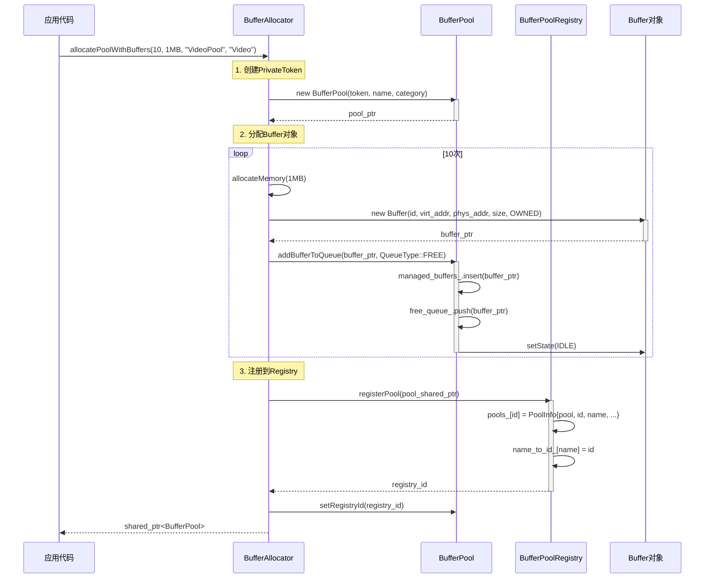
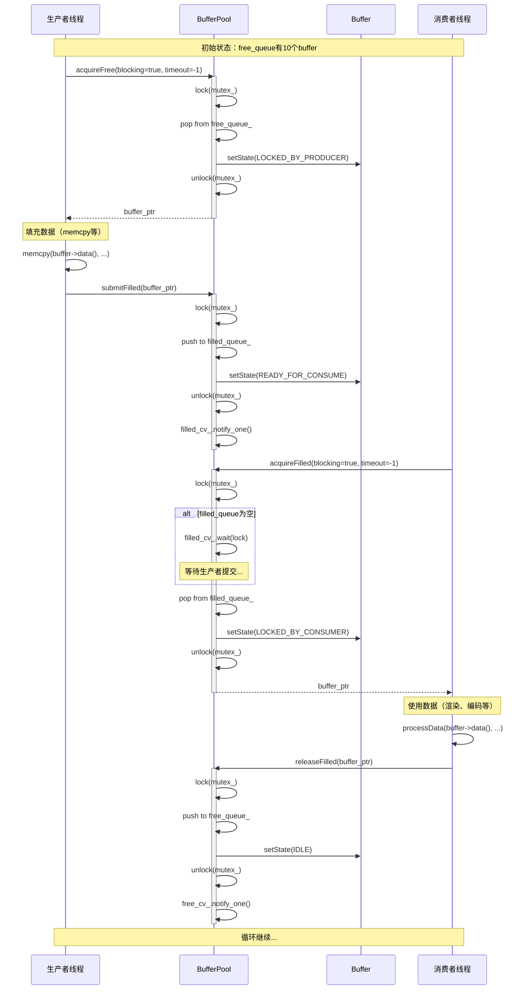
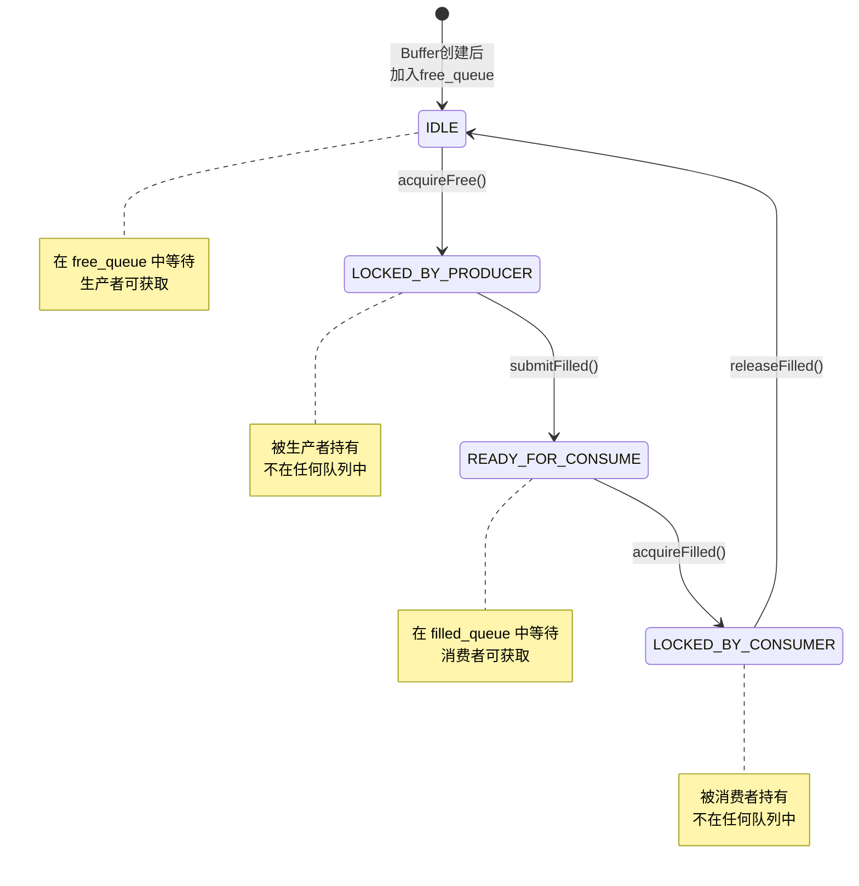
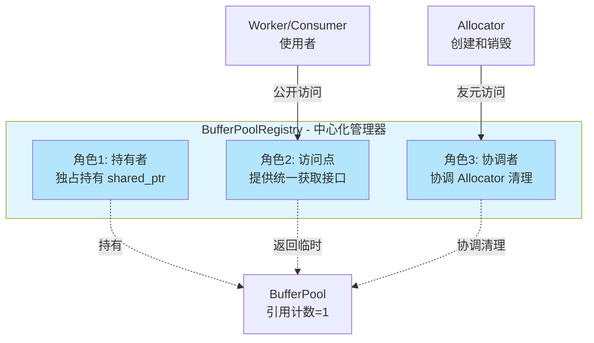
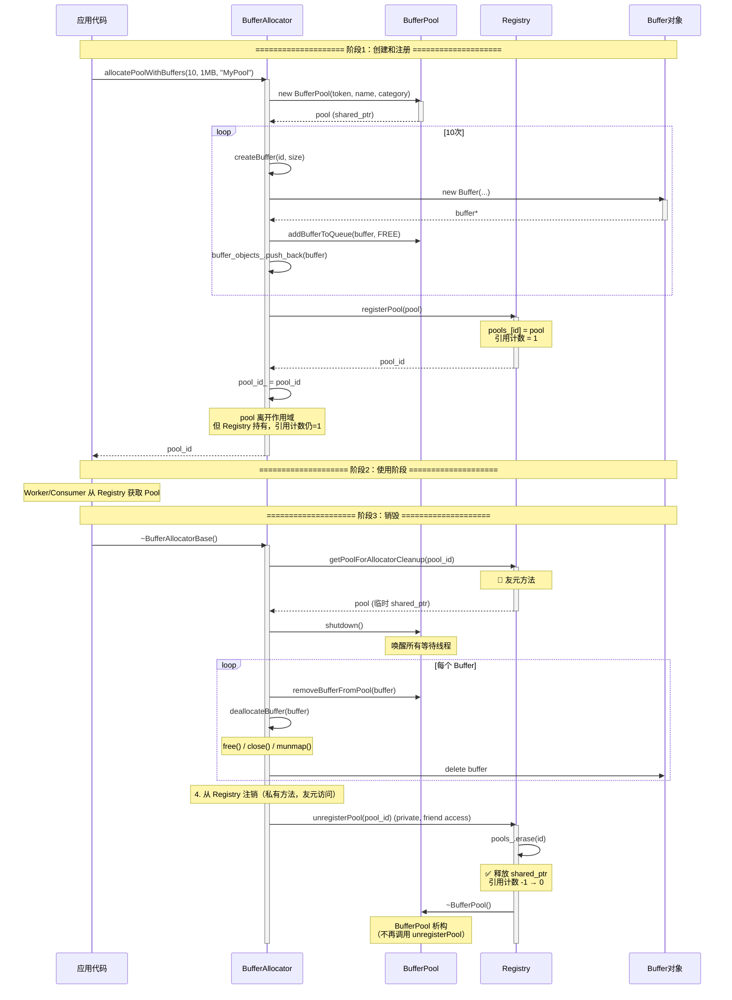
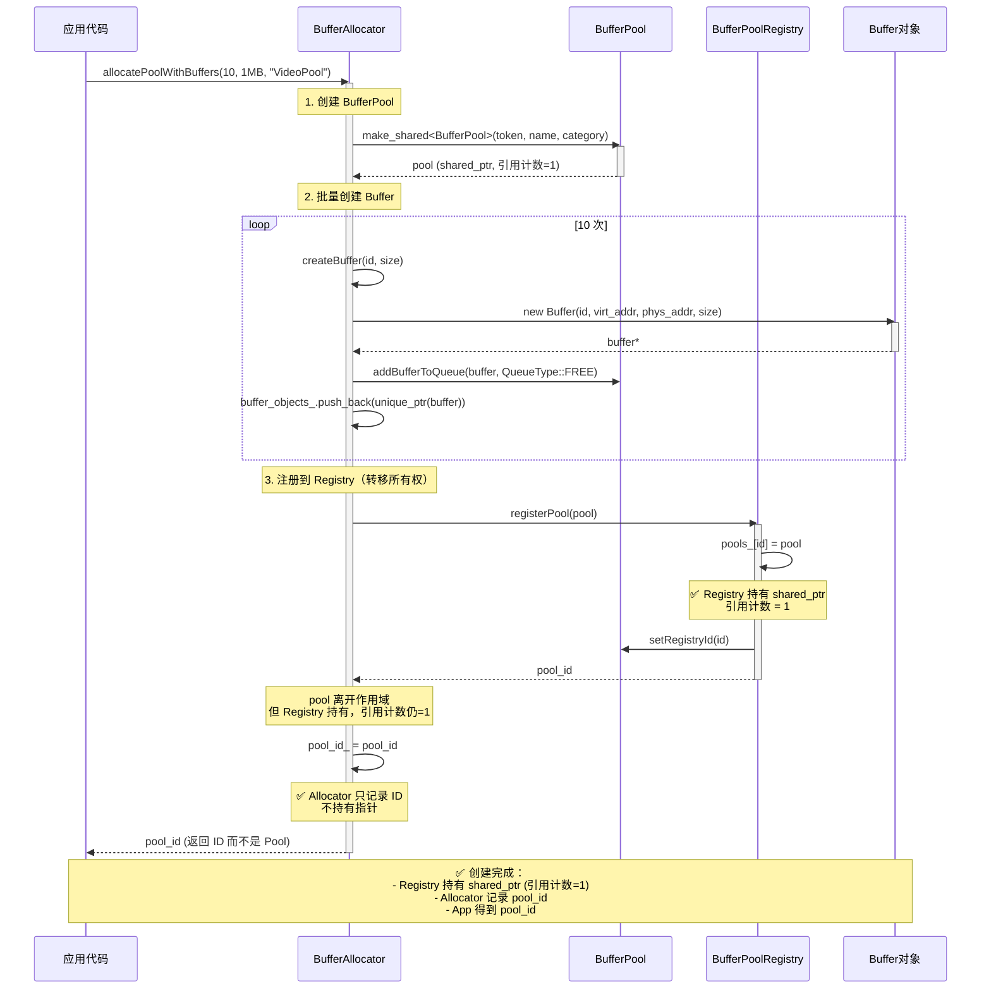
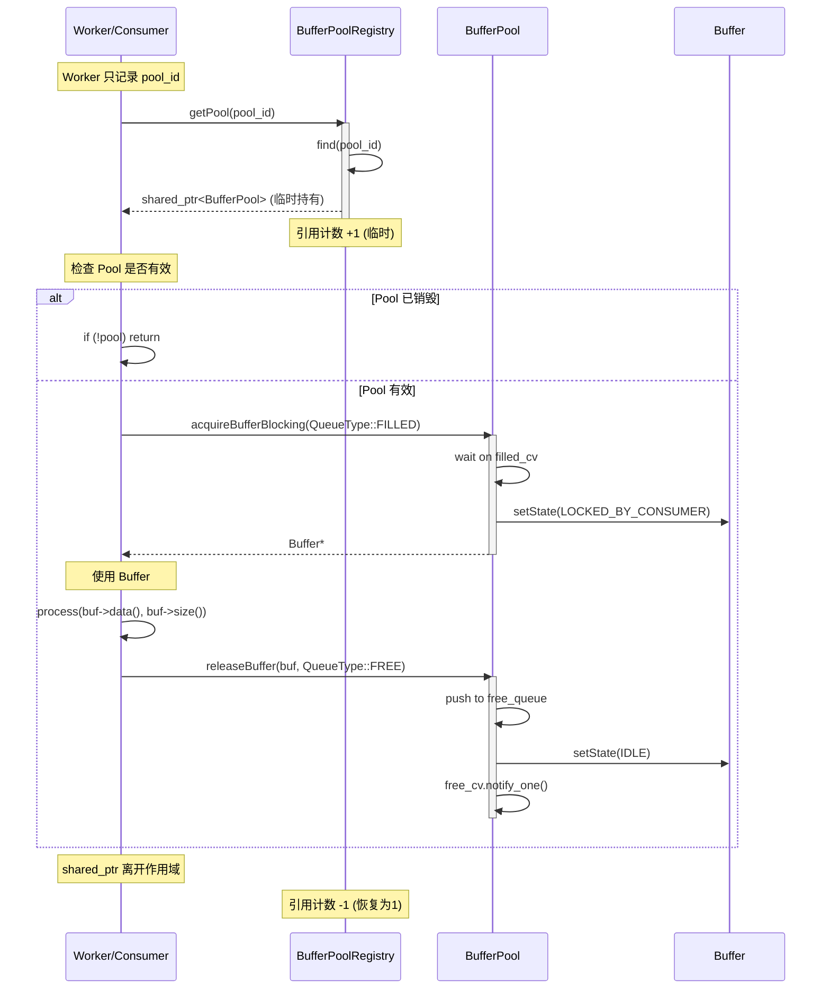

# Buffer子系统设计文档

> **面向人群**: 新入职开发者  
> **文档版本**: v2.0  
> **最后更新**: 2025-11-30  
> **维护者**: AI SDK Team  
> **架构变更**: v2.0 重大变更 - Registry 中心化 + Allocator 友元模式

---

## 📚 目录

1. [概述](#1-概述)
2. [架构设计](#2-架构设计)
3. [类详细设计](#3-类详细设计)
4. [UML图集](#4-uml图集)
5. [典型使用场景](#5-典型使用场景)
6. [线程安全分析](#6-线程安全分析)
7. [扩展性与最佳实践](#7-扩展性与最佳实践)
8. [架构演进与所有权管理](#8-架构演进与所有权管理) ⭐ **v2.0 新增**
9. [总结](#9-总结)

---

## 1. 概述

### 1.1 系统定位

**Buffer子系统**是一个**零拷贝、高性能的内存管理框架**，专为音视频处理场景设计。它提供：

- ✅ **零拷贝传输**：支持虚拟地址+物理地址双映射，可直接用于DMA传输
- ✅ **生产者-消费者模式**：内置双队列调度，支持多线程并发访问
- ✅ **全局监控**：注册表模式统一管理所有BufferPool，便于调试和性能分析
- ✅ **灵活的所有权模型**：支持自有内存和外部托管两种模式

### 1.2 核心价值

| 特性 | 传统方案 | Buffer子系统 |
|------|---------|-------------|
| **内存拷贝** | 多次memcpy | 零拷贝（指针传递） |
| **线程安全** | 手动加锁 | 内置互斥锁+条件变量 |
| **队列管理** | 自己实现 | 双队列自动调度 |
| **生命周期** | 手动malloc/free | Allocator统一管理 |
| **全局监控** | 无 | 注册表统一查询 |

### 1.3 设计原则

```
🎯 单一职责原则 (SRP)
   - Buffer：     纯元数据，不管理内存
   - BufferPool： 纯调度器，不分配内存
   - Allocator：  纯分配器，负责生命周期

🔒 线程安全 (Thread-Safe)
   - 所有公开接口都是线程安全的
   - 使用std::mutex + condition_variable

🔌 依赖注入 (DI)
   - BufferPool不依赖Allocator，通过友元模式解耦

🏗️ 可扩展性 (Extensibility)
   - 通过BufferAllocatorBase可扩展新的分配策略
   - 通过ValidationCallback可自定义校验逻辑
```

---

## 2. 架构设计

### 2.1 三层架构图

```
┌─────────────────────────────────────────────────────────────┐
│                  应用层 (Application)                        │
│         VideoDecoder, Display, ProductionLine...            │
└───────────────────┬─────────────────────────────────────────┘
                    │ acquire / submit / release
                    ▼
┌─────────────────────────────────────────────────────────────┐
│              管理层 (BufferPoolRegistry)                     │
│  - 全局注册表 (单例)                                         │
│  - 监控和查询                                                │
│  - 权限控制 (只读 vs 读写)                                   │
└───────────────────┬─────────────────────────────────────────┘
                    │ registerPool / getPool
                    ▼
┌─────────────────────────────────────────────────────────────┐
│                调度层 (BufferPool)                           │
│  - 双队列调度 (free_queue, filled_queue)                    │
│  - 生产者接口: acquireFree, submitFilled                    │
│  - 消费者接口: acquireFilled, releaseFilled                 │
└───────────────────┬─────────────────────────────────────────┘
                    │ manage pointers
                    ▼
┌─────────────────────────────────────────────────────────────┐
│                元数据层 (Buffer)                             │
│  - 虚拟地址 (virt_addr_) - CPU访问                          │
│  - 物理地址 (phys_addr_) - DMA访问                          │
│  - 状态机 (IDLE → LOCKED → READY → LOCKED)                  │
│  - 引用计数 (ref_count_)                                     │
└───────────────────┬─────────────────────────────────────────┘
                    │ point to
                    ▼
┌─────────────────────────────────────────────────────────────┐
│             内存层 (BufferAllocatorBase)                     │
│  - NormalAllocator:     malloc/posix_memalign               │
│  - DmaAllocator:        dma-buf allocation                  │
│  - CmaAllocator:        CMA reserved memory                 │
│  - FramebufferAllocator: /dev/fb0 mmap                      │
└─────────────────────────────────────────────────────────────┘
```

### 2.2 职责划分

#### 🔹 Buffer - 元数据容器
**职责**: 封装单个buffer的完整元数据  
**不负责**: 内存分配和释放  
**核心能力**:
- 存储虚拟地址 + 物理地址（零拷贝关键）
- 状态机管理（IDLE → LOCKED_BY_PRODUCER → READY → LOCKED_BY_CONSUMER）
- 引用计数（用于外部buffer生命周期检测）
- 安全性检查（magic number + 自定义校验回调）

#### 🔹 BufferPool - 调度器
**职责**: 管理Buffer队列，提供线程安全的调度接口  
**不负责**: Buffer对象的创建和销毁  
**核心能力**:
- 双队列管理（free_queue 和 filled_queue）
- 生产者-消费者模式（支持阻塞/非阻塞）
- 超时控制（毫秒级精度）
- 优雅关闭（shutdown唤醒所有等待线程）

#### 🔹 BufferPoolRegistry - 全局管理器
**职责**: 集中管理所有BufferPool实例  
**不负责**: BufferPool的创建（由Allocator负责）  
**核心能力**:
- 单例模式（全局唯一）
- 注册表管理（自动分配ID）
- 权限控制（只读 vs 读写访问）
- 全局监控（统计所有Pool的状态）

### 2.3 依赖关系（v2.0 新架构）

```
BufferAllocatorBase (创建者和销毁者)
    ├── 创建 → BufferPool (通过 PrivateToken)
    ├── 注册 → BufferPoolRegistry (立即转移所有权，传入 Allocator ID)
    ├── 唯一标识 → allocator_id_ (全局唯一 ID)
    ├── 友元访问 → Registry::getPoolForAllocatorCleanup() (仅在清理时)
    ├── 管理 → Buffer 对象生命周期
    └── 销毁 → 查询 Registry 获取所有 Pool → 逐个调用 destroyPool()

BufferPool
    ├── 管理 → Buffer* (指针，不拥有对象)
    ├── 友元 → BufferAllocatorBase (访问私有方法)
    └── 被持有 → BufferPoolRegistry (独占所有权)

Buffer
    └── 独立类（无外部依赖）

BufferPoolRegistry (单例，中心化资源管理器)
    ├── 独占持有 → shared_ptr<BufferPool> (引用计数 = 1)
    ├── 提供访问 → getPool() 返回临时 shared_ptr
    ├── 提供观察 → getPoolWeak() 返回 weak_ptr
    ├── 友元方法 → getPoolForAllocatorCleanup() (仅 Allocator 可调用)
    └── 友元声明 → friend class BufferAllocatorBase

Worker/ProductionLine/Consumer (使用者)
    ├── 记录 → buffer_pool_id_ (不持有指针)
    ├── 临时访问 → Registry::getPool(buffer_pool_id_) (使用时获取)
    └── 关闭清理 → Worker::close() 调用 destroyPool() 主动清理
```

**关键变更（v2.0）：**
- ✅ Registry **独占持有** BufferPool（shared_ptr，引用计数=1）
- ✅ Allocator **不持有指针**（只记录 pool_id）
- ✅ Allocator 通过**友元**访问清理方法
- ✅ 所有使用者从 Registry 获取（临时 shared_ptr）

### 2.4 设计模式应用

| 设计模式 | 应用位置 | 目的 |
|---------|---------|------|
| **Passkey Idiom** | `BufferPool::PrivateToken` | 控制BufferPool的创建权限，只有Allocator可创建 |
| **Singleton** | `BufferPoolRegistry` | 全局唯一的注册表 |
| **Friend + Private** | `BufferPool` ↔ `BufferAllocatorBase` | 受控的内部接口访问 |
| **Producer-Consumer** | `BufferPool` 双队列 | 高效的多线程协作 |
| **RAII** | `BufferPool` 析构 | 自动注销和资源清理 |
| **Template Method** | `BufferAllocatorBase` | 扩展不同的分配策略 |

---

## 3. 类详细设计

### 3.1 Buffer类

#### 3.1.1 类概述

```cpp
/**
 * @brief Buffer 元数据类
 * 
 * 设计目标：
 * - 封装单个buffer的完整元数据（地址、大小、状态）
 * - 支持零拷贝（虚拟地址 + 物理地址）
 * - 线程安全的状态管理（atomic）
 * - 生命周期检测（引用计数 + magic number）
 */
class Buffer {
    // ...
};
```

#### 3.1.2 成员属性

| 属性 | 类型 | 说明 | 初始值 |
|-----|------|------|--------|
| `id_` | `uint32_t` | 唯一标识符（在Pool内唯一） | 构造时传入 |
| `virt_addr_` | `void*` | 虚拟地址（CPU访问） | 构造时传入 |
| `phys_addr_` | `uint64_t` | 物理地址（DMA/硬件访问，0表示未知） | 构造时传入 |
| `size_` | `size_t` | Buffer大小（字节） | 构造时传入 |
| `ownership_` | `Ownership` | 所有权类型（OWNED/EXTERNAL） | 构造时传入 |
| `state_` | `atomic<State>` | 当前状态（状态机） | `IDLE` |
| `ref_count_` | `atomic<int>` | 引用计数（外部buffer检测） | `0` |
| `dma_fd_` | `int` | DMA-BUF文件描述符（-1表示无效） | `-1` |
| `validation_magic_` | `uint32_t` | 魔数（用于检测野指针） | `0xBEEFF123` |
| `validation_callback_` | `ValidationCallback` | 自定义校验回调 | `nullptr` |

#### 3.1.3 状态机

```
     acquireFree()              submitFilled()
IDLE ─────────────→ LOCKED_BY_PRODUCER ─────────────→ READY_FOR_CONSUME
 ↑                                                              │
 │                                                              │
 │                    releaseFilled()        acquireFilled()   │
 └────────────────── LOCKED_BY_CONSUMER ←─────────────────────┘
```

| 状态 | 枚举值 | 含义 | 所在队列 |
|-----|--------|------|---------|
| `IDLE` | `State::IDLE` | 空闲，等待生产者获取 | `free_queue` |
| `LOCKED_BY_PRODUCER` | `State::LOCKED_BY_PRODUCER` | 被生产者锁定，正在填充数据 | 无（被生产者持有） |
| `READY_FOR_CONSUME` | `State::READY_FOR_CONSUME` | 数据就绪，等待消费者获取 | `filled_queue` |
| `LOCKED_BY_CONSUMER` | `State::LOCKED_BY_CONSUMER` | 被消费者锁定，正在使用数据 | 无（被消费者持有） |

#### 3.1.4 所有权类型

```cpp
enum class Ownership {
    OWNED,      // BufferPool拥有并管理生命周期（由Allocator分配）
    EXTERNAL    // 外部拥有，BufferPool只负责调度（如硬件buffer）
};
```

| 类型 | 适用场景 | 生命周期管理 |
|-----|---------|-------------|
| `OWNED` | 普通malloc、DMA-BUF分配 | Allocator负责malloc/free |
| `EXTERNAL` | 硬件驱动提供的buffer、mmap的framebuffer | 外部负责，Pool只管理指针 |

#### 3.1.5 成员方法

##### Getters（只读接口）

```cpp
// 基础信息
uint32_t id() const;                          // 获取唯一ID
void* getVirtualAddress() const;              // 获取虚拟地址（CPU访问）
uint64_t getPhysicalAddress() const;          // 获取物理地址（DMA访问）
size_t size() const;                          // 获取Buffer大小
Ownership ownership() const;                  // 获取所有权类型

// 状态和计数
State state() const;                          // 获取当前状态（原子读取）
int refCount() const;                         // 获取引用计数

// DMA相关
int getDmaBufFd() const;                      // 获取DMA-BUF文件描述符

// 兼容接口
void* data() const;                           // 别名：getVirtualAddress()
```

##### Setters（写接口）

```cpp
// 状态管理
void setState(State state);                   // 设置状态（原子写入）

// 地址设置
void setPhysicalAddress(uint64_t phys_addr); // 设置物理地址（延迟获取场景）

// DMA设置
void setDmaBufFd(int fd);                     // 设置DMA-BUF fd

// 引用计数
void addRef();                                // 增加引用计数（原子操作）
void releaseRef();                            // 减少引用计数（原子操作）
```

##### 校验接口

```cpp
// 基础校验
bool isValid() const;                         // 检查magic number和地址非空

// 完整校验
bool validate() const;                        // 包含基础校验 + 自定义回调

// 自定义校验
using ValidationCallback = std::function<bool(const Buffer*)>;
void setValidationCallback(ValidationCallback cb);
```

**使用示例**:
```cpp
// 场景：检查DMA buffer是否仍然有效
buffer->setValidationCallback([](const Buffer* buf) {
    // 自定义逻辑：检查物理地址是否在有效范围内
    uint64_t phys = buf->getPhysicalAddress();
    return phys >= 0x10000000 && phys < 0x20000000;
});

if (buffer->validate()) {
    // 安全使用
}
```

##### 调试接口

```cpp
void printInfo() const;                       // 打印Buffer详细信息
static const char* stateToString(State state); // 状态→字符串
static const char* ownershipToString(Ownership ownership); // 所有权→字符串
```

**输出示例**:
```
📦 Buffer #3:
   Virtual Address:  0x7f8a4c000000
   Physical Address: 0x00000012345678
   Size:             8388608 bytes (8.00 MB)
   Ownership:        OWNED (自有内存)
   State:            IDLE (空闲)
   Ref Count:        0
   DMA-BUF FD:       -1
   Valid:            ✅ Yes
```

---

### 3.2 BufferPool类

#### 3.2.1 类概述

```cpp
/**
 * @brief BufferPool - 纯调度器
 * 
 * 设计目标：
 * - 管理Buffer队列（free_queue, filled_queue）
 * - 提供线程安全的生产者-消费者接口
 * - 支持阻塞/非阻塞/超时三种模式
 * - 不负责Buffer对象的生命周期
 */
class BufferPool {
    // ...
};
```

#### 3.2.2 成员属性

| 属性 | 类型 | 说明 | 线程安全 |
|-----|------|------|---------|
| `name_` | `std::string` | Pool名称（如"VideoDecodePool"） | 构造后不变 |
| `category_` | `std::string` | Pool分类（如"Video", "Display"） | 构造后不变 |
| `registry_id_` | `uint64_t` | 注册表分配的唯一ID | 构造后设置 |
| `managed_buffers_` | `unordered_set<Buffer*>` | 所有托管的Buffer指针 | 🔒 mutex保护 |
| `free_queue_` | `queue<Buffer*>` | 空闲队列（生产者获取） | 🔒 mutex保护 |
| `filled_queue_` | `queue<Buffer*>` | 填充队列（消费者获取） | 🔒 mutex保护 |
| `mutex_` | `std::mutex` | 保护所有队列和状态 | - |
| `free_cv_` | `condition_variable` | 空闲队列条件变量 | - |
| `filled_cv_` | `condition_variable` | 填充队列条件变量 | - |
| `running_` | `atomic<bool>` | 运行状态（shutdown时设为false） | 原子操作 |

#### 3.2.3 Passkey模式（权限控制）

```cpp
class PrivateToken {
private:
    PrivateToken() = default;
    friend class BufferAllocatorBase;  // 只有Allocator可创建Token
};

// 构造函数需要Token（外部无法创建Token，因此无法直接构造）
BufferPool(PrivateToken token, const std::string& name, const std::string& category);
```

**设计意图**: 防止外部随意创建BufferPool，必须通过Allocator统一管理。

#### 3.2.4 成员方法

##### 生产者接口（Producer）

```cpp
/**
 * @brief 获取空闲Buffer
 * @param blocking    是否阻塞等待（true=阻塞, false=立即返回）
 * @param timeout_ms  超时时间（-1=无限等待, >0=超时毫秒数）
 * @return Buffer*    成功返回buffer，失败/超时返回nullptr
 * 
 * 线程安全：✅ 是
 * 状态变化：Buffer状态从 IDLE → LOCKED_BY_PRODUCER
 */
Buffer* acquireFree(bool blocking = true, int timeout_ms = -1);

/**
 * @brief 提交已填充的Buffer
 * @param buffer_ptr  填充好的buffer
 * 
 * 线程安全：✅ 是
 * 状态变化：Buffer状态从 LOCKED_BY_PRODUCER → READY_FOR_CONSUME
 * 通知：唤醒一个等待filled_queue的消费者线程
 */
void submitFilled(Buffer* buffer_ptr);
```

**使用示例**:
```cpp
// 生产者线程
void producerThread(BufferPool* pool) {
    while (running) {
        // 1. 获取空闲buffer（阻塞等待，最多100ms）
        Buffer* buf = pool->acquireFree(true, 100);
        if (!buf) {
            continue;  // 超时，重试
        }
        
        // 2. 填充数据
        memcpy(buf->getVirtualAddress(), data, size);
        
        // 3. 提交到filled队列
        pool->submitFilled(buf);
    }
}
```

##### 消费者接口（Consumer）

```cpp
/**
 * @brief 获取已填充的Buffer
 * @param blocking    是否阻塞等待
 * @param timeout_ms  超时时间
 * @return Buffer*    成功返回buffer，失败/超时返回nullptr
 * 
 * 线程安全：✅ 是
 * 状态变化：Buffer状态从 READY_FOR_CONSUME → LOCKED_BY_CONSUMER
 */
Buffer* acquireFilled(bool blocking = true, int timeout_ms = -1);

/**
 * @brief 归还已使用的Buffer
 * @param buffer_ptr  已使用的buffer
 * 
 * 线程安全：✅ 是
 * 状态变化：Buffer状态从 LOCKED_BY_CONSUMER → IDLE
 * 通知：唤醒一个等待free_queue的生产者线程
 */
void releaseFilled(Buffer* buffer_ptr);
```

**使用示例**:
```cpp
// 消费者线程
void consumerThread(BufferPool* pool) {
    while (running) {
        // 1. 获取filled buffer（阻塞等待）
        Buffer* buf = pool->acquireFilled(true, -1);
        if (!buf) {
            break;  // Pool已shutdown
        }
        
        // 2. 使用数据
        processData(buf->getVirtualAddress(), buf->size());
        
        // 3. 归还到free队列
        pool->releaseFilled(buf);
    }
}
```

##### 查询接口（Query）

```cpp
int getFreeCount() const;           // 获取空闲buffer数量（线程安全）
int getFilledCount() const;         // 获取就绪buffer数量（线程安全）
int getTotalCount() const;          // 获取总buffer数量（线程安全）

const std::string& getName() const;      // 获取Pool名称
const std::string& getCategory() const;  // 获取Pool分类
uint64_t getRegistryId() const;          // 获取注册表ID

Buffer* getBufferById(uint32_t id) const;  // 根据ID查找Buffer（线程安全）
size_t getBufferSize() const;              // 获取Buffer大小（假设所有buffer大小相同）
```

##### 生命周期管理

```cpp
/**
 * @brief 停止BufferPool（优雅关闭）
 * 
 * 作用：
 * - 设置 running_ = false
 * - 唤醒所有等待的线程（free_cv和filled_cv）
 * - 防止死锁
 * 
 * 使用场景：
 * - BufferPool析构前（自动调用）
 * - 需要清理资源时
 */
void shutdown();
```

##### 调试接口

```cpp
void printStats() const;         // 打印统计信息
void printAllBuffers() const;    // 打印所有buffer详情
```

##### 私有接口（仅BufferAllocatorBase使用）

```cpp
/**
 * @brief 添加Buffer到指定队列
 * @param buffer  Buffer指针
 * @param queue   目标队列（FREE或FILLED）
 * @return true   成功，false失败（buffer已存在）
 * 
 * 访问权限：私有（通过friend class BufferAllocatorBase访问）
 * 线程安全：✅ 是
 */
bool addBufferToQueue(Buffer* buffer, QueueType queue);

/**
 * @brief 从Pool中移除Buffer
 * @param buffer  Buffer指针
 * @return true   成功，false失败（buffer不在pool或正在使用）
 * 
 * 限制条件：只能移除IDLE状态的buffer
 * 访问权限：私有（通过friend class BufferAllocatorBase访问）
 * 线程安全：✅ 是
 */
bool removeBufferFromPool(Buffer* buffer);
```

---

### 3.3 BufferPoolRegistry类

#### 3.3.1 类概述

```cpp
/**
 * @brief BufferPoolRegistry - 全局注册表（单例）
 * 
 * 设计目标：
 * - 跟踪系统中所有BufferPool实例
 * - 提供全局查询和监控接口
 * - 支持命名和分类管理
 * - 权限控制（只读 vs 读写访问）
 */
class BufferPoolRegistry {
    // ...
};
```

#### 3.3.2 成员属性

| 属性 | 类型 | 说明 |
|-----|------|------|
| `mutex_` | `std::mutex` | 保护所有成员变量 |
| `pools_` | `unordered_map<uint64_t, PoolInfo>` | ID → PoolInfo映射表 |
| `name_to_id_` | `unordered_map<string, uint64_t>` | Name → ID映射表（快速查找） |
| `next_id_` | `uint64_t` | 下一个可用ID（递增分配） |

**PoolInfo结构**:
```cpp
struct PoolInfo {
    std::shared_ptr<BufferPool> pool;                    // Pool的shared_ptr
    uint64_t id;                                         // 唯一ID
    std::string name;                                    // 可读名称
    std::string category;                                // 分类
    std::chrono::system_clock::time_point created_time;  // 创建时间
};
```

#### 3.3.3 成员方法

##### 单例接口

```cpp
static BufferPoolRegistry& getInstance();  // 获取全局唯一实例（线程安全）
```

##### 注册管理（自动调用）

```cpp
/**
 * @brief 注册BufferPool（由Allocator创建pool后自动调用）
 * @param pool  BufferPool的shared_ptr
 * @return 唯一ID
 * 
 * 线程安全：✅ 是
 */
uint64_t registerPool(std::shared_ptr<BufferPool> pool);

/**
 * @brief 注销BufferPool（由BufferPool析构函数自动调用）
 * @param id  注册时返回的唯一ID
 * 
 * 线程安全：✅ 是
 */
void unregisterPool(uint64_t id);
```

##### 只读接口（公开，任何人都可以调用）

```cpp
// 按ID查询
std::shared_ptr<const BufferPool> getPoolReadOnly(uint64_t id) const;

// 按名称查询
std::shared_ptr<const BufferPool> getPoolReadOnlyByName(const std::string& name) const;

// 查询所有
std::vector<std::shared_ptr<const BufferPool>> getAllPoolsReadOnly() const;

// 按分类查询
std::vector<std::shared_ptr<const BufferPool>> getPoolsByCategoryReadOnly(
    const std::string& category) const;

// Worker相关查询
std::vector<std::shared_ptr<const BufferPool>> getWorkerPoolsReadOnly() const;
std::shared_ptr<const BufferPool> getWorkerPoolReadOnly(const std::string& worker_name) const;

// 统计
size_t getPoolCount() const;  // 获取注册的BufferPool总数
```

**为什么是只读？**
- 防止外部随意修改BufferPool状态
- 只能通过BufferPool的公开接口操作
- 符合最小权限原则

##### 读写接口（仅ProductionLine可以调用）

```cpp
// 权限控制：通过 friend class VideoProductionLine 限制

/**
 * @brief 获取BufferPool（读写版本，仅ProductionLine使用）
 */
std::shared_ptr<BufferPool> getPoolForProductionLine(uint64_t id);
std::shared_ptr<BufferPool> getPoolByNameForProductionLine(const std::string& name);
```

**设计意图**: ProductionLine需要连接多个Worker的BufferPool，需要读写权限。

##### 全局监控接口

```cpp
/**
 * @brief 打印所有BufferPool的统计信息
 */
void printAllStats() const;

/**
 * @brief 获取所有BufferPool的总内存使用量
 * @return size_t 总字节数
 */
size_t getTotalMemoryUsage() const;

/**
 * @brief 全局统计信息结构
 */
struct GlobalStats {
    int total_pools;         // 总Pool数量
    int total_buffers;       // 总Buffer数量
    int total_free;          // 总空闲Buffer数量
    int total_filled;        // 总已填充Buffer数量
    size_t total_memory;     // 总内存使用量（字节）
};

/**
 * @brief 获取全局统计信息
 */
GlobalStats getGlobalStats() const;
```

**使用示例**:
```cpp
// 场景：性能监控和调试
void printSystemStatus() {
    auto& registry = BufferPoolRegistry::getInstance();
    
    // 方式1：打印所有统计
    registry.printAllStats();
    
    // 方式2：程序化访问
    auto stats = registry.getGlobalStats();
    printf("系统总内存使用：%.2f MB\n", stats.total_memory / (1024.0 * 1024.0));
    printf("总Buffer数量：%d (空闲: %d, 使用中: %d)\n",
           stats.total_buffers, stats.total_free, stats.total_filled);
}
```

---

## 4. UML图集

### 4.1 类图（Class Diagram）

```mermaid
classDiagram
    %% ========== 核心类 ==========
    class Buffer {
        -uint32_t id_
        -void* virt_addr_
        -uint64_t phys_addr_
        -size_t size_
        -Ownership ownership_
        -atomic~State~ state_
        -atomic~int~ ref_count_
        -int dma_fd_
        -uint32_t validation_magic_
        -ValidationCallback validation_callback_
        
        +Buffer(id, virt_addr, phys_addr, size, ownership)
        +id() uint32_t
        +getVirtualAddress() void*
        +getPhysicalAddress() uint64_t
        +size() size_t
        +state() State
        +setState(State)
        +validate() bool
        +printInfo()
    }
    
    class BufferPool {
        -string name_
        -string category_
        -uint64_t registry_id_
        -unordered_set~Buffer*~ managed_buffers_
        -queue~Buffer*~ free_queue_
        -queue~Buffer*~ filled_queue_
        -mutex mutex_
        -condition_variable free_cv_
        -condition_variable filled_cv_
        -atomic~bool~ running_
        
        +BufferPool(PrivateToken, name, category)
        +acquireFree(blocking, timeout_ms) Buffer*
        +submitFilled(Buffer*)
        +acquireFilled(blocking, timeout_ms) Buffer*
        +releaseFilled(Buffer*)
        +getFreeCount() int
        +getFilledCount() int
        +shutdown()
        -addBufferToQueue(Buffer*, QueueType) bool
        -removeBufferFromPool(Buffer*) bool
    }
    
    class BufferPoolRegistry {
        <<singleton>>
        -mutex mutex_
        -unordered_map~uint64_t, PoolInfo~ pools_
        -unordered_map~string, uint64_t~ name_to_id_
        -uint64_t next_id_
        
        +getInstance()$ BufferPoolRegistry&
        +registerPool(shared_ptr~BufferPool~) uint64_t
        +unregisterPool(uint64_t)
        +getPoolReadOnly(uint64_t) shared_ptr~const BufferPool~
        +getAllPoolsReadOnly() vector
        +printAllStats()
        +getGlobalStats() GlobalStats
        +getPoolForProductionLine(uint64_t) shared_ptr~BufferPool~
    }
    
    class BufferAllocatorBase {
        <<abstract>>
        #vector~unique_ptr~Buffer~~ buffer_objects_
        #shared_ptr~BufferPool~ pool_
        
        +allocatePoolWithBuffers(count, size, name, category) shared_ptr~BufferPool~
        +addBufferToPool(uint32_t, void*, uint64_t, size, Ownership) bool
        +removeBufferFromPool(Buffer*) bool
        #allocateMemory(size)* AllocResult
        #freeMemory(void*, size)*
    }
    
    %% ========== 关系 ==========
    BufferPool "1" *-- "N" Buffer : manages >
    BufferPool ..> BufferAllocatorBase : friend
    BufferPoolRegistry "1" o-- "N" BufferPool : tracks >
    BufferAllocatorBase ..> BufferPool : creates >
    BufferAllocatorBase "1" *-- "N" Buffer : owns >
    
    %% ========== 嵌套类 ==========
    class PrivateToken {
        -PrivateToken()
    }
    BufferPool +-- PrivateToken
    BufferAllocatorBase ..> PrivateToken : can create
    
    %% ========== 枚举 ==========
    class State {
        <<enumeration>>
        IDLE
        LOCKED_BY_PRODUCER
        READY_FOR_CONSUME
        LOCKED_BY_CONSUMER
    }
    Buffer +-- State
    
    class Ownership {
        <<enumeration>>
        OWNED
        EXTERNAL
    }
    Buffer +-- Ownership
    
    class QueueType {
        <<enumeration>>
        FREE
        FILLED
    }
```

**关键关系说明**:

| 关系符号 | 含义 | 示例 |
|---------|------|------|
| `*--` | 组合（强拥有） | BufferPool管理Buffer指针 |
| `o--` | 聚合（弱拥有） | Registry跟踪Pool的shared_ptr |
| `..>` | 依赖 | Allocator创建Pool |
| `friend` | 友元 | Allocator可访问Pool私有方法 |

---

### 4.2 时序图（Sequence Diagrams）

#### 场景1：创建BufferPool并注册



---

#### 场景2：生产者-消费者正常流程



---

#### 场景3：超时处理

```mermaid
sequenceDiagram
    participant Producer as 生产者线程
    participant Pool as BufferPool
    
    Note over Producer,Pool: 场景：free_queue为空，生产速度>消费速度
    
    Producer->>Pool: acquireFree(blocking=true, timeout_ms=100)
    activate Pool
    Pool->>Pool: lock(mutex_)
    Pool->>Pool: check free_queue_.empty() == true
    
    alt 使用超时等待
        Pool->>Pool: free_cv_.wait_until(lock, deadline)
        Note over Pool: 等待100ms...
        
        alt 超时
            Pool->>Pool: return std::cv_status::timeout
            Pool->>Pool: unlock(mutex_)
            Pool-->>Producer: nullptr (超时)
        else 被唤醒且有buffer
            Pool->>Pool: pop from free_queue_
            Pool-->>Producer: buffer_ptr
        end
    end
    deactivate Pool
    
    Note over Producer: 处理nullptr情况
    Producer->>Producer: if (!buffer) { continue; }
```

---

### 4.3 状态图（State Diagram）

#### Buffer状态转换图



#### BufferPool生命周期图

```mermaid
stateDiagram-v2
    [*] --> Creating : Allocator调用<br/>allocatePoolWithBuffers()
    
    Creating --> Running : 构造完成<br/>running_=true
    
    Running --> Running : 正常调度<br/>acquire/submit/release
    
    Running --> Shutting_Down : shutdown()调用<br/>running_=false
    
    Shutting_Down --> Destroyed : Allocator::destroyPool()<br/>清理Buffer后unregisterPool()
    
    Destroyed --> [*]
    
    note right of Running
        - 生产者和消费者正常工作
        - 线程可能阻塞在条件变量上
    end note
    
    note right of Shutting_Down
        - 唤醒所有等待线程
        - 新的acquire调用立即返回nullptr
        - 允许优雅退出
    end note
```

---

### 4.4 对象生命周期图

```mermaid
graph TD
    subgraph "1️⃣ 创建阶段"
        A[App调用Allocator] --> B[Allocator::allocatePoolWithBuffers]
        B --> C[创建BufferPool对象]
        B --> D[分配N个Buffer对象]
        D --> E[addBufferToQueue 添加到free_queue]
        C --> F[registerPool 注册到Registry]
    end
    
    subgraph "2️⃣ 运行阶段"
        G[生产者获取free buffer] --> H[填充数据]
        H --> I[submitFilled 提交到filled_queue]
        I --> J[消费者获取filled buffer]
        J --> K[使用数据]
        K --> L[releaseFilled 归还到free_queue]
        L --> G
    end
    
    subgraph "3️⃣ 销毁阶段"
        M[Allocator::destroyPool()] --> N[清理所有Buffer]
        N --> O[调用unregisterPool()注销]
        O --> P[释放shared_ptr]
        P --> Q[BufferPool析构函数]
        Q --> R[shutdown 唤醒所有线程]
        Q --> S[BufferPool销毁完成]
        Note over M,S: ⚠️ 注意：BufferPool析构函数<br/>不再调用unregisterPool()<br/>（由Allocator::destroyPool()负责）
    end
    
    F --> G
    L --> M
```

**关键点**:
1. **Buffer对象生命周期**: 由Allocator的`buffer_objects_`管理（unique_ptr）
2. **BufferPool生命周期**: 由shared_ptr管理，App和Registry共同持有
3. **内存生命周期**: 由Allocator管理，调用allocateMemory/freeMemory

---

## 5. 典型使用场景

### 5.1 场景：视频解码器（生产者）

```cpp
#include "buffer/bufferpool/BufferPool.hpp"
#include "buffer/BufferAllocatorFacade.hpp"

class VideoDecoder {
public:
    VideoDecoder() {
        // 1. 创建BufferPool（10个8MB的buffer）
        pool_ = BufferFacade::createBufferPool(
            10,                          // buffer数量
            8 * 1024 * 1024,            // 每个8MB
            BufferMemoryAllocatorType::NORMAL_MALLOC,  // 使用malloc
            "VideoDecodePool",           // Pool名称
            "Video"                      // 分类
        );
        
        // 2. 启动解码线程
        decode_thread_ = std::thread(&VideoDecoder::decodeLoop, this);
    }
    
    ~VideoDecoder() {
        running_ = false;
        if (decode_thread_.joinable()) {
            decode_thread_.join();
        }
    }
    
private:
    void decodeLoop() {
        while (running_) {
            // 1. 获取空闲buffer（阻塞等待，最多100ms）
            Buffer* buf = pool_->acquireFree(true, 100);
            if (!buf) {
                continue;  // 超时，重试
            }
            
            // 2. 解码一帧到buffer
            AVFrame* frame = decodeOneFrame();
            if (!frame) {
                pool_->releaseFilled(buf);  // 没有数据，直接归还
                continue;
            }
            
            // 3. 拷贝帧数据到buffer
            memcpy(buf->getVirtualAddress(), frame->data[0], frame->linesize[0] * frame->height);
            
            // 4. 提交到filled队列（供显示模块消费）
            pool_->submitFilled(buf);
            
            printf("✅ 解码帧 #%d, Buffer #%u\n", frame_count_++, buf->id());
        }
    }
    
    std::shared_ptr<BufferPool> pool_;
    std::thread decode_thread_;
    std::atomic<bool> running_{true};
    int frame_count_ = 0;
};
```

---

### 5.2 场景：显示模块（消费者）

```cpp
class DisplayModule {
public:
    DisplayModule(const std::string& decoder_pool_name) {
        // 1. 从Registry获取解码器的BufferPool（只读）
        auto& registry = BufferPoolRegistry::getInstance();
        pool_ = registry.getPoolReadOnlyByName(decoder_pool_name);
        
        if (!pool_) {
            throw std::runtime_error("找不到解码器的BufferPool: " + decoder_pool_name);
        }
        
        // 2. 启动显示线程
        display_thread_ = std::thread(&DisplayModule::displayLoop, this);
    }
    
    ~DisplayModule() {
        running_ = false;
        if (display_thread_.joinable()) {
            display_thread_.join();
        }
    }
    
private:
    void displayLoop() {
        while (running_) {
            // 1. 获取filled buffer（阻塞等待）
            // 注意：pool_是const，但acquireFilled()是const方法，所以可以调用
            Buffer* buf = const_cast<BufferPool*>(pool_.get())->acquireFilled(true, -1);
            if (!buf) {
                break;  // Pool已shutdown
            }
            
            // 2. 显示buffer（例如：渲染到屏幕）
            renderToScreen(buf->getVirtualAddress(), buf->size());
            
            // 3. 归还到free队列
            const_cast<BufferPool*>(pool_.get())->releaseFilled(buf);
            
            printf("🖥️  显示帧，Buffer #%u\n", buf->id());
        }
    }
    
    std::shared_ptr<const BufferPool> pool_;  // 只读版本
    std::thread display_thread_;
    std::atomic<bool> running_{true};
};
```

**注意**: 实际使用中，应该通过ProductionLine统一管理，而不是直接const_cast。

---

### 5.3 场景：DMA零拷贝（硬件加速）

```cpp
#include "buffer/BufferAllocatorFacade.hpp"

class HardwareEncoder {
public:
    HardwareEncoder() {
        // 1. 创建DMA BufferPool（支持零拷贝到硬件）
        pool_ = BufferFacade::createBufferPool(
            5,                          // 5个buffer（硬件限制）
            1920 * 1080 * 3 / 2,       // NV12格式大小
            BufferMemoryAllocatorType::DMA_BUF,  // 使用DMA-BUF
            "HwEncodePool",
            "Video"
        );
    }
    
    void encodeFrame(const uint8_t* yuv_data, size_t size) {
        // 1. 获取空闲buffer（非阻塞）
        Buffer* buf = pool_->acquireFree(false, 0);
        if (!buf) {
            printf("⚠️  所有buffer都在使用中，丢帧\n");
            return;
        }
        
        // 2. CPU填充数据
        memcpy(buf->getVirtualAddress(), yuv_data, size);
        
        // 3. 获取物理地址，传递给硬件编码器
        uint64_t phys_addr = buf->getPhysicalAddress();
        int dma_fd = buf->getDmaBufFd();
        
        // 4. 硬件编码（异步）
        hardware_encode_async(dma_fd, phys_addr, size, [this, buf](int result) {
            // 编码完成回调
            if (result == 0) {
                printf("✅ 硬件编码完成，Buffer #%u\n", buf->id());
            }
            
            // 5. 归还buffer
            pool_->releaseFilled(buf);  // 注意：即使是生产者，也要归还
        });
    }
    
private:
    std::shared_ptr<BufferPool> pool_;
};
```

---

### 5.4 场景：外部Buffer托管（Framebuffer）

```cpp
#include "buffer/BufferAllocatorFacade.hpp"

class FramebufferManager {
public:
    FramebufferManager() {
        // 1. 打开framebuffer设备
        int fb_fd = open("/dev/fb0", O_RDWR);
        if (fb_fd < 0) {
            throw std::runtime_error("无法打开/dev/fb0");
        }
        
        // 2. 获取设备信息
        struct fb_var_screeninfo vinfo;
        ioctl(fb_fd, FBIOGET_VSCREENINFO, &vinfo);
        
        size_t screen_size = vinfo.xres * vinfo.yres * vinfo.bits_per_pixel / 8;
        
        // 3. mmap映射到用户空间
        void* fb_mem = mmap(0, screen_size * 3, PROT_READ | PROT_WRITE, MAP_SHARED, fb_fd, 0);
        if (fb_mem == MAP_FAILED) {
            throw std::runtime_error("mmap失败");
        }
        
        // 4. 创建空的BufferPool
        pool_ = BufferFacade::createEmptyBufferPool("FramebufferPool", "Display");
        
        // 5. 添加外部buffer（三缓冲）
        for (int i = 0; i < 3; i++) {
            void* buffer_addr = (uint8_t*)fb_mem + i * screen_size;
            
            bool success = BufferFacade::addExternalBufferToPool(
                pool_,
                i,                        // Buffer ID
                buffer_addr,              // 虚拟地址
                0,                        // 物理地址未知
                screen_size               // 大小
            );
            
            if (success) {
                printf("✅ 添加外部buffer #%d: %p, size=%zu\n", i, buffer_addr, screen_size);
            }
        }
    }
    
    void swapBuffer() {
        // 获取下一个framebuffer
        Buffer* buf = pool_->acquireFree(true, -1);
        
        // 渲染到buffer
        renderFrame(buf->getVirtualAddress());
        
        // 提交显示
        pool_->submitFilled(buf);
        
        // 等待vsync...
        
        // 归还
        pool_->releaseFilled(buf);
    }
    
private:
    std::shared_ptr<BufferPool> pool_;
};
```

---

### 5.5 场景：全局监控和调试

```cpp
#include "buffer/bufferpool/BufferPoolRegistry.hpp"

class SystemMonitor {
public:
    void printAllPools() {
        auto& registry = BufferPoolRegistry::getInstance();
        
        // 方式1：使用内置打印
        registry.printAllStats();
        
        // 方式2：程序化访问
        auto stats = registry.getGlobalStats();
        printf("\n========================================\n");
        printf("📊 系统Buffer使用情况\n");
        printf("========================================\n");
        printf("  总Pool数量:      %d\n", stats.total_pools);
        printf("  总Buffer数量:    %d\n", stats.total_buffers);
        printf("  空闲Buffer:      %d (%.1f%%)\n", 
               stats.total_free,
               100.0 * stats.total_free / stats.total_buffers);
        printf("  使用中Buffer:    %d (%.1f%%)\n",
               stats.total_filled,
               100.0 * stats.total_filled / stats.total_buffers);
        printf("  总内存使用:      %.2f MB\n",
               stats.total_memory / (1024.0 * 1024.0));
        printf("========================================\n\n");
    }
    
    void checkPoolHealth(const std::string& pool_name) {
        auto& registry = BufferPoolRegistry::getInstance();
        
        // 获取只读版本
        auto pool = registry.getPoolReadOnlyByName(pool_name);
        if (!pool) {
            printf("⚠️  Pool '%s' 不存在\n", pool_name.c_str());
            return;
        }
        
        // 检查健康度
        int free = pool->getFreeCount();
        int filled = pool->getFilledCount();
        int total = pool->getTotalCount();
        
        if (free == 0) {
            printf("🔴 警告：Pool '%s' 没有空闲buffer（生产者可能阻塞）\n", pool_name.c_str());
        } else if (filled == 0) {
            printf("🟡 提示：Pool '%s' 没有filled buffer（消费者可能阻塞）\n", pool_name.c_str());
        } else {
            printf("🟢 正常：Pool '%s' (空闲: %d, 就绪: %d, 总数: %d)\n",
                   pool_name.c_str(), free, filled, total);
        }
    }
    
    void findBottleneck() {
        auto& registry = BufferPoolRegistry::getInstance();
        auto all_pools = registry.getAllPoolsReadOnly();
        
        printf("🔍 查找性能瓶颈...\n\n");
        
        for (const auto& pool : all_pools) {
            int free = pool->getFreeCount();
            int filled = pool->getFilledCount();
            int total = pool->getTotalCount();
            
            // 判断瓶颈类型
            if (free == 0 && filled > 0) {
                printf("⚠️  Pool '%s': 生产速度 < 消费速度 (考虑增加buffer数量)\n",
                       pool->getName().c_str());
            } else if (filled == 0 && free > 0) {
                printf("⚠️  Pool '%s': 生产速度 > 消费速度 (考虑优化消费者)\n",
                       pool->getName().c_str());
            } else if (free == 0 && filled == 0) {
                printf("🔴 Pool '%s': 所有buffer都被锁定（死锁？）\n",
                       pool->getName().c_str());
            }
        }
    }
};
```

**使用示例**:
```cpp
// 在主循环中定期监控
SystemMonitor monitor;

while (running) {
    std::this_thread::sleep_for(std::chrono::seconds(5));
    
    monitor.printAllPools();
    monitor.checkPoolHealth("VideoDecodePool");
    monitor.findBottleneck();
}
```

---

## 6. 线程安全分析

### 6.1 锁策略

#### BufferPool的锁粒度

```cpp
class BufferPool {
    mutable std::mutex mutex_;  // 保护以下所有成员：
    // - managed_buffers_
    // - free_queue_
    // - filled_queue_
};
```

**锁持有时间**:
- ✅ **短时间持有**: 只在队列操作时加锁（push/pop）
- ✅ **锁外通知**: `notify_one()`在锁外调用，避免惊群效应
- ❌ **禁止嵌套**: 不允许在持有锁时调用其他锁

**示例（正确）**:
```cpp
void BufferPool::submitFilled(Buffer* buffer_ptr) {
    {
        std::lock_guard<std::mutex> lock(mutex_);
        filled_queue_.push(buffer_ptr);
        buffer_ptr->setState(Buffer::State::READY_FOR_CONSUME);
    }  // 锁在这里释放
    
    filled_cv_.notify_one();  // 锁外通知（正确✅）
}
```

**示例（错误）**:
```cpp
// ❌ 错误示例：锁内通知
void BufferPool::submitFilled_WRONG(Buffer* buffer_ptr) {
    std::lock_guard<std::mutex> lock(mutex_);
    filled_queue_.push(buffer_ptr);
    filled_cv_.notify_one();  // 锁内通知（可能导致性能问题）
}  // 锁在这里释放
```

#### BufferPoolRegistry的锁粒度

```cpp
class BufferPoolRegistry {
    mutable std::mutex mutex_;  // 保护：
    // - pools_
    // - name_to_id_
    // - next_id_
};
```

**锁持有时间**:
- ✅ **查询操作**: 锁持有时间短（只读map）
- ⚠️ **遍历操作**: `getAllPoolsReadOnly()`需要拷贝vector，稍长

---

### 6.2 条件变量使用

#### 标准等待模式

```cpp
Buffer* BufferPool::acquireFree(bool blocking, int timeout_ms) {
    std::unique_lock<std::mutex> lock(mutex_);
    
    if (blocking) {
        if (timeout_ms < 0) {
            // 无限等待
            while (free_queue_.empty() && running_) {  // ✅ 循环检查条件
                free_cv_.wait(lock);
            }
        } else {
            // 超时等待
            auto deadline = std::chrono::steady_clock::now() + 
                           std::chrono::milliseconds(timeout_ms);
            
            while (free_queue_.empty() && running_) {  // ✅ 循环检查条件
                if (free_cv_.wait_until(lock, deadline) == std::cv_status::timeout) {
                    return nullptr;  // 超时
                }
            }
        }
    }
    
    // 再次检查（防止虚假唤醒）
    if (!running_ || free_queue_.empty()) {
        return nullptr;
    }
    
    // ... 获取buffer
}
```

**关键点**:
1. ✅ **循环等待**: 使用`while`而不是`if`（防止虚假唤醒）
2. ✅ **双重检查**: 等待后再次检查条件
3. ✅ **running_标志**: 支持优雅退出

#### 虚假唤醒（Spurious Wakeup）

```cpp
// ❌ 错误示例：没有循环
if (free_queue_.empty()) {
    free_cv_.wait(lock);  // 可能虚假唤醒
}
// 这里 free_queue_ 可能仍然为空！

// ✅ 正确示例：使用循环
while (free_queue_.empty() && running_) {
    free_cv_.wait(lock);  // 醒来后会重新检查条件
}
```

---

### 6.3 原子操作

#### Buffer状态（atomic）

```cpp
class Buffer {
    std::atomic<State> state_;       // 原子状态
    std::atomic<int> ref_count_;     // 原子引用计数
};
```

**为什么使用atomic？**
- `state_`: 允许在锁外快速查询状态（调试）
- `ref_count_`: 支持无锁的引用计数操作

**注意**: 虽然是atomic，但状态转换仍在BufferPool的锁保护下进行（保证一致性）。

#### BufferPool运行标志（atomic）

```cpp
class BufferPool {
    std::atomic<bool> running_;  // 运行状态
};

void BufferPool::shutdown() {
    running_ = false;  // 原子写入，无需加锁
    free_cv_.notify_all();
    filled_cv_.notify_all();
}
```

---

### 6.4 死锁预防

#### 规则1：固定加锁顺序

```cpp
// ✅ 正确：总是先锁Pool，再锁Registry
void SomeClass::operation() {
    std::lock_guard<std::mutex> pool_lock(pool_->mutex_);
    // ... 操作pool ...
    
    // 如果需要Registry，在锁外操作
}
```

#### 规则2：锁外调用外部代码

```cpp
// ✅ 正确：回调在锁外调用
if (buffer->validate()) {  // validate()可能调用用户回调
    // ... 在锁外执行
}
```

#### 规则3：使用shutdown优雅退出

```cpp
// 析构函数中
BufferPool::~BufferPool() {
    shutdown();  // 唤醒所有等待线程
    // 然后再清理资源
}
```

---

## 7. 扩展性与最佳实践

### 7.1 如何扩展新的Allocator

假设你需要支持**GPU内存分配**（CUDA），步骤如下：

#### 步骤1：继承BufferAllocatorBase

```cpp
// CudaAllocator.hpp
#include "buffer/BufferAllocatorBase.hpp"
#include <cuda_runtime.h>

class CudaAllocator : public BufferAllocatorBase {
public:
    CudaAllocator() : BufferAllocatorBase() {}
    
protected:
    // 实现纯虚函数：分配CUDA内存
    AllocResult allocateMemory(size_t size) override {
        void* device_ptr = nullptr;
        cudaError_t err = cudaMalloc(&device_ptr, size);
        
        if (err != cudaSuccess) {
            return {nullptr, 0, -1};  // 失败
        }
        
        // 注意：CUDA内存没有"物理地址"概念，可以用device pointer的值
        uint64_t pseudo_phys = reinterpret_cast<uint64_t>(device_ptr);
        
        return {device_ptr, pseudo_phys, -1};
    }
    
    // 实现纯虚函数：释放CUDA内存
    void freeMemory(void* virt_addr, size_t size) override {
        if (virt_addr) {
            cudaFree(virt_addr);
        }
    }
};
```

#### 步骤2：在Factory中注册

```cpp
// BufferAllocatorFactory.cpp
#include "CudaAllocator.hpp"

std::unique_ptr<BufferAllocatorBase> BufferAllocatorFactory::create(
    BufferMemoryAllocatorType type)
{
    switch (type) {
        case BufferMemoryAllocatorType::NORMAL_MALLOC:
            return std::make_unique<NormalAllocator>(type);
        
        case BufferMemoryAllocatorType::CUDA_DEVICE:  // 新增
            return std::make_unique<CudaAllocator>();
        
        // ...
    }
}
```

#### 步骤3：使用

```cpp
// 创建GPU BufferPool
auto pool = BufferFacade::createBufferPool(
    10,
    1920 * 1080 * 4,  // RGBA
    BufferMemoryAllocatorType::CUDA_DEVICE,  // 新类型
    "GpuDecodePool",
    "GPU"
);

// 使用（注意：需要CUDA kernel处理）
Buffer* buf = pool->acquireFree(true, -1);
launchCudaKernel<<<grid, block>>>(buf->getVirtualAddress(), buf->size());
pool->submitFilled(buf);
```

---

### 7.2 性能优化建议

#### 优化1：预分配足够的Buffer

```cpp
// ❌ 不好：buffer数量太少，频繁阻塞
auto pool = BufferFacade::createBufferPool(2, 8*1024*1024, ...);  // 只有2个

// ✅ 更好：根据生产-消费速度差异调整
int producer_count = 2;   // 2个生产者线程
int consumer_count = 1;   // 1个消费者线程
int buffer_count = producer_count + consumer_count + 2;  // 5个（留2个余量）

auto pool = BufferFacade::createBufferPool(buffer_count, 8*1024*1024, ...);
```

#### 优化2：使用非阻塞模式避免丢帧

```cpp
// 视频编码器：宁可丢帧，也不要阻塞
Buffer* buf = pool->acquireFree(false, 0);  // 非阻塞
if (!buf) {
    frame_dropped_count_++;
    printf("⚠️  丢帧 (Buffer池满)\n");
    return;
}
// ... 使用buffer
```

#### 优化3：避免大内存拷贝

```cpp
// ❌ 不好：多次拷贝
uint8_t* temp = new uint8_t[size];
decode_to(temp);  // 解码到临时buffer
Buffer* buf = pool->acquireFree(...);
memcpy(buf->data(), temp, size);  // 再拷贝到BufferPool
delete[] temp;

// ✅ 更好：直接解码到Buffer
Buffer* buf = pool->acquireFree(...);
decode_to(buf->data());  // 直接解码到目标地址（零拷贝）
```

#### 优化4：使用DMA-BUF避免CPU拷贝

```cpp
// 硬件解码 → 硬件编码（完全零拷贝）
auto decode_pool = BufferFacade::createBufferPool(..., DMA_BUF, ...);
auto encode_pool = BufferFacade::createBufferPool(..., DMA_BUF, ...);

// 解码器输出
Buffer* decode_buf = decode_pool->acquireFilled(...);
int dma_fd = decode_buf->getDmaBufFd();

// 编码器输入（直接使用dma_fd，无需CPU拷贝）
hardware_encode_from_dma_fd(dma_fd);
```

---

### 7.3 常见陷阱

#### 陷阱1：忘记归还Buffer

```cpp
// ❌ 错误：acquire后没有submit或release
Buffer* buf = pool->acquireFree(...);
if (some_error) {
    return;  // 泄漏！buf永远不会归还
}

// ✅ 正确：使用RAII
class BufferGuard {
    BufferPool* pool_;
    Buffer* buffer_;
    bool submitted_ = false;
public:
    BufferGuard(BufferPool* pool, Buffer* buf) : pool_(pool), buffer_(buf) {}
    ~BufferGuard() {
        if (buffer_ && !submitted_) {
            pool_->releaseFilled(buffer_);  // 自动归还
        }
    }
    void submit() {
        pool_->submitFilled(buffer_);
        submitted_ = true;
    }
};

// 使用
Buffer* buf = pool->acquireFree(...);
BufferGuard guard(pool, buf);
// ... 使用buffer ...
if (success) {
    guard.submit();  // 正常流程
}
// 析构时自动归还（异常安全）
```

#### 陷阱2：在析构中阻塞等待

```cpp
// ❌ 错误：析构函数中阻塞等待
MyClass::~MyClass() {
    Buffer* buf = pool->acquireFilled(true, -1);  // 可能永远阻塞！
}

// ✅ 正确：先shutdown，再清理
MyClass::~MyClass() {
    pool->shutdown();  // 唤醒所有等待线程
    // 然后清理资源
}
```

#### 陷阱3：混淆OWNED和EXTERNAL

```cpp
// ❌ 错误：外部buffer使用OWNED（会导致double free）
void* external_mem = get_from_hardware();
addBufferToPool(pool, 0, external_mem, 0, size, Buffer::Ownership::OWNED);
// Allocator析构时会尝试free(external_mem) → 崩溃！

// ✅ 正确：使用EXTERNAL
addBufferToPool(pool, 0, external_mem, 0, size, Buffer::Ownership::EXTERNAL);
// Allocator析构时不会释放external_mem
```

#### 陷阱4：跨Pool传递Buffer

```cpp
// ❌ 错误：将pool1的buffer提交到pool2
Buffer* buf = pool1->acquireFree(...);
pool2->submitFilled(buf);  // ⚠️  会被拒绝（buffer不属于pool2）

// ✅ 正确：使用数据拷贝或共享BufferPool
Buffer* src = pool1->acquireFilled(...);
Buffer* dst = pool2->acquireFree(...);
memcpy(dst->data(), src->data(), src->size());
pool1->releaseFilled(src);
pool2->submitFilled(dst);
```

---

### 7.4 调试技巧

#### 技巧1：启用详细日志

```cpp
// 在开发阶段，打印所有Buffer操作
class DebugBufferPool : public BufferPool {
    Buffer* acquireFree(bool blocking, int timeout_ms) override {
        Buffer* buf = BufferPool::acquireFree(blocking, timeout_ms);
        if (buf) {
            printf("🔍 [%s] acquireFree → Buffer #%u\n", getName().c_str(), buf->id());
        }
        return buf;
    }
    // ... 其他方法类似
};
```

#### 技巧2：定期检查Pool健康度

```cpp
// 定时器线程
void monitorThread() {
    while (running) {
        std::this_thread::sleep_for(std::chrono::seconds(10));
        
        auto& registry = BufferPoolRegistry::getInstance();
        auto all_pools = registry.getAllPoolsReadOnly();
        
        for (const auto& pool : all_pools) {
            int free = pool->getFreeCount();
            int filled = pool->getFilledCount();
            int total = pool->getTotalCount();
            
            if (free + filled != total) {
                printf("⚠️  Pool '%s': 数量不一致 (free=%d, filled=%d, total=%d)\n",
                       pool->getName().c_str(), free, filled, total);
            }
        }
    }
}
```

#### 技巧3：使用GDB打印Buffer状态

```bash
# GDB命令
(gdb) p buffer->printInfo()

# 输出
📦 Buffer #3:
   Virtual Address:  0x7f8a4c000000
   Physical Address: 0x00000012345678
   Size:             8388608 bytes (8.00 MB)
   Ownership:        OWNED (自有内存)
   State:            LOCKED_BY_CONSUMER (消费者持有)
   Ref Count:        0
   DMA-BUF FD:       -1
   Valid:            ✅ Yes
```

---

## 8. 架构演进与所有权管理

> **架构版本**: v2.0  
> **变更日期**: 2025-11-30  
> **不兼容变更**: 是（需要迁移）  
> **维护者**: AI SDK Team

---

### 8.1 架构演进历史

#### 8.1.1 旧架构（v1.0）：shared_ptr 共同持有模式

**时间范围**: 2024-01 ~ 2025-06

**设计思路**:
```
Allocator 持有 shared_ptr → Registry 持有 shared_ptr → Worker 持有 shared_ptr
                ↓                    ↓                        ↓
          引用计数 = 3（多方共同持有）
```

**存在的问题**:

| 问题类型 | 具体表现 | 影响 |
|---------|---------|------|
| ❌ **所有权不清晰** | Allocator、Registry、Worker 都持有 | 销毁责任模糊 |
| ❌ **内存泄漏风险** | 循环引用可能导致无法释放 | 内存占用持续增长 |
| ❌ **销毁时序混乱** | 谁先析构不确定 | Buffer 可能泄漏 |
| ❌ **代码复杂** | 需要仔细管理 shared_ptr 生命周期 | 维护成本高 |

**旧代码示例**:
```cpp
// ❌ 旧架构：多方持有
class BufferAllocatorBase {
    std::shared_ptr<BufferPool> managed_pool_sptr_;  // Allocator 持有
};

class BufferPoolRegistry {
    std::shared_ptr<BufferPool> pool;  // Registry 也持有
};

class WorkerBase {
    std::shared_ptr<BufferPool> buffer_pool_sptr_;  // Worker 也持有
};

// 引用计数 = 3，销毁责任不清晰
```

---

#### 8.1.2 中期架构（v1.5）：unique_ptr 独占所有权模式

**时间范围**: 2025-06 ~ 2025-11

**设计思路**:
```
Allocator 创建 unique_ptr → 转移给 Worker → Worker 转移给 ProductionLine
                ↓                ↓                      ↓
          创建者不持有      临时持有           最终持有者
```

**commit 信息**:
```
commit 040e8a1
change buffer_pool pointer owner management.
Only one owner at the whole life, who owned it and will responsible for release it
```

**存在的问题**:

| 问题类型 | 具体表现 | 影响 |
|---------|---------|------|
| ❌ **无法多方访问** | unique_ptr 只能有一个持有者 | 消费者无法访问 |
| ❌ **Registry weak_ptr 失效** | 注册后立即 reset()，weak_ptr 失效 | Registry 所有 getPool() 返回 nullptr |
| ❌ **生命周期不安全** | ProductionLine 暴露裸指针 | 消费者持有悬空指针风险 |
| ❌ **违背生产者-消费者模式** | BufferPool 需要多方共享访问 | 架构设计根本性冲突 |

**问题代码示例**:
```cpp
// ❌ 问题1：Registry 的 weak_ptr 立即失效
auto pool = std::make_unique<BufferPool>(...);

std::shared_ptr<BufferPool> temp_shared(
    pool.get(),
    [](BufferPool*) {}  // 空删除器
);

uint64_t id = Registry::registerPoolWeak(temp_shared);
temp_shared.reset();  // ❌ weak_ptr 立即失效！

// ❌ 问题2：消费者无法安全访问
class VideoProductionLine {
    std::unique_ptr<BufferPool> worker_buffer_pool_uptr_;  // 独占持有
    
    BufferPool* getWorkingBufferPool() const {
        return worker_buffer_pool_uptr_.get();  // ❌ 返回裸指针，不安全
    }
};

// 消费者线程
BufferPool* pool = producer.getWorkingBufferPool();  // ❌ 裸指针
Buffer* buf = pool->acquireFilled();  // 如果 producer 销毁，崩溃！
```

---

#### 8.1.3 新架构（v2.0）：Registry 中心化 + Allocator 友元模式 ⭐

**时间范围**: 2025-11 ~

**设计思路**:
```
Allocator 创建 shared_ptr
    ↓
立即注册到 Registry（转移所有权，传入 Allocator ID）
    ↓
Registry 独占持有（引用计数 = 1），记录 allocator_id
    ↓
Allocator 使用 allocator_id_ 唯一标识（不维护 Pool 列表）
    ↓
使用者从 Registry 获取（临时 weak_ptr）
    ↓
Allocator 析构时，查询 Registry 获取所有 Pool，逐个清理
```

**核心设计原则**:

```
🎯 单一持有者原则
   Registry 是 BufferPool 的唯一持有者（shared_ptr 引用计数 = 1）

🔑 友元访问模式
   Allocator 是 Registry 的友元，可以访问私有清理方法

♻️ 谁创建谁负责销毁
   Allocator 创建 BufferPool，Allocator 析构时清理 Buffer 并 unregister

🔒 中心化资源管理
   所有访问都通过 Registry，统一管理和监控
```

**解决的问题**:

| 问题 | 旧架构 | 新架构 |
|-----|--------|--------|
| **所有权管理** | ❌ 多方持有，不清晰 | ✅ Registry 独占持有 |
| **多方访问** | ❌ unique_ptr 无法共享 | ✅ 从 Registry 获取临时 shared_ptr |
| **生命周期安全** | ❌ 裸指针悬空风险 | ✅ 临时 shared_ptr 保证安全 |
| **销毁控制** | ❌ 销毁时序不确定 | ✅ Allocator 通过友元控制 |
| **Registry 可用性** | ❌ weak_ptr 失效 | ✅ shared_ptr 始终有效 |

**新架构代码示例**:
```cpp
// ✅ 新架构：Registry 独占持有 + Allocator 友元访问

class BufferPoolRegistry {
    friend class BufferAllocatorBase;  // 🔑 友元
    
public:
    uint64_t registerPool(std::shared_ptr<BufferPool> pool, uint64_t allocator_id);  // 🆕 传入 Allocator ID
    void unregisterPool(uint64_t id);  // 私有方法，只能由 Allocator 调用
    std::shared_ptr<BufferPool> getPool(uint64_t id) const;  // 返回临时 shared_ptr
    
private:
    // 🔒 私有方法：只有友元 Allocator 可调用
    std::shared_ptr<BufferPool> getPoolForAllocatorCleanup(uint64_t id);
    
    // ✅ Registry 独占持有（引用计数 = 1）
    std::unordered_map<uint64_t, std::shared_ptr<BufferPool>> pools_;
};

class BufferAllocatorBase {
    uint64_t pool_id_;  // ✅ 只记录 ID，不持有指针
    
public:
    uint64_t allocatePoolWithBuffers(...) {
        auto pool = std::make_shared<BufferPool>(...);
        pool_id_ = Registry::getInstance().registerPool(pool);  // ✅ 转移所有权
        return pool_id_;
    }
    
    ~BufferAllocatorBase() {
        // 🔑 通过友元获取 Pool（临时访问）
        auto pool = Registry::getInstance().getPoolForAllocatorCleanup(pool_id_);
        // 清理 Buffer...
        Registry::getInstance().unregisterPool(pool_id_);  // ✅ 触发 Pool 析构
    }
};

class WorkerBase {
    uint64_t buffer_pool_id_;  // ✅ 只记录 ID
    
    uint64_t getOutputBufferPoolId() const {
        return buffer_pool_id_;
    }
};

// ✅ 使用者从 Registry 获取（临时 shared_ptr）
auto pool = Registry::getInstance().getPool(pool_id);  // 临时持有
if (!pool) return;  // Pool 已销毁

Buffer* buf = pool->acquireFilled();
// ... 使用
pool->releaseFilled(buf);
// pool 离开作用域，shared_ptr 析构
```

---

### 8.2 所有权管理详解

#### 8.2.1 核心原则：谁创建谁负责销毁

**为什么 Allocator 必须负责销毁？**

BufferPool 销毁时需要：
1. 销毁所有 Buffer 对象
2. 释放 Buffer 的内存
3. **释放策略取决于分配方式**（只有 Allocator 知道）

**不同 Allocator 的内存释放方式：**

| Allocator 类型 | 内存分配方式 | 内存释放方式 | 说明 |
|---------------|-------------|-------------|------|
| `NormalAllocator` | `malloc()` / `posix_memalign()` | `free(virt_addr)` | 普通堆内存 |
| `DmaAllocator` | `dma_alloc()` / `ioctl(DMA_BUF_IOCTL_ALLOC)` | `close(dma_fd)` | DMA 缓冲区 |
| `FramebufferAllocator` | `mmap(/dev/fb0)` | `munmap(virt_addr)` | 帧缓冲设备内存 |
| `CudaAllocator` | `cudaMalloc()` | `cudaFree(device_ptr)` | GPU 显存 |
| `CmaAllocator` | CMA 预留内存 | 释放到 CMA pool | 连续物理内存 |

**代码示例：不同 Allocator 的 deallocateBuffer 实现**

```cpp
// NormalAllocator
void NormalAllocator::deallocateBuffer(Buffer* buffer) {
    void* virt_addr = buffer->getVirtualAddress();
    if (virt_addr) {
        free(virt_addr);  // 使用 free
    }
    delete buffer;
}

// DmaAllocator
void DmaAllocator::deallocateBuffer(Buffer* buffer) {
    int dma_fd = buffer->getDmaBufFd();
    if (dma_fd >= 0) {
        close(dma_fd);  // 关闭 DMA-BUF fd
    }
    delete buffer;
}

// FramebufferAllocator
void FramebufferAllocator::deallocateBuffer(Buffer* buffer) {
    void* virt_addr = buffer->getVirtualAddress();
    size_t size = buffer->size();
    if (virt_addr && buffer->ownership() == Buffer::Ownership::OWNED) {
        munmap(virt_addr, size);  // 使用 munmap
    }
    delete buffer;
}
```

**结论**:
✅ 只有 Allocator 知道如何正确释放内存  
✅ 因此 Allocator 必须控制 BufferPool 的销毁  
✅ 通过友元模式，Allocator 可以在不持有指针的情况下控制销毁

---

#### 8.2.2 Registry 的角色：中心化资源管理器

**Registry 的三重职责：**

```
┌─────────────────────────────────────────────┐
│   BufferPoolRegistry (单例，中心化管理)      │
├─────────────────────────────────────────────┤
│                                             │
│  角色1: 持有者 (Owner)                       │
│    └─ 独占持有所有 BufferPool (shared_ptr)  │
│    └─ 引用计数 = 1（唯一持有者）             │
│                                             │
│  角色2: 访问点 (Access Point)                │
│    └─ 对外提供统一的获取接口                  │
│    └─ getPool() → 返回临时 shared_ptr        │
│    └─ getPoolWeak() → 返回 weak_ptr 观察者   │
│                                             │
│  角色3: 协调者 (Coordinator)                 │
│    └─ 协调 Allocator 的清理操作（通过友元）  │
│    └─ getPoolForAllocatorCleanup() 私有方法  │
│    └─ unregisterPool() 触发 Pool 析构       │
│                                             │
└─────────────────────────────────────────────┘
```

**Mermaid 图：Registry 的三重角色**



**代码实现：**

```cpp
class BufferPoolRegistry {
    friend class BufferAllocatorBase;  // 协调者角色：友元访问
    
public:
    // 角色1：持有者
    uint64_t registerPool(std::shared_ptr<BufferPool> pool) {
        std::lock_guard<std::mutex> lock(mutex_);
        uint64_t id = next_id_++;
        pools_[id] = pool;  // ✅ 独占持有（引用计数 = 1）
        return id;
    }
    
    // ⚠️ unregisterPool 现在是私有方法，只能由 Allocator 的 destroyPool() 调用
    // 正确的销毁流程：
    // 1. Allocator::destroyPool() 清理所有 Buffer
    // 2. Allocator::destroyPool() 调用 unregisterPool() 注销
    // 3. unregisterPool() 释放 shared_ptr，触发 Pool 析构
    
private:
    void unregisterPool(uint64_t id) {
        std::lock_guard<std::mutex> lock(mutex_);
        pools_.erase(id);  // ✅ 释放 shared_ptr，触发 Pool 析构
    }
    
    // 角色2：访问点
    std::shared_ptr<BufferPool> getPool(uint64_t id) const {
        std::lock_guard<std::mutex> lock(mutex_);
        auto it = pools_.find(id);
        if (it != pools_.end()) {
            return it->second;  // ✅ 返回临时 shared_ptr（引用计数临时 +1）
        }
        return nullptr;
    }
    
private:
    // 角色3：协调者（私有方法，只有友元可调用）
    std::shared_ptr<BufferPool> getPoolForAllocatorCleanup(uint64_t id) {
        auto it = pools_.find(id);
        if (it != pools_.end()) {
            return it->second.pool;  // 返回 shared_ptr
        }
        return nullptr;
    }
    
    // 🆕 查询所有属于指定 Allocator 的 Pool ID
    std::vector<uint64_t> getPoolsByAllocatorId(uint64_t allocator_id) const {
        std::lock_guard<std::mutex> lock(mutex_);
        std::vector<uint64_t> pool_ids;
        for (const auto& pair : pools_) {
            if (pair.second.allocator_id == allocator_id) {
                pool_ids.push_back(pair.first);
            }
        }
        return pool_ids;
    }
    
    struct PoolInfo {
        std::shared_ptr<BufferPool> pool;
        uint64_t id;
        uint64_t allocator_id;  // 🆕 创建者 Allocator ID
    };
    
    std::unordered_map<uint64_t, PoolInfo> pools_;  // 🆕 使用 PoolInfo 结构
};
```

---

#### 8.2.3 Allocator 的职责：创建、注册、销毁

**完整生命周期：**

```cpp
class BufferAllocatorBase {
public:
    // ==================== 阶段1：创建和注册 ====================
    uint64_t allocatePoolWithBuffers(
        int count,
        size_t size,
        const std::string& name,
        const std::string& category = ""
    ) {
        printf("\n🏭 Allocator: Creating BufferPool '%s'...\n", name.c_str());
        
        // 1. 创建 BufferPool
        auto pool = std::make_shared<BufferPool>(token(), name, category);
        
        // 2. 批量创建 Buffer 对象
        for (int i = 0; i < count; i++) {
            Buffer* buffer = createBuffer(i, size);  // 纯虚函数，子类实现
            if (!buffer) {
                printf("❌ Failed to create buffer #%d\n", i);
                return 0;
            }
            
            // 添加到 Pool
            pool->addBufferToQueue(buffer, QueueType::FREE);
            
            // 记录所有权（用于析构时清理）
            buffer_objects_.push_back(std::unique_ptr<Buffer>(buffer));
        }
        
        // 3. 立即注册到 Registry（✅ 转移所有权）
        auto& registry = BufferPoolRegistry::getInstance();
        uint64_t id = registry.registerPool(pool);  // pool 离开作用域，引用计数保持=1
        
        // 4. Allocator 只记录 ID（不持有指针）
        pool_id_ = id;
        
        printf("✅ BufferPool '%s' created and registered (ID: %lu)\n", name.c_str(), id);
        
        return id;  // 返回 ID 而不是 Pool
    }
    
    // ==================== 阶段2：使用阶段（Allocator 不参与）====================
    // Worker/ProductionLine/Consumer 从 Registry 获取 Pool
    
    // ==================== 阶段3：销毁 ====================
    virtual ~BufferAllocatorBase() {
        if (pool_id_ == 0) {
            return;  // 没有创建 Pool
        }
        
        printf("\n🧹 Allocator: Cleaning up pool (ID: %lu)...\n", pool_id_);
        
        auto& registry = BufferPoolRegistry::getInstance();
        
        // 1. 🔑 通过友元获取 Pool（临时访问）
        auto pool = registry.getPoolForAllocatorCleanup(pool_id_);
        
        if (pool) {
            // 2. 停止 BufferPool（唤醒所有等待线程）
            pool->shutdown();
            printf("   ✅ BufferPool shutdown\n");
            
            // 3. 销毁所有 Buffer 对象和内存
            for (auto& buffer_uptr : buffer_objects_) {
                Buffer* buffer = buffer_uptr.get();
                
                // 从 Pool 中移除（友元方法）
                pool->removeBufferFromPool(buffer);
                
                // 释放内存（纯虚函数，子类实现）
                deallocateBuffer(buffer);
            }
            buffer_objects_.clear();
            
            printf("   ✅ All buffers destroyed (%zu buffers)\n", buffer_objects_.size());
        }
        
        // 4. 从 Registry 注销（✅ 释放 shared_ptr，引用计数 -1 → 0 → Pool 析构）
        registry.unregisterPool(pool_id_);
        
        printf("   ✅ BufferPool unregistered and destroyed\n");
    }
    
protected:
    // v2.0: 不再需要 pool_id_，使用 allocator_id_ 机制
    // Registry 记录每个 Pool 的创建者 Allocator ID
    std::vector<std::unique_ptr<Buffer>> buffer_objects_;  // 持有 Buffer 对象
    
    // 纯虚函数：子类实现具体的分配/释放逻辑
    virtual Buffer* createBuffer(uint32_t id, size_t size) = 0;
    virtual void deallocateBuffer(Buffer* buffer) = 0;
};
```

**时序图：Allocator 的完整生命周期**



---

#### 8.2.4 友元模式的应用

**为什么使用友元而不是公开方法？**

| 方案 | 优点 | 缺点 | 选择 |
|------|------|------|------|
| **方案A：公开清理方法** | 简单 | ❌ 任何人都可以调用<br/>❌ 可能误用 | ❌ 不采用 |
| **方案B：传递 Allocator 指针** | 不用友元 | ❌ 循环依赖<br/>❌ 指针可能失效 | ❌ 不采用 |
| **方案C：友元模式** | ✅ 限制访问权限<br/>✅ 无循环依赖<br/>✅ 类型安全 | 稍微复杂 | ✅ 采用 |

**友元模式实现：**

```cpp
// ==================== BufferPoolRegistry.hpp ====================
class BufferPoolRegistry {
    // 🔑 声明友元类
    friend class BufferAllocatorBase;
    
public:
    // 公开接口：任何人都可以调用
    uint64_t registerPool(std::shared_ptr<BufferPool> pool);
    std::weak_ptr<BufferPool> getPool(uint64_t id) const;
    
private:
    // 🔒 私有接口：只有友元 BufferAllocatorBase 可以调用
    std::shared_ptr<BufferPool> getPoolForAllocatorCleanup(uint64_t id);
    void unregisterPool(uint64_t id);  // ⚠️ 私有方法，只能由 Allocator 的 destroyPool() 调用
    
    std::unordered_map<uint64_t, std::shared_ptr<BufferPool>> pools_;
};

// ==================== BufferAllocatorBase.hpp ====================
class BufferAllocatorBase {
    // BufferAllocatorBase 是 Registry 的友元，可以调用私有方法
    
public:
    virtual ~BufferAllocatorBase() {
        auto& registry = BufferPoolRegistry::getInstance();
        
        // 🆕 查询 Registry 获取所有属于此 Allocator 的 Pool
        auto pool_ids = registry.getPoolsByAllocatorId(getAllocatorId());
        
        // 逐个清理
        for (uint64_t pool_id : pool_ids) {
            auto pool = registry.getPoolForAllocatorCleanup(pool_id);
            // 清理所有 Buffer（只有 Allocator 知道如何清理）
            // ...
            // ✅ 友元可以调用私有方法注销 Pool
            registry.unregisterPool(pool_id);
        }
    }
};

// ==================== 普通用户代码 ====================
class Consumer {
    void use() {
        auto& registry = BufferPoolRegistry::getInstance();
        
        // ✅ 可以调用公开方法
        auto pool = registry.getPool(pool_id_);
        
        // ❌ 编译错误：无法调用私有方法
        // auto pool = registry.getPoolForAllocatorCleanup(pool_id_);
        //             ^^^^^^^^^^^^^^^^^^^^^^^^^^^^^^^^^^^^^^^^^
        //             error: 'getPoolForAllocatorCleanup' is a private member
    }
};
```

**友元模式的优势：**

1. **✅ 访问控制精确**
   - 只有 Allocator 可以访问清理方法
   - 普通用户无法误用

2. **✅ 无循环依赖**
   - Registry 不需要包含 Allocator 头文件
   - 只需前向声明：`friend class BufferAllocatorBase;`

3. **✅ 类型安全**
   - 编译期检查
   - 如果错误调用，编译直接报错

4. **✅ API 简洁**
   - 对外公开接口简单
   - 内部协调逻辑隐藏

**友元模式 vs 回调模式：**

```cpp
// ❌ 方案：回调模式（不采用）
class BufferPoolRegistry {
    using CleanupCallback = std::function<void(BufferPool*)>;
    
    void registerPool(std::shared_ptr<BufferPool> pool, CleanupCallback cb) {
        // 存储回调...
    }
};

// 问题：
// 1. 回调可能捕获 this，导致悬空指针
// 2. 存储回调增加内存开销
// 3. 回调执行时机不确定

// ✅ 方案：友元模式（采用）
class BufferPoolRegistry {
    friend class BufferAllocatorBase;  // 简单清晰
};

// 优势：
// 1. 无额外内存开销
// 2. 编译期类型检查
// 3. 访问控制精确
```

---

### 8.3 BufferPool 接口审计

#### 8.3.1 接口暴露情况总览

**审计目的：**
- 识别所有暴露 BufferPool 获取接口的类
- 分析所有权传递链路
- 标注需要修改的接口

**审计范围：**
- Allocator 子系统
- Worker 子系统
- ProductionLine
- Display 设备
- BufferPoolRegistry

**审计结论：**

| 状态 | 数量 | 说明 |
|------|------|------|
| ✅ **正确** | 6 | Registry 的接口设计正确 |
| ⚠️ **需修改** | 5 | Worker/ProductionLine 需改为返回 ID |
| ❌ **已废弃** | 5 | Allocator 的 `getManagedBufferPool()` 已删除 |

---

#### 8.3.2 核心接口定义与实现链路

**表1：Worker 子系统的接口链路**

| 层级 | 类名 | 方法签名 | 实现方式 | BufferPool 持有情况 | 调用链路 | v2.0 状态 |
|------|------|---------|---------|------------------|---------|---------|
| **接口层** | `IBufferFillingWorker` | `virtual unique_ptr<BufferPool> getOutputBufferPool()` | 默认实现：返回 `nullptr` | ❌ 不持有 | - | ⚠️ **需废弃**<br/>改为 `getOutputBufferPoolId()` |
| **基类层** | `WorkerBase` | `virtual unique_ptr<BufferPool> getOutputBufferPool() override` | **真正实现**：<br>`return std::move(buffer_pool_uptr_);` | ~~✅ 持有~~<br>`unique_ptr<BufferPool> buffer_pool_uptr_` | - | ⚠️ **需修改**<br/>改为记录 `pool_id_`<br/>返回 `uint64_t` |
| **子类层** | 所有 Worker 子类<br>(`FfmpegDecodeVideoFileWorker`<br>`FfmpegDecodeRtspWorker`<br>等) | `unique_ptr<BufferPool> getOutputBufferPool() override` | **调用基类**：<br>`return WorkerBase::getOutputBufferPool();` | ❌ 不持有<br/>（使用基类的 `buffer_pool_uptr_`） | 子类 → `WorkerBase::getOutputBufferPool()` → 返回基类的 `buffer_pool_uptr_` | ⚠️ **需修改**<br/>调用基类的 `getOutputBufferPoolId()` |
| **门面层** | `BufferFillingWorkerFacade` | `unique_ptr<BufferPool> getOutputBufferPool() override` | **转发调用**：<br>`return worker_base_uptr_->getOutputBufferPool();` | ❌ 不持有<br/>（持有 Worker 的 `unique_ptr`） | Facade → Worker → `WorkerBase::getOutputBufferPool()` | ⚠️ **需修改**<br/>改为返回 ID |

**关键说明：**
- ✅ 只有 `WorkerBase` 真正持有 ~~`unique_ptr<BufferPool>`~~ → 改为记录 `pool_id_`
- ✅ 所有子类都调用基类方法，没有重写实现
- ✅ Facade 只是转发调用
- ⚠️ **v2.0 需要修改**：将所有 `getOutputBufferPool()` 改为 `getOutputBufferPoolId()`

---

**表2：ProductionLine 和 Display 的接口**

| 类名 | 方法签名 | 实现方式 | BufferPool 持有情况 | 当前用途 | 问题 | v2.0 状态 |
|------|---------|---------|------------------|---------|------|---------|
| `VideoProductionLine` | `BufferPool* getWorkingBufferPool() const` | 返回裸指针：<br>`return working_buffer_pool_ptr_;` | ~~✅ 持有~~<br>`unique_ptr<BufferPool> worker_buffer_pool_uptr_` | **🚨 消费者通过此接口获取 Pool** | ❌ 裸指针不安全<br/>❌ 绕过 Registry<br/>❌ 生命周期不可控 | ❌ **删除**<br/>改为 `getWorkingBufferPoolId()`<br/>消费者从 Registry 获取 |
| `LinuxFramebufferDevice` | `BufferPool* getBufferPool() const` | 返回裸指针：<br>`return buffer_pool_.get();` | ~~✅ 持有~~<br>`unique_ptr<BufferPool> buffer_pool_` | Display 设备的 BufferPool | ❌ 裸指针不安全<br/>❌ 未注册到 Registry | ⚠️ **需修改**<br/>注册到 Registry<br/>返回 ID |

**关键说明：**
- ✅ `VideoProductionLine` 从 Worker 获取 Pool 后，用 ~~`unique_ptr`~~ 持有 → 改为记录 `pool_id_`
- ✅ 然后暴露裸指针 `working_buffer_pool_ptr_` 给消费者 → **删除此方法**
- 🚨 **这是最严重的问题**：消费者直接访问，不经过 Registry
- ⚠️ **v2.0 修改**：消费者必须从 Registry 获取

---

**表3：BufferPoolRegistry 的接口（设计正确，无需修改）**

| 方法签名 | 返回类型 | 访问权限 | 当前实现 | v2.0 状态 | 说明 |
|---------|---------|---------|---------|-----------|------|
| `registerPool(shared_ptr<BufferPool>)` | `uint64_t` | public | 存储到 `pools_` | ✅ **正确** | 任何人都可以注册 |
| `unregisterPool(uint64_t id)` | `void` | **private**<br/>friend | 从 `pools_` 删除 | ✅ **已更新** | 只能由 Allocator 的 destroyPool() 调用 |
| `getPool(uint64_t id)` | `shared_ptr<BufferPool>` | public | 返回临时 `shared_ptr` | ✅ **正确** | 对外公开，临时持有 |
| `getPoolWeak(uint64_t id)` | `weak_ptr<BufferPool>` | public | 返回 `weak_ptr` | ✅ **正确** | 用户自己 lock |
| `getPoolForAllocatorCleanup(id)` | `shared_ptr<BufferPool>` | **private**<br/>friend | 返回 `shared_ptr` | ✅ **新增** | 只有 Allocator 可调用 |

**关键说明：**
- ✅ Registry 的接口设计完全正确
- ✅ 对外提供 `shared_ptr`（临时持有）和 `weak_ptr`（观察者）
- ✅ 私有方法通过友元限制访问
- ✅ v2.0 新增友元方法，供 Allocator 清理时使用

---

**表4：Allocator 的接口（v1.5 已删除，v2.0 确认正确）**

| 类名 | 方法名 | v1.0 状态 | v1.5 状态 | v2.0 状态 |
|------|--------|----------|----------|----------|
| `BufferAllocatorBase` | `getManagedBufferPool()` | ✅ 存在 | ✅ **已删除** | ✅ **确认删除** |
| `BufferAllocatorBase` | `managed_pool_sptr_` | ✅ 持有 | ❌ **已删除** | ✅ **确认删除**<br/>改为 `pool_id_` |
| `BufferAllocatorFacade` | `getManagedBufferPool()` | ✅ 存在 | ✅ **已删除** | ✅ **确认删除** |
| 所有 Allocator 子类 | `allocatePoolWithBuffers()` | 返回 `shared_ptr` | 返回 `unique_ptr` | ⚠️ **需修改**<br/>改为返回 `uint64_t` |

**关键说明：**
- ✅ v1.5 已删除 `getManagedBufferPool()`，正确
- ✅ Allocator 不再持有 BufferPool 指针
- ⚠️ v2.0 需要修改：`allocatePoolWithBuffers()` 返回 `uint64_t` 而不是 `unique_ptr`

---

### 8.4 生命周期完整流程

#### 8.4.1 创建流程（Allocator → Registry）

**时序图：**



**代码实现：**

```cpp
// NormalAllocator::allocatePoolWithBuffers()
uint64_t NormalAllocator::allocatePoolWithBuffers(
    int count,
    size_t size,
    const std::string& name,
    const std::string& category
) {
    printf("\n🏭 NormalAllocator: Creating BufferPool '%s' with %d buffers...\n", 
           name.c_str(), count);
    
    // 1. 创建 BufferPool (shared_ptr)
    auto pool = std::make_shared<BufferPool>(
        token(),    // Passkey token
        name,
        category
    );
    printf("   ✅ BufferPool created (shared_ptr, ref_count=1)\n");
    
    // 2. 批量创建 Buffer
    for (int i = 0; i < count; i++) {
        Buffer* buffer = createBuffer(i, size);
        if (!buffer) {
            printf("❌ Failed to create buffer #%d\n", i);
            return 0;  // 失败，Pool 会自动析构
        }
        
        // 添加到 Pool 的 free 队列
        if (!pool->addBufferToQueue(buffer, QueueType::FREE)) {
            printf("❌ Failed to add buffer #%d to pool\n", i);
            deallocateBuffer(buffer);
            return 0;
        }
        
        // 记录 Buffer 对象所有权
        buffer_objects_.push_back(std::unique_ptr<Buffer>(buffer));
        
        printf("   ✅ Buffer #%d created: virt_addr=%p, size=%zu\n",
               i, buffer->getVirtualAddress(), size);
    }
    
    // 3. 注册到 Registry（✅ 转移所有权）
    auto& registry = BufferPoolRegistry::getInstance();
    uint64_t id = registry.registerPool(pool);
    // pool 离开作用域，但 Registry 持有，引用计数仍然=1
    
    pool->setRegistryId(id);
    
    // 4. Allocator 只记录 ID（不持有指针）
    pool_id_ = id;
    
    printf("✅ BufferPool '%s' registered (ID: %lu, ref_count=1)\n\n", name.c_str(), id);
    
    return id;  // ✅ 返回 ID 而不是 Pool
}
```

---

#### 8.4.2 使用流程（从 Registry 获取）

**时序图：**



**代码实现：**

```cpp
// ✅ Worker 使用（v2.0 新方式）
class Worker {
    uint64_t buffer_pool_id_;  // 只记录 ID
    
public:
    void processFrame() {
        // 1. 从 Registry 获取 Pool（临时 shared_ptr）
        auto& registry = BufferPoolRegistry::getInstance();
        auto pool = registry.getPool(buffer_pool_id_);
        
        // 2. 检查 Pool 是否有效
        if (!pool) {
            printf("⚠️  BufferPool already destroyed\n");
            return;
        }
        
        // 3. 使用 Pool（在 pool 有效期间操作）
        Buffer* buf = pool->acquireBufferBlocking(QueueType::FILLED);
        if (!buf) {
            return;  // Pool 已 shutdown
        }
        
        // 4. 处理数据
        processData(buf->data(), buf->size());
        
        // 5. 归还 Buffer
        pool->releaseBuffer(buf, QueueType::FREE);
        
        // 6. pool 离开作用域，shared_ptr 析构，引用计数 -1
    }
};

// ✅ Consumer 使用（v2.0 新方式）
class Consumer {
    uint64_t pool_id_;  // 只记录 ID
    
public:
    void consumeLoop() {
        while (running_) {
            // 每次循环都从 Registry 获取（临时持有）
            auto pool = BufferPoolRegistry::getInstance().getPool(pool_id_);
            if (!pool) {
                printf("⚠️  BufferPool destroyed, exiting...\n");
                break;
            }
            
            Buffer* buf = pool->acquireFilled(true, -1);
            if (!buf) {
                break;  // Pool shutdown
            }
            
            display(buf->data(), buf->size());
            pool->releaseFilled(buf);
            
            // pool 自动析构
        }
    }
};

// ❌ 旧方式（v1.5，不要使用）
class Consumer_OLD {
    BufferPool* pool_;  // ❌ 裸指针，不安全
    
public:
    void consumeLoop() {
        // ❌ 如果 ProductionLine 先析构，pool_ 变成悬空指针
        Buffer* buf = pool_->acquireFilled(true, -1);  // 崩溃！
    }
};
```

---

#### 8.4.3 销毁流程（Allocator 析构）

**时序图：**

```mermaid
sequenceDiagram
    participant App as 应用代码
    participant Alloc as BufferAllocator
    participant Reg as BufferPoolRegistry
    participant Pool as BufferPool
    participant Buf as Buffer对象
    
    Note over App: Allocator 生命周期结束
    
    App->>Alloc: ~BufferAllocatorBase()
    activate Alloc
    
    Note over Alloc: 1. 通过友元获取 Pool
    Alloc->>Reg: getPoolForAllocatorCleanup(pool_id)
    activate Reg
    Note over Reg: 🔑 私有方法，只有友元可调用
    Reg-->>Alloc: shared_ptr<BufferPool> (临时)
    Note over Reg: 引用计数 +1 (临时)
    deactivate Reg
    
    alt Pool 仍然存在
        Note over Alloc: 2. 停止 Pool
        Alloc->>Pool: shutdown()
        activate Pool
        Pool->>Pool: running_ = false
        Pool->>Pool: free_cv.notify_all()
        Pool->>Pool: filled_cv.notify_all()
        Note over Pool: 唤醒所有等待线程
        deactivate Pool
        
        Note over Alloc: 3. 销毁所有 Buffer
        loop 每个 Buffer
            Alloc->>Pool: removeBufferFromPool(buffer)
            Note over Pool: 从 managed_buffers_ 移除
            
            Alloc->>Alloc: deallocateBuffer(buffer)
            Note over Alloc: free() / close() / munmap()
            
            Alloc->>Buf: delete buffer
            destroy Buf
        end
        
        Alloc->>Alloc: buffer_objects_.clear()
        Note over Alloc: ✅ 所有 Buffer 已销毁
    end
    
    Note over Alloc: pool 临时 shared_ptr 离开作用域
    Note over Reg: 引用计数 -1 (恢复为1)
    
    Note over Alloc: 4. 从 Registry 注销
    Alloc->>Reg: unregisterPool(pool_id)
    activate Reg
    Reg->>Reg: pools_.erase(pool_id)
    Note over Reg: ✅ 释放 shared_ptr<br/>引用计数 -1 → 0
    
    Reg->>Pool: ~BufferPool()
    activate Pool
    Note over Pool: BufferPool 析构<br/>⚠️ 不再调用 unregisterPool()<br/>（由 Allocator::destroyPool() 负责）
    destroy Pool
    deactivate Pool
    
    Reg-->>Alloc: (完成)
    deactivate Reg
    
    deactivate Alloc
    
    Note over App,Buf: ✅ 销毁完成：<br/>- 所有 Buffer 已释放<br/>- BufferPool 已析构<br/>- Registry 已清理
```

**代码实现：**

```cpp
BufferAllocatorBase::~BufferAllocatorBase() {
    if (pool_id_ == 0) {
        return;  // 没有创建 Pool
    }
    
    printf("\n🧹 BufferAllocatorBase: Cleaning up pool (ID: %lu)...\n", pool_id_);
    
    auto& registry = BufferPoolRegistry::getInstance();
    
    // 1. 🔑 通过友元获取 Pool（临时访问）
    auto pool = registry.getPoolForAllocatorCleanup(pool_id_);
    
    if (pool) {
        printf("   ✅ Pool found (ref_count temporarily +1)\n");
        
        // 2. 停止 BufferPool（唤醒所有等待线程）
        pool->shutdown();
        printf("   ✅ BufferPool shutdown (all threads woken up)\n");
        
        // 3. 销毁所有 Buffer 对象和内存
        size_t count = buffer_objects_.size();
        for (auto& buffer_uptr : buffer_objects_) {
            Buffer* buffer = buffer_uptr.get();
            
            // 从 Pool 中移除（友元方法）
            bool removed = pool->removeBufferFromPool(buffer);
            if (!removed) {
                printf("⚠️  Warning: Buffer #%u not in pool or in use\n", buffer->id());
            }
            
            // 释放内存（纯虚函数，子类实现）
            deallocateBuffer(buffer);
            
            printf("   ✅ Buffer #%u destroyed and memory freed\n", buffer->id());
        }
        buffer_objects_.clear();
        
        printf("   ✅ All buffers destroyed (%zu buffers)\n", count);
        
        // pool 离开作用域，临时 shared_ptr 析构，引用计数 -1
    } else {
        printf("   ⚠️  Pool already destroyed\n");
    }
    
    // 4. 从 Registry 注销（✅ 释放 shared_ptr，引用计数 -1 → 0 → Pool 析构）
    registry.unregisterPool(pool_id_);
    
    printf("   ✅ BufferPool unregistered and destroyed\n\n");
}
```

---

#### 8.4.4 异常处理和边界情况

**情况1：Allocator 提前析构，但 Worker 仍在使用**

```cpp
// 场景：Allocator 先销毁，Worker 后销毁

{
    NormalAllocator allocator;
    uint64_t pool_id = allocator.allocatePoolWithBuffers(10, 1MB, "Pool", "Video");
    
    // Worker 记录 pool_id
    worker.setBufferPoolId(pool_id);
    
    // ... 使用 ...
    
}  // ← Allocator 析构，BufferPool 被销毁

// Worker 仍在运行
worker.processFrame();  // 调用 registry.getPool(pool_id)

// 结果：registry.getPool() 返回 nullptr
// Worker 检查后安全退出，不会崩溃 ✅
```

**情况2：多个使用者同时访问**

```cpp
// 场景：生产者和消费者同时访问

// 生产者线程
void producer() {
    auto pool = registry.getPool(pool_id);  // 临时 shared_ptr
    Buffer* buf = pool->acquireFree();
    fillData(buf);
    pool->submitFilled(buf);
    // pool 析构，引用计数 -1
}

// 消费者线程（同时进行）
void consumer() {
    auto pool = registry.getPool(pool_id);  // 临时 shared_ptr
    Buffer* buf = pool->acquireFilled();
    processData(buf);
    pool->releaseFilled(buf);
    // pool 析构，引用计数 -1
}

// 结果：
// - Registry 持有 shared_ptr（引用计数 = 1）
// - 生产者获取时：引用计数 +1 = 2
// - 消费者获取时：引用计数 +1 = 3 (或 2，如果生产者已释放)
// - BufferPool 不会被提前销毁 ✅
```

**情况3：循环获取 Pool**

```cpp
// ❌ 不推荐：每次循环都获取（性能开销）
void worker_BAD() {
    while (running) {
        auto pool = registry.getPool(pool_id);  // 每次都获取
        if (!pool) break;
        
        Buffer* buf = pool->acquireFilled();
        // ... 处理 ...
        pool->releaseFilled(buf);
    }
}

// ✅ 推荐：循环外获取一次（减少开销）
void worker_GOOD() {
    auto pool = registry.getPool(pool_id);  // 只获取一次
    if (!pool) return;
    
    while (running) {
        Buffer* buf = pool->acquireFilled();
        if (!buf) break;  // Pool shutdown
        
        // ... 处理 ...
        pool->releaseFilled(buf);
    }
    // pool 离开作用域
}
```

**情况4：Registry 清理已销毁的 Pool**

```cpp
// BufferPoolRegistry 定期清理（可选）
void BufferPoolRegistry::cleanupDestroyedPools() {
    std::lock_guard<std::mutex> lock(mutex_);
    
    // 遍历查找引用计数为 1 且没有使用者的 Pool
    for (auto it = pools_.begin(); it != pools_.end(); ) {
        if (it->second.use_count() == 1) {
            // 只有 Registry 持有，可以安全清理
            printf("🧹 Cleaning up unused pool (ID: %lu)\n", it->first);
            it = pools_.erase(it);
        } else {
            ++it;
        }
    }
}
```

---

### 8.5 多线程并发访问

#### 8.5.1 并发访问场景分析

**典型场景：生产者-消费者模式**

```
┌─────────────────────────────────────────────────┐
│           BufferPool (shared_ptr, ref=1)        │
│   ┌─────────────┐         ┌──────────────┐     │
│   │ free_queue  │         │ filled_queue │     │
│   └─────────────┘         └──────────────┘     │
│         ↑  ↓                    ↑  ↓            │
└─────────┼──┼────────────────────┼──┼────────────┘
          │  │                    │  │
    ┌─────┘  └─────┐        ┌─────┘  └─────┐
    │               │        │               │
┌───┴───┐       ┌───┴────┐ ┌┴────────┐ ┌────┴──────┐
│生产者1│       │生产者2 │ │消费者1  │ │消费者2    │
│Thread1│       │Thread2 │ │Thread3  │ │Thread4    │
└───────┘       └────────┘ └─────────┘ └───────────┘
    ↓               ↓          ↓             ↓
registry.getPool()  临时 shared_ptr (ref +1)
```

**并发操作分析：**

| 操作 | 线程A（生产者） | 线程B（消费者） | 并发安全性 |
|------|---------------|---------------|-----------|
| **获取 Pool** | `registry.getPool(id)` | `registry.getPool(id)` | ✅ Registry 内部加锁 |
| **acquireFree** | `pool->acquireFree()` | - | ✅ Pool 内部加锁 |
| **acquireFilled** | - | `pool->acquireFilled()` | ✅ Pool 内部加锁 |
| **submitFilled** | `pool->submitFilled(buf)` | - | ✅ Pool 内部加锁 |
| **releaseFilled** | - | `pool->releaseFilled(buf)` | ✅ Pool 内部加锁 |
| **Buffer 状态** | `buf->setState(LOCKED)` | `buf->state()` | ✅ atomic 操作 |

---

#### 8.5.2 线程安全保证

**1. Registry 的线程安全**

```cpp
class BufferPoolRegistry {
    mutable std::mutex mutex_;  // 保护所有成员
    
public:
    std::shared_ptr<BufferPool> getPool(uint64_t id) const {
        std::lock_guard<std::mutex> lock(mutex_);  // ✅ 加锁
        
        auto it = pools_.find(id);
        if (it != pools_.end()) {
            return it->second;  // 返回 shared_ptr（拷贝，引用计数 +1）
        }
        return nullptr;
    }
    // 锁在这里释放
};

// 使用
// 线程A
auto pool = registry.getPool(pool_id);  // 加锁 → 查找 → 拷贝 → 解锁

// 线程B（同时进行）
auto pool = registry.getPool(pool_id);  // 等待锁 → 加锁 → 查找 → 拷贝 → 解锁

// ✅ 两个线程都安全获取到 shared_ptr
```

**2. BufferPool 的线程安全**

```cpp
class BufferPool {
    std::mutex mutex_;  // 保护队列
    std::condition_variable free_cv_;
    std::condition_variable filled_cv_;
    
public:
    Buffer* acquireFree(bool blocking, int timeout_ms) {
        std::unique_lock<std::mutex> lock(mutex_);  // ✅ 加锁
        
        if (blocking) {
            while (free_queue_.empty() && running_) {
                free_cv_.wait(lock);  // 等待时自动释放锁
            }
        }
        
        if (free_queue_.empty() || !running_) {
            return nullptr;
        }
        
        Buffer* buf = free_queue_.front();
        free_queue_.pop();
        buf->setState(Buffer::State::LOCKED_BY_PRODUCER);
        
        return buf;
        // 锁在这里释放
    }
    
    void submitFilled(Buffer* buffer_ptr) {
        {
            std::lock_guard<std::mutex> lock(mutex_);  // ✅ 加锁
            filled_queue_.push(buffer_ptr);
            buffer_ptr->setState(Buffer::State::READY_FOR_CONSUME);
        }  // 锁在这里释放
        
        filled_cv_.notify_one();  // ✅ 锁外通知（避免惊群）
    }
};
```

**3. Buffer 的线程安全**

```cpp
class Buffer {
    std::atomic<State> state_;  // ✅ 原子状态
    std::atomic<int> ref_count_;  // ✅ 原子引用计数
    
public:
    void setState(State state) {
        state_.store(state, std::memory_order_release);  // ✅ 原子写
    }
    
    State state() const {
        return state_.load(std::memory_order_acquire);  // ✅ 原子读
    }
};
```

---

#### 8.5.3 性能优化建议

**优化1：减少 Registry 访问频率**

```cpp
// ❌ 不好：每次操作都获取 Pool（频繁加锁）
void worker_BAD() {
    while (running) {
        auto pool = registry.getPool(pool_id);  // 每次都加锁
        Buffer* buf = pool->acquireFree();
        // ... 处理 ...
    }
}

// ✅ 更好：循环外获取一次（减少加锁）
void worker_GOOD() {
    auto pool = registry.getPool(pool_id);  // 只加锁一次
    if (!pool) return;
    
    while (running) {
        Buffer* buf = pool->acquireFree();  // 不再访问 Registry
        if (!buf) break;
        // ... 处理 ...
    }
}
```

**优化2：避免持有锁时做耗时操作**

```cpp
// ❌ 错误：在锁内做耗时操作
void BufferPool::submitFilled_BAD(Buffer* buffer_ptr) {
    std::lock_guard<std::mutex> lock(mutex_);  // 加锁
    
    filled_queue_.push(buffer_ptr);
    buffer_ptr->setState(Buffer::State::READY_FOR_CONSUME);
    
    filled_cv_.notify_one();  // ❌ 锁内通知（性能差）
}  // 锁在这里释放

// ✅ 正确：锁外通知
void BufferPool::submitFilled_GOOD(Buffer* buffer_ptr) {
    {
        std::lock_guard<std::mutex> lock(mutex_);
        filled_queue_.push(buffer_ptr);
        buffer_ptr->setState(Buffer::State::READY_FOR_CONSUME);
    }  // 锁在这里释放
    
    filled_cv_.notify_one();  // ✅ 锁外通知（性能好）
}
```

**优化3：使用非阻塞模式避免死锁**

```cpp
// 场景：编码器，宁可丢帧也不要阻塞
void encoder() {
    auto pool = registry.getPool(pool_id);
    if (!pool) return;
    
    while (running) {
        // ✅ 非阻塞模式：如果没有 free buffer，立即返回
        Buffer* buf = pool->acquireFree(false, 0);  // blocking=false
        if (!buf) {
            dropped_frames_++;
            printf("⚠️  No free buffer, frame dropped\n");
            continue;
        }
        
        encodeFrame(buf);
        pool->submitFilled(buf);
    }
}
```

---

### 8.6 最佳实践与反模式

#### 8.6.1 推荐做法（✅ DO）

**DO #1：从 Registry 获取 Pool（临时持有）**

```cpp
// ✅ 推荐
void processFrame(uint64_t pool_id) {
    auto pool = BufferPoolRegistry::getInstance().getPool(pool_id);
    if (!pool) {
        printf("⚠️  Pool not found or destroyed\n");
        return;
    }
    
    Buffer* buf = pool->acquireFilled();
    // ... 处理 ...
    pool->releaseFilled(buf);
    
    // pool 自动析构，引用计数 -1
}
```

**DO #2：使用 RAII 确保 shared_ptr 及时释放**

```cpp
// ✅ 推荐：使用作用域控制生命周期
void worker() {
    while (running) {
        {
            auto pool = registry.getPool(pool_id);  // 临时持有
            if (!pool) break;
            
            Buffer* buf = pool->acquireFilled();
            if (!buf) break;
            
            processData(buf->data(), buf->size());
            pool->releaseFilled(buf);
            
        }  // ← pool 自动析构，引用计数 -1
        
        // 其他处理...
    }
}
```

**DO #3：检查 Pool 是否有效**

```cpp
// ✅ 推荐：始终检查 nullptr
auto pool = registry.getPool(pool_id);
if (!pool) {
    // Pool 已销毁或不存在
    handleError();
    return;
}

// 安全使用 pool
```

**DO #4：Allocator 负责销毁**

```cpp
// ✅ 推荐：Allocator 的析构函数清理
class MyAllocator : public BufferAllocatorBase {
public:
    ~MyAllocator() {
        // 基类析构会自动清理 Buffer 和 unregister
        // 无需额外操作
    }
};
```

**DO #5：使用 weak_ptr 观察**

```cpp
// ✅ 推荐：长期观察但不持有
class Monitor {
    std::weak_ptr<BufferPool> pool_weak_;
    
    void checkStatus() {
        auto pool = pool_weak_.lock();  // 尝试提升
        if (pool) {
            printf("Pool still alive: free=%d, filled=%d\n",
                   pool->getFreeCount(), pool->getFilledCount());
        } else {
            printf("Pool destroyed\n");
        }
    }
};
```

---

#### 8.6.2 常见错误（❌ DON'T）

**DON'T #1：直接持有 BufferPool 指针**

```cpp
// ❌ 错误：长期持有 shared_ptr
class Worker_BAD {
    std::shared_ptr<BufferPool> pool_;  // ❌ 长期持有
    
    void init(uint64_t pool_id) {
        pool_ = registry.getPool(pool_id);  // 引用计数 +1
    }
    
    // 问题：
    // 1. Worker 销毁前，Pool 无法被销毁（引用计数 ≥ 2）
    // 2. 如果 Allocator 先析构，Buffer 可能已释放，但 Pool 仍存在
};

// ✅ 正确：只记录 ID
class Worker_GOOD {
    uint64_t pool_id_;  // ✅ 只记录 ID
    
    void process() {
        auto pool = registry.getPool(pool_id_);  // 临时持有
        if (!pool) return;
        // ... 使用 ...
    }
};
```

**DON'T #2：绕过 Registry 访问 Pool**

```cpp
// ❌ 错误：通过裸指针访问
class ProductionLine_BAD {
    std::unique_ptr<BufferPool> pool_;  // ❌ 绕过 Registry
    
    BufferPool* getPool() {
        return pool_.get();  // ❌ 返回裸指针
    }
};

// 消费者
BufferPool* pool = producer.getPool();  // ❌ 裸指针，不安全
Buffer* buf = pool->acquireFilled();  // 如果 producer 销毁，崩溃！

// ✅ 正确：通过 Registry 访问
class ProductionLine_GOOD {
    uint64_t pool_id_;  // ✅ 只记录 ID
    
    uint64_t getPoolId() const {
        return pool_id_;
    }
};

// 消费者
uint64_t pool_id = producer.getPoolId();
auto pool = registry.getPool(pool_id);  // ✅ 安全
if (!pool) return;
Buffer* buf = pool->acquireFilled();
```

**DON'T #3：忘记检查 nullptr**

```cpp
// ❌ 错误：未检查 nullptr
auto pool = registry.getPool(pool_id);
Buffer* buf = pool->acquireFilled();  // ❌ 如果 pool 为 nullptr，崩溃！

// ✅ 正确：始终检查
auto pool = registry.getPool(pool_id);
if (!pool) {
    printf("⚠️  Pool not found\n");
    return;
}
Buffer* buf = pool->acquireFilled();  // ✅ 安全
```

**DON'T #4：在析构中阻塞等待**

```cpp
// ❌ 错误：析构函数中阻塞等待 Pool
class Worker_BAD {
    ~Worker_BAD() {
        auto pool = registry.getPool(pool_id_);
        Buffer* buf = pool->acquireFilled(true, -1);  // ❌ 可能永远阻塞！
        // 如果 Pool 已 shutdown，永远等不到
    }
};

// ✅ 正确：析构前先停止，或使用非阻塞模式
class Worker_GOOD {
    ~Worker_GOOD() {
        auto pool = registry.getPool(pool_id_);
        if (pool) {
            pool->shutdown();  // ✅ 先停止
        }
        // 然后清理资源
    }
};
```

**DON'T #5：在锁内调用外部代码**

```cpp
// ❌ 错误：在持有 Pool 锁时调用回调
void BufferPool::submitFilled_BAD(Buffer* buffer_ptr) {
    std::lock_guard<std::mutex> lock(mutex_);
    
    filled_queue_.push(buffer_ptr);
    
    // ❌ 回调可能做耗时操作或加其他锁，导致死锁
    if (on_buffer_filled_callback_) {
        on_buffer_filled_callback_(buffer_ptr);
    }
}

// ✅ 正确：锁外调用回调
void BufferPool::submitFilled_GOOD(Buffer* buffer_ptr) {
    {
        std::lock_guard<std::mutex> lock(mutex_);
        filled_queue_.push(buffer_ptr);
    }  // 锁在这里释放
    
    // ✅ 锁外调用回调
    if (on_buffer_filled_callback_) {
        on_buffer_filled_callback_(buffer_ptr);
    }
}
```

---

#### 8.6.3 迁移指南（从旧架构到新架构）

**步骤1：修改 Allocator 代码**

```cpp
// ❌ 旧代码（v1.5）
class BufferAllocatorBase {
    std::unique_ptr<BufferPool> managed_pool_uptr_;  // 持有指针
    
    std::unique_ptr<BufferPool> allocatePoolWithBuffers(...) {
        managed_pool_uptr_ = std::make_unique<BufferPool>(...);
        // ...
        return std::move(managed_pool_uptr_);  // 转移所有权
    }
};

// ✅ 新代码（v2.0）
class BufferAllocatorBase {
    uint64_t pool_id_ = 0;  // 只记录 ID
    
    uint64_t allocatePoolWithBuffers(...) {
        auto pool = std::make_shared<BufferPool>(...);
        // ...
        pool_id_ = registry.registerPool(pool);  // 注册并转移所有权
        return pool_id_;  // 返回 ID
    }
    
    ~BufferAllocatorBase() {
        // 通过友元清理
        auto pool = registry.getPoolForAllocatorCleanup(pool_id_);
        // ... 清理 Buffer ...
        registry.unregisterPool(pool_id_);
    }
};
```

**步骤2：修改 Worker 代码**

```cpp
// ❌ 旧代码（v1.5）
class WorkerBase {
    std::unique_ptr<BufferPool> buffer_pool_uptr_;  // 持有指针
    
    std::unique_ptr<BufferPool> getOutputBufferPool() {
        return std::move(buffer_pool_uptr_);  // 转移所有权
    }
};

// ✅ 新代码（v2.0）
class WorkerBase {
    uint64_t buffer_pool_id_ = 0;  // 只记录 ID
    
    uint64_t getOutputBufferPoolId() const {
        return buffer_pool_id_;  // 返回 ID
    }
};
```

**步骤3：修改 ProductionLine 代码**

```cpp
// ❌ 旧代码（v1.5）
class VideoProductionLine {
    std::unique_ptr<BufferPool> worker_buffer_pool_uptr_;  // 持有指针
    BufferPool* working_buffer_pool_ptr_;  // 裸指针
    
    bool start(const Config& config) {
        worker_buffer_pool_uptr_ = worker->getOutputBufferPool();  // 获取所有权
        working_buffer_pool_ptr_ = worker_buffer_pool_uptr_.get();  // 暴露裸指针
        return true;
    }
    
    BufferPool* getWorkingBufferPool() const {
        return working_buffer_pool_ptr_;  // ❌ 返回裸指针给消费者
    }
};

// ✅ 新代码（v2.0）
class VideoProductionLine {
    uint64_t worker_buffer_pool_id_ = 0;  // 只记录 ID
    
    bool start(const Config& config) {
        worker_buffer_pool_id_ = worker->getOutputBufferPoolId();  // 获取 ID
        return true;
    }
    
    uint64_t getWorkingBufferPoolId() const {
        return worker_buffer_pool_id_;  // ✅ 返回 ID
    }
};
```

**步骤4：修改 Consumer 代码**

```cpp
// ❌ 旧代码（v1.5）
void consumer() {
    BufferPool* pool = producer.getWorkingBufferPool();  // ❌ 裸指针
    
    while (running) {
        Buffer* buf = pool->acquireFilled();  // 不安全
        processData(buf->data(), buf->size());
        pool->releaseFilled(buf);
    }
}

// ✅ 新代码（v2.0）
void consumer() {
    uint64_t pool_id = producer.getWorkingBufferPoolId();  // ✅ 获取 ID
    
    auto pool = BufferPoolRegistry::getInstance().getPool(pool_id);  // ✅ 从 Registry 获取
    if (!pool) {
        printf("⚠️  Pool not found\n");
        return;
    }
    
    while (running) {
        Buffer* buf = pool->acquireFilled();
        if (!buf) break;
        
        processData(buf->data(), buf->size());
        pool->releaseFilled(buf);
    }
}
```

**步骤5：修改 Registry 友元声明**

```cpp
// BufferPoolRegistry.hpp
class BufferPoolRegistry {
    friend class BufferAllocatorBase;  // ✅ 新增友元声明
    
public:
    // ... 公开接口不变 ...
    
private:
    // ✅ 新增私有方法
    std::shared_ptr<BufferPool> getPoolForAllocatorCleanup(uint64_t id);
};
```

---

## 9. 总结

### 9.1 核心概念回顾

| 概念 | 说明 |
|-----|------|
| **Buffer** | 纯元数据，不管理内存，支持虚拟地址+物理地址 |
| **BufferPool** | 纯调度器，管理队列，不分配内存 |
| **BufferPoolRegistry** | 全局注册表，提供监控和查询 |
| **BufferAllocator** | 内存分配器，负责生命周期管理 |
| **Passkey Idiom** | 控制BufferPool创建权限 |
| **生产者-消费者** | 双队列模式，支持多线程协作 |
| **零拷贝** | 通过指针传递和DMA支持 |

### 8.2 最佳实践清单

- ✅ 通过`BufferFacade`创建BufferPool（不要直接new）
- ✅ 根据生产-消费速度差异调整buffer数量
- ✅ 使用RAII确保Buffer被正确归还
- ✅ 析构前调用`shutdown()`避免死锁
- ✅ 区分OWNED和EXTERNAL所有权
- ✅ 使用Registry监控全局状态
- ✅ 优先使用DMA-BUF实现零拷贝
- ✅ 在锁外调用条件变量notify

### 8.3 下一步学习

- 📖 阅读`BufferAllocatorBase`源码（理解分配器扩展）
- 📖 阅读`BufferFacade`源码（理解工厂模式封装）
- 🛠️ 实现自己的Allocator（如GPU、共享内存）
- 🧪 编写压力测试（多生产者-多消费者场景）
- 📊 集成性能监控工具（如Prometheus）

---

## 附录A：快速参考

### 创建BufferPool

```cpp
#include "buffer/BufferAllocatorFacade.hpp"

auto pool = BufferFacade::createBufferPool(
    10,                              // buffer数量
    8 * 1024 * 1024,                // 每个8MB
    BufferMemoryAllocatorType::NORMAL_MALLOC,
    "MyPool",
    "Video"
);
```

### 生产者代码模板

```cpp
Buffer* buf = pool->acquireFree(true, 100);  // 阻塞100ms
if (!buf) return;
memcpy(buf->data(), data, size);
pool->submitFilled(buf);
```

### 消费者代码模板

```cpp
Buffer* buf = pool->acquireFilled(true, -1);  // 无限等待
if (!buf) return;
process(buf->data(), buf->size());
pool->releaseFilled(buf);
```

### 监控代码模板

```cpp
auto& registry = BufferPoolRegistry::getInstance();
registry.printAllStats();
```

---

## 附录B：常见问题FAQ

**Q: Buffer的物理地址有什么用？**  
A: 用于DMA传输。硬件设备（如GPU、视频编码器）需要物理地址来直接访问内存，避免CPU拷贝。

**Q: 为什么BufferPool不直接分配内存？**  
A: 单一职责原则。Pool只负责调度，Allocator负责内存管理，便于扩展不同的分配策略。

**Q: 什么时候使用EXTERNAL所有权？**  
A: 当buffer的内存由外部管理时（如硬件驱动提供、mmap的文件），Pool只负责调度，不负责释放。

**Q: 如何避免死锁？**  
A: 1) 固定加锁顺序 2) 锁外调用外部代码 3) 析构前调用shutdown()

**Q: 超时参数如何选择？**  
A: 实时系统用短超时（如16ms），批处理用长超时或无限等待（-1）。

---

**文档结束** 🎉

> 如有疑问，请联系 AI SDK Team  
> 邮箱: ai-sdk@example.com  
> Wiki: https://wiki.example.com/buffer-system

