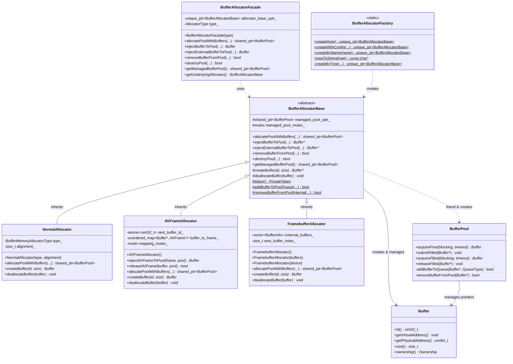
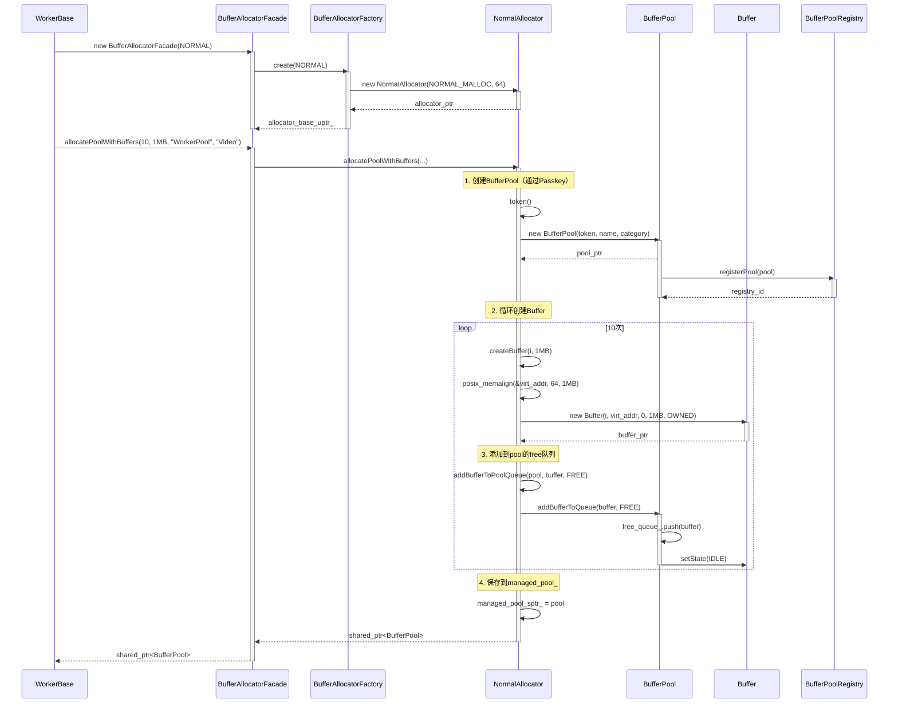
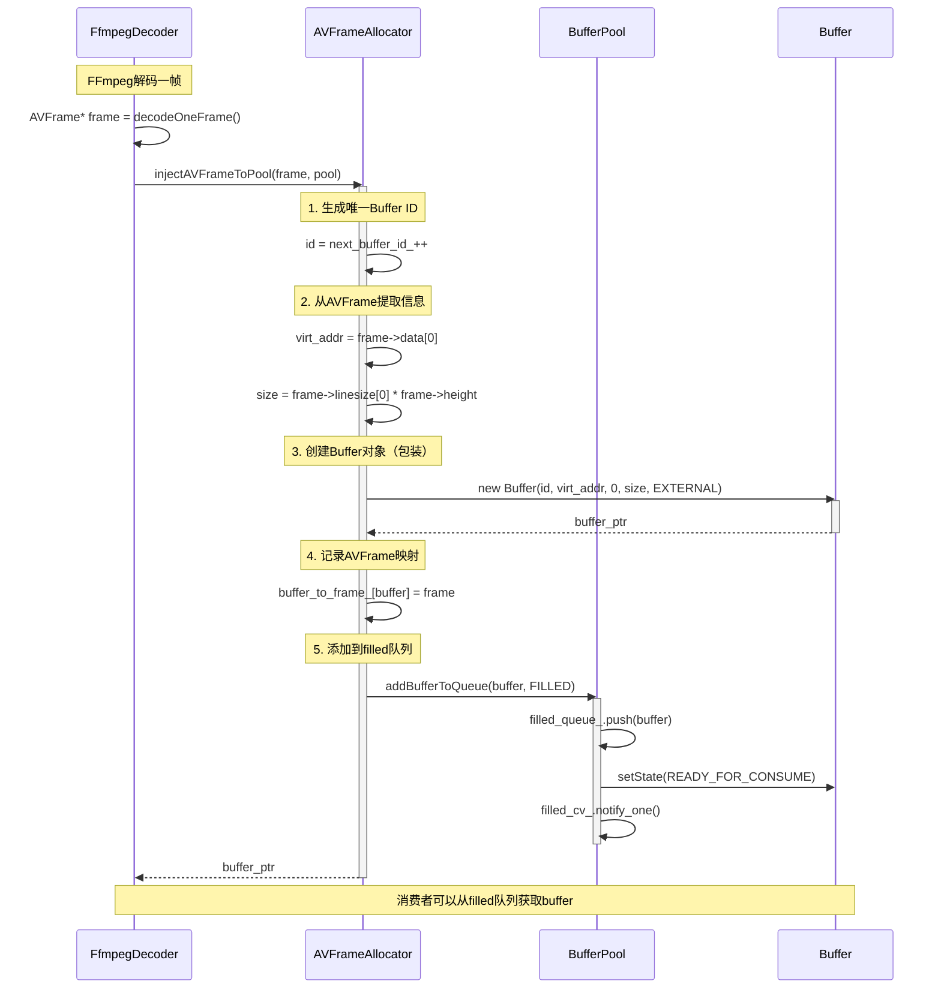
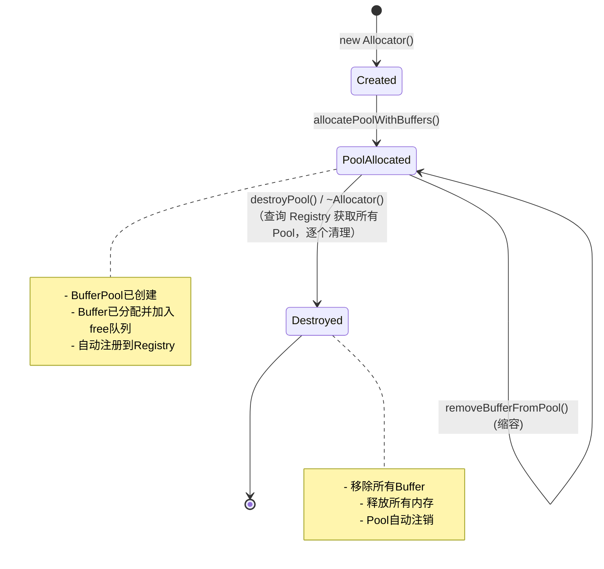

# Allocator子系统设计文档

> **面向人群**: 新入职开发者  
> **文档版本**: v1.0  
> **最后更新**: 2025-01-XX  
> **维护者**: AI SDK Team

---

## 📚 目录

1. [概述](#1-概述)
2. [架构设计](#2-架构设计)
3. [类详细设计](#3-类详细设计)
4. [UML图集](#4-uml图集)
5. [典型使用场景](#5-典型使用场景)
6. [线程安全分析](#6-线程安全分析)
7. [扩展性与最佳实践](#7-扩展性与最佳实践)

---

## 1. 概述

### 1.1 系统定位

**Allocator子系统**是一个**统一接口、多种分配策略的内存管理与Buffer生命周期管理框架**，专为音视频处理场景设计。它提供：

- ✅ **统一接口**：通过`BufferAllocatorBase`抽象基类统一所有Allocator实现
- ✅ **多种分配策略**：支持普通内存、AVFrame包装、Framebuffer外部内存等
- ✅ **自动生命周期管理**：Allocator负责Buffer对象和内存的创建与销毁
- ✅ **工厂模式**：通过`BufferAllocatorFactory`自动选择最优实现
- ✅ **门面模式**：通过`BufferAllocatorFacade`简化使用

### 1.2 核心价值

| 特性 | 传统方案 | Allocator子系统 |
|------|---------|----------------|
| **内存管理** | 手动malloc/free | Allocator统一管理 |
| **Buffer创建** | 手动创建对象 | Allocator自动创建 |
| **生命周期** | 容易泄漏 | RAII自动释放 |
| **多种内存类型** | 各自实现 | 统一接口，可替换 |
| **与BufferPool集成** | 手动管理 | 自动注册和管理 |

### 1.3 设计原则

```
🎯 模板方法模式 (Template Method)
   - BufferAllocatorBase：定义统一流程
   - 子类实现：createBuffer() / deallocateBuffer()
   - 基类提供：allocatePoolWithBuffers() 模板方法

🔌 依赖注入 (DI)
   - Allocator不依赖具体内存分配方式
   - 通过子类实现不同分配策略

🏭 工厂模式 (Factory Pattern)
   - BufferAllocatorFactory统一创建Allocator
   - 支持自动检测和手动指定

🎭 门面模式 (Facade Pattern)
   - BufferAllocatorFacade统一对外接口
   - 隐藏底层实现复杂性

🤝 友元模式 (Friend Pattern)
   - Allocator是BufferPool的友元
   - 可访问BufferPool的私有方法
   - 实现解耦的同时保证协作

🔑 Passkey模式 (Passkey Idiom)
   - 控制BufferPool的创建权限
   - 只有Allocator可以创建BufferPool
```

---

## 2. 架构设计

### 2.1 三层架构图

```
┌─────────────────────────────────────────────────────────────┐
│                  应用层 (Application)                        │
│         Worker, ProductionLine, LinuxFramebufferDevice      │
└───────────────────┬─────────────────────────────────────────┘
                    │ use
                    ▼
┌─────────────────────────────────────────────────────────────┐
│              门面层 (BufferAllocatorFacade)                  │
│  - 统一对外接口                                              │
│  - 隐藏实现细节                                              │
│  - 自动创建Allocator                                         │
└───────────────────┬─────────────────────────────────────────┘
                    │ delegate to
                    ▼
┌─────────────────────────────────────────────────────────────┐
│              工厂层 (BufferAllocatorFactory)                 │
│  - 创建Allocator实例                                         │
│  - 自动选择最优实现                                          │
│  - 配置管理                                                  │
└───────────────────┬─────────────────────────────────────────┘
                    │ create
                    ▼
┌─────────────────────────────────────────────────────────────┐
│              基类层 (BufferAllocatorBase)                    │
│  - 抽象基类（纯虚接口）                                      │
│  - 定义统一接口                                              │
│  - Passkey模式创建BufferPool                                │
│  - BufferPool友元                                           │
└───────────────────┬─────────────────────────────────────────┘
                    │ inherit
                    ▼
┌─────────────────────────────────────────────────────────────┐
│              实现层 (Implementation)                          │
│  - NormalAllocator: 普通内存分配（malloc/posix_memalign）  │
│  - AVFrameAllocator: AVFrame包装分配器（动态注入）          │
│  - FramebufferAllocator: Framebuffer外部内存包装            │
└───────────────────┬─────────────────────────────────────────┘
                    │ create & manage
                    ▼
┌─────────────────────────────────────────────────────────────┐
│              Buffer子系统 (BufferPool & Buffer)              │
│  - BufferPool: Buffer调度器                                 │
│  - Buffer: 元数据容器                                        │
└─────────────────────────────────────────────────────────────┘
```

### 2.2 职责划分

#### 🔹 BufferAllocatorBase - 抽象基类
**职责**: 定义所有Allocator必须实现的统一接口  
**核心能力**:
- `allocatePoolWithBuffers()`: 批量创建Buffer并构建BufferPool（模板方法）
- `injectBufferToPool()`: 创建单个Buffer并注入到Pool（扩容）
- `injectExternalBufferToPool()`: 注入外部内存到Pool（零拷贝）
- `removeBufferFromPool()`: 从Pool移除并销毁Buffer（缩容）
- `destroyPool()`: 销毁整个BufferPool及其所有Buffer
- `createBuffer()`: 纯虚函数，子类实现具体分配逻辑
- `deallocateBuffer()`: 纯虚函数，子类实现具体释放逻辑

#### 🔹 BufferAllocatorFacade - 门面类
**职责**: 为用户提供统一、简单的接口  
**核心能力**:
- 构造时自动创建底层Allocator
- 转发所有方法到底层Allocator
- 隐藏工厂模式的复杂性
- 提供便利方法（如`getManagedBufferPool()`）

#### 🔹 BufferAllocatorFactory - 工厂类
**职责**: 统一创建Allocator实例  
**核心能力**:
- 根据类型创建Allocator
- 封装配置细节（内存类型、对齐大小等）
- 支持自动选择最优实现
- 提供类型转换和名称查询

#### 🔹 NormalAllocator - 普通内存分配器
**职责**: 使用标准C++内存分配（malloc/posix_memalign）  
**核心能力**:
- 分配对齐内存（默认64字节对齐）
- 适合CPU处理的普通数据缓冲
- 不保证物理连续性

#### 🔹 AVFrameAllocator - AVFrame包装分配器
**职责**: 将FFmpeg解码后的AVFrame包装为Buffer对象  
**核心能力**:
- 包装AVFrame为Buffer（零拷贝）
- 动态注入到BufferPool
- 管理AVFrame的生命周期（av_frame_free）
- 适合FFmpeg解码、RTSP流等场景

#### 🔹 FramebufferAllocator - Framebuffer外部内存包装分配器
**职责**: 将外部设备（如framebuffer）提供的已映射内存包装为Buffer  
**核心能力**:
- 包装外部内存为Buffer（不分配新内存）
- 支持物理连续内存
- 不释放外部内存（仅删除Buffer对象）
- 适合Framebuffer设备、DRM/KMS显示等场景

### 2.3 依赖关系

```
BufferAllocatorBase (抽象基类)
    ↑ implements
具体实现类 (NormalAllocator, AVFrameAllocator, FramebufferAllocator)

BufferAllocatorFacade (门面)
    ├── 持有 → BufferAllocatorBase (通过unique_ptr)
    └── 转发 → 所有方法

BufferAllocatorFactory (工厂)
    └── 创建 → BufferAllocatorBase (通过unique_ptr)

BufferAllocatorBase
    ├── 友元 → BufferPool (可访问私有方法)
    ├── 创建 → BufferPool (通过Passkey)
    ├── 持有 → BufferPool (shared_ptr，管理生命周期)
    └── 创建 → Buffer (管理Buffer对象)

BufferPool
    └── 管理 → Buffer* (指针，不拥有对象)

Buffer
    └── 指向 → 内存 (virt_addr, phys_addr)
```

### 2.4 设计模式应用

| 设计模式 | 应用位置 | 目的 |
|---------|---------|------|
| **模板方法模式** | `BufferAllocatorBase::allocatePoolWithBuffers()` | 定义统一流程，子类实现具体步骤 |
| **工厂模式** | `BufferAllocatorFactory` | 统一创建Allocator，封装配置 |
| **门面模式** | `BufferAllocatorFacade` | 简化使用，隐藏实现细节 |
| **Passkey模式** | `BufferAllocatorBase::token()` | 控制BufferPool创建权限 |
| **友元模式** | `BufferAllocatorBase` ↔ `BufferPool` | 解耦的同时保证协作 |
| **策略模式** | 多种Allocator实现 | 可替换的不同内存分配策略 |
| **RAII** | Allocator析构 | 自动释放所有Buffer和内存 |

---

## 3. 类详细设计

### 3.1 BufferAllocatorBase抽象基类

#### 3.1.1 类概述

```cpp
/**
 * @brief BufferAllocatorBase - Buffer分配器基类（纯抽象接口类）
 * 
 * 设计模式：模板方法模式 + 友元模式 + Passkey模式
 * 
 * 职责：
 * - 定义所有Allocator必须实现的接口
 * - 提供模板方法（allocatePoolWithBuffers）
 * - 作为BufferPool的友元，可访问其私有方法
 * - 通过Passkey模式创建BufferPool
 */
class BufferAllocatorBase {
public:
    virtual ~BufferAllocatorBase() = default;
    
    // 纯虚函数接口（子类必须实现）
    virtual std::shared_ptr<BufferPool> allocatePoolWithBuffers(...) = 0;
    virtual Buffer* injectBufferToPool(...) = 0;
    virtual Buffer* injectExternalBufferToPool(...) = 0;
    virtual bool removeBufferFromPool(...) = 0;
    virtual bool destroyPool(...) = 0;
    
protected:
    // 子类必须实现的核心方法
    virtual Buffer* createBuffer(uint32_t id, size_t size) = 0;
    virtual void deallocateBuffer(Buffer* buffer) = 0;
    
    // Passkey模式：获取创建BufferPool的通行证
    static BufferPool::PrivateToken token();
    
    // 友元辅助方法：访问BufferPool私有方法
    static bool addBufferToPoolQueue(BufferPool* pool, Buffer* buffer, QueueType queue);
    static bool removeBufferFromPoolInternal(BufferPool* pool, Buffer* buffer);
};
```

#### 3.1.2 核心方法

##### allocatePoolWithBuffers() - 批量创建Buffer并构建BufferPool（模板方法）

```cpp
/**
 * @brief 批量创建Buffer并构建BufferPool（模板方法）
 * 
 * 工作流程（模板）：
 * 1. 创建空的BufferPool（通过Passkey）
 * 2. 循环创建Buffer（调用子类的createBuffer）
 * 3. 将Buffer添加到pool的free队列
 * 4. Allocator持有shared_ptr（管理生命周期）
 * 5. 自动注册到BufferPoolRegistry
 * 
 * @param count Buffer数量
 * @param size 每个Buffer大小
 * @param name BufferPool名称
 * @param category BufferPool分类
 * @return shared_ptr<BufferPool> 成功返回pool，失败返回nullptr
 * 
 * @note 这是模板方法，定义了统一流程
 * @note 子类只需实现createBuffer()和deallocateBuffer()
 */
virtual std::shared_ptr<BufferPool> allocatePoolWithBuffers(
    int count,
    size_t size,
    const std::string& name,
    const std::string& category = ""
) = 0;
```

**模板方法模式示例**:
```cpp
// 在子类中实现（以NormalAllocator为例）
std::shared_ptr<BufferPool> NormalAllocator::allocatePoolWithBuffers(
    int count, size_t size, const std::string& name, const std::string& category
) {
    // 1. 创建BufferPool（通过Passkey）
    auto pool = std::make_shared<BufferPool>(token(), name, category);
    
    // 2. 循环创建Buffer
    for (int i = 0; i < count; i++) {
        // 调用子类的createBuffer（具体分配逻辑）
        Buffer* buf = createBuffer(i, size);
        if (!buf) {
            // 失败时清理已创建的buffer
            destroyPool(pool.get());
            return nullptr;
        }
        
        // 3. 添加到pool的free队列
        addBufferToPoolQueue(pool.get(), buf, QueueType::FREE);
    }
    
    // 4. 保存到managed_pool_
    {
        std::lock_guard<std::mutex> lock(managed_pool_mutex_);
        managed_pool_sptr_ = pool;
    }
    
    return pool;
}
```

##### injectBufferToPool() - 动态扩容

```cpp
/**
 * @brief 创建单个Buffer并注入到指定BufferPool（内部分配）
 * 
 * 适用场景：
 * - 动态扩容：向已有pool添加新buffer
 * - 内部分配：Allocator自己分配内存
 * 
 * @param size Buffer大小
 * @param pool 目标BufferPool
 * @param queue 注入到哪个队列（FREE或FILLED）
 * @return Buffer* 成功返回buffer，失败返回nullptr
 */
virtual Buffer* injectBufferToPool(
    size_t size,
    BufferPool* pool,
    QueueType queue = QueueType::FREE
) = 0;
```

##### injectExternalBufferToPool() - 零拷贝注入

```cpp
/**
 * @brief 注入外部已分配的内存到BufferPool（外部注入）
 * 
 * 适用场景：
 * - 外部内存包装：将外部已分配的内存包装为Buffer对象
 * - Framebuffer内存：将Framebuffer设备内存注入到Pool
 * - 零拷贝场景：直接使用外部内存，避免拷贝
 * 
 * @param virt_addr 外部内存的虚拟地址（已分配）
 * @param phys_addr 外部内存的物理地址（可选，0表示无）
 * @param size 外部内存的大小（字节）
 * @param pool 目标BufferPool
 * @param queue 注入到哪个队列（FREE或FILLED）
 * @return Buffer* 成功返回buffer，失败返回nullptr
 * 
 * @note Buffer对象的ownership为EXTERNAL
 */
virtual Buffer* injectExternalBufferToPool(
    void* virt_addr,
    uint64_t phys_addr,
    size_t size,
    BufferPool* pool,
    QueueType queue = QueueType::FREE
) = 0;
```

#### 3.1.3 Passkey模式

```cpp
/**
 * @brief 创建BufferPool的通行证Token
 * 
 * 设计模式：Passkey Idiom
 * 
 * 原理：
 * - BufferAllocatorBase是BufferPool::PrivateToken的friend
 * - 子类可以通过这个protected static方法获取Token
 * - 外部无法获取Token
 * 
 * 使用示例：
 * @code
 * // 在子类的allocatePoolWithBuffers()中：
 * auto pool = std::make_shared<BufferPool>(
 *     token(),              // 从基类获取通行证
 *     name,                 // Pool名称
 *     category              // Pool分类
 * );
 * @endcode
 */
static BufferPool::PrivateToken token() {
    return BufferPool::PrivateToken();
}
```

**Passkey模式流程图**:
```
外部代码
  └─[✗]─> new BufferPool()  // ❌ 错误：无法访问私有构造函数

Allocator
  └─[✓]─> token()  // ✅ 获取通行证（protected static）
       └─[✓]─> new BufferPool(token, name, category)  // ✅ 成功
```

#### 3.1.4 友元模式

```cpp
/**
 * @brief 将Buffer添加到BufferPool的指定队列
 * 
 * 友元模式：通过friend关系访问BufferPool的私有方法
 * 
 * @param pool BufferPool指针
 * @param buffer Buffer指针
 * @param queue 队列类型（FREE或FILLED）
 * @return bool 成功返回true
 */
static bool addBufferToPoolQueue(BufferPool* pool, Buffer* buffer, QueueType queue) {
    if (!pool || !buffer) {
        return false;
    }
    // 通过友元关系访问BufferPool的私有方法
    return pool->addBufferToQueue(buffer, queue);
}
```

**友元关系示意图**:
```
BufferAllocatorBase
  ├── friend of BufferPool  // 友元关系
  │
  └── 可以访问：
       ├── BufferPool::addBufferToQueue()     // 私有方法
       └── BufferPool::removeBufferFromPool() // 私有方法

外部代码
  └── ❌ 无法访问BufferPool私有方法
```

---

### 3.2 BufferAllocatorFacade门面类

#### 3.2.1 类概述

```cpp
/**
 * @brief BufferAllocatorFacade - Buffer分配器门面类
 * 
 * 设计模式：门面模式（Facade Pattern）
 * 
 * 职责：
 * - 为用户提供统一、简单的Buffer分配接口
 * - 隐藏底层多种Allocator实现的复杂性
 * - 自动选择最优的Allocator实现
 */
class BufferAllocatorFacade {
private:
    std::unique_ptr<BufferAllocatorBase> allocator_base_uptr_;  // 底层Allocator
    BufferAllocatorFactory::AllocatorType type_;                // 当前类型
    
public:
    // 构造时自动创建底层Allocator
    explicit BufferAllocatorFacade(
        BufferAllocatorFactory::AllocatorType type = AUTO
    );
    
    // 转发所有方法到底层Allocator
    std::shared_ptr<BufferPool> allocatePoolWithBuffers(...);
    Buffer* injectBufferToPool(...);
    Buffer* injectExternalBufferToPool(...);
    bool removeBufferFromPool(...);
    bool destroyPool(...);
    
    // 便利方法
    std::shared_ptr<BufferPool> getManagedBufferPool() const;
    BufferAllocatorBase* getUnderlyingAllocator() const;
};
```

#### 3.2.2 使用示例

```cpp
// 在WorkerBase中使用（最简单的方式）
class WorkerBase {
protected:
    BufferAllocatorFacade allocator_facade_;  // 只需一行声明
    std::shared_ptr<BufferPool> buffer_pool_sptr_;
    
public:
    WorkerBase(BufferAllocatorFactory::AllocatorType type)
        : allocator_facade_(type)  // 构造时自动创建
        , buffer_pool_sptr_(nullptr)
    {
        // 无需其他初始化代码
    }
    
    bool open(const char* path) {
        // 直接使用，无需关心底层类型
        buffer_pool_sptr_ = allocator_facade_.allocatePoolWithBuffers(
            10, frame_size, "WorkerPool", "Video"
        );
        return buffer_pool_sptr_ != nullptr;
    }
};
```

---

### 3.3 BufferAllocatorFactory工厂类

#### 3.3.1 类概述

```cpp
/**
 * @brief BufferAllocatorFactory - Buffer分配器工厂
 * 
 * 设计模式：工厂模式（Factory Pattern）
 * 
 * 职责：
 * - 根据类型创建合适的Allocator实现
 * - 封装配置细节（内存类型、对齐大小等）
 * - 支持自动检测和手动指定
 */
class BufferAllocatorFactory {
public:
    enum class AllocatorType {
        AUTO,           // 自动选择（默认使用NormalAllocator）
        NORMAL,         // NormalAllocator（普通内存分配）
        AVFRAME,        // AVFrameAllocator（FFmpeg AVFrame包装）
        FRAMEBUFFER     // FramebufferAllocator（Framebuffer内存包装）
    };
    
    // 简化版工厂方法（推荐）
    static std::unique_ptr<BufferAllocatorBase> create(
        AllocatorType type = AllocatorType::AUTO
    );
    
    // 完整版工厂方法（特殊配置需求）
    static std::unique_ptr<BufferAllocatorBase> createWithConfig(
        AllocatorType type,
        BufferMemoryAllocatorType mem_type,
        size_t alignment
    );
};
```

#### 3.3.2 配置策略

```cpp
/**
 * @brief 工厂配置策略（内部决定）
 * 
 * 配置原则：
 * - 每种类型使用最优的默认配置
 * - 上层无需关心配置细节
 * - 符合"高层不依赖底层实现细节"的设计原则
 */
std::unique_ptr<BufferAllocatorBase> BufferAllocatorFactory::create(
    AllocatorType type
) {
    switch (type) {
        case AllocatorType::NORMAL:
            // NORMAL: NORMAL_MALLOC + 64字节对齐
            return std::make_unique<NormalAllocator>(
                BufferMemoryAllocatorType::NORMAL_MALLOC,
                64  // 默认64字节对齐
            );
            
        case AllocatorType::AVFRAME:
            // AVFRAME: AVFrameAllocator默认配置
            return std::make_unique<AVFrameAllocator>();
            
        case AllocatorType::FRAMEBUFFER:
            // FRAMEBUFFER: FramebufferAllocator默认配置
            return std::make_unique<FramebufferAllocator>();
            
        case AllocatorType::AUTO:
        default:
            // AUTO: 默认使用NORMAL
            return create(AllocatorType::NORMAL);
    }
}
```

---

### 3.4 具体实现类

#### 3.4.1 NormalAllocator

**功能**: 使用标准C++内存分配（malloc/posix_memalign）

**特点**:
- 虚拟内存：是
- 物理地址：否（phys_addr = 0）
- 连续性：不保证物理连续
- 对齐：支持（默认64字节）

**适用场景**:
- CPU处理的普通数据缓冲
- 不需要DMA访问的场景
- Raw视频文件Worker

**核心实现**:
```cpp
Buffer* NormalAllocator::createBuffer(uint32_t id, size_t size) {
    void* virt_addr = nullptr;
    
    // 使用posix_memalign分配对齐内存
    int ret = posix_memalign(&virt_addr, alignment_, size);
    if (ret != 0 || !virt_addr) {
        return nullptr;
    }
    
    // 创建Buffer对象（phys_addr = 0）
    return new Buffer(id, virt_addr, 0, size, Buffer::Ownership::OWNED);
}

void NormalAllocator::deallocateBuffer(Buffer* buffer) {
    if (buffer) {
        if (buffer->ownership() == Buffer::Ownership::OWNED) {
            // 释放内存
            free(buffer->getVirtualAddress());
        }
        // 删除Buffer对象
        delete buffer;
    }
}
```

#### 3.4.2 AVFrameAllocator

**功能**: 将FFmpeg解码后的AVFrame包装为Buffer对象

**特点**:
- 虚拟内存：AVFrame->data[0]（FFmpeg分配）
- 物理地址：0（AVFrame不提供物理地址）
- 连续性：不保证
- 动态注入：支持

**适用场景**:
- FFmpeg视频解码
- RTSP流解码
- 需要动态创建Buffer的场景

**核心实现**:
```cpp
Buffer* AVFrameAllocator::injectAVFrameToPool(AVFrame* frame, BufferPool* pool) {
    if (!frame || !pool) {
        return nullptr;
    }
    
    // 1. 生成唯一Buffer ID
    uint32_t id = next_buffer_id_++;
    
    // 2. 从AVFrame提取虚拟地址和大小
    void* virt_addr = frame->data[0];
    size_t size = frame->linesize[0] * frame->height;
    
    // 3. 创建Buffer对象（Ownership::EXTERNAL）
    Buffer* buf = new Buffer(id, virt_addr, 0, size, Buffer::Ownership::EXTERNAL);
    
    // 4. 记录AVFrame和Buffer的映射（用于释放）
    {
        std::lock_guard<std::mutex> lock(mapping_mutex_);
        buffer_to_frame_[buf] = frame;
    }
    
    // 5. 添加到pool的filled队列
    addBufferToPoolQueue(pool, buf, QueueType::FILLED);
    
    return buf;
}

void AVFrameAllocator::deallocateBuffer(Buffer* buffer) {
    if (buffer) {
        // 1. 查找并释放AVFrame
        {
            std::lock_guard<std::mutex> lock(mapping_mutex_);
            auto it = buffer_to_frame_.find(buffer);
            if (it != buffer_to_frame_.end()) {
                av_frame_free(&it->second);
                buffer_to_frame_.erase(it);
            }
        }
        
        // 2. 删除Buffer对象
        delete buffer;
    }
}
```

#### 3.4.3 FramebufferAllocator

**功能**: 将外部设备（如framebuffer）提供的已映射内存包装为Buffer

**特点**:
- 虚拟内存：由调用者提供（已mmap）
- 物理地址：由调用者提供（可选）
- 连续性：通常是物理连续的
- 不分配：不分配新内存，只包装

**适用场景**:
- Framebuffer设备内存
- DRM/KMS显示内存
- GPU共享内存

**核心实现**:
```cpp
// 构造函数：从LinuxFramebufferDevice构造
FramebufferAllocator::FramebufferAllocator(LinuxFramebufferDevice* device) {
    // 从device获取已映射的内存信息
    external_buffers_ = buildBufferInfosFromDevice(device);
}

Buffer* FramebufferAllocator::createBuffer(uint32_t id, size_t size) {
    // 从external_buffers_获取预先映射的内存
    if (id >= external_buffers_.size()) {
        return nullptr;
    }
    
    const auto& info = external_buffers_[id];
    
    // 创建Buffer对象（包装外部内存，Ownership::EXTERNAL）
    return new Buffer(
        id,
        info.virt_addr,
        info.phys_addr,
        info.size,
        Buffer::Ownership::EXTERNAL
    );
}

void FramebufferAllocator::deallocateBuffer(Buffer* buffer) {
    if (buffer) {
        // 不释放内存（外部管理）
        // 仅删除Buffer对象
        delete buffer;
    }
}
```

---

## 4. UML图集

### 4.1 类图（Class Diagram）



**关键关系说明**:

| 关系符号 | 含义 | 示例 |
|---------|------|------|
| `<|--` | 继承 | `NormalAllocator`继承`BufferAllocatorBase` |
| `..>` | 依赖 | `BufferAllocatorFactory`创建`BufferAllocatorBase` |
| `-->` | 组合 | `BufferAllocatorBase`创建和管理`Buffer` |
| `friend` | 友元 | `BufferAllocatorBase`是`BufferPool`的友元 |

---

### 4.2 时序图（Sequence Diagrams）

#### 场景1：创建BufferPool并批量分配Buffer



---

#### 场景2：动态注入AVFrame到BufferPool



---

#### 场景3：销毁BufferPool

```mermaid
sequenceDiagram
    participant App as 应用代码
    participant Allocator as NormalAllocator
    participant Pool as BufferPool
    participant Buffer as Buffer
    participant Registry as BufferPoolRegistry
    
    App->>Allocator: destroyPool(pool_id)
    activate Allocator
    
    Note over Allocator: 1. 通过友元获取 Pool
    Allocator->>Registry: getPoolSpecialForAllocator(pool_id) (private, friend access)
    activate Registry
    Registry-->>Allocator: pool (shared_ptr)
    deactivate Registry
    
    Allocator->>Pool: getTotalCount()
    activate Pool
    Pool-->>Allocator: count
    deactivate Pool
    
    Note over Allocator: 2. 移除并销毁所有buffer
    loop 每个buffer
        Allocator->>Pool: removeBufferFromPool(pool_id, buffer)
        activate Pool
        Pool->>Pool: 检查buffer状态（必须是IDLE）
        Pool->>Pool: managed_buffers_.erase(buffer)
        Pool->>Pool: free_queue_中移除
        Pool-->>Allocator: true
        deactivate Pool
        
        Allocator->>Allocator: deallocateBuffer(buffer)
        Allocator->>Buffer: delete buffer
        activate Buffer
        Buffer->>Buffer: free(virt_addr_)
        destroy Buffer
        deactivate Buffer
    end
    
    Note over Allocator: 3. 从 Registry 注销（私有方法，友元访问）
    Allocator->>Registry: unregisterPool(pool_id) (private, friend access)
    activate Registry
    Registry->>Registry: pools_.erase(id)
    Note over Registry: ✅ 释放 shared_ptr<br/>引用计数 -1 → 0
    Registry->>Pool: ~BufferPool()
    Note over Pool: BufferPool 析构<br/>（不再调用 unregisterPool）
    destroy Pool
    deactivate Registry
    
    Allocator-->>App: true
    deactivate Allocator
```

---

### 4.3 状态图（State Diagram）

#### Allocator生命周期图



---

## 5. 典型使用场景

### 5.1 场景：NormalAllocator - 普通内存分配

```cpp
#include "buffer/allocator/facade/BufferAllocatorFacade.hpp"

int main() {
    // 1. 创建Allocator门面（指定类型）
    BufferAllocatorFacade allocator(
        BufferAllocatorFactory::AllocatorType::NORMAL
    );
    
    // 2. 批量创建Buffer并构建BufferPool
    auto pool = allocator.allocatePoolWithBuffers(
        10,                  // 10个Buffer
        1920 * 1080 * 4,    // 每个8MB（1080p RGBA）
        "VideoPool",         // Pool名称
        "Video"              // Pool分类
    );
    
    if (!pool) {
        printf("❌ Failed to create BufferPool\n");
        return -1;
    }
    
    printf("✅ BufferPool created successfully\n");
    printf("   Total Buffers: %d\n", pool->getTotalCount());
    printf("   Free Buffers:  %d\n", pool->getFreeCount());
    
    // 3. 使用BufferPool
    Buffer* buf = pool->acquireFree(true, -1);
    if (buf) {
        printf("✅ Acquired buffer #%u\n", buf->id());
        
        // 填充数据
        memset(buf->getVirtualAddress(), 0xFF, buf->size());
        
        // 提交到filled队列
        pool->submitFilled(buf);
    }
    
    // 4. 销毁（可选，析构函数会自动清理）
    allocator.destroyPool(pool.get());
    
    return 0;
}
```

---

### 5.2 场景：AVFrameAllocator - FFmpeg解码动态注入

```cpp
#include "buffer/allocator/implementation/AVFrameAllocator.hpp"

extern "C" {
#include <libavcodec/avcodec.h>
}

class FFmpegDecoder {
private:
    std::unique_ptr<AVFrameAllocator> allocator_;
    std::shared_ptr<BufferPool> pool_;
    
public:
    FFmpegDecoder() {
        // 1. 创建AVFrameAllocator
        allocator_ = std::make_unique<AVFrameAllocator>();
        
        // 2. 创建空的BufferPool（动态注入模式）
        pool_ = allocator_->allocatePoolWithBuffers(
            0, 0,           // count和size无意义（动态注入）
            "RTSP_Pool",
            "RTSP"
        );
    }
    
    void decodeLoop() {
        while (running_) {
            // 1. 解码一帧
            AVFrame* frame = decodeOneFrame();
            if (!frame) {
                continue;
            }
            
            // 2. 动态注入到BufferPool（零拷贝）
            Buffer* buf = allocator_->injectAVFrameToPool(frame, pool_.get());
            if (!buf) {
                av_frame_free(&frame);
                continue;
            }
            
            printf("✅ Injected AVFrame as Buffer #%u\n", buf->id());
            
            // 注意：
            // - Buffer已在filled队列中
            // - 消费者可以直接acquireFilled()获取
            // - AVFrame生命周期由Allocator管理
        }
    }
    
    AVFrame* decodeOneFrame() {
        // FFmpeg解码逻辑
        AVFrame* frame = av_frame_alloc();
        // ... avcodec_receive_frame() ...
        return frame;
    }
};
```

---

### 5.3 场景：FramebufferAllocator - Framebuffer设备内存包装

```cpp
#include "buffer/allocator/implementation/FramebufferAllocator.hpp"
#include "display/LinuxFramebufferDevice.hpp"

int main() {
    // 1. 初始化Framebuffer设备
    auto fb_device = std::make_unique<LinuxFramebufferDevice>();
    if (!fb_device->initialize(0)) {  // /dev/fb0
        printf("❌ Failed to initialize framebuffer device\n");
        return -1;
    }
    
    // 2. 创建FramebufferAllocator（从设备构造）
    auto allocator = std::make_unique<FramebufferAllocator>(fb_device.get());
    
    // 3. 创建BufferPool（包装Framebuffer内存）
    auto pool = allocator->allocatePoolWithBuffers(
        0, 0,           // count和size由device决定
        "FBPool",
        "Display"
    );
    
    if (!pool) {
        printf("❌ Failed to create BufferPool\n");
        return -1;
    }
    
    printf("✅ BufferPool created from Framebuffer device\n");
    printf("   Total Buffers: %d\n", pool->getTotalCount());
    
    // 4. 设置BufferPool到设备
    fb_device->setBufferPool(pool.get());
    
    // 5. 使用（显示）
    Buffer* buf = pool->acquireFree(true, -1);
    if (buf) {
        // 渲染到Framebuffer
        renderFrame(buf->getVirtualAddress(), buf->size());
        
        // 提交显示
        pool->submitFilled(buf);
        fb_device->flip();  // 切换显示buffer
    }
    
    return 0;
}
```

---

### 5.4 场景：与Worker集成

```cpp
#include "productionline/worker/base/WorkerBase.hpp"

class FfmpegDecodeVideoFileWorker : public WorkerBase {
public:
    FfmpegDecodeVideoFileWorker()
        : WorkerBase(BufferAllocatorFactory::AllocatorType::AVFRAME)
        // 父类自动创建AVFRAME类型的allocator_facade_
    {
    }
    
    bool open(const char* path) override {
        // 1. 打开视频文件
        if (!openVideo(path)) {
            return false;
        }
        
        // 2. 计算帧大小
        size_t frame_size = output_width_ * output_height_ * output_bpp_ / 8;
        
        // 3. 使用allocator_facade_创建BufferPool
        buffer_pool_sptr_ = allocator_facade_.allocatePoolWithBuffers(
            4,                  // 4个Buffer
            frame_size,
            std::string("FFmpegDecoder_") + std::string(path),
            "Video"
        );
        
        if (!buffer_pool_sptr_) {
            printf("❌ Failed to create BufferPool\n");
            closeVideo();
            return false;
        }
        
        printf("✅ Worker opened successfully\n");
        printf("   BufferPool: %s\n", buffer_pool_sptr_->getName().c_str());
        printf("   Buffer Count: %d\n", buffer_pool_sptr_->getTotalCount());
        
        return true;
    }
    
    std::unique_ptr<BufferPool> getOutputBufferPool() override {
        if (!buffer_pool_sptr_) {
            return nullptr;
        }
        
        // 转移所有权给ProductionLine
        BufferPool* raw_ptr = buffer_pool_sptr_.get();
        buffer_pool_sptr_.reset();
        return std::unique_ptr<BufferPool>(raw_ptr);
    }
};
```

---

## 6. 线程安全分析

### 6.1 Allocator线程安全策略

#### 6.1.1 BufferAllocatorBase

```cpp
class BufferAllocatorBase {
protected:
    std::shared_ptr<BufferPool> managed_pool_sptr_;
    mutable std::mutex managed_pool_mutex_;  // 保护managed_pool_
};
```

**线程安全保证**:
- ✅ `getManagedBufferPool()`: 加锁保护，线程安全
- ✅ BufferPool操作：所有操作通过BufferPool接口，BufferPool内部加锁
- ⚠️ 子类实现：需要确保`createBuffer()`和`deallocateBuffer()`的线程安全

#### 6.1.2 AVFrameAllocator

```cpp
class AVFrameAllocator : public BufferAllocatorBase {
private:
    std::atomic<uint32_t> next_buffer_id_;  // 原子操作，线程安全
    
    std::unordered_map<Buffer*, AVFrame*> buffer_to_frame_;
    std::mutex mapping_mutex_;  // 保护buffer_to_frame_
};
```

**线程安全策略**:
- ✅ **原子ID生成**: `next_buffer_id_`使用`atomic`，无需加锁
- ✅ **映射表保护**: `buffer_to_frame_`使用`mapping_mutex_`保护
- ✅ **BufferPool操作**: 通过友元方法访问，BufferPool内部加锁

**示例（正确）**:
```cpp
Buffer* AVFrameAllocator::injectAVFrameToPool(AVFrame* frame, BufferPool* pool) {
    // 1. 原子操作，线程安全
    uint32_t id = next_buffer_id_++;
    
    // 2. 创建Buffer
    Buffer* buf = new Buffer(id, frame->data[0], 0, size, Buffer::Ownership::EXTERNAL);
    
    // 3. 加锁保护映射表
    {
        std::lock_guard<std::mutex> lock(mapping_mutex_);
        buffer_to_frame_[buf] = frame;
    }
    
    // 4. BufferPool操作（内部加锁）
    addBufferToPoolQueue(pool, buf, QueueType::FILLED);
    
    return buf;
}
```

---

### 6.2 BufferPool访问的线程安全

**Allocator与BufferPool的协作**:

```cpp
// 生产者线程（Allocator动态注入）
void decoderThread(AVFrameAllocator* allocator, BufferPool* pool) {
    while (running) {
        AVFrame* frame = decodeOneFrame();
        if (!frame) break;
        
        // 线程安全：内部加锁
        Buffer* buf = allocator->injectAVFrameToPool(frame, pool);
        
        // Buffer已在filled队列，消费者可直接获取
    }
}

// 消费者线程（显示）
void displayThread(BufferPool* pool) {
    while (running) {
        // 线程安全：BufferPool内部加锁
        Buffer* buf = pool->acquireFilled(true, -1);
        if (!buf) break;
        
        // 显示
        display(buf->getVirtualAddress(), buf->size());
        
        // 线程安全：BufferPool内部加锁
        pool->releaseFilled(buf);
    }
}
```

**关键点**:
- ✅ `BufferPool`的所有接口都是线程安全的（内部使用`mutex`保护）
- ✅ Allocator通过友元方法访问BufferPool私有方法时，仍受BufferPool内部锁保护
- ✅ 多线程可以安全地同时调用`injectBufferToPool()`和`acquireFilled()`

---

## 7. 扩展性与最佳实践

### 7.1 如何扩展新的Allocator实现

假设你需要支持**GPU内存分配器**（CUDA），步骤如下：

#### 步骤1：继承BufferAllocatorBase

```cpp
// CudaAllocator.hpp
#include "buffer/allocator/base/BufferAllocatorBase.hpp"
#include <cuda_runtime.h>

class CudaAllocator : public BufferAllocatorBase {
public:
    CudaAllocator() = default;
    ~CudaAllocator() override = default;
    
    // 实现基类纯虚函数
    std::shared_ptr<BufferPool> allocatePoolWithBuffers(
        int count, size_t size, const std::string& name, const std::string& category
    ) override {
        // 1. 创建BufferPool（通过Passkey）
        auto pool = std::make_shared<BufferPool>(token(), name, category);
        
        // 2. 循环创建Buffer
        for (int i = 0; i < count; i++) {
            Buffer* buf = createBuffer(i, size);
            if (!buf) {
                destroyPool(pool.get());
                return nullptr;
            }
            addBufferToPoolQueue(pool.get(), buf, QueueType::FREE);
        }
        
        // 3. 保存到managed_pool_
        {
            std::lock_guard<std::mutex> lock(managed_pool_mutex_);
            managed_pool_sptr_ = pool;
        }
        
        return pool;
    }
    
    Buffer* injectBufferToPool(
        size_t size, BufferPool* pool, QueueType queue
    ) override {
        // 扩容逻辑
        uint32_t id = pool->getTotalCount();
        Buffer* buf = createBuffer(id, size);
        if (!buf) return nullptr;
        
        addBufferToPoolQueue(pool, buf, queue);
        return buf;
    }
    
    // ... 其他接口实现
    
protected:
    // 核心：CUDA内存分配
    Buffer* createBuffer(uint32_t id, size_t size) override {
        void* device_ptr = nullptr;
        cudaError_t err = cudaMalloc(&device_ptr, size);
        
        if (err != cudaSuccess) {
            return nullptr;
        }
        
        // CUDA内存没有"物理地址"概念，使用device pointer值
        uint64_t pseudo_phys = reinterpret_cast<uint64_t>(device_ptr);
        
        return new Buffer(id, device_ptr, pseudo_phys, size, Buffer::Ownership::OWNED);
    }
    
    // 核心：CUDA内存释放
    void deallocateBuffer(Buffer* buffer) override {
        if (buffer) {
            if (buffer->ownership() == Buffer::Ownership::OWNED) {
                cudaFree(buffer->getVirtualAddress());
            }
            delete buffer;
        }
    }
};
```

#### 步骤2：在Factory中注册

```cpp
// BufferAllocatorFactory.cpp
#include "CudaAllocator.hpp"

std::unique_ptr<BufferAllocatorBase> BufferAllocatorFactory::create(
    AllocatorType type
) {
    switch (type) {
        case AllocatorType::NORMAL:
            return std::make_unique<NormalAllocator>(...);
        
        case AllocatorType::CUDA:  // 新增
            return std::make_unique<CudaAllocator>();
        
        // ...
    }
}
```

#### 步骤3：更新枚举

```cpp
// BufferAllocatorFactory.hpp
enum class AllocatorType {
    AUTO,
    NORMAL,
    AVFRAME,
    FRAMEBUFFER,
    CUDA            // 新增
};
```

#### 步骤4：使用

```cpp
// 创建CUDA Allocator
BufferAllocatorFacade allocator(
    BufferAllocatorFactory::AllocatorType::CUDA
);

auto pool = allocator.allocatePoolWithBuffers(
    10,
    1920 * 1080 * 4,
    "GpuPool",
    "GPU"
);

// 使用（需要CUDA kernel处理）
Buffer* buf = pool->acquireFree(true, -1);
launchCudaKernel<<<grid, block>>>(buf->getVirtualAddress(), buf->size());
pool->submitFilled(buf);
```

---

### 7.2 性能优化建议

#### 优化1：选择合适的Allocator类型

```cpp
// ❌ 不好：FFmpeg Worker使用NORMAL Allocator（需要额外拷贝）
BufferAllocatorFacade allocator(BufferAllocatorFactory::AllocatorType::NORMAL);

// ✅ 更好：FFmpeg Worker使用AVFRAME Allocator（零拷贝）
BufferAllocatorFacade allocator(BufferAllocatorFactory::AllocatorType::AVFRAME);
```

#### 优化2：使用合适的内存对齐

```cpp
// ❌ 不好：没有对齐（可能影响性能）
auto allocator = std::make_unique<NormalAllocator>(
    BufferMemoryAllocatorType::NORMAL_MALLOC,
    1  // 1字节对齐
);

// ✅ 更好：64字节对齐（利用缓存行）
auto allocator = std::make_unique<NormalAllocator>(
    BufferMemoryAllocatorType::NORMAL_MALLOC,
    64  // 64字节对齐
);
```

#### 优化3：预分配足够的Buffer

```cpp
// ❌ 不好：Buffer数量太少，频繁动态注入
auto pool = allocator.allocatePoolWithBuffers(2, size, ...);

// ✅ 更好：预分配足够的Buffer
int producer_count = 2;
int consumer_count = 1;
int buffer_count = producer_count + consumer_count + 2;  // 5个
auto pool = allocator.allocatePoolWithBuffers(buffer_count, size, ...);
```

---

### 7.3 常见陷阱

#### 陷阱1：忘记销毁BufferPool

```cpp
// ❌ 错误：Allocator持有shared_ptr，但未显式销毁
{
    BufferAllocatorFacade allocator;
    auto pool = allocator.allocatePoolWithBuffers(...);
    // ... 使用pool ...
}  // allocator析构，但pool的shared_ptr可能仍被其他地方持有

// ✅ 正确：显式销毁或确保shared_ptr引用计数正确
{
    BufferAllocatorFacade allocator;
    auto pool = allocator.allocatePoolWithBuffers(...);
    // ... 使用pool ...
    allocator.destroyPool(pool.get());  // 显式销毁
}
```

#### 陷阱2：混淆OWNED和EXTERNAL所有权

```cpp
// ❌ 错误：外部内存使用OWNED（会导致double free）
void* external_mem = get_from_hardware();
Buffer* buf = new Buffer(0, external_mem, 0, size, Buffer::Ownership::OWNED);
// Allocator析构时会尝试free(external_mem) → 崩溃！

// ✅ 正确：外部内存使用EXTERNAL
void* external_mem = get_from_hardware();
Buffer* buf = new Buffer(0, external_mem, 0, size, Buffer::Ownership::EXTERNAL);
// Allocator析构时不会释放external_mem
```

#### 陷阱3：AVFrameAllocator忘记释放AVFrame

```cpp
// ❌ 错误：只删除Buffer，不释放AVFrame
Buffer* buf = allocator->injectAVFrameToPool(frame, pool);
delete buf;  // ❌ AVFrame泄漏！

// ✅ 正确：通过Allocator的deallocateBuffer释放
allocator->removeBufferFromPool(buf, pool);  // 内部会调用deallocateBuffer
// 或
allocator->releaseAVFrame(buf, pool);  // 专用方法
```

#### 陷阱4：多线程创建Buffer

```cpp
// ❌ 错误：多线程同时调用createBuffer（如果子类不是线程安全的）
// 线程1
Buffer* buf1 = allocator->createBuffer(0, size);

// 线程2
Buffer* buf2 = allocator->createBuffer(1, size);

// ✅ 正确：通过BufferPool的线程安全接口
// 线程1
Buffer* buf1 = allocator->injectBufferToPool(size, pool);  // 内部加锁

// 线程2
Buffer* buf2 = allocator->injectBufferToPool(size, pool);  // 内部加锁
```

---

### 7.4 调试技巧

#### 技巧1：启用详细日志

```cpp
// 在开发阶段，打印所有Allocator操作
class DebugAllocator : public NormalAllocator {
    Buffer* createBuffer(uint32_t id, size_t size) override {
        printf("🔍 [Allocator] createBuffer(id=%u, size=%zu)\n", id, size);
        Buffer* buf = NormalAllocator::createBuffer(id, size);
        if (buf) {
            printf("   ✅ Buffer created: virt=%p, size=%zu\n",
                   buf->getVirtualAddress(), buf->size());
        } else {
            printf("   ❌ Failed to create buffer\n");
        }
        return buf;
    }
    
    void deallocateBuffer(Buffer* buffer) override {
        printf("🔍 [Allocator] deallocateBuffer(id=%u, virt=%p)\n",
               buffer->id(), buffer->getVirtualAddress());
        NormalAllocator::deallocateBuffer(buffer);
        printf("   ✅ Buffer deallocated\n");
    }
};
```

#### 技巧2：检查BufferPool状态

```cpp
void checkPoolHealth(BufferPool* pool) {
    printf("📊 BufferPool Status:\n");
    printf("   Name:         %s\n", pool->getName().c_str());
    printf("   Total:        %d\n", pool->getTotalCount());
    printf("   Free:         %d\n", pool->getFreeCount());
    printf("   Filled:       %d\n", pool->getFilledCount());
    printf("   In Use:       %d\n",
           pool->getTotalCount() - pool->getFreeCount() - pool->getFilledCount());
    
    // 健康检查
    if (pool->getFreeCount() == 0) {
        printf("   ⚠️  Warning: No free buffers (may block producer)\n");
    }
    if (pool->getFilledCount() == 0) {
        printf("   ⚠️  Warning: No filled buffers (may block consumer)\n");
    }
}
```

#### 技巧3：内存泄漏检测

```cpp
// 使用valgrind检测内存泄漏
$ valgrind --leak-check=full --show-leak-kinds=all ./your_app

// 或使用AddressSanitizer
$ g++ -fsanitize=address -g your_app.cpp -o your_app
$ ./your_app

// 检查点：
// 1. Allocator析构时是否释放了所有Buffer
// 2. BufferPool析构时是否从Registry注销
// 3. AVFrameAllocator是否释放了所有AVFrame
```

#### 技巧4：使用GDB调试

```bash
# GDB命令
(gdb) p allocator->getManagedBufferPool()
(gdb) p pool->getTotalCount()
(gdb) p pool->getFreeCount()

# 检查Buffer
(gdb) p buffer->id()
(gdb) p buffer->getVirtualAddress()
(gdb) p buffer->ownership()

# AVFrameAllocator：检查映射表
(gdb) p allocator->buffer_to_frame_.size()
```

---

## 8. 总结

### 8.1 核心概念回顾

| 概念 | 说明 |
|-----|------|
| **BufferAllocatorBase** | 抽象基类，定义统一接口，模板方法模式 |
| **BufferAllocatorFacade** | 门面类，简化使用，自动创建Allocator |
| **BufferAllocatorFactory** | 工厂类，统一创建Allocator，封装配置 |
| **NormalAllocator** | 普通内存分配器（malloc/posix_memalign） |
| **AVFrameAllocator** | AVFrame包装分配器（动态注入，零拷贝） |
| **FramebufferAllocator** | Framebuffer外部内存包装分配器 |
| **Passkey模式** | 控制BufferPool创建权限 |
| **友元模式** | Allocator与BufferPool解耦协作 |
| **模板方法模式** | 定义统一流程，子类实现具体步骤 |

### 8.2 最佳实践清单

- ✅ 通过`BufferAllocatorFacade`使用Allocator（不要直接使用实现类）
- ✅ 根据场景选择合适的Allocator类型（NORMAL/AVFRAME/FRAMEBUFFER）
- ✅ 使用模板方法模式扩展新的Allocator（只需实现createBuffer和deallocateBuffer）
- ✅ 注意OWNED和EXTERNAL所有权的区别
- ✅ AVFrameAllocator必须通过Allocator释放（av_frame_free）
- ✅ Allocator析构时会自动清理所有Buffer和内存（RAII）
- ✅ 多线程访问时通过BufferPool的线程安全接口
- ✅ 使用Passkey模式确保BufferPool只能由Allocator创建

### 8.3 下一步学习

- 📖 阅读`Buffer子系统设计文档`（理解Buffer和BufferPool）
- 📖 阅读`Worker子系统设计文档`（理解Allocator与Worker的集成）
- 🛠️ 实现自己的Allocator（如GPU内存、共享内存）
- 🧪 编写性能测试（比较不同Allocator实现的性能）
- 📊 集成性能监控工具（如Valgrind、AddressSanitizer）

---

## 附录A：快速参考

### 创建Allocator

```cpp
#include "buffer/allocator/facade/BufferAllocatorFacade.hpp"

// 方式1：指定类型
BufferAllocatorFacade allocator(
    BufferAllocatorFactory::AllocatorType::NORMAL
);

// 方式2：自动选择
BufferAllocatorFacade allocator(
    BufferAllocatorFactory::AllocatorType::AUTO
);
```

### 创建BufferPool

```cpp
auto pool = allocator.allocatePoolWithBuffers(
    10,                  // Buffer数量
    1920 * 1080 * 4,    // 每个Buffer大小
    "MyPool",            // Pool名称
    "Video"              // Pool分类
);
```

### 动态注入（AVFrame）

```cpp
AVFrame* frame = decodeOneFrame();
Buffer* buf = allocator->injectAVFrameToPool(frame, pool.get());
```

### 销毁Pool

```cpp
allocator.destroyPool(pool.get());
```

---

## 附录B：常见问题FAQ

**Q: Allocator什么时候创建BufferPool？**  
A: 调用`allocatePoolWithBuffers()`时创建。Allocator持有`shared_ptr`管理生命周期。

**Q: 为什么需要Passkey模式？**  
A: 确保BufferPool只能由Allocator创建，防止外部随意创建，保证生命周期管理的一致性。

**Q: 什么时候使用OWNED，什么时候使用EXTERNAL？**  
A: 
- OWNED: Allocator分配的内存（如malloc），Allocator负责释放
- EXTERNAL: 外部提供的内存（如Framebuffer、AVFrame），Allocator不释放

**Q: AVFrameAllocator为什么需要映射表？**  
A: 记录Buffer和AVFrame的对应关系，销毁Buffer时能找到并释放对应的AVFrame（av_frame_free）。

**Q: Allocator是线程安全的吗？**  
A: 取决于实现。通过BufferPool接口操作是线程安全的（BufferPool内部加锁），但直接调用`createBuffer()`可能不安全。

**Q: 如何扩展新的Allocator？**  
A: 继承`BufferAllocatorBase`，实现`createBuffer()`和`deallocateBuffer()`，然后在Factory中注册。

---

**文档结束** 🎉

> 如有疑问，请联系 AI SDK Team  
> 邮箱: ai-sdk@example.com  
> Wiki: https://wiki.example.com/allocator-system


