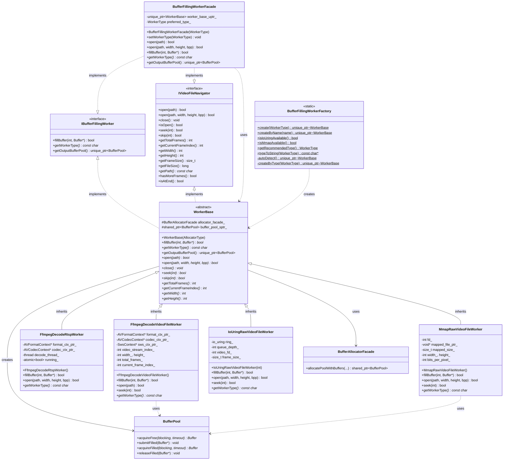
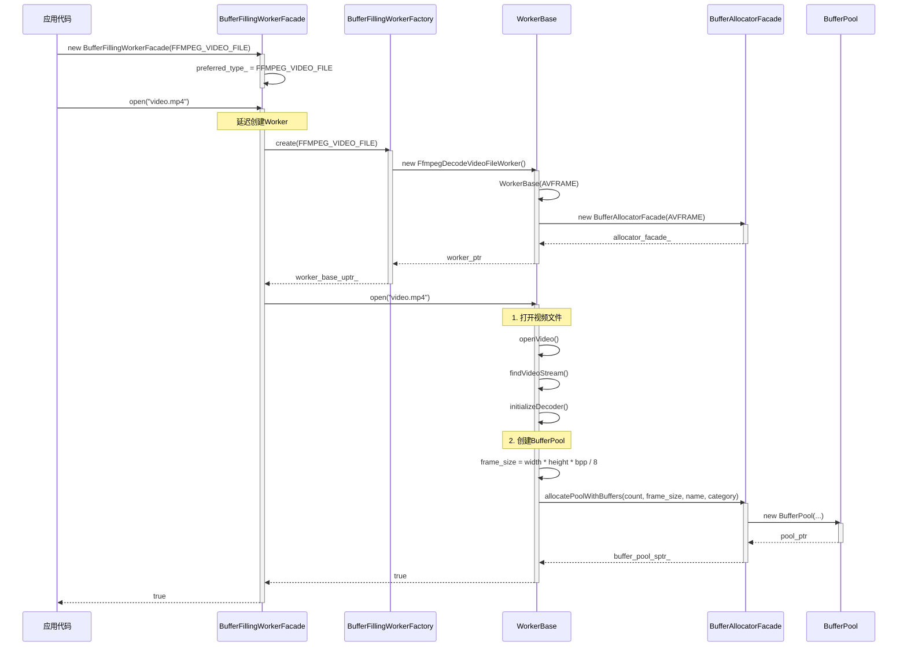
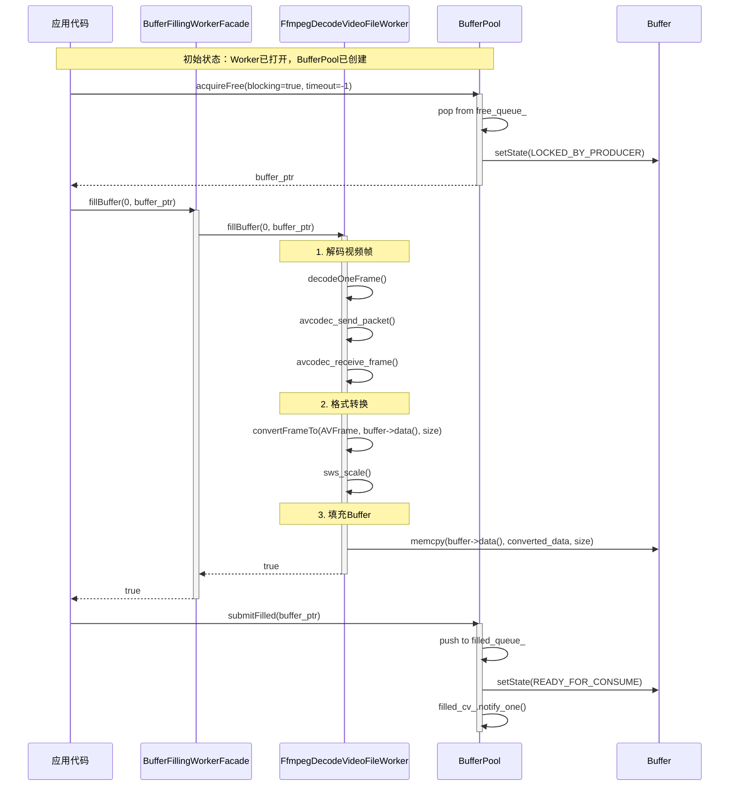
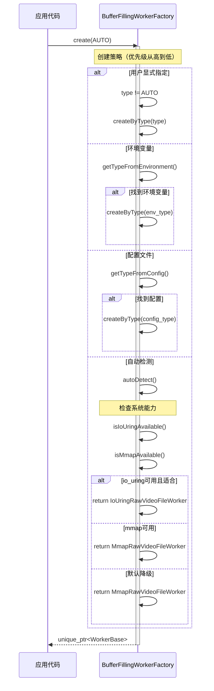
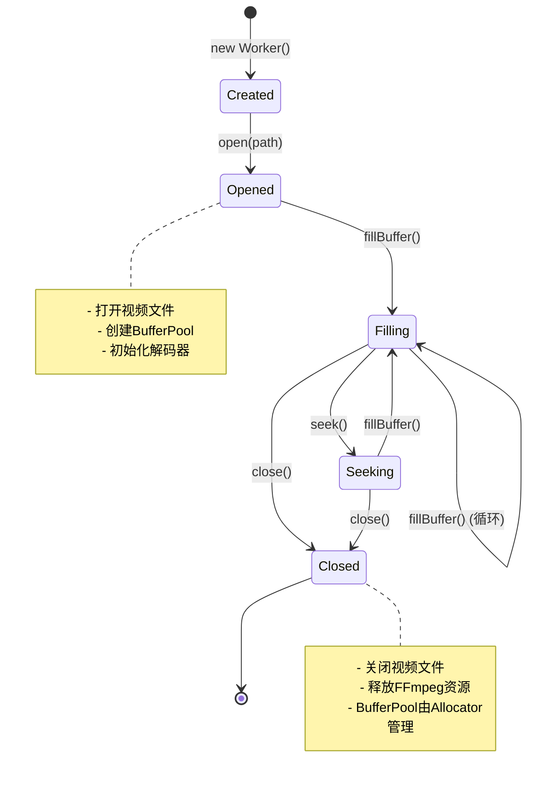

# Worker子系统设计文档

> **面向人群**: 新入职开发者  
> **文档版本**: v1.0  
> **最后更新**: 2025-01-XX  
> **维护者**: AI SDK Team

---

## 📚 目录

1. [概述](#1-概述)
2. [架构设计](#2-架构设计)
3. [类详细设计](#3-类详细设计)
4. [UML图集](#4-uml图集)
5. [典型使用场景](#5-典型使用场景)
6. [线程安全分析](#6-线程安全分析)
7. [扩展性与最佳实践](#7-扩展性与最佳实践)

---

## 1. 概述

### 1.1 系统定位

**Worker子系统**是一个**统一接口、多种实现的视频数据读取与Buffer填充框架**，专为音视频处理流水线设计。它提供：

- ✅ **统一接口**：通过`IBufferFillingWorker`和`IVideoFileNavigator`两个接口统一所有Worker实现
- ✅ **多种实现**：支持FFmpeg解码、MMAP内存映射、IoUring异步I/O等多种数据源
- ✅ **自动BufferPool管理**：Worker在`open()`时自动创建和管理BufferPool
- ✅ **工厂模式**：通过`BufferFillingWorkerFactory`自动选择最优实现
- ✅ **门面模式**：通过`BufferFillingWorkerFacade`简化使用

### 1.2 核心价值

| 特性 | 传统方案 | Worker子系统 |
|------|---------|-------------|
| **接口统一** | 每个实现类接口不同 | 统一接口，可替换 |
| **BufferPool管理** | 手动创建和管理 | Worker自动创建 |
| **实现选择** | 硬编码实现类 | 工厂模式自动选择 |
| **使用复杂度** | 需要了解具体实现 | 门面模式简化使用 |
| **扩展性** | 修改上层代码 | 只需新增实现类 |

### 1.3 设计原则

```
🎯 接口隔离原则 (ISP)
   - IBufferFillingWorker: Buffer填充职责
   - IVideoFileNavigator: 文件导航职责
   - Worker可选择性实现两个接口

🔌 依赖注入 (DI)
   - WorkerBase通过构造函数参数传递AllocatorType
   - 父类统一管理Allocator创建逻辑

🏭 工厂模式 (Factory Pattern)
   - BufferFillingWorkerFactory统一创建Worker
   - 支持自动检测和手动指定

🎭 门面模式 (Facade Pattern)
   - BufferFillingWorkerFacade统一对外接口
   - 隐藏底层实现复杂性

🏗️ 可扩展性 (Extensibility)
   - 通过继承WorkerBase可扩展新的Worker实现
   - 通过工厂模式注册新实现
```

---

## 2. 架构设计

### 2.1 三层架构图

```
┌─────────────────────────────────────────────────────────────┐
│                  应用层 (Application)                        │
│         VideoProductionLine, Test Cases...                  │
└───────────────────┬─────────────────────────────────────────┘
                    │ use
                    ▼
┌─────────────────────────────────────────────────────────────┐
│              门面层 (BufferFillingWorkerFacade)              │
│  - 统一对外接口                                              │
│  - 隐藏实现细节                                              │
│  - 智能参数判断                                              │
└───────────────────┬─────────────────────────────────────────┘
                    │ delegate to
                    ▼
┌─────────────────────────────────────────────────────────────┐
│              工厂层 (BufferFillingWorkerFactory)              │
│  - 创建Worker实例                                            │
│  - 自动检测最优实现                                          │
│  - 环境变量/配置文件支持                                     │
└───────────────────┬─────────────────────────────────────────┘
                    │ create
                    ▼
┌─────────────────────────────────────────────────────────────┐
│              基类层 (WorkerBase)                             │
│  - 统一基类（同时实现两个接口）                              │
│  - Allocator管理（统一创建逻辑）                             │
│  - BufferPool管理（自动创建）                                │
└───────────────────┬─────────────────────────────────────────┘
                    │ inherit
                    ▼
┌─────────────────────────────────────────────────────────────┐
│              实现层 (Implementation)                          │
│  - FfmpegDecodeVideoFileWorker: FFmpeg解码视频文件          │
│  - FfmpegDecodeRtspWorker: FFmpeg解码RTSP流                 │
│  - MmapRawVideoFileWorker: MMAP内存映射Raw文件              │
│  - IoUringRawVideoFileWorker: IoUring异步I/O Raw文件       │
└───────────────────┬─────────────────────────────────────────┘
                    │ use
                    ▼
┌─────────────────────────────────────────────────────────────┐
│              Buffer子系统 (BufferPool)                       │
│  - BufferPool: 调度器                                        │
│  - BufferAllocator: 内存分配器                              │
└─────────────────────────────────────────────────────────────┘
```

### 2.2 职责划分

#### 🔹 IBufferFillingWorker - Buffer填充接口
**职责**: 定义Buffer填充的核心功能  
**核心能力**:
- `fillBuffer()`: 填充Buffer的核心方法
- `getWorkerType()`: 获取Worker类型标识
- `getOutputBufferPool()`: 提供Worker创建的BufferPool

#### 🔹 IVideoFileNavigator - 文件导航接口
**职责**: 定义文件操作和导航功能  
**核心能力**:
- 文件打开/关闭（`open()`, `close()`, `isOpen()`）
- 文件导航（`seek()`, `skip()`, `seekToBegin()`, `seekToEnd()`）
- 文件信息查询（`getTotalFrames()`, `getCurrentFrameIndex()`, `getWidth()`, `getHeight()`等）

#### 🔹 WorkerBase - 统一基类
**职责**: 作为所有Worker实现类的统一基类  
**核心能力**:
- 同时实现`IBufferFillingWorker`和`IVideoFileNavigator`两个接口
- 统一管理`BufferAllocatorFacade`（通过构造函数参数传递类型）
- 统一管理`BufferPool`（在`open()`时自动创建）
- 避免在门面类中使用`dynamic_cast`

#### 🔹 BufferFillingWorkerFacade - 门面类
**职责**: 为用户提供统一、简单的接口  
**核心能力**:
- 隐藏底层多种实现的复杂性
- 智能判断参数使用（编码视频 vs Raw视频）
- 延迟创建Worker（在`open()`时创建）

#### 🔹 BufferFillingWorkerFactory - 工厂类
**职责**: 统一创建Worker实例  
**核心能力**:
- 根据类型创建Worker
- 自动检测系统能力并选择最优实现
- 支持环境变量和配置文件

### 2.3 依赖关系

```
IBufferFillingWorker (接口)
    ↑ implements
WorkerBase (基类)
    ↑ inherits
具体实现类 (FfmpegDecodeVideoFileWorker等)

IVideoFileNavigator (接口)
    ↑ implements
WorkerBase (基类)
    ↑ inherits
具体实现类

BufferFillingWorkerFacade (门面)
    ├── 持有 → WorkerBase (通过unique_ptr)
    ├── 实现 → IBufferFillingWorker
    └── 实现 → IVideoFileNavigator

BufferFillingWorkerFactory (工厂)
    └── 创建 → WorkerBase (通过unique_ptr)

WorkerBase
    ├── 持有 → BufferAllocatorFacade (统一管理)
    └── 持有 → BufferPool (shared_ptr)

具体实现类
    └── 使用 → BufferPool (填充Buffer)
```

### 2.4 设计模式应用

| 设计模式 | 应用位置 | 目的 |
|---------|---------|------|
| **接口隔离原则** | `IBufferFillingWorker` + `IVideoFileNavigator` | 分离Buffer填充和文件导航职责 |
| **工厂模式** | `BufferFillingWorkerFactory` | 统一创建Worker，支持自动检测 |
| **门面模式** | `BufferFillingWorkerFacade` | 简化使用，隐藏实现细节 |
| **模板方法模式** | `WorkerBase` | 统一Allocator和BufferPool管理逻辑 |
| **策略模式** | 多种Worker实现 | 可替换的不同数据源读取策略 |
| **依赖注入** | `WorkerBase`构造函数 | 通过参数传递AllocatorType |

---

## 3. 类详细设计

### 3.1 IBufferFillingWorker接口

#### 3.1.1 接口概述

```cpp
/**
 * @brief IBufferFillingWorker - 填充Buffer的Worker接口
 * 
 * 职责：
 * - 从不同数据源获取数据，填充到Buffer中
 * - 提供Worker类型标识
 * - 提供Worker创建的BufferPool（如果有）
 */
class IBufferFillingWorker {
public:
    virtual ~IBufferFillingWorker() = default;
    
    // 核心功能：填充Buffer
    virtual bool fillBuffer(int frame_index, Buffer* buffer) = 0;
    
    // 类型信息
    virtual const char* getWorkerType() const = 0;
    
    // 提供BufferPool（可选）
    virtual std::unique_ptr<BufferPool> getOutputBufferPool();
};
```

#### 3.1.2 成员方法

##### fillBuffer() - 核心填充方法

```cpp
/**
 * @brief 填充Buffer（核心功能）
 * @param frame_index 帧索引
 * @param buffer 输出Buffer（从BufferPool获取）
 * @return 成功返回true，失败返回false
 * 
 * 实现要求：
 * - MmapRawVideoFileWorker: 从mmap映射的内存读取数据到buffer->data()
 * - FfmpegDecodeVideoFileWorker: 解码视频帧并拷贝到buffer->data()
 * - FfmpegDecodeRtspWorker: 解码RTSP流并拷贝到buffer->data()
 * - IoUringRawVideoFileWorker: 使用io_uring异步读取到buffer->data()
 * 
 * 注意：
 * - buffer由调用者（ProductionLine）从BufferPool获取
 * - 实现者只负责填充数据
 * - 成功返回true，失败返回false（buffer由调用者归还）
 */
virtual bool fillBuffer(int frame_index, Buffer* buffer) = 0;
```

**使用示例**:
```cpp
// ProductionLine使用
Buffer* buf = pool->acquireFree(true, -1);
if (worker->fillBuffer(frame_idx, buf)) {
    pool->submitFilled(buf);  // 成功，提交到filled队列
} else {
    pool->releaseFilled(buf);  // 失败，归还到free队列
}
```

##### getWorkerType() - 类型标识

```cpp
/**
 * @brief 获取Worker类型名称（用于调试和日志）
 * @return 类型名称（如"FfmpegDecodeVideoFileWorker"）
 */
virtual const char* getWorkerType() const = 0;
```

##### getOutputBufferPool() - 提供BufferPool

```cpp
/**
 * @brief 获取输出BufferPool（如果有）
 * @return BufferPool的智能指针，如果Worker创建了内部BufferPool，返回unique_ptr；否则返回nullptr
 * 
 * 使用场景：
 * - 硬件解码器Worker：返回内部创建的overlay BufferPool
 * - MmapRawVideoFileWorker：返回nullptr（使用外部BufferPool）
 * - VideoProductionLine：通过此方法获取Worker的BufferPool（如果有）
 * 
 * 默认实现：返回nullptr（普通Worker没有内部BufferPool）
 */
virtual std::unique_ptr<BufferPool> getOutputBufferPool() {
    return nullptr;
}
```

---

### 3.2 IVideoFileNavigator接口

#### 3.2.1 接口概述

```cpp
/**
 * @brief IVideoFileNavigator - 视频文件导航接口
 * 
 * 职责：
 * - 文件打开/关闭操作
 * - 文件导航操作（seek、skip等）
 * - 文件状态查询
 */
class IVideoFileNavigator {
public:
    virtual ~IVideoFileNavigator() = default;
    
    // 文件打开/关闭
    virtual bool open(const char* path) = 0;
    virtual bool open(const char* path, int width, int height, int bits_per_pixel) = 0;
    virtual void close() = 0;
    virtual bool isOpen() const = 0;
    
    // 文件导航
    virtual bool seek(int frame_index) = 0;
    virtual bool seekToBegin() = 0;
    virtual bool seekToEnd() = 0;
    virtual bool skip(int frame_count) = 0;
    
    // 文件信息查询
    virtual int getTotalFrames() const = 0;
    virtual int getCurrentFrameIndex() const = 0;
    virtual size_t getFrameSize() const = 0;
    virtual long getFileSize() const = 0;
    virtual int getWidth() const = 0;
    virtual int getHeight() const = 0;
    virtual int getBytesPerPixel() const = 0;
    virtual const char* getPath() const = 0;
    virtual bool hasMoreFrames() const = 0;
    virtual bool isAtEnd() const = 0;
};
```

#### 3.2.2 核心方法说明

##### open() - 打开文件（两个重载）

```cpp
/**
 * @brief 打开编码视频文件（自动检测格式）
 * @param path 文件路径
 * @return 成功返回true
 * 
 * 适用场景：
 * - FFmpeg解码视频文件（MP4, AVI, MKV等）
 * - 自动检测视频格式、分辨率、编码格式
 */
virtual bool open(const char* path) = 0;

/**
 * @brief 打开视频文件（统一智能接口）
 * @param path 文件路径
 * @param width 视频宽度（可选，用于raw视频）
 * @param height 视频高度（可选，用于raw视频）
 * @param bits_per_pixel 每像素位数（可选，用于raw视频）
 * @return 成功返回true
 * 
 * 实现类应根据Worker类型自动判断：
 * - 编码视频Worker（FFMPEG_VIDEO_FILE, FFMPEG_RTSP）：忽略width/height/bpp，自动检测格式
 * - Raw视频Worker（MMAP_RAW, IOURING_RAW）：使用传入的width/height/bpp参数
 */
virtual bool open(const char* path, int width, int height, int bits_per_pixel) = 0;
```

**使用示例**:
```cpp
// 编码视频（自动检测）
worker->open("video.mp4");

// Raw视频（需要指定格式）
worker->open("video.raw", 1920, 1080, 32);  // 1920x1080, 32bpp
```

##### seek() / skip() - 文件导航

```cpp
/**
 * @brief 跳转到指定帧
 * @param frame_index 帧索引（从0开始）
 * @return 成功返回true
 */
virtual bool seek(int frame_index) = 0;

/**
 * @brief 跳过N帧（可正可负）
 * @param frame_count 跳过的帧数（正数向前，负数向后）
 * @return 成功返回true
 */
virtual bool skip(int frame_count) = 0;
```

---

### 3.3 WorkerBase基类

#### 3.3.1 类概述

```cpp
/**
 * @brief WorkerBase - Worker基类
 * 
 * 设计目标：
 * - 统一所有Worker实现类的基类
 * - 同时继承IBufferFillingWorker和IVideoFileNavigator两个接口
 * - 避免在门面类中使用dynamic_cast进行类型转换
 * - 提供统一的Allocator和BufferPool管理
 * - 采用构造函数参数传递模式，父类统一管理Allocator创建逻辑
 */
class WorkerBase : public IBufferFillingWorker, public IVideoFileNavigator {
    // ...
};
```

#### 3.3.2 成员属性

| 属性 | 类型 | 说明 | 访问权限 |
|-----|------|------|---------|
| `allocator_facade_` | `BufferAllocatorFacade` | Allocator门面（所有Worker子类自动继承） | `protected` |
| `buffer_pool_sptr_` | `std::shared_ptr<BufferPool>` | Worker创建的BufferPool（所有Worker子类自动继承） | `protected` |

#### 3.3.3 构造函数

```cpp
/**
 * @brief 构造函数
 * 
 * Allocator类型选择建议：
 * - NORMAL: Raw视频文件Worker（需要内部分配内存）
 * - AVFRAME: FFmpeg解码Worker（需要动态注入AVFrame）
 * - FRAMEBUFFER: Framebuffer设备Worker（需要包装外部内存）
 * - AUTO: 默认使用NORMAL（不推荐，子类应明确指定）
 * 
 * @param allocator_type Allocator类型（子类传递）
 */
explicit WorkerBase(
    BufferAllocatorFactory::AllocatorType allocator_type
) : allocator_facade_(allocator_type)  // 🎯 父类直接创建Allocator门面
  , buffer_pool_sptr_(nullptr) 
{
}
```

**使用示例**:
```cpp
// 子类实现
class FfmpegDecodeVideoFileWorker : public WorkerBase {
public:
    FfmpegDecodeVideoFileWorker()
        : WorkerBase(BufferAllocatorFactory::AllocatorType::AVFRAME)  // 🎯 只需传递类型！
    {
        // 父类已经创建好AVFRAME类型的allocator_facade_，无需任何初始化代码
    }
};
```

#### 3.3.4 核心方法

##### getOutputBufferPool() - 提供BufferPool（默认实现）

```cpp
/**
 * @brief 获取Worker创建的BufferPool（默认实现）
 * 
 * 子类可以重写此方法，但通常不需要（直接使用基类的buffer_pool_即可）
 * 
 * @return unique_ptr<BufferPool> 成功返回pool，失败返回nullptr
 * 
 * @note Worker必须在open()时创建BufferPool，否则返回nullptr
 * @note 从shared_ptr转换为unique_ptr（通过release，但Allocator和Registry仍持有shared_ptr）
 */
virtual std::unique_ptr<BufferPool> getOutputBufferPool() override {
    if (!buffer_pool_sptr_) {
        return nullptr;
    }
    // 从shared_ptr转换为unique_ptr
    // 注意：Allocator和Registry仍持有shared_ptr，所以不会销毁
    BufferPool* raw_ptr = buffer_pool_sptr_.get();
    buffer_pool_sptr_.reset();  // Worker不再持有
    return std::unique_ptr<BufferPool>(raw_ptr);  // ProductionLine持有unique_ptr
}
```

---

### 3.4 具体实现类

#### 3.4.1 FfmpegDecodeVideoFileWorker

**功能**: 使用FFmpeg解码视频文件（MP4, AVI, MKV, MOV, FLV等）

**特点**:
- 支持多种编码格式（H.264, H.265, VP9, AV1等）
- 自动检测硬件加速能力
- 支持格式转换（YUV → ARGB888）
- 零拷贝优化（当硬件支持时）
- 线程安全的帧访问

**Allocator类型**: `AVFRAME`（需要动态注入AVFrame）

**使用示例**:
```cpp
FfmpegDecodeVideoFileWorker worker;
worker.open("video.mp4");  // 自动检测格式
std::unique_ptr<BufferPool> pool = worker.getOutputBufferPool();
Buffer* buf = pool->acquireFree(true, -1);
worker.fillBuffer(0, buf);
pool->submitFilled(buf);
```

#### 3.4.2 FfmpegDecodeRtspWorker

**功能**: 使用FFmpeg解码RTSP视频流

**特点**:
- 实时流处理（无总帧数概念）
- 自动重连机制
- 线程安全的帧访问
- 支持硬件加速解码（可选）

**Allocator类型**: `AVFRAME`

**使用示例**:
```cpp
FfmpegDecodeRtspWorker worker;
worker.open("rtsp://192.168.1.100:8554/stream", 1920, 1080, 32);
std::unique_ptr<BufferPool> pool = worker.getOutputBufferPool();
Buffer* buf = pool->acquireFree(true, -1);
worker.fillBuffer(0, buf);  // frame_index在RTSP中无意义，但需要传入
pool->submitFilled(buf);
```

#### 3.4.3 MmapRawVideoFileWorker

**功能**: 使用mmap内存映射方式打开raw视频文件

**特点**:
- 零拷贝访问（通过memcpy）
- 适合随机访问和小到中等大小文件
- 实现简单，兼容性好
- 内核自动管理页缓存

**Allocator类型**: `NORMAL`（普通内存分配）

**使用示例**:
```cpp
MmapRawVideoFileWorker worker;
worker.open("video.raw", 1920, 1080, 32);  // 需要指定格式
// 注意：MmapRawVideoFileWorker通常不创建BufferPool，使用外部提供的
Buffer* buf = external_pool->acquireFree(true, -1);
worker.fillBuffer(0, buf);
external_pool->submitFilled(buf);
```

#### 3.4.4 IoUringRawVideoFileWorker

**功能**: 使用io_uring高性能异步I/O方式打开raw视频文件

**特点**:
- 零拷贝异步I/O
- 批量提交读取请求
- 显著降低CPU使用率
- 提高I/O吞吐量
- 适合大文件（>1GB）高并发读取

**Allocator类型**: `NORMAL`

**使用示例**:
```cpp
IoUringRawVideoFileWorker worker(32);  // queue_depth=32
worker.open("video.raw", 1920, 1080, 32);
Buffer* buf = external_pool->acquireFree(true, -1);
worker.fillBuffer(0, buf);
external_pool->submitFilled(buf);
```

---

### 3.5 BufferFillingWorkerFacade门面类

#### 3.5.1 类概述

```cpp
/**
 * @brief BufferFillingWorkerFacade - Buffer填充Worker门面类
 * 
 * 设计模式：门面模式（Facade Pattern）
 * 
 * 职责：
 * - 为用户提供统一、简单的Buffer填充操作接口
 * - 隐藏底层多种实现的复杂性
 * - 自动选择最优的Worker实现
 */
class BufferFillingWorkerFacade : public IBufferFillingWorker, public IVideoFileNavigator {
private:
    std::unique_ptr<WorkerBase> worker_base_uptr_;  // 实际的Worker实现
    BufferFillingWorkerFactory::WorkerType preferred_type_;  // 用户偏好的类型
};
```

#### 3.5.2 核心特性

##### 延迟创建Worker

```cpp
/**
 * @brief 构造函数（不立即创建Worker）
 * @param type Worker类型（默认AUTO，自动选择最优实现）
 */
BufferFillingWorkerFacade(BufferFillingWorkerFactory::WorkerType type = AUTO);

/**
 * @brief open()时自动创建Worker（如果还没创建）
 */
bool open(const char* path) override {
    // 创建worker（如果还没创建）
    if (!worker_base_uptr_) {
        worker_base_uptr_ = BufferFillingWorkerFactory::create(preferred_type_);
    }
    // ...
}
```

##### 智能参数判断

```cpp
/**
 * @brief 智能判断：根据Worker类型选择合适的open方法
 */
bool open(const char* path, int width, int height, int bits_per_pixel) override {
    bool is_raw_worker = (preferred_type_ == MMAP_RAW || preferred_type_ == IOURING_RAW);
    
    if (is_raw_worker) {
        // Raw视频Worker：使用传入的格式参数
        return worker_base_uptr_->open(path, width, height, bits_per_pixel);
    } else {
        // 编码视频Worker：自动检测格式（忽略width/height/bpp参数）
        return worker_base_uptr_->open(path);
    }
}
```

#### 3.5.3 使用示例

```cpp
// 方式1：编码视频（自动检测格式）
BufferFillingWorkerFacade worker(BufferFillingWorkerFactory::WorkerType::FFMPEG_VIDEO_FILE);
worker.open("video.mp4");  // 自动检测格式，无需指定宽高

// 方式2：Raw视频（需要指定格式）
BufferFillingWorkerFacade worker(BufferFillingWorkerFactory::WorkerType::MMAP_RAW);
worker.open("video.raw", 1920, 1080, 32);  // 指定格式参数

// 方式3：通用方式（推荐）
BufferFillingWorkerFacade worker;
worker.setWorkerType(BufferFillingWorkerFactory::WorkerType::FFMPEG_VIDEO_FILE);
worker.open(path, width, height, bpp);  // 门面类会根据Worker类型自动判断是否使用这些参数
```

---

### 3.6 BufferFillingWorkerFactory工厂类

#### 3.6.1 类概述

```cpp
/**
 * @brief BufferFillingWorkerFactory - 填充Buffer的Worker工厂
 * 
 * 设计模式：工厂模式（Factory Pattern）
 * 
 * 职责：
 * - 根据环境和配置创建合适的Worker实现
 * - 封装Worker创建逻辑
 * - 支持自动检测和手动指定两种模式
 */
class BufferFillingWorkerFactory {
public:
    enum class WorkerType {
        AUTO,              // 自动检测（默认）
        MMAP_RAW,          // 创建MmapRawVideoFileWorker
        IOURING_RAW,       // 创建IoUringRawVideoFileWorker
        FFMPEG_RTSP,       // 创建FfmpegDecodeRtspWorker
        FFMPEG_VIDEO_FILE  // 创建FfmpegDecodeVideoFileWorker
    };
    
    static std::unique_ptr<WorkerBase> create(WorkerType type = WorkerType::AUTO);
};
```

#### 3.6.2 创建策略（优先级从高到低）

1. **用户显式指定** (`type != AUTO`)
2. **环境变量** (`VIDEO_READER_TYPE`)
3. **配置文件** (`/etc/video_reader.conf`)
4. **自动检测系统能力**

#### 3.6.3 自动检测逻辑

```cpp
/**
 * @brief 自动检测并创建最优Worker
 */
static std::unique_ptr<WorkerBase> autoDetect() {
    // 检查io_uring
    bool iouring_available = isIoUringAvailable();
    
    // 检查mmap
    bool mmap_available = isMmapAvailable();
    
    // 决策逻辑
    if (iouring_available && isIoUringSuitable()) {
        return std::make_unique<IoUringRawVideoFileWorker>();
    }
    
    if (mmap_available) {
        return std::make_unique<MmapRawVideoFileWorker>();
    }
    
    // 默认降级
    return std::make_unique<MmapRawVideoFileWorker>();
}
```

---

## 4. UML图集

### 4.1 类图（Class Diagram）



**关键关系说明**:

| 关系符号 | 含义 | 示例 |
|---------|------|------|
| `<|..` | 接口实现 | `WorkerBase`实现`IBufferFillingWorker` |
| `<|--` | 继承 | `FfmpegDecodeVideoFileWorker`继承`WorkerBase` |
| `..>` | 依赖 | `WorkerBase`使用`BufferAllocatorFacade` |
| `-->` | 组合 | `WorkerBase`创建`BufferPool` |

---

### 4.2 时序图（Sequence Diagrams）

#### 场景1：创建Worker并打开文件



---

#### 场景2：填充Buffer



---

#### 场景3：工厂自动检测



---

### 4.3 状态图（State Diagram）

#### Worker生命周期图



---

## 5. 典型使用场景

### 5.1 场景：FFmpeg解码视频文件

```cpp
#include "productionline/worker/facade/BufferFillingWorkerFacade.hpp"
#include "buffer/BufferPool.hpp"

int main() {
    // 1. 创建Worker门面（指定类型）
    BufferFillingWorkerFacade worker(
        BufferFillingWorkerFactory::WorkerType::FFMPEG_VIDEO_FILE
    );
    
    // 2. 打开视频文件（自动检测格式）
    if (!worker.open("video.mp4")) {
        printf("❌ Failed to open video file\n");
        return -1;
    }
    
    // 3. 获取Worker创建的BufferPool
    std::unique_ptr<BufferPool> pool = worker.getOutputBufferPool();
    if (!pool) {
        printf("❌ Worker did not create BufferPool\n");
        return -1;
    }
    
    // 4. 填充Buffer
    Buffer* buf = pool->acquireFree(true, -1);
    if (!buf) {
        printf("❌ Failed to acquire buffer\n");
        return -1;
    }
    
    if (worker.fillBuffer(0, buf)) {
        printf("✅ Frame filled successfully\n");
        pool->submitFilled(buf);
    } else {
        printf("❌ Failed to fill buffer\n");
        pool->releaseFilled(buf);
    }
    
    // 5. 清理
    worker.close();
    return 0;
}
```

---

### 5.2 场景：Raw视频文件读取（MMAP）

```cpp
#include "productionline/worker/facade/BufferFillingWorkerFacade.hpp"
#include "buffer/allocator/facade/BufferFacade.hpp"

int main() {
    // 1. 创建Worker门面
    BufferFillingWorkerFacade worker(
        BufferFillingWorkerFactory::WorkerType::MMAP_RAW
    );
    
    // 2. 打开Raw视频文件（需要指定格式）
    if (!worker.open("video.raw", 1920, 1080, 32)) {
        printf("❌ Failed to open raw video file\n");
        return -1;
    }
    
    // 3. 创建外部BufferPool（MMAP Worker通常不创建内部Pool）
    auto pool = BufferFacade::createBufferPool(
        10,
        worker.getFrameSize(),
        BufferMemoryAllocatorType::NORMAL_MALLOC,
        "RawVideoPool",
        "Video"
    );
    
    // 4. 填充Buffer
    Buffer* buf = pool->acquireFree(true, -1);
    if (worker.fillBuffer(0, buf)) {
        pool->submitFilled(buf);
    } else {
        pool->releaseFilled(buf);
    }
    
    worker.close();
    return 0;
}
```

---

### 5.3 场景：RTSP流解码

```cpp
#include "productionline/worker/facade/BufferFillingWorkerFacade.hpp"

int main() {
    // 1. 创建RTSP Worker
    BufferFillingWorkerFacade worker(
        BufferFillingWorkerFactory::WorkerType::FFMPEG_RTSP
    );
    
    // 2. 打开RTSP流（需要指定输出格式）
    if (!worker.open("rtsp://192.168.1.100:8554/stream", 1920, 1080, 32)) {
        printf("❌ Failed to connect RTSP stream\n");
        return -1;
    }
    
    // 3. 获取Worker创建的BufferPool
    std::unique_ptr<BufferPool> pool = worker.getOutputBufferPool();
    
    // 4. 持续读取帧
    while (running) {
        Buffer* buf = pool->acquireFilled(true, -1);
        if (!buf) {
            break;  // Worker已关闭
        }
        
        // 处理帧数据
        processFrame(buf->getVirtualAddress(), buf->size());
        
        pool->releaseFilled(buf);
    }
    
    worker.close();
    return 0;
}
```

---

### 5.4 场景：与ProductionLine集成

```cpp
#include "productionline/VideoProductionLine.hpp"
#include "productionline/worker/facade/BufferFillingWorkerFacade.hpp"

int main() {
    // 1. 创建Worker
    auto worker = std::make_shared<BufferFillingWorkerFacade>(
        BufferFillingWorkerFactory::WorkerType::FFMPEG_VIDEO_FILE
    );
    
    // 2. 打开视频文件
    worker->open("video.mp4");
    
    // 3. 创建ProductionLine
    VideoProductionLine production_line;
    
    // 4. 添加Worker（ProductionLine会自动获取Worker的BufferPool）
    production_line.addWorker(worker);
    
    // 5. 启动流水线
    production_line.start();
    
    // 6. 运行
    while (running) {
        std::this_thread::sleep_for(std::chrono::milliseconds(100));
    }
    
    // 7. 停止并清理
    production_line.stop();
    worker->close();
    return 0;
}
```

---

## 6. 线程安全分析

### 6.1 Worker线程安全策略

#### FfmpegDecodeVideoFileWorker

```cpp
class FfmpegDecodeVideoFileWorker : public WorkerBase {
private:
    // 使用递归锁避免同一线程重入时死锁（例如fillBuffer -> seek）
    mutable std::recursive_mutex mutex_;
    
    // 原子操作统计信息
    std::atomic<int> decoded_frames_;
    std::atomic<int> decode_errors_;
};
```

**锁策略**:
- ✅ **递归锁**: 允许同一线程重入（`fillBuffer()`可能调用`seek()`）
- ✅ **原子操作**: 统计信息使用`atomic`，无需加锁
- ⚠️ **FFmpeg资源**: FFmpeg API本身不是线程安全的，需要加锁保护

**示例（正确）**:
```cpp
bool FfmpegDecodeVideoFileWorker::fillBuffer(int frame_index, Buffer* buffer) {
    std::lock_guard<std::recursive_mutex> lock(mutex_);  // ✅ 加锁保护
    
    // FFmpeg操作（非线程安全）
    AVFrame* frame = decodeOneFrame();
    if (!frame) {
        return false;
    }
    
    // 格式转换和拷贝
    convertFrameTo(frame, buffer->data(), buffer->size());
    return true;
}
```

#### MmapRawVideoFileWorker

```cpp
class MmapRawVideoFileWorker : public WorkerBase {
    // 无显式锁（mmap是进程级共享，多线程读取安全）
    // 但写入操作需要外部同步
};
```

**线程安全**:
- ✅ **mmap读取**: 多线程同时读取是安全的（只读操作）
- ⚠️ **seek操作**: 修改`current_frame_index_`需要同步（如果多线程调用）

---

### 6.2 BufferPool访问的线程安全

**Worker与ProductionLine的协作**:

```cpp
// 生产者线程（Worker）
void workerThread(BufferFillingWorkerFacade* worker, BufferPool* pool) {
    while (running) {
        Buffer* buf = pool->acquireFree(true, -1);  // ✅ 线程安全
        if (!buf) break;
        
        worker->fillBuffer(frame_idx++, buf);  // Worker内部加锁
        
        pool->submitFilled(buf);  // ✅ 线程安全
    }
}

// 消费者线程（ProductionLine）
void consumerThread(BufferPool* pool) {
    while (running) {
        Buffer* buf = pool->acquireFilled(true, -1);  // ✅ 线程安全
        if (!buf) break;
        
        processFrame(buf);
        
        pool->releaseFilled(buf);  // ✅ 线程安全
    }
}
```

**关键点**:
- ✅ `BufferPool`的所有接口都是线程安全的（内部使用`mutex`保护）
- ✅ Worker的`fillBuffer()`内部加锁保护FFmpeg资源
- ✅ 多线程可以安全地同时调用`acquireFree()`和`acquireFilled()`

---

## 7. 扩展性与最佳实践

### 7.1 如何扩展新的Worker实现

假设你需要支持**硬件解码器Worker**，步骤如下：

#### 步骤1：继承WorkerBase

```cpp
// HardwareDecodeWorker.hpp
#include "productionline/worker/base/WorkerBase.hpp"

class HardwareDecodeWorker : public WorkerBase {
public:
    HardwareDecodeWorker()
        : WorkerBase(BufferAllocatorFactory::AllocatorType::DMA_BUF)  // 使用DMA-BUF
    {
    }
    
    // 实现IBufferFillingWorker接口
    bool fillBuffer(int frame_index, Buffer* buffer) override {
        // 硬件解码逻辑
        // 1. 调用硬件解码API
        // 2. 获取解码后的物理地址
        // 3. 设置Buffer的物理地址（零拷贝）
        return true;
    }
    
    const char* getWorkerType() const override {
        return "HardwareDecodeWorker";
    }
    
    // 实现IVideoFileNavigator接口
    bool open(const char* path) override {
        // 打开硬件解码器
        // 创建BufferPool（如果需要）
        return true;
    }
    
    // ... 其他接口实现
};
```

#### 步骤2：在Factory中注册

```cpp
// BufferFillingWorkerFactory.cpp
#include "HardwareDecodeWorker.hpp"

std::unique_ptr<WorkerBase> BufferFillingWorkerFactory::createByType(WorkerType type) {
    switch (type) {
        case WorkerType::MMAP_RAW:
            return std::make_unique<MmapRawVideoFileWorker>();
        
        case WorkerType::HARDWARE_DECODE:  // 新增
            return std::make_unique<HardwareDecodeWorker>();
        
        // ...
    }
}
```

#### 步骤3：使用

```cpp
// 创建硬件解码Worker
BufferFillingWorkerFacade worker(
    BufferFillingWorkerFactory::WorkerType::HARDWARE_DECODE
);
worker.open("video.h264");
```

---

### 7.2 性能优化建议

#### 优化1：选择合适的Worker类型

```cpp
// ❌ 不好：小文件使用io_uring（过度设计）
auto worker = BufferFillingWorkerFactory::create(
    BufferFillingWorkerFactory::WorkerType::IOURING_RAW
);

// ✅ 更好：根据文件大小选择
if (file_size > 1GB) {
    worker = BufferFillingWorkerFactory::create(
        BufferFillingWorkerFactory::WorkerType::IOURING_RAW
    );
} else {
    worker = BufferFillingWorkerFactory::create(
        BufferFillingWorkerFactory::WorkerType::MMAP_RAW
    );
}
```

#### 优化2：使用零拷贝模式（FFmpeg Worker）

```cpp
// FFmpeg Worker支持零拷贝模式（当硬件支持时）
FfmpegDecodeVideoFileWorker worker;
worker.setHardwareDecoder(true);  // 启用硬件解码
worker.setDecoderName("h264_taco");  // 使用特殊解码器
worker.open("video.mp4");

// Worker会自动使用零拷贝模式（如果解码器支持）
std::unique_ptr<BufferPool> pool = worker.getOutputBufferPool();
```

#### 优化3：批量读取（IoUring Worker）

```cpp
// IoUring Worker支持批量提交读取请求
IoUringRawVideoFileWorker worker(64);  // queue_depth=64
worker.open("video.raw", 1920, 1080, 32);

// 批量读取多帧
std::vector<int> frame_indices = {0, 1, 2, 3, 4};
int submitted = worker.submitBatchReads(pool.get(), frame_indices);
```

---

### 7.3 常见陷阱

#### 陷阱1：忘记调用close()

```cpp
// ❌ 错误：忘记关闭Worker
BufferFillingWorkerFacade worker;
worker.open("video.mp4");
// ... 使用worker ...
// 忘记调用close()，资源泄漏！

// ✅ 正确：使用RAII或显式关闭
{
    BufferFillingWorkerFacade worker;
    worker.open("video.mp4");
    // ... 使用worker ...
}  // 析构函数自动调用close()

// 或显式关闭
worker.close();
```

#### 陷阱2：Raw视频Worker需要指定格式参数

```cpp
// ❌ 错误：Raw视频Worker不指定格式
BufferFillingWorkerFacade worker(MMAP_RAW);
worker.open("video.raw");  // 缺少格式参数，可能失败或使用错误格式

// ✅ 正确：指定格式参数
worker.open("video.raw", 1920, 1080, 32);  // 1920x1080, 32bpp
```

#### 陷阱3：混淆Worker类型和Allocator类型

```cpp
// ❌ 错误：混淆概念
// Worker类型：决定如何读取数据（FFmpeg vs MMAP vs IoUring）
// Allocator类型：决定如何分配内存（NORMAL vs AVFRAME vs DMA_BUF）

// ✅ 正确：Worker类型和Allocator类型是独立的
// FFmpeg Worker使用AVFRAME Allocator（由WorkerBase自动选择）
// Raw Worker使用NORMAL Allocator（由WorkerBase自动选择）
```

#### 陷阱4：多线程访问Worker

```cpp
// ❌ 错误：多线程同时调用fillBuffer()（FFmpeg Worker）
// FFmpeg API不是线程安全的，需要Worker内部加锁

// ✅ 正确：FFmpeg Worker内部已加锁保护
// 多线程可以安全调用fillBuffer()，但性能可能下降
// 更好的做法：每个线程使用独立的Worker实例
```

---

### 7.4 调试技巧

#### 技巧1：启用详细日志

```cpp
// 在开发阶段，打印所有Worker操作
class DebugWorkerFacade : public BufferFillingWorkerFacade {
    bool fillBuffer(int frame_index, Buffer* buffer) override {
        printf("🔍 [%s] fillBuffer(frame=%d, buffer=%p)\n",
               getWorkerType(), frame_index, buffer);
        bool result = BufferFillingWorkerFacade::fillBuffer(frame_index, buffer);
        printf("   Result: %s\n", result ? "✅ Success" : "❌ Failed");
        return result;
    }
};
```

#### 技巧2：检查Worker状态

```cpp
void checkWorkerHealth(BufferFillingWorkerFacade* worker) {
    if (!worker->isOpen()) {
        printf("⚠️  Worker is not open\n");
        return;
    }
    
    printf("📊 Worker Status:\n");
    printf("   Type:        %s\n", worker->getWorkerType());
    printf("   Path:        %s\n", worker->getPath());
    printf("   Resolution:  %dx%d\n", worker->getWidth(), worker->getHeight());
    printf("   Frame Size:  %zu bytes\n", worker->getFrameSize());
    printf("   Total Frames: %d\n", worker->getTotalFrames());
    printf("   Current:     %d\n", worker->getCurrentFrameIndex());
    printf("   Has More:    %s\n", worker->hasMoreFrames() ? "Yes" : "No");
}
```

#### 技巧3：使用GDB调试

```bash
# GDB命令
(gdb) p worker->getWorkerType()
(gdb) p worker->isOpen()
(gdb) p worker->getCurrentFrameIndex()
(gdb) p worker->getTotalFrames()

# 检查BufferPool
(gdb) p pool->getFreeCount()
(gdb) p pool->getFilledCount()
(gdb) p pool->getTotalCount()
```

---

## 8. 总结

### 8.1 核心概念回顾

| 概念 | 说明 |
|-----|------|
| **IBufferFillingWorker** | Buffer填充接口，定义核心功能 |
| **IVideoFileNavigator** | 文件导航接口，定义文件操作功能 |
| **WorkerBase** | 统一基类，同时实现两个接口，统一管理Allocator和BufferPool |
| **BufferFillingWorkerFacade** | 门面类，简化使用，隐藏实现细节 |
| **BufferFillingWorkerFactory** | 工厂类，统一创建Worker，支持自动检测 |
| **接口隔离原则** | 分离Buffer填充和文件导航职责 |
| **工厂模式** | 统一创建Worker，支持自动选择最优实现 |
| **门面模式** | 简化使用，隐藏底层复杂性 |

### 8.2 最佳实践清单

- ✅ 通过`BufferFillingWorkerFacade`使用Worker（不要直接使用实现类）
- ✅ 根据数据源类型选择合适的Worker类型
- ✅ Raw视频Worker必须指定格式参数（width, height, bits_per_pixel）
- ✅ 编码视频Worker使用`open(path)`自动检测格式
- ✅ 使用`getOutputBufferPool()`获取Worker创建的BufferPool
- ✅ 使用RAII确保Worker被正确关闭
- ✅ 多线程访问时注意Worker的线程安全策略
- ✅ 使用工厂模式自动选择最优实现

### 8.3 下一步学习

- 📖 阅读`Buffer子系统设计文档`（理解BufferPool和BufferAllocator）
- 📖 阅读`VideoProductionLine`源码（理解Worker如何与流水线集成）
- 🛠️ 实现自己的Worker（如硬件解码器、网络流等）
- 🧪 编写性能测试（比较不同Worker实现的性能）
- 📊 集成性能监控工具（如Prometheus）

---

## 附录A：快速参考

### 创建Worker

```cpp
#include "productionline/worker/facade/BufferFillingWorkerFacade.hpp"

// 方式1：指定类型
auto worker = std::make_shared<BufferFillingWorkerFacade>(
    BufferFillingWorkerFactory::WorkerType::FFMPEG_VIDEO_FILE
);

// 方式2：自动检测
auto worker = std::make_shared<BufferFillingWorkerFacade>(
    BufferFillingWorkerFactory::WorkerType::AUTO
);
```

### 打开文件

```cpp
// 编码视频（自动检测格式）
worker->open("video.mp4");

// Raw视频（需要指定格式）
worker->open("video.raw", 1920, 1080, 32);
```

### 填充Buffer

```cpp
Buffer* buf = pool->acquireFree(true, -1);
if (worker->fillBuffer(frame_idx, buf)) {
    pool->submitFilled(buf);
} else {
    pool->releaseFilled(buf);
}
```

### 获取BufferPool

```cpp
std::unique_ptr<BufferPool> pool = worker->getOutputBufferPool();
```

---

## 附录B：常见问题FAQ

**Q: Worker什么时候创建BufferPool？**  
A: Worker在`open()`时自动创建BufferPool（如果需要）。FFmpeg Worker通常会创建，Raw Worker通常不创建（使用外部提供的Pool）。

**Q: 为什么需要两个接口（IBufferFillingWorker和IVideoFileNavigator）？**  
A: 接口隔离原则。有些Worker只需要填充Buffer功能（不需要文件导航），有些需要完整的文件操作功能。

**Q: 什么时候使用门面类，什么时候直接使用实现类？**  
A: 推荐使用门面类（`BufferFillingWorkerFacade`），除非你需要访问实现类的特定功能。

**Q: 如何选择Worker类型？**  
A: 使用工厂的自动检测（`AUTO`），或根据数据源类型手动指定：
- FFmpeg视频文件 → `FFMPEG_VIDEO_FILE`
- RTSP流 → `FFMPEG_RTSP`
- Raw文件（小） → `MMAP_RAW`
- Raw文件（大，高并发） → `IOURING_RAW`

**Q: Worker是线程安全的吗？**  
A: 取决于实现：
- `FfmpegDecodeVideoFileWorker`: 是（内部使用递归锁）
- `MmapRawVideoFileWorker`: 读取安全，写入需要同步
- `IoUringRawVideoFileWorker`: 是（io_uring是线程安全的）

---

**文档结束** 🎉

> 如有疑问，请联系 AI SDK Team  
> 邮箱: ai-sdk@example.com  
> Wiki: https://wiki.example.com/worker-system

